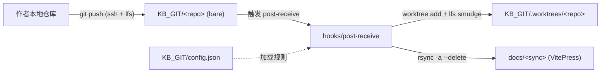

# KB_GIT

> [!note]
> **Ref:** 纯本地文档，无外部来源。首个仓库示例见 `test/`。

`KB_GIT/` 下每个子目录都是一个 **bare（裸）** Git 仓库，作者通过 SSH 向其推送笔记。每次推送成功后，`post-receive` 钩子会把被推送的树实体化（含 LFS 平滑还原），并通过 `rsync` 把规则里指定的子路径 **镜像** 到 `../docs/<sync>`——也就是 VitePress 的内容根目录。**一个 bare 仓库 = 一个 VitePress 主题**。



---

## 1. 服务器端依赖

### 1.1 基础包

```bash
sudo apt install -y openssh-server git rsync python3
sudo systemctl enable --now ssh
```

- 钩子使用 `python3` 解析 `config.json`，**不依赖 `jq`**。
- `rsync` 用于把 worktree 中的内容镜像到 `docs/<sync>`。

### 1.2 git-lfs ≥ 3.4（客户端 + 服务端都要）

pure-SSH LFS 协议是 **git-lfs 3.4** 才变成稳定自动协商的；Ubuntu 22.04 apt 冻结在 3.0.2，**不能用**。两端都要从上游 release 拉最新 Linux binary 装到 `~/.local/bin`：

```bash
# 两端都执行一次。安装目标：~/.local/bin/git-lfs （单个静态 ELF）
VER=$(curl -sSL https://api.github.com/repos/git-lfs/git-lfs/releases/latest \
        | python3 -c 'import json,sys;print(json.load(sys.stdin)["tag_name"].lstrip("v"))')
URL="https://github.com/git-lfs/git-lfs/releases/download/v${VER}/git-lfs-linux-amd64-v${VER}.tar.gz"
TMP=$(mktemp -d) && cd "$TMP"
curl -sSL "$URL" | tar xz
mkdir -p ~/.local/bin
install -m 0755 git-lfs-*/git-lfs ~/.local/bin/git-lfs
```

### 1.3 服务端还需要 `git-lfs-transfer`（来自 scutiger）

**关键 gotcha：** 主 `git-lfs` binary **不包含** 服务端 transfer 实现。pure-SSH 协议的 server 端被拆到了 [bk2204/scutiger](https://github.com/bk2204/scutiger)（同一维护者的 Rust 实现）里，而且 **scutiger 没有发过预编译 release**，必须从源码编。

在任意一台装了 Rust 1.63+ 的机器上（典型的 C 工具链 + cmake + openssl 开发头足够 —— libgit2 会被 `libgit2-sys` 自动 vendor）：

```bash
git clone --depth 1 https://github.com/bk2204/scutiger.git
cd scutiger
cargo build --release -p scutiger-lfs --bin git-lfs-transfer
# => target/release/git-lfs-transfer   (约 1.8 MB, 动态链接 libc/libz/libgcc)
```

把生成的 `git-lfs-transfer` 拷到 **服务端** 的 `~/.local/bin/`：

```bash
scp target/release/git-lfs-transfer vps:~/.local/bin/git-lfs-transfer
ssh vps 'chmod 0755 ~/.local/bin/git-lfs-transfer'
```

> libc 兼容性：binary 会动态链接 `libc.so.6`。localhost 与目标 VPS 的 glibc 主版本对齐就能直接 scp；否则要么换 musl target 重编，要么直接在 VPS 上 build。本仓当前双端都是 **Ubuntu 22.04 / glibc 2.35**，已验证通过。

### 1.4 让 ssh 非交互 shell 能找到 `~/.local/bin`

pure-SSH LFS 的 client 每次上传会跑 `ssh host git-lfs-transfer <path> <op>`，这触发的是**非交互非登录** shell。对 zsh 用户而言，`.zshrc` **不会** 被 source，只有 `.zshenv` 会。所以服务端必须在 `~/.zshenv` 里把 `~/.local/bin` 前置到 `PATH`：

```bash
# 在服务端执行
cat > ~/.zshenv << 'ZENV'
# Ensure ~/.local/bin is on PATH for every shell invocation (incl. ssh-non-interactive)
case ":$PATH:" in
  *":$HOME/.local/bin:"*) ;;
  *) export PATH="$HOME/.local/bin:$PATH" ;;
esac
ZENV
```

对 bash 用户，等价的位置是 `~/.bash_env` + `BASH_ENV` 环境变量，或者直接在 `~/.bashrc` 顶部补 `PATH`（bash 对非交互 ssh 会 source `.bashrc` 若 `~/.bashrc` 检测 `$-` 包含 `i`），细节视发行版 skeleton 而定。

验证方式：

```bash
ssh vps 'which git-lfs git-lfs-transfer && git-lfs version'
# 必须解析到 ~/.local/bin，版本 ≥ 3.4
```

### 1.5 为什么不能只装 git-lfs？

历史上 git-lfs 对私有 SSH 服务器的支持分三代：

| git-lfs 版本 | SSH LFS 方案 | 服务端需要 |
|---|---|---|
| < 3.0 | 只能走 HTTPS，SSH 仅调 `git-lfs-authenticate` 脚本 | 自建 HTTPS LFS server + 自写 `git-lfs-authenticate` |
| 3.0–3.3 | 实验性 pure-SSH，非自动协商 | 同上 |
| ≥ 3.4 | **稳定 pure-SSH，自动协商** | `git-lfs-transfer`（来自 scutiger，**不在** git-lfs binary 里） |

Ubuntu 22.04 apt 的 `git-lfs 3.0.2` 卡在第二代，即使两端都装了 apt 版本也无法直接推 LFS over SSH —— 推送会报 `git-lfs-authenticate: command not found`。

## 2. 目录结构

```
KB_GIT/
├── README.md          ← 当前文件
├── config.json        ← 同步规则（见 §4）
├── .gitignore         ← 屏蔽 bare 仓内部文件，避免污染外层 ea-kb 仓
├── .worktrees/        ← 钩子运行时使用的临时 worktree（自动创建）
└── <repo>/            ← 一个 bare Git 仓库，对应一个 VitePress 主题
    └── hooks/post-receive
```

## 3. 新增一个笔记仓库

```bash
cd /home/pi/work/ea-kb/KB_GIT
git init --bare myrepo
install -m 0755 templete/hooks/post-receive myrepo/hooks/post-receive
```

也可以直接用脚本一键创建：

```bash
./create-repo.sh myrepo
```

脚本只负责创建 bare 仓库和安装 LFS；hooks 与 `config.json` 规则需要手工添加或修改。

## 4. `config.json` —— 同步规则

```jsonc
{
  "rules": [
    {
      "repo":   "test",       // 必须与 bare 仓目录名一致
      "scan":   "notes",      // 推送树内要导出的子路径
                              //   "" 或 "." 表示整个仓库
      "sync":   "99-test",    // 目标路径（相对 ea-kb/docs/）
                              //   必须非空，钩子拒绝写入 docs 根
      "branch": "main"        // 仅当推送到此分支时才触发同步
    }
  ]
}
```

语义约定：

- 钩子用 **自身所在 bare 仓的目录名** 去匹配 `rules[].repo`。
- 若匹配不到规则：推送会被正常接收，但不进行任何同步。
- `rsync -a --delete` 是 **镜像式** 同步 —— 仓库里删除的文件在下一次推送时也会从 `docs/<sync>` 中消失。
- 同步过程中自动排除 `.git`、`.gitattributes`、`.gitignore`。

## 5. 客户端用法

```bash
# 通过 SSH 克隆
git clone ssh://pi@<host>/home/pi/work/ea-kb/KB_GIT/test mynotes
cd mynotes

# （可选）对二进制资源启用 LFS
git lfs install
git lfs track "*.pdf" "*.png"
git add .gitattributes

# 正常写作流程
mkdir -p notes && echo '# hello' > notes/hello.md
git add notes && git commit -m 'hello'
git push origin main
# → 服务端执行 post-receive，notes/hello.md 落地为 ea-kb/docs/99-test/hello.md
```

### 收紧服务端账户权限（推荐）

在 `~pi/.ssh/authorized_keys` 中为每位作者的公钥加上 `command="git-shell"` 前缀，使该 key 只能执行 Git 命令：

```
command="git-shell -c \"$SSH_ORIGINAL_COMMAND\"",no-pty,no-port-forwarding,no-agent-forwarding ssh-ed25519 AAAA... author@laptop
```

> **与 LFS 的兼容性：** 若你配置了 `git-shell`，LFS 的 pure-SSH 模式会走 `git-lfs-transfer` —— 但 `git-shell` 只白名单 `git-upload-pack` / `git-receive-pack`，**不**放行 `git-lfs-transfer`。需要手动把一个 wrapper 脚本放进 `~pi/git-shell-commands/git-lfs-transfer`：
>
> ```bash
> #!/usr/bin/env bash
> exec ~/.local/bin/git-lfs-transfer "$@"
> ```
>
> 并 `chmod 0755` 它。

## 6. 为什么用 `post-receive` 而不是 `update`？

任务描述里写的是 "update-hook-bash"。但 Git 的 `update` 钩子 **每个 ref 触发一次，且在 ref 实际移动之前** —— 它的设计目的是做 *准入/拒绝* 判断，并不能干净地读取「新树」来做导出。`post-receive` 则是在所有 ref 更新完成后 **只触发一次**，是部署/同步类逻辑的规范落点。实现仍然是纯 bash 脚本。

## 7. 故障排查

- **推送成功但 `docs/` 没更新** → 看客户端 `git push` 输出；钩子打印的 `[kb-sync] …` 行会通过 SSH 回流到客户端终端。
- **提示 `scan path 'X' not found`** → `scan` 在被推送的树里必须真实存在。
- **`docs/` 里出现 LFS pointer 文本而不是真实文件** → 确认服务端 `PATH` 中有 `git-lfs`，并且 bare 仓里已经执行过 `git lfs install --local`（会写入 `filter.lfs.*`）。
- **`docs/<sync>` 被意外清空** → 记住 `rsync --delete` 是镜像同步，**不要** 在被同步目录里手动改文件。
- **`batch request: …: command not found: git-lfs-authenticate`** → 你在走 LFS 3.0–3.3 的旧协议，说明客户端 git-lfs 版本太老（未启用 pure-SSH）或服务端没装 scutiger `git-lfs-transfer`。回到 §1.2 / §1.3。
- **`pure SSH protocol connection failed ... Unable to negotiate version`** 且 stderr 显示 `unknown command "/home/..." for "git-lfs"` → 服务端的 `git-lfs-transfer` 不是真 scutiger 实现（大概率是你把它做成了 `git-lfs` 的符号链接 —— git-lfs 主 binary **不**支持 argv[0] dispatch）。按 §1.3 从源码编译一个真正的 scutiger binary。
- **服务端 `ssh vps 'which git-lfs-transfer'` 返回空** → `~/.local/bin` 没进 ssh 非交互 shell 的 `PATH`。按 §1.4 写 `~/.zshenv`（zsh）或等价文件。
- **LFS 推送的冒烟测试步骤** → 任何改动 LFS 配置后，用下面这段快速验证三端 sha256 是否一致：
  ```bash
  SCRATCH=$(mktemp -d) && cd "$SCRATCH" && git init -q -b main c && cd c
  git config user.email t@t && git config user.name t
  git lfs install --local && git lfs track '*.bin'
  mkdir -p notes && head -c 8192 /dev/urandom > notes/x.bin
  sha256sum notes/x.bin
  git add -A && git commit -qm t
  git remote add origin ssh://vps/home/pi/work/ea-kb/KB_GIT/test
  git push origin main
  ssh vps 'sha256sum ~/work/ea-kb/docs/99-test/x.bin'
  # 两个 sha256 必须相等
  ```
