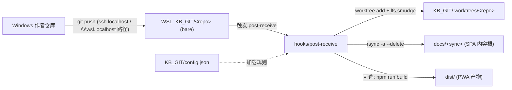

# KB_GIT — 本地（WSL）笔记 Git 服务器

> 无 VPS 架构：`KB_GIT/` 下每个子目录都是一个 **bare（裸）** Git 仓库，直接跑在本机 WSL 里。
> 作者在 Windows 或 WSL 内通过 **local path 或 SSH** 推送笔记；每次推送成功后，`post-receive`
> 钩子把被推送的树实体化（含 LFS 平滑还原），用 `rsync` 把规则里指定的子路径 **镜像** 到
> `../docs/<sync>`——即 SPA 的内容根目录。**一个 bare 仓库 = 一块知识库子树**。


```mermaid
flowchart LR
  A["Windows 作者仓库"] -- "git push (ssh localhost / \\\\wsl.localhost 路径)" --> B["WSL: KB_GIT/&lt;repo&gt; (bare)"]
  B -- "触发 post-receive" --> H["hooks/post-receive"]
  H -- "worktree add + lfs smudge" --> W["KB_GIT/.worktrees/&lt;repo&gt;"]
  H -- "rsync -a --delete" --> D["docs/&lt;sync&gt; (SPA 内容根)"]
  H -- "可选: npm run build" --> S["dist/ (PWA 产物)"]
  C["KB_GIT/config.json"] -. "加载规则" .-> H
```

与旧 VPS 方案的区别：**不再需要 VPS / GitHub Actions / Pages**。站点就是一个本地
静态产物（`npm run build` + `vite preview` 或任意静态服务器），内容更新 = 推送 + 构建。

---

## 1. 本地依赖

```bash
sudo apt install -y git rsync python3   # WSL 内
# 可选：Windows → WSL SSH 推送需要 WSL 里跑 sshd
sudo apt install -y openssh-server
sudo systemctl enable --now ssh
```

- 钩子用 `python3` 解析 `config.json`（不依赖 `jq`）。
- `rsync` 用于把 worktree 内容镜像到 `docs/<sync>`。
- git-lfs ≥ 3.4（两端）：WSL 本地推送时 LFS 走文件系统，无需 scutiger/`git-lfs-transfer`
  （那是纯 SSH 协议的 server 端，只在 Windows→WSL SSH 推送带 LFS 对象时才需要，见 §5）。

## 2. 目录结构

```
KB_GIT/
├── README.md          ← 当前文件
├── config.json        ← 同步规则（见 §3）
├── create_repo.sh     ← 一键创建 bare 仓 + 安装 post-receive 钩子
├── push.sh            ← 同步后提交 ea-kb（可选推送远端，见 §6）
├── template/          ← bare 仓模板（hooks/post-receive 等）
├── .worktrees/        ← 钩子运行时使用的临时 worktree（自动创建）
└── <repo>/            ← 一个 bare Git 仓库，对应一块 docs 子树
    └── hooks/post-receive
```

## 3. `config.json` —— 同步规则

```jsonc
{
  "rules": [
    {
      "repo":   "MPUthings",   // 必须与 bare 仓目录名一致
      "scan":   "note",        // 推送树内要导出的子路径（"." = 整仓）
      "sync":   "MPUthings",   // 目标路径（相对 ea-kb/docs/，必须非空）
      "branch": "main"         // 仅当推送到此分支时才触发同步
    }
  ]
}
```

- 钩子用 **自身所在 bare 仓的目录名** 匹配 `rules[].repo`；匹配不到则接收推送但不同步。
- `rsync --delete` 是镜像同步——仓内删除的文件下次推送时也会从 `docs/<sync>` 消失。
- 同步自动排除 `.git` / `.gitattributes` / `.gitignore`，默认只收 `*.md`（可用 `transform` 覆盖）。

## 4. 新增一个笔记仓库

```bash
cd /home/pi/work/ea-kb/KB_GIT
./create_repo.sh MyNotes        # 创建 bare 仓 + 安装 post-receive 钩子
# 然后在 KB_GIT/config.json 的 rules 里加一条
```

## 5. 客户端用法（两种推送方式）

### 方式 A：WSL 内 local path（最简单）

```bash
git clone /home/pi/work/ea-kb/KB_GIT/MyNotes mynotes
cd mynotes
mkdir -p note && echo '# hello' > note/hello.md
git add -A && git commit -m 'hello'
git push origin main
# → 服务端钩子触发 → docs/MyNotes/note/hello.md 落地
```

### 方式 B：Windows 通过 SSH 推送到 WSL

WSL2 默认把 localhost 转发到 Windows，所以 Windows 上直接：

```bash
git remote add kb yceachan@localhost:/home/pi/work/ea-kb/KB_GIT/MyNotes
git push kb main
```

- 需要 WSL 里 sshd 运行（§1），并把 Windows 公钥放进 `~/.ssh/authorized_keys`。
- WSL2 的 IP 会变；`localhost` 转发由 Windows 侧自动处理，无需关心 IP。
- 若 LFS 仓库走 SSH 推送，需 pure-SSH 支持：git-lfs ≥ 3.4 + 服务端 `git-lfs-transfer`
  （scutiger 编译版，放 `~/.local/bin`，并在 `~/.zshenv` 里把 `~/.local/bin` 加进 PATH）。

### 方式 C：Windows 通过 `\\wsl.localhost` 路径（不推荐，慢）

```bash
git remote add kb '\\wsl.localhost\Ubuntu\home\pi\work\ea-kb\KB_GIT\MyNotes'
```

UNC 路径跨 9P 文件系统，大仓库性能差；建议优先 SSH。

## 6. 推送后的动作

钩子每次同步后：

1. **提交 ea-kb**：`KB_GIT/push.sh` 把 `docs/<sync>` 的变更 commit 进 ea-kb（消息
   `notes : <sync> YYYY-MM-DD HH:MM`）。
2. **（可选）推远端**：只有显式设置 `KB_PUSH_REMOTE=origin` 时才 `git push`；本地优先
   模式默认不推任何远端。
3. **（可选）重建 SPA**：设置 `KB_AUTO_BUILD=1` 时，钩子在提交后执行 `npm run build`，
   让浏览器端 PWA 立即可见新内容。不设置则需要手动 `npm run build`。

```bash
# 推荐配置（~/.bashrc 或钩子环境）
export KB_AUTO_BUILD=1          # 推送后自动重建 SPA
# export KB_PUSH_REMOTE=origin  # 需要同步到远端时再开
```

> 内容被打包进 JS chunk：**改动了笔记就必须重建**，否则浏览器/PWA 看到的还是旧内容
> （除非用 dev server 热更新）。

## 7. 故障排查

- **推送成功但 docs/ 没更新** → 看客户端 push 输出里的 `[kb-sync] …` 行。
- **提示 `scan path 'X' not found`** → `scan` 在被推送的树里必须真实存在。
- **docs/ 里出现 LFS pointer 文本** → 服务端 `git lfs install --local` 且 PATH 里有 git-lfs。
- **`docs/<sync>` 被意外清空** → `rsync --delete` 是镜像语义，别在被同步目录里手动改文件。
- **`batch request: … git-lfs-authenticate`** → 客户端 git-lfs 太老或服务端缺
  `git-lfs-transfer`（§5 方式 B）。本地路径推送（方式 A）不涉及。
- **改了笔记浏览器看不到** → 忘重建：`npm run build`（或设 `KB_AUTO_BUILD=1` 后重新推送）。

## 8. 冒烟测试（新仓验证）

```bash
SCRATCH=$(mktemp -d) && cd "$SCRATCH" && git init -q -b main c && cd c
git config user.email t@t && git config user.name t
mkdir -p note && echo '# smoke' > note/a.md
git add -A && git commit -qm t
git remote add origin /home/pi/work/ea-kb/KB_GIT/MyNotes
git push origin main
ls /home/pi/work/ea-kb/docs/MyNotes/note/a.md   # 必须存在
```
