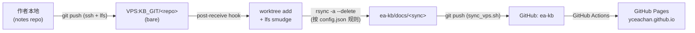

# Ea-Knowledge_Base

> 一个面向嵌入式开发者的个人知识库，基于 VitePress 重构，支持 PWA、Mermaid、LaTeX、Explorer 风格导航。

## Pre

> [!note]
> **Inspired by:**
> [Legacy.kb.io](https://github.com/yceachan/Legacy.kb.io/) ｜ [Lysssyo.github.io](https://github.com/Lysssyo/Lysssyo.github.io/)

### 为什么放弃 `Legacy.kb.io`？

`Legacy` 是一个嵌入式开发者纯 Vibe Coding 实现的前端博客项目，采用 `React + SPA + Tailwind` 来渲染 Markdown 并提供 Explorer 风格导航。这是核心想法没错，但暴露出三个硬伤：

- **Markdown 渲染**
  Tailwind theme 的开箱效果不尽人意，需要和 AI 对话多轮逐个加插件；devper 对前端栈掌握不深，技术债快速累叠，维护苦不堪言。

- **CI/CD 繁琐**
  旧方案在 JS 里硬编码本地路径做全量扫描，devper 需要定期 `do.bat sync` 一下 note repo（这个项目的最大需求场景就是：会有很多个、不同领域、项目/笔记混杂的仓库）。
  目标是 —— 在 note repo `git push` 一下，就能让 `github.io` 端笔记自动同步上线。

- **移动端适配**
  不想再重头设计一遍移动端 UI。

### Solution

- **VitePress + PWA**：theme 开箱即用，移动端适配性好，有好 Hommie 模板可抄 [Lysssyo.github.io](https://github.com/Lysssyo/Lysssyo.github.io/)。
- **CI/CD**：VPS 上部署本地 git 服务器，`post-update` 钩子 sync notes 到 VitePress Engine，再 CI/CD 到 GitHub Pages，最省心。

## Stack

### front_end

| 模块 | 技术 | 用途 |
| --- | --- | --- |
| 框架 | **VitePress 1.5** (Vite + Vue 3 + MPA SSG) | 静态站点生成，自带 Shiki 代码高亮、本地搜索 |
| PWA | **vite-plugin-pwa** + Workbox | 离线缓存、可安装到桌面/手机主屏 |
| 图片 | **medium-zoom** | 点击放大查看 |
| 导航 | `docTreePlugin` + `Explorer.vue` 组件族 | Explorer 风格的目录浏览 |
| 主题 | 自定义 `ProfileSidebar` / `Layout` / `PrivateVault` | 个人资料栏、PWA Reload 提示 |

### md_render

| 模块 | 技术 | 用途 |
| --- | --- | --- |
| 图表 | **vitepress-plugin-mermaid** | Mermaid 流程图 / 时序图 |
| 公式 | **markdown-it-mathjax3** | LaTeX 数学公式渲染 |
| Alert | `markdown-it-github-alerts` | GitHub 风格的 `> [!note]` / `> [!tip]` 块 |
| Task | `markdown-it-task-lists` | `- [x]` 复选框任务列表 |
| Callout | `markdown-it-container` | 自定义 `:::callout 💡 ... :::` 容器 |

vitepress 的 config.mts 里还做了一些**毛刺打磨**：

- 自定义 `slugify`（兼容中英文、括号、冒号、百分号），并同步拦截 markdown 内部锚点链接，保持一致
- 把 Shiki 不识别的 fence 语言（`dts` / `kconfig` / `assembly` …）降级为 `txt`，避免构建中断
- 拦截 Typora 残留的本地绝对路径图片（`C:\…`、`/home/…`），替换为 data-url，避免 Vite 当模块解析
- 拦截裸 `<placeholder>` 标签，避免 Vue 模板编译器把它当未闭合 HTML

### CI/CD

**核心诉求**：本博客的最大使用场景是 —— 有很多个、不同领域、项目/笔记混杂的仓库（`MPUthings` / `MCUthings` / `Zephyr` / `Awesome-Bluetooth` …），希望在 **笔记 repo 直接 `git push`**，`github.io` 端笔记就能自动同步上线，devper 不再手动 `do.bat sync` 运维。

方案是在 VPS 上自建 Git 服务器，把每个外部笔记仓做成一个 **bare 仓库**，用 `post-receive` 钩子把指定子路径镜像到本站 `docs/`，再由 GitHub Actions 一次构建并发布到 GitHub Pages：



关键设计：

- **一个 bare 仓库 = 一块 VitePress 子树**，由 `KB_GIT/config.json` 里的 `{repo, scan, sync, branch}` 规则声明映射关系
- 镜像走 `rsync --delete`，仓内删除的笔记下次推送时同步消失，避免脏数据沉淀
- LFS 走 pure-SSH（`git-lfs ≥ 3.4` + scutiger `git-lfs-transfer`），不用额外起 HTTPS LFS server
- 本站这个 `ea-kb` 仓本身也托管在 VPS，`sync_vps.sh` 走 `ssh + git pull --ff-only` 让 **本地 / VPS / GitHub 三端**保持同步

> 详细的服务端依赖、`config.json` 规则、SSH/LFS 配置和故障排查，见 [`KB_GIT/README.md`](./KB_GIT/README.md)。

## Knowledge Base

- **MCUthings** — 微控制器
  - `Zephyr` RTOS、外设视图
- **MPUthings** — Linux MPU / 内核
  - `kernel` `Subsystem` `SysCall` `DTS` `FS` `Kbuild` `BSP-Dev` `SoC-Arch` `sdk` `虚拟化` 等
- **Protocol** — 协议栈
  - `Bluetooth`
- **OsCookBook** — 操作系统 & CS 基础
  - `操作系统理论` `计算机体系结构` `网络原理` `编译原理与交叉编译技术` `CSAPP`
  - 工具链：`Better Linux` `Better Wins` `git版本控制` `Frontend` `Agent`

## QuickStart

```bash
# 1. 克隆
git clone https://github.com/yceachan/yceachan.github.io.git ea-kb
cd ea-kb

# 2. 安装依赖（任选其一）
npm install
# 或者 pnpm install / yarn

# 3. 本地预览（默认 http://localhost:5173 ）
npm run docs:dev

# 4. 生产构建 → docs/.vitepress/dist
npm run docs:build

# 5. 预览构建产物
npm run docs:preview
```

要把它变成你自己的知识库，至少要改三处：

1. `docs/public/profile.json` — 个人信息（name / bio / email / github / repo）
2. `docs/public/profile-photo.{svg,jpg}` — 头像
3. `docs/` 下任意 Markdown — 用 YAML frontmatter 起头（详见全局规范），目录结构即侧边栏

### 接入其他项目的笔记仓

如果你想让另一个项目（例如 `MPUthings`、`Zephyr`、自己的某个 repo）的笔记**通过 `git push` 自动同步**到本知识库，详见 [`KB_GIT/README.md`](./KB_GIT/README.md)。简要流程：

```bash
# 1. 在 VPS 上为该项目创建一个 bare 仓库
cd /home/pi/work/ea-kb/KB_GIT
./create_repo.sh MyNotes               # 创建 bare 仓 + 安装 post-receive hook

# 2. 在 KB_GIT/config.json 里追加一条同步规则
#    repo:   bare 仓目录名
#    scan:   推送树里要导出的子路径（"." 表示整仓）
#    sync:   目标路径，相对于 ea-kb/docs/
#    branch: 触发同步的分支
# {
#   "repo": "MyNotes", "scan": "note",
#   "sync": "MyNotes", "branch": "main"
# }

# 3. 在作者本地 repo 添加 remote 并推送
git remote add kb ssh://pi@<vps-host>/home/pi/work/ea-kb/KB_GIT/MyNotes
git push kb main
# → 服务端钩子触发 → docs/MyNotes/ 自动更新 → CI/CD 发布到 GitHub Pages
```

LFS、`git-shell` 权限收紧、推送后 `docs/` 没更新等问题的排查清单，KB_GIT/README.md 第 §1、§7 章有完整说明。

## License

[MIT](./LICENSE) © 2026-present yceachan
