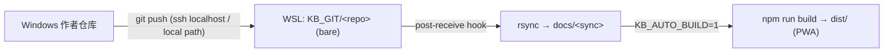

# Ea-Knowledge_Base

> 一个面向嵌入式开发者的个人知识库，React SPA + Appica UI + marked，支持 PWA 离线、Mermaid、KaTeX、Explorer 风格导航。

## Pre

> [!note]
> **Inspired by:**
> [Legacy.kb.io](https://github.com/yceachan/Legacy.kb.io/) ｜ [Lysssyo.github.io](https://github.com/Lysssyo/Lysssyo.github.io/)

### 演进历史

1. **Legacy（React + Tailwind 手搓）** —— Markdown 渲染体验差、CI/CD 繁琐、移动端没设计。
2. **VitePress 版（v1）** —— 主题开箱即用，但依赖 VPS + GitHub Actions + Pages 的弯弯绕绕。
3. **当前版（v2，本分支）** —— React SPA + **Appica UI** + **marked**，内容构建期打包进
   bundle（PWA 100% 离线），笔记仓库通过 **WSL 本地 bare git** 推送触发钩子同步，无 VPS。

## Solution

- **前端**：React 19 SPA，UI 基础组件库 [Appica UI](https://appica.dev)（Base UI + Tailwind v4），
  Markdown 渲染器 [marked](https://marked.js.org)。
- **内容管线**：`src/lib/content.ts` 用 `import.meta.glob` 把 `docs/**/*.md` 全部打包进产物
  —— 离线可用 = 首次加载后 100% 可用；`src/vite-plugin/docMeta.ts` 提供文档树 + git mtime。
- **笔记同步**：`KB_GIT/` 本地 bare 仓库 + `post-receive` 钩子，笔记仓库 `git push` 即同步
  到 `docs/`（可自动重建 SPA），详见 [`KB_GIT/README.md`](./KB_GIT/README.md)。
- **PWA**：`vite-plugin-pwa`（registerType `prompt`），precache 全部资源；更新提示「发现新版本」。

## Stack

### front_end

| 模块 | 技术 | 用途 |
| --- | --- | --- |
| 框架 | **React 19 + Vite + TypeScript** | SPA 应用骨架 |
| UI | **@appica/ui-react** + Tailwind CSS v4 | 组件库 / 设计 token / 深色模式 |
| Markdown | **marked 18** + 自定义扩展 | 渲染管线（基线对齐见 `docs/design/`） |
| 代码高亮 | shiki（github-light / github-dark 双主题） | 与基线视觉一致 |
| 数学 | KaTeX（marked-katex-extension） | `$...$` / `$$...$$` |
| 图表 | mermaid 11 | 流程图 / 时序图（运行时水合） |
| 搜索 | minisearch（构建期内容索引） | 顶栏搜索，`K` / `Ctrl+K` 聚焦 |
| 图片 | medium-zoom | 点击放大 |
| 导航 | 自定义 Explorer 组件族 | Explorer 风格目录浏览（与基线交互一致） |
| 状态 | zustand | explorer store（localStorage key 与基线同名） |
| PWA | vite-plugin-pwa + workbox | 离线缓存、可安装、更新提示 |

### md_render（与 VitePress 基线逐项对齐，见 `docs/design/design-freeze.md` §4）

| 特性 | 实现 |
| --- | --- |
| 锚点 slugify | 与基线同正则（空格/冒号/括号/百分号 → `-`，数字开头 `_` 前缀） |
| GitHub alerts | `> [!note/tip/important/warning/caution]` → 基线同款 DOM + 配色 |
| Task lists | `- [x]` → `li.task-list-item` + checkbox（基线 DOM） |
| Callout | `:::callout 💡 … :::` 容器 |
| Mermaid | ` ```mermaid ` fence → `mermaid.run()` 水合 |
| 代码块 | 未知语言降级纯文本（kconfig/dts/…）；`vp-code` 类与基线一致 |
| 安全 | DOMPurify sanitize；裸 `<placeholder>` 转义；坏图片中和 |

## CI/CD —— 本地优先（无 VPS）

**核心诉求**：笔记 repo 直接 `git push`，本机站点内容自动同步。


```mermaid
flowchart LR
  A["Windows 作者仓库"] -- "git push (ssh localhost / local path)" --> B["WSL: KB_GIT/&lt;repo&gt; (bare)"]
  B -- "post-receive hook" --> C["rsync → docs/&lt;sync&gt;"]
  C -- "KB_AUTO_BUILD=1" --> D["npm run build → dist/ (PWA)"]
```

- bare 仓库在 WSL 本地（`KB_GIT/`），Windows 通过 `ssh yceachan@localhost`（WSL2 localhost
  转发）或 WSL 内 local path 推送。
- 钩子同步后自动 commit 进 ea-kb；远端推送改为可选（`KB_PUSH_REMOTE`）。
- 站点即 `dist/` 静态产物，`npm run preview` 或任意静态服务器托管。

## Knowledge Base

- **MCUthings** — 微控制器（Zephyr、外设视图）
- **MPUthings** — Linux MPU / 内核（kernel、Subsystem、SysCall、DTS、FS、Kbuild、BSP-Dev、SoC-Arch、sdk、虚拟化…）
- **Protocol** — 协议栈（Bluetooth）
- **OsCookBook** — 操作系统 & CS 基础（操作系统理论、计算机体系结构、网络原理、编译原理与交叉编译技术、CSAPP）
- 工具链：Better Linux、Better Wins、git版本控制、Frontend、Agent

## QuickStart

```bash
# 1. 克隆
git clone https://github.com/yceachan/yceachan.github.io.git ea-kb
cd ea-kb

# 2. 安装依赖
npm install

# 3. 本地预览（默认 http://localhost:5174；旧 VitePress 基线占 5173）
npm run dev

# 4. 生产构建 → dist/
npm run build

# 5. 预览构建产物
npm run preview
```

要把它变成你自己的知识库，至少要改三处：

1. `docs/public/profile.json` — 个人信息（name / bio / email / github / repo）
2. `docs/public/profile-photo.{svg,jpg}` — 头像
3. `docs/` 下任意 Markdown — 用 YAML frontmatter 起头（详见全局规范），目录结构即文件树

### 接入其他项目的笔记仓

详见 [`KB_GIT/README.md`](./KB_GIT/README.md)。简要流程：

```bash
# 1. 本地创建一个 bare 仓库
cd /home/pi/work/ea-kb/KB_GIT
./create_repo.sh MyNotes

# 2. 在 KB_GIT/config.json 里追加同步规则（repo/scan/sync/branch）

# 3. 作者本地 repo 添加 remote 并推送
git remote add kb /home/pi/work/ea-kb/KB_GIT/MyNotes   # WSL 内
# 或 Windows: git remote add kb yceachan@localhost:/home/pi/work/ea-kb/KB_GIT/MyNotes
git push kb main
# → 钩子触发 → docs/MyNotes/ 自动更新 → （KB_AUTO_BUILD=1 时）SPA 自动重建
```

## Design & Verification

- [`docs/design/design-freeze.md`](./docs/design/design-freeze.md) — 设计冻结（唯一权威契约）
- [`docs/design/current-app-inventory.md`](./docs/design/current-app-inventory.md) — 基线行为清单
- [`docs/design/stack-research.md`](./docs/design/stack-research.md) — 技术栈研究
- [`docs/design/verification-report.md`](./docs/design/verification-report.md) — browser-harness 验证报告

## License

[MIT](./LICENSE) © 2026-present yceachan
