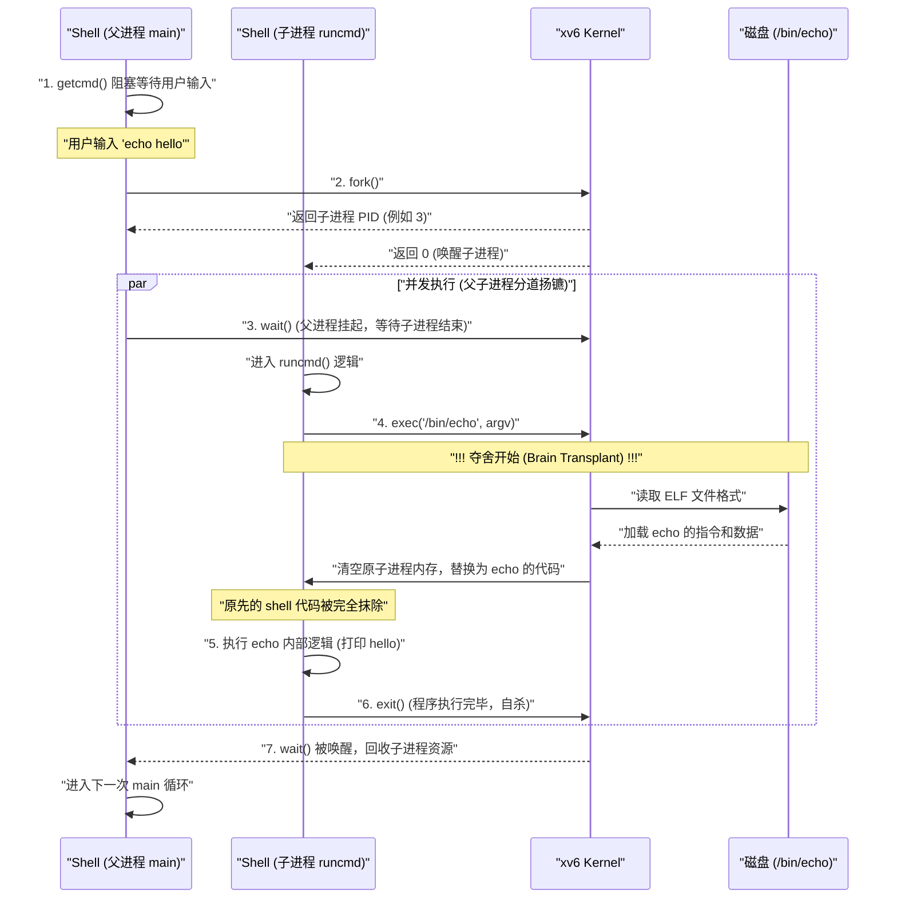
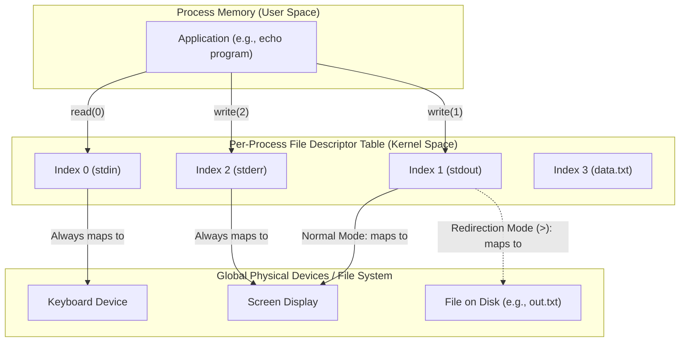
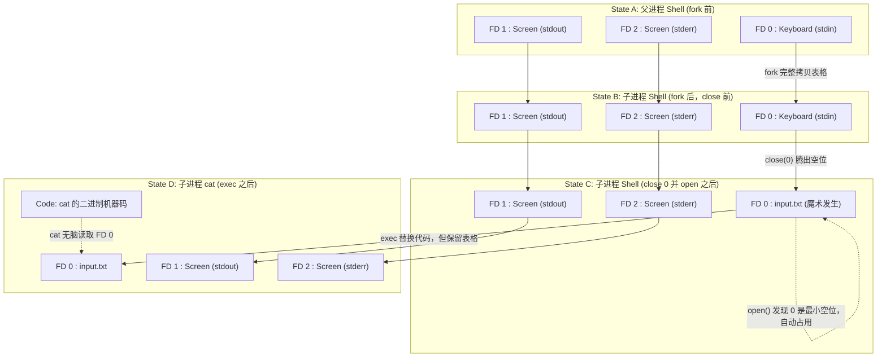
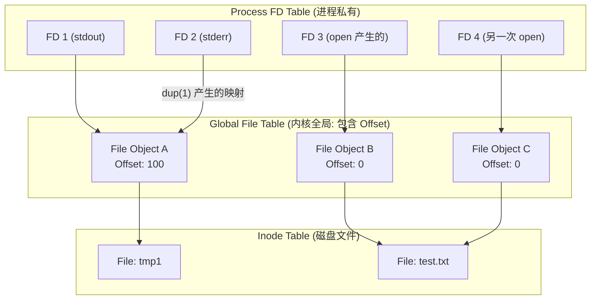

# 第 1 章 操作系统接口

**操作系统的工作，一个是在不同程序之间共享计算机，一个是提供比硬件所提供的的服务更好用的服务集合**。操作系统管理并抽象底层硬件，举例来说，文字处理程序不需要考虑自己用的是什么类型的硬盘。操作系统将硬件在多个程序之间分享，让它们能同时运行（或看起来是同时运行）。最后，操作系统为程序间的交互提供受控的方法，这样它们就能共享数据或协同工作。

操作系统通过接口向用户进程提供服务。设计一套好的接口很难。一方面，我们希望接口简单而狭窄，因为这样的接口容易正确地使用。另一方面，我们可能尝试为应用程序提供很多复杂的特性。解决这个矛盾的方法，是设计依赖于一些机制的接口，它们可以组合起来，提供更通用的功能。

本书使用一个简单的操作系统作为具体的例子，来阐述操作系统的概念。xv6 操作系统提供了 Ken Thompson 与 Dennis Ritchie 的 Unix 操作系统引入的基础接口[14]，以及模仿 Unix 的内部实现。Unix 提供了一组狭窄的接口，其机制可以很好地组合，从而提供了惊人的通用性。这组接口相当成功，现代操作系统——BSD，Linux，MAC OS X，Solarias，甚至 Microsoft Windows——都有类 Unix 接口。理解 xv6 对于理解这些操作系统中的任何一种以及很多其他的系统来说，都是一个很好地开始。

如图 1.1 所示，xv6 延续了内核的传统，内核是一个特殊的程序，它为程序运行提供了服务。**运行的程序叫做进程，有着包含指令、数据和一个栈的内存**。指令实现了程序的计算。数据是计算中所使用的变量。栈组织了程序的调用过程。典型地，一台给定的计算机有很多进程，但只有一个内核。

当进程需要调用内核服务时，它要调用一个系统调用（操作系统接口中的一种）。系统调用进入到内核，内核执行对应的服务并返回。因此，进程在用户空间和内核空间之间切换。

内核使用 CPU 提供的硬件保护机制来保证每个运行在用户空间的进程只能访问它自己的内存。内核拥有硬件特权，可以执行受保护的操作；而用户程序没有这些特权。当用户程序调用系统调用时，硬件提升其特权级别，开始执行内核中提前安排好的函数。

内核提供的系统调用集合是用户程序所看到的接口。xv6 提供的系统调用集是传统 Unix 内核系统调用的一个子集。图 1.2 列出了所有的 xv6 系统调用。

本章其余部分简要描述了 xv6 提供的服务——进程、内存、文件描述符、管道以及一个文件系统——并使用代码片段举例说明，还讨论了 shell（Unix 的命令行用户界面）如何使用它们。shell 对系统调用的使用会进一步说明系统调用设计的精妙。

shell 是一个普通程序，它从用户读取命令并执行。shell 是用户程序而非内核一部分的事实说明了系统调用接口的强大：shell 本身没什么特别。这也意味着 shell 很容易被取代；现代 Unix 系统有大量可选的 shell，每种 shell 都有自己的用户界面和脚本特性。xv6 shell 是 Unix Bourne shell 精髓部分的简单实现。它的实现可以在（user/sh.c:1）中找到。

# 1.1 进程和内存

一个 xv6 进程由用户空间内存（包括指令、数据和栈）以及内核私有的每进程状态组成。xv6 支持进程的时间共享：它会在多个等待执行的进程之间透明地切换可用的 CPU。当一个进程暂停执行时，xv6 会保存其 CPU 寄存器，并在该进程下次运行时恢复它们。内核为每个进程分配一个进程标识符（pid）来进行管理。

进程可能使用 fork 系统调用创建新进程。fork 会创建一个新进程，称为子进程（child process），它的内存内容与调用 fork 的进程（称为父进程（parent process））完全相同。fork 在父进程和子进程中都会返回。在父进程中，fork 返回子进程的 pid；在子进程中，它返回 0。例如，考虑以下程序片段：

```C
int pid = fork();
if (pid > 0) {
    printf("parent: child=%d\n", pid);
    pid = wait((int *) 0);
    printf("child %d is done\n", pid);
} else if (pid == 0) {
    printf("child: exiting\n");
    exit(0);
} else {
    printf("fork error\n");
}
```

exit 系统调用会使调用进程停止执行，并释放诸如内存和已打开文件等资源。exit 需要一个整数状态参数，通常 0 表示成功，1 表示失败。wait 系统调用返回当前进程的某个已退出（或被杀死）的子进程的 PID，并将该子进程的退出状态复制到传递给 wait 的地址中。如果调用进程的子进程尚未退出，wait 会阻塞并等待其中一个子进程退出。如果调用进程没有子进程，wait 会立即返回 -1。如果父进程不关心子进程的退出状态，它可以向 wait 传递一个 0 地址。

在这个例子中，输出行：

```
parent: child=1234
child: exiting
```

的先后顺序可能不同，这取决于父进程与子进程谁先执行到 printf 调用。在子进程退出后，父进程的 wait 返回，导致父进程打印：

```
parent: child 1234 is done
```

尽管子进程最初的内存内容与父进程相同，但它们在不同的内存空间和不同的寄存器中执行：在一个进程中修改变量不会影响另一个进程。例如，当 wait 的返回值被存储到父进程的 pid 变量时，它不会影响子进程中的 pid 变量。子进程中的 pid 仍然保持为 0。

exec 系统调用会用存储在文件系统中的一个文件加载的新内存映像替换调用进程的内存。该文件必须符合特定格式，以指定文件中哪部分是指令、哪部分是数据、从哪条指令开始执行等。xv6 使用 ELF 格式，关于 ELF 的详细信息在第 3 章中有更深入的讨论。当 exec 成功执行时，它不会返回到调用它的程序，而是直接执行从文件加载的指令，并从 ELF 头部声明的入口点开始运行。exec 接受两个参数：包含可执行文件的文件名 和 字符串参数数组。
例如：

```C
char *argv[3];

argv[0] = "echo";
argv[1] = "helloc";
argv[2] = 0;
exec("/bin/echo", argv);
printf("exec erorr\n");
```

这段代码用使用参数列表 echo hello 的程序实例/bin/echo 替换了调用程序。大部分程序忽略参数数组中的第一个元素，通常是程序名。

xv6 shell 使用上面的调用为用户运行程序。shell 的主要结构很简单；见 main（user/sh.c:145）。主循环使用 getcmd 从用户输入读取一行。然后调用 fork，创建一个 shell 进程的拷贝。当子进程运行命令时，父进程调用 wait。例如，如果用户在 shell 中输入“echo hello”，runcmd 会以“echo hello”为参数被调用。runcmd（user/sh.c:58）运行实际的命令。对“echo hello”来说，它会调用 exec（user/sh.c:78）。如果 exec 成功，子进程将执行 echo 中的指令而不是 runcmd。在某些时候 echo 会调用 exit，使父进程从 main 中的 wait 函数返回（user/sh.c:145）。



你可能会好奇，为什么 fork 和 exec 没有被合并成一个单一的系统调用？后面我们会看到，shell 在实现 I/O 重定向时利用了它们的分离。为了避免创建一个完全相同的进程然后立即用 exec 替换（这看起来很浪费），现代操作系统内核对 fork 进行了优化，使用 虚拟内存技术（如写时复制（copy-on-write），详见第 4.6 节）来减少不必要的资源复制。

在 xv6 中，大部分用户空间的内存是隐式分配的：
- fork 会为子进程分配足够的内存，以复制父进程的内存。
- exec 会分配足够的内存来加载可执行文件。
如果进程在运行时需要更多的内存（例如 malloc 申请动态内存），可以调用 sbrk(n)，它会将数据段增长 n 个字节，并返回新分配内存的起始地址。

# 1.2 I/O 与文件描述符

**文件描述符是**代表一个进程可能读写的内核管理的对象的**小整数**。进程可能通过打开文件、目录或设备，或者创建管道，亦或复制已存在的描述符来获得。简单起见，我们将把文件描述符指向的对象称为“文件”；文件描述符接口的抽象隔离了文件、管道和设备之间的不同，让它们看起来都好像是字节流。我们将把输入输出称为 I/O。

在内部，xv6 内核将文件描述符作为每进程表的索引来使用，这样每个进程都有了一个从 0 开始的私有文件描述符空间。传统上，进程从文件描述符 0 读取（标准输入），向文件描述符 1 写入（标准输出），将错误消息写入文件描述符 2（标准错误）。如我们所见，shell 利用这个传统来实现 I/O 重定向与管道。shell 保证有三个文件描述符一直打开（user/sh.c：151），它们就是默认的控制台文件描述符。


``

> [!TIP] shell 利用这个传统来实现 I/O 重定向与管道
> 例如`echo hello > out.txt`
> Shell 在使用 `fork` 创建了子进程准备运行 `echo` 之前，偷偷做了一个“偷梁换柱”的操作：它把子进程表格里的 `1` 号通道关掉，然后打开了 `out.txt`。根据 Unix 每次分配 FD 都会“寻找当前最小可用数字”的规则，`out.txt` 就自动占用了 `1` 号位。
> 随后 Shell 调用 `exec` 夺舍，`echo` 程序苏醒。`echo` 依然傻傻地往 `1` 号通道写 `hello`，但它不知道的是，底层的铁轨早就被 Shell 悄悄扳道，指向了磁盘上的 `out.txt` 文件！


read 和 write 系统调用从文件描述符所指的打开的文件读取和写入数据。read(fs, buf, n)调用从文件描述符中读取最多 n 个字节，将它们拷贝到 buf 中，然后返回读到的字节数。每个指向一个文件的文件描述符都有一个与它对应的偏移量。read 从当前的文件偏移读取数据，然后将偏移量增加读取的字节数：后续的 read 将返回第一个 read 返回的数据后面的字节。当没有更多字节可以读取时，read 返回 0 来说明文件已到结尾。

write(fs, buf, n)调用将 buf 中的 n 个字节写入到文件描述符 fs 中，然后返回写入的字节数。出错时写入的字节数将小于 n。跟 read 一样，write 在当前文件偏移处写入数据，然后将偏移量后移写入的字节数：每个 write 都在上一个 write 离开的地方继续。

后面这段代码（组成了 cat 程序的必要部分）将数据从它的标准输入拷贝到标准输出。如果出现错误，它会在标准错误中写入一条消息。

```C
char buf[512];
int n;

for (;;) {
    n = read(0, buf, sizeof buf);
    if (n == 0)
        break;
    if (n < 0) {
        fprintf(2, "read error\n");
        exit(1);
    }
    if (write(1, buf, n) != n) {
        fprintf(2, "write error\n");
        exit(1);
    }
}
```

其中需要注意的重点是 cat 不知道它是从哪里读数据的，是文件，控制台还是管道。同样，cat 不知道它打印在控制台还是文件，还是别的什么地方。文件描述符的使用和文件描述符 0 是输入，1 是输出的传统使得 cat 的实现非常简单。

close 系统调用释放文件描述符，让其回归空闲状态，以便下一个 open，pipe 或 dup 系统调用（下面会讲）使用。新分配的文件描述符总是当前进程未使用的最小描述符。

文件描述符和 fork 的交互使得 I/O 重定向更容易实现。

> [!tip]
> **I/O 重定向魔术 (I/O Redirection Magic)**：依赖于三个核心机制的配合。
>   1. **继承性：** `fork` 出来的子进程会完美复制父进程的文件描述符表。
>  2. **最低可用原则：** `open` 系统调用每次分配文件描述符时，永远会选择当前**最小的、未被使用的**整数。
> 3. **保留性：** `exec` 夺舍（替换进程代码）时，虽然内存被清空重写，但文件描述符表会被原封不动地保留下来。

fork 将父进程的文件描述符表同它的内存一起拷贝，这样子进程开始时就拥有与父进程完全相同的打开的文件。系统调用 exec 将调用进程的内存替换掉，但留下它的文件表。这个行为让 shell 能够这样实现 I/O 重定向：先 fork，然后在子进程中重新打开选定的文件描述符，接着调用 exec 来运行新程序。

下面是 shell 运行命令 cat < input.txt 的代码的简化版本：

```C
char *argv[2];

argv[0] = "cat";
argv[1] = 0;
if (fork() == 0) {
    close(0);
    open("input.txt", O_RDONLY);
    exec("cat", argv);
}
```



在子进程关闭文件描述符 0 后，open 就能够为新打开的 input.txt 使用这个文件描述符：0 成为了最小的可用文件描述符。然后 cat 继续执行，将文件描述符 0（标准输入）指向 input.txt。父进程的文件描述符不会被这些操作改变，因为它们只修改了子进程的描述符。

xv6 shell 中的 I/O 重定向确实是以这种方式工作（user/sh.c:82）。回忆一下，这时，代码中 shell 已经 fork 了子进程的 shell，然后 runcmd 将调用 exec 来加载新程序。

open 的第二个参数由一组标志位组成，以 bit 表示，它们控制了 open 的行为。可用的标志位在文件控制（fcntl）头文件中（kernel/fcntl.h:1-5）：O_RDONLY，O_WRONLY，O_RDWR，O_CREATE，O_TRUNC，分别通知 open 打开文件用于读，写，读写，若不存在则创建文件以及将文件长度截断为 0。

现在应该清楚为什么 fork 与 exec 分开非常有用了：在二者之间，shell 有机会在不打扰主 shell I/O 设置的同时重定向子进程的 I/O。有人可能想使用一个 forkexec 的组合系统调用，但用这样的调用来做 I/O 重定向非常别扭：要么 shell 要在调用 forkexec 之前修改自己的 I/O 设置（后面还要恢复）；要么 forkexec 将 I/O 重定向的指令作为参数；要么就教会每个类似 cat 的程序自己做 I/O 重定向。

**尽管 fork 拷贝了文件描述符表，但每个隐含的文件偏移量还是在父子进程之间共享**。考虑下面的例子：

```C
if (fork() == 0) {
    write(1, "hello", 6);
    exit(0);
} else {
    wait(0);
    write(1, "world\n", 6);
}
```

这段代码最后，文件描述符 1 指向的文件会包含数据 hello world。父进程中的 write（由于 wait，它在子进程之后运行）从子进程的 write 离开的地方继续。这种行为让顺序执行的 shell 命令能够顺序输出，例如(echo hello; echo world) > output.txt。

dup 系统调用复制了一个已存在的文件描述符，**返回指向同一个 I/O 对象的描述符**。每对文件描述符都共享偏移量，正如 fork 中复制的文件描述符那样。下面是另一种向文件中写 hello world 的方法：

> [!TIP] 和 open 一样,dup 也会去用当前最小的文件描述符
> 

```C
fd = dup(1);
write(1, "hello ", 6);
write(fd, "world", 6);
```

如果两个文件描述符是使用 fork 和 dup 调用，从同一个文件描述符生成，那它们共享偏移量。否则，文件描述符不共享偏移量，即使它们来自对同一个文件的 open 调用。

dup 使 shell 能够这样实现命令：ls existing-file non-existing-file > tmp1 2>&1。2>&1 告诉 shell 给命令一个从描述符 1 复制而来的文件描述符 2。已存在的文件的名称和不存在文件的错误消息都将在文件 tmp1 中出现。xv6 shell 不支持到错误文件描述符的 I/O 重定向，但现在你知道了怎么实现它。



> [!TIP] 场景 A：为什么 `dup` 和 `fork` 共享偏移量？
> 
> 当你执行 `2>&1` 时，Shell 实际上是在子进程里执行了 `dup(1)`：
> 
> 1. 此时，进程的文件描述符表中，`1` 号和 `2` 号都指向了同一个内核文件对象 **Object A**。
> 2. 当 `ls` 往 `1` 号写了 50 字节，**Object A** 的偏移量变成了 50。
> 3. 接着 `ls` 报错，往 `2` 号写错误信息。因为 `2` 号也看 **Object A**，它发现进度条在 50，于是接着往 51 字节写。
> 4. **结果：** 正常输出和错误输出完美拼接在 `tmp1` 文件里，互不覆盖。
>     

> [!TIP] 场景 B：为什么两次 `open` 不共享偏移量？
> 
> 如果你在代码里调用了两次 `open("tmp1", ...)` 得到 FD 3 和 FD 4：
> 
> 1. 内核会创建两个独立的内核文件对象 **Object B** 和 **Object C**，它们都有各自的偏移量（初始化都为 0）。
> 2. 当你往 FD 3 写了 50 字节，**Object B** 的偏移量变成 50。
> 3. 但当你往 FD 4 写时，**Object C** 的偏移量还是 0！它会从文件开头开始写，**直接覆盖掉** FD 3 刚才写的内容。
> 4. **结果：** 文件内容会被搞得一团糟。

> [!TIP] `> tmp1 2>&1`的底层实现：
> 
> ```mermaid
> sequenceDiagram
>     participant S as Shell (Child Process)
>     participant K as xv6 Kernel
>     participant F as tmp1 (File)
> 
>     Note over S: 刚 fork 出来：1->Console, 2->Console
>     
>     S->>K: close(1)
>     Note over S: FD 1 空闲 (最小)
>     
>     S->>K: open("tmp1", O_CREATE|O_WRONLY)
>     K-->>S: 返回 FD 1 (占用最小空位)
>     Note over S: 此时：1->tmp1, 2->Console
>     
>     S->>K: close(2)
>     Note over S: FD 2 空闲 (最小)
>     
>     S->>K: dup(1)
>     K-->>S: 返回 FD 2 (拷贝 FD 1 的指向)
>     Note over S: 终态：1->tmp1, 2->tmp1
>     
>     S->>K: exec("ls", argv)
>     Note over S: ls 启动，无脑往 1 和 2 写数据
> ```

文件描述符是一种强大的抽象，因为它们隐藏了它们所连接对象的细节：写入文件描述符 1 的进程可能写入了一个文件，一个类似控制台的设备或者一个管道。

# 1.3 管道

管道是一小段内核缓冲区，它暴露给进程一对文件描述符，一个用来读，另一个用来写。向管道一端写入的数据可以在另一端读取。管道提供了一种进程间通信的方式。

下面的示例代码执行了 wc 程序，其标准输入连接在一个管道的读端。

```C
int p[2];
char *argv[2];

argv[0] = "wc"; // 统计程序，无脑从标准输入（0 号描述符）读取文本，数一数有多少个单词。
argv[1] = 0;

pipe(p); // `p[0]` 是读端，`p[1]` 是写端。
if (fork() == 0) { // 父子进程各自手里都握着一对读写端，总共有 4 个文件描述符指向同一个管道。
    close(0); // 拔掉原本连着键盘的 0 号插头
    dup(p[0]); // 0号插头 改为 管道的读端
    close(p[0]); // 原来的 p[0] 不需要了，关闭它
    close(p[1]); // !!! 极其重要：关闭子进程手里的写端 !!!
    exec("/bin/wc", argv); // 夺舍为 wc。wc 开始从 0 号（也就是管道）疯狂吸入数据。
} else {
    close(p[0]); // 父进程的 指向同一个管道的读端关闭
    write(p[1], "hello world\n", 12); // 父进程往管道的写端写入数据
    close(p[1]); // 注水完毕，关闭写端
}
```


> [!TIP] 为什么子进程必须 `close(p[1])`？
> 
> > _“如果 wc 的一个文件描述符还指向管道的写端，wc 将永远看不到文件结束符（EOF）。”_
> 
> 想象一下：父进程把 `"hello world\n"` 写完后，调用了 `close(p[1])`。此时父进程这边的写入口关闭了。 子进程里的 `wc` 读到了这 12 个字符。然后呢？`wc` 会继续在管道口死等，看有没有新数据过来。 **如果子进程在执行 `exec` 之前，没有调用 `close(p[1])`，那么子进程自己手里还握着一个通向该管道的写入口。**
> 
> 内核的机制是：只要全天下还有**哪怕一个**写端没关闭，内核就不会给读端发送 EOF。因为内核觉得：“说不定过一会儿，那个没关的写端还会往里灌数据呢！” 于是，`wc` 就会陷入**无限死锁（挂起）**，它在等别人关掉写入口，而那个没关的写入口恰恰就在它自己这个进程的口袋里！
> 
> 所以，使用管道的铁律是：**谁不往管道里写东西，谁就必须尽早把自己手里的写端 `close` 掉。**

xv6 shell 中的管道实现，例如 grep fork sh.c | wc -l，与上面的代码类似（user/sh.c:100）。子进程创建了一个管道，将管道左侧与右侧连接起来。然后为管道符号左侧调用 fork 和 runcmd，接着为右侧调用 fork 和 runcmd，最后等待两边结束。管道右侧可能是一个包含管道的命令（例如，a|b|c），它本身又会 fork 出两个新的子进程（一个是 b，一个是 c）。因此，shell 可能创建一颗进程树。树的叶子节点是命令，而内部节点是等待左右子进程结束的进程。

原则上讲，我们也可以让内部节点执行管道左侧的命令，但追求这种正确会让实现复杂化。考虑使用下面的修改：将 sh.c 的内部进程中的为 p->left fork 改为运行 runcmd(p->left)。然后，举个例子，echo hi | wc 将不产生输出，因为当 echo hi 在 runcmd 中退出时，内部进程退出了，因为永远都不会调用 fork 来运行管道右侧的命令。这种村务行为可以通过在内部进程的 runcmd 中不调用 exit 来改正，但这种修改让代码复杂化：现在 runcmd 需要知道它是否是内部进程。runcmd(p->left)不使用 fork 也会产生复杂性。举例来说，按照前面的修改，sleep 10 | echo hi 会直接输出“hi”而不是 10 秒之后输出，因为 echo 直接运行并推车，不会等待 sleep 结束。因为 sh.c 的目标是越简单越好，因此不会尝试去避免创建内部进程。

> [!TIP] 理解上面的文字
> MIT 的大佬们在写 xv6 的 Shell 时，故意用了一种**看起来有点浪费进程资源，但代码逻辑极其简单的“笨办法”**，而放弃了一种“稍微聪明一点，但会让代码变得一团糟的优化”。
> 
> 平时我们写业务逻辑，处理嵌套的数据结构（比如 JSON 解析或表达式求值）时，经常会用到递归。xv6 的 Shell 处理包含多个管道的命令（比如 `a | b | c`）时，用的也是类似处理抽象语法树（AST）的递归思想。
> 
> 1.**概念定义**
> 
> **管道的进程树模型 (Process Tree of Pipes)**：Shell 将管道命令解析为一棵二叉树。叶子节点（最底层的节点）是真正干活的业务程序（如 `echo`, `grep`, `wc`）。内部节点（枝干节点）本身不执行任何业务逻辑，它们扮演“包工头”的角色：专门负责开辟管道、`fork` 出左右两个子进程去干活，然后阻塞自己，静静等待左右两个子进程完工。
> 
> 
> **逐步解析：为什么不能优化？**
> 
> 现在，我们把书上那段绕口令拆解到上面的图里，看看如果采用“架构 B”（让内部节点亲自执行左边的命令）会引发什么灾难。
> 
> **灾难一：`echo hi | wc` 没有输出**
> 
> 1. 正常逻辑下（架构 A），包工头 `fork` 出左子进程去执行 `echo`，`fork` 出右子进程去执行 `wc`。两边同时跑，管道顺畅。
> 2. 如果优化成架构 B：包工头心想“反正闲着也是闲着，我自己去执行左边的 `echo` 吧（不调用 `fork`）”。
> 3. 于是包工头调用了 `runcmd(echo)`。
> 4. **致命问题来了：** 我们之前学过，`runcmd` 最终要么调用 `exec` 被夺舍，要么执行完内部逻辑后调用 `exit` 自杀。
> 5. 包工头执行完 `echo hi` 后，直接 `exit` 死了。它根本还没来得及去管右边的 `wc`！于是命令执行了一半就夭折了，`wc` 永远不会启动，屏幕上自然啥输出也没有。
>     
> 
> **灾难二：`sleep 10 | echo hi` 时序错乱**
> 
> 6. 管道两端的命令应该是**并发**运行的。`sleep` 在左边卡 10 秒，右边的 `echo hi` 应该立刻在屏幕上打印 "hi"，然后右边结束，等左边 10 秒后结束，整个管道才算跑完。
> 7. 如果用架构 B，包工头亲自去执行左边的 `sleep 10`。
> 8. 包工头自己被卡住了 10 秒！它必须等 10 秒苏醒后，才能去 `fork` 右边的 `echo hi`。这就把原本并行的管道变成了**串行**，行为彻底错误。
>     
> 
> **怎么修这些灾难？（代码复杂化的根源）** 书里最后说：想要修复这些错误，当然可以。我们可以给 `runcmd` 传各种标记，告诉它：“嗨，你现在是包工头，你执行完 `echo` 千万别 `exit` 啊！” 或者 “遇到 `sleep` 你得特殊处理”。 但是，这样会让 `runcmd` 的代码逻辑变得极度耦合和恶心，到处都是 `if-else`。
> 
> **MIT 的结论：** “因为 `sh.c` 的目标是越简单越好，因此不会尝试去避免创建内部进程。” 用大白话翻译就是：**多费一个 `fork` 创建包工头进程算什么？只要代码结构清晰、解耦、递归优美，浪费一点点底层的进程资源是完全值得的。**
> 
> 在软件工程中，这就是典型的“用空间换取架构的清晰性”。理解了这段，说明你已经不只是在学 API 的调用，而是在体会顶级程序员在系统设计时的品味了。


管道看起来似乎并不比临时文件强多少：管道行

```echo hello world | wc```

也可以不用管道实现：

```echo hello world >/tmp/xyz; wc </tmp/xyz```

在这种情境中，管道相对临时文件至少有四个优势。第一，管道会自动完成清理；在文件重定向中，shell 在完成命令后还要小心地清理/tmp/xyz 文件。第二，管道能传递任意长度的流数据，而文件重定向需要足够的硬盘空闲空间来保存所有的数据。第三，管道允许管道各部分并行执行，而文件方法需要第一个程序执行完，第二个程序才会开始。第四，如果你在实现进程间通讯，管道的阻塞式读写比文件的非阻塞语义更加高效。

# 1.4 文件系统

xv6 文件系统提供了文件和目录，文件中包含了未编译字节数组，目录中包含有名称的数据文件和其他目录。目录构成了一棵树，从叫作根目录的特殊目录开始。类似/a/b/c 的路径指向根目录下的 a 目录中的 b 目录中名为 c 的文件或目录。不以/开头的路径相对于调用进程的当前目录进行计算，该目录可以通过 chdir 系统调用进行更改。下面这些代码都打开了同一文件（假设所有涉及到的目录都存在）：

```C
    chdir("/a");
    chdir("b");
    open("c", O_RDONLY);

    open("/a/b/c", O_RDONLY);
```

前一段代码将进程的当前路径改为/a/b；后一段未指向也未更改进程的当前路径。

有些系统调用用来创建新文件和路径：mkdir 创建了新路径，使用 O_CREATE 的 open 创建了一个新的数据文件，mknod 创建一个新的设备文件。下面的例子说明了它们的使用：

```C
    mkdir("/dir");
    fd = open("/dir/file", O_CREATE|O_WRONLY);
    close(fd);
    mknod("/console", 1, 1);
```

mknod 创建指向设备的特殊文件。与设备文件关联的是主设备号与最小设备号（传给 mknod 的两个参数），**这两个编号单独制定了一个内核设备**。当进程以后打开一个设备文件时，内核将 read 与 write 系统调用转到内核设备实现中，而不是传给文件系统。

**文件名与文件本身相互独立**；底层的文件，叫作 inode，可以有很多不同的名字，叫作连接。每个连接由一个目录项构成；目录项包含一个文件名和一个指向 inode 的引用。inode 包含了文件的 metadate，包括它的类型（文件或目录或者设备），它的长度，文件内容在硬盘上的位置，以及指向文件的连接数。

fstat 系统调用从文件描述符指向的 inode 中获取文件的信息。它填充了一个 stat 结构体，stat 定义在 stat.h（kernel/stat.h）中，定义如下：

```C
#define T_DIR       1   // Directory
#define T_FILE      2   // File
#define T_DEVICE    3   // Device

struct stat {
    int dev;        // File system's disk device
    uint ino;       // Inode number
    short type;     // Type of file
    short nlink;    // Number of links to file
    uint64 size;    // Size of file in bytes
};
```

link 系统调用创建了一个新的指向一个已存在的文件 inode 的文件系统名。这段代码创建了一个新文件，有 a、b 两个文件名。

```C
    open("a", O_CREATE|O_WRONLY);
    link("a", "b");
```

读写 a 文件与读写 b 文件完全相同。每个 inode 都有一个惟一的 inode 编号。在上面的代码之后，可以通过查看 fstat 的结果来确定 a 跟 b 指向同一个底层文件：二者都会返回相同的 inode 编号（ino），而且 nlink 将被设为 2。

unlink 系统调用从文件系统中删除一个名称。文件的 inode 与存放文件内容的硬盘空间只有在文件的连接数为 0 而且没有文件描述符指向它时才会被释放。因此，将`unlink("a");`添加到前面的代码段末尾会使得 inode 与文件内容只能通过 b 访问。此外，

```
    fd = open("/tmp/xyz", O_CREATE|O_RDWR);
    unlink("/tmp/xyz");
```

是一种创建临时 inode 的惯用方法，这个 inode 没有名称，当进程关闭 fd 或退出时，将被清理掉。

Unix 提供了 shell 作为用户层程序可调用的文件操作工具，例如 mkdir，ln 和 rm。这一设计允许任何人通过增加新的用户层程序来扩展命令行接口。现在看来，这种方式好像显而易见，但与 Unix 同时代设计的操作系统通常将这类命令内置到 shell 中（并将 shell 集成到内核中）。

cd 是一个例外，它被集成在 shell 中（user/sh.c:160）。cd 必须改变 shell 本身的当前工作目录。如果 cd 作为一个常规命令运行，shell 可能会 fork 一个子进程，子进程运行 cd，cd 会改变子进程的工作路径。而父进程（即 shell）的工作路径不会改变。

# 1.5 真实世界

Unix将“标准”文件描述符、管道和方便的shell语法结合起来进行操作，这是编写通用可重用程序方面的一大进步。这个想法引发了一种“软件工具”的文化，这种文化对Unix的强大和流行做出了卓越贡献，shell是第一个所谓的“脚本语言”。Unix系统调用接口今天仍然存在于BSD、Linux和MacOSx等系统中。

Unix系统调用接口已经通过便携式操作系统接口(POSIX)标准进行了标准化。xv6与POSIX不兼容:它缺少许多系统调用(包括lseek等基本系统调用)，并且它提供的许多系统调用与标准不同。我们xv6的主要目标是简单明了，同时提供一个简单的类unix系统调用接口。为了运行基本的Unix程序，有些人扩展了xv6，增加了一些系统调用和一个简单的c库。然而，现代内核比xv6提供了更多的系统调用和更多种类的内核服务。例如，它们支持网络工作、窗口系统、用户级线程、许多设备的驱动程序等等。现代内核不断快速发展，提供了许多超越POSIX的特性。

Unix通过一组文件名和文件描述符接口统一访问多种类型的资源(文件、目录和设备)。这个想法可以扩展到更多种类的资源;一个很好的例子是Plan9，它将“资源是文件”的概念应用到网络、图形等等。然而，大多数unix衍生的操作系统并没有遵循这条路。

文件系统和文件描述符是强大的抽象。即便如此，还有其他的操作系统接口模型。Multics，Unix的前身，以一种看起来像内存的方式抽象了文件存储，产生了一种非常不同的接口风格。Multics设计的复杂性直接影响了Unix的设计者，他们试图使设计更简单。

Xv6没有提供一个用户概念或者保护一个用户不受另一个用户的伤害;用Unix的术语来说，所有的Xv6进程都作为root运行。

本书研究了xv6如何实现其类Unix接口，但这些思想和概念不仅仅适用于Unix。任何操作系统都必须在底层硬件上复用进程，彼此隔离进程，并提供受控制的进程间通讯机制。在学习了xv6之后，你应该去看看更复杂的操作系统，以及这些系统中与xv6相同的底层基本概念。


# 1.6 练习

编写一个使用UNIX系统调用的程序，通过一对管道在两个进程之间“ping-pong”一个字节（也就是像打乒乓球一样来回传递），每个方向一个管道。以每秒的交换次数为单位，测量程序的性能。


