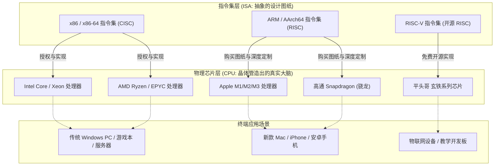
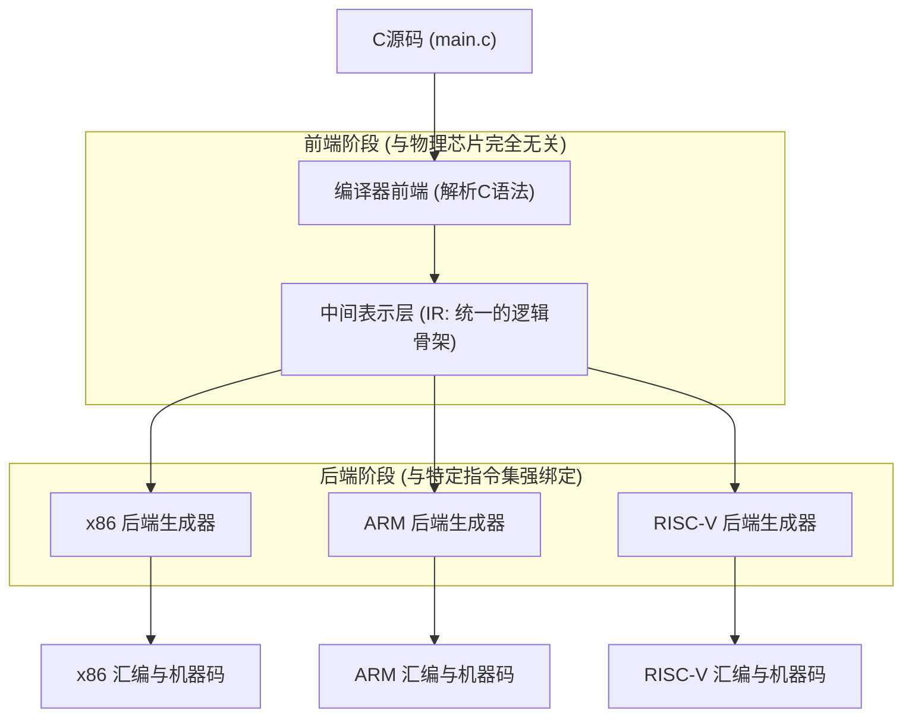
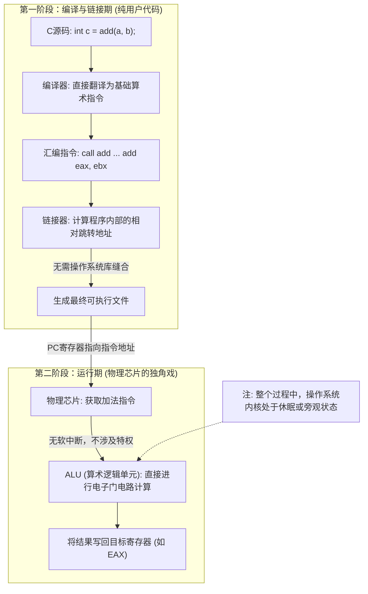
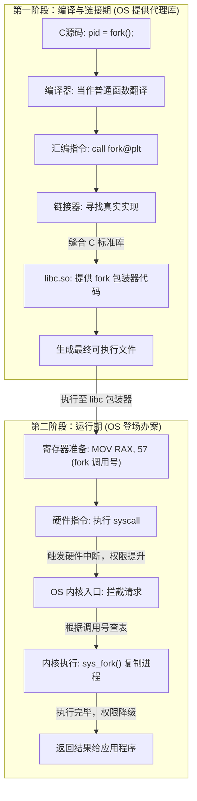
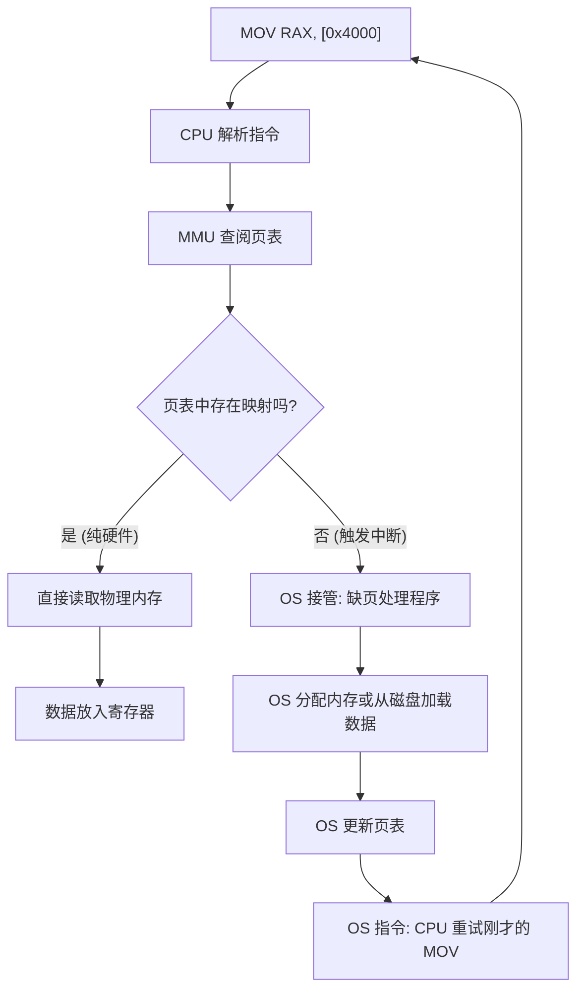
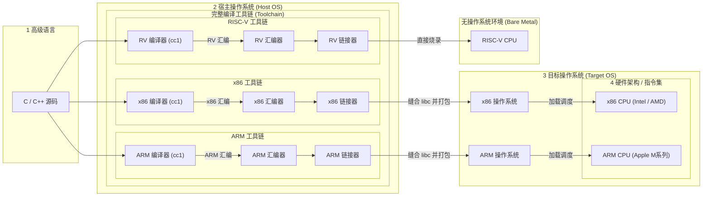
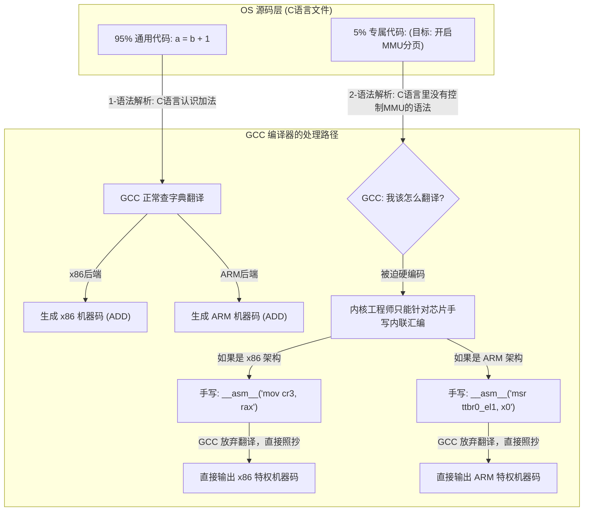

# 指令集、芯片与操作系统的底层协同

指令集、物理芯片和操作系统构成了计算机体系结构中最核心的**抽象层级**。它们之间的关系本质上是“协议”、“实现”与“管理者”的关系。

---

## 1. 核心概念

-   **指令集 (ISA, Instruction Set Architecture)**：软件与硬件之间的沟通“协议”。它定义了 CPU 能够执行的基础命令（机器指令）。
-   **物理芯片 (CPU)**：**指令集物理载体与执行者**。例如，Intel芯片是x86指令集，Apple M 芯片是 ARM 指令集。
-   **操作系统 (OS)**：硬件的**管理者与协调者**。它通过指令集指挥芯片，并为应用提供安全的运行环境。

> [!TIP]
> - **指令集门派：** 目前主流的指令集架构主要分为两大阵营：主打高性能的 **CISC（复杂指令集，以 x86 为代表）**，以及主打高能效的 **RISC（精简指令集，以 ARM 和开源的 RISC-V 为代表）**。
> - **物理芯片厂商：** 厂商拿到或买下指令集图纸后，通过自己设计内部的晶体管排布（微架构设计），把这套图纸变成真实的硅片。
> - **操作系统和指令集、芯片没有必然联系，操作系统是一个软件。**

---

## 2. 静态阶段：从代码到机器指令（编译与链接）

在程序运行前，高级代码需要降维成芯片能看懂的二进制。在此阶段，**OS 主要是“场地提供方”和“通讯录提供方”**。

### 2.1 编译型语言（C/C++）的四步进化

当执行 `gcc main.c` 时，编译工具链经历以下过程：

1.  **预处理 (Preprocessing)**：处理 `#` 指令，代码仍是 C。
2.  **编译 (Compilation)**：将 C 翻译为**汇编指令**（.s）。此时逻辑已锁定在特定 ISA。
3.  **汇编 (Assembly)**：**将汇编助记符一对一翻译成二进制机器指令**（.o）。
4.  **链接 (Linking)**：**OS 登场提供“通讯录”**。链接器将 `.o` 文件与系统提供的 **C 标准库 (libc)** 缝合，解决像 `printf` 或 `fork` 这种系统级功能的代码归宿。

> [!NOTE] 汇编与机器指令的关系
> 汇编指令是机器指令的“助记符”。物理芯片是“文盲”，它看不懂 `MOV`，只懂高低电平。汇编器负责这种极致的“降维”。

### 2.2 编译器内部的“翻译官”逻辑

GCC(GNU Compiler Collection) 不仅仅是一个程序，而是一个支持多硬件架构的集合体：

- **编译器前端 (Frontend)：** 负责“读懂人类”。它只管检查 C 语言语法对不对，然后把 C 语言转换成一种抽象的、与任何物理芯片都无关的**中间表示（IR, Intermediate Representation）**。
- **编译器后端 (Backend)：** 负责“对接硬件”。它接收前端传来的 IR，然后根据目标芯片的指令集字典，把 IR 翻译成专属的汇编代码和机器码。

结合上面的图，我们可以这样理解：

- **前端是共享的：** 无论你是要编译给 Intel 的 CPU，还是苹果的 M 芯片，或者是一块单片机，GCC 处理 `if-else` 和 `for` 循环的逻辑（前端）都是同一套代码。
- **后端的“按需调用”：** 
	- 当你在自己的一台 x86 电脑（比如普通的 Windows/Linux PC）上安装 GCC 时，系统默认给你安装的是 **“包含 x86 后端的 GCC”**。所以你敲 `gcc` 时，它默认调用 x86 后端，输出 x86 机器码。
    - 如果你买了一台树莓派（ARM 架构），在上面 `apt install gcc`，系统给你装的其实是 **“包含 ARM 后端的 GCC”**。虽然命令也是 `gcc`，但它体内的后端已经换人了。
- **交叉编译 (Cross-Compilation)** 假设你现在用着 x86 的电脑，但你需要给一台 ARM 架构的智能音箱写 C 程序。这时候你普通的 `gcc` 就罢工了。你必须专门去下载并安装一个名为 `arm-linux-gnueabihf-gcc` 的特定编译器。这就是典型的“在 A 架构上，运行带有 B 架构后端的编译器”。

### 2.3 解释型与虚拟机（Java/Python）

-   **虚拟机 (VM)**：运行在 OS 之上的“软件 CPU”，实时将中间字节码翻译成当前芯片的指令。
-   **JIT (即时编译)**：对热点代码直接编译并缓存，使速度接近 C。

---

## 3. 运行层：指令集、芯片与 OS 的三种协同模式

程序运行后，根据操作的权限，三者的参与程度完全不同。

### 模式 A：用户态计算（OS 隐身模式）

**场景：** `int c = add(a, b);`。这是纯粹的“用户代码”，OS 不干预。

### 模式 B：系统调用（OS 代理模式）

**场景：** `pid = fork();`。应用程序无权直接操作进程，必须请求 OS 代办。

让我们拆解一下，当你写下 `pid = fork();` 并按下编译键时，到底发生了什么：

- **编译期（OS 是“场地提供方”）：** 当你运行 `gcc` 时，OS 只是把 CPU 时间和内存借给 GCC 这个软件。GCC 在检查你的 C 代码时，看到 `fork()`，它根本不知道这是一个系统调用。它只会在 `<unistd.h>` 头文件里看到一个函数声明，于是就把它生硬地翻译成一句普通的汇编指令：`call fork`。
- **链接期（OS 提供了“通讯录”）：** GCC 的链接器（ld）发现你的代码里缺少 `fork` 的具体实现代码。这时，它会去 OS 系统目录里找到 **C 标准库（libc.so）**。链接器把 `libc` 里的 `fork` 包装器代码地址填入你的程序中。**这里的 `libc` 可以看作是 OS 提前写好并留在系统里的“系统调用代理代码”。**
- **运行期（OS 终于“登场办案”）：** 当你的程序真正跑起来，执行到 `fork` 包装器时，核心动作来了：
    1. **准备暗号：** `libc` 代码会往物理芯片的 `RAX` 寄存器里放入数字 `57`（在 Linux x86-64 架构中，57 代表 `fork` 系统调用）。
    2. **敲击硬核通道：** 紧接着，`libc` 会执行一条特殊的硬件汇编指令：`syscall`。
    3. **OS 全面接管：** `syscall` 指令瞬间触发硬件中断，暂停你的程序，把物理芯片切换到最高权限（内核态）。**此时，操作系统内核被彻底唤醒。**
    4. **执行内核逻辑：** OS 内核接手后，去查 `RAX` 寄存器，发现是 57 号请求。于是 OS 开始在自己的最高权限内存区里分配资源、复制页表、创建全新的子进程。
    5. **返回用户态：** OS 办完事后，把新进程的 ID 放回寄存器，再次操作物理芯片降级权限，把控制权还给你的 C 程序。

> [!TIP]
> 在编译 C 代码时，操作系统本身几乎不参与代码转换的逻辑，它只负责提供底层的 `libc` 库供链接器打包。真正的魔法，在于 `libc` 中隐藏的那句 `syscall` 汇编指令，它在**程序运行的那一刻**，打通了应用程序通向操作系统内核的物理硬件桥梁。

### 模式 C：硬件异常处理（OS 救火模式）
**场景：** 缺页异常。当 MMU（内存管理单元）发现地址转换失败时，OS 必须被动介入。

---

## 4. 总结：全链路逻辑全景图

> [!TIP] 关于操作系统的位置
> 
> - **位置一：包围工具链的“宿主 OS”。** 图中最庞大的中间框（完整编译工具链）整体运行在宿主 OS 上。这就好比你在 x86 的 Windows 电脑上运行 GCC。Windows 提供了内存和 CPU 资源，让 `cc1`、`as` 和 `ld` 这些翻译工具能够干活。
> - **位置二：链接器与“目标 OS”的接头。** 汇编器（`as`）输出的虽然已经是纯粹的机器指令了，但它就像是一堆散落的汽车零件。**链接器（`ld`）必须根据“目标 OS”的要求，把这些零件装配成一辆完整的车（可执行文件）。** 它会把目标 OS 的 `libc` 库（比如 `printf` 或 `fork` 的底层实现）缝合进去。
> - **位置三：阻隔在程序与芯片之间的“目标 OS”。** 对于 x86 和 ARM 这种通用计算机系统，生成的可执行文件（如 ELF 或 exe）绝对不可能直接扔给物理芯片。它必须先交给目标 OS。目标 OS 负责双击运行、分配虚拟内存、建立页表，最后才由 OS 的调度器把机器指令一条条送进 CPU。
> - **特例对比：RISC-V 裸机分支** 如果你写的是直接跑在单片机或物联网芯片（如简单的 RISC-V 芯片）上的代码，那里**没有操作系统**。此时，链接器会生成一种极其纯粹的二进制文件（如 `.bin` 或 `.hex`），通过烧录器**直接强行写入芯片的物理闪存**。开机通电，芯片直接从第一行代码开始执行。只有在这种“Bare Metal（裸机）”环境下，代码才是真正越过 OS，直达物理芯片的。

## 5. 其他问题

操作系统和计算机架构（x86，arm）有什么关系呢？

**操作系统和计算机架构没有必然联系。** 例如 Linux 操作系统可以运行在 x86架构的芯片上，也可以运行在 arm 架构的芯片上。因为，操作系统归根结底也就是一个极其庞大、极其复杂的软件程序。它到底会使用哪种架构，完全取决于你在编译它时，**选择了哪一条“工具链流水线”以及对应的目标芯片。** 相当于图中的 `CODE["C / C++ 源码"]` 

> [!TIP]
> 在图里的 `CODE["C / C++ 源码"]` 这个框框里：
> 
> - 如果你放进去的是你写的业务代码，编译出来就是跑在系统上的**普通应用程序**。
> - 如果你放进去的是 Linus Torvalds 写的 **Linux 内核源码**，编译出来的就是**操作系统本身**！

但是，虽然我们说操作系统可以等同于图中的 C 代码，但物理芯片毕竟存在硬件差异（比如 x86 的特权指令叫 `syscall`，而 ARM 的可能叫 `svc`）。为了兼顾“跨平台”和“硬件控制”，Linux 内核源码巧妙地分为了两部分：

- **95% 的通用 C 代码（与指令集无关）：** 操作系统的绝大部分逻辑（比如文件系统怎么读写文件、网络 TCP/IP 协议怎么发包、进程调度的算法模型）都是纯粹的逻辑。这些 C 代码可以直接喂给图中的 x86 工具链或 ARM 工具链，编译器会自动把它们翻译成对应芯片的机器码。
- **5% 的架构专属代码（与指令集强绑定）：** 涉及到直接操作硬件底层的极小部分代码（比如开机启动的第一段引导代码、内存 MMU 页表的底层设定、上下文切换时保存寄存器），必须针对不同的芯片手写**特定的汇编语言**或调用特定的硬件指令。

**为什么必须手写那 5%？**

**场景一：如何告诉芯片“页表”在哪里？** 操作系统要维护一张页表（地图）。当页表建好后，操作系统必须把这张地图的起始地址告诉物理芯片（CPU），这样 MMU 才能开始工作。

- **在 x86 芯片上：** 硬件规定，这个地址必须塞进一个叫 `CR3` 的特权寄存器里。
- **在 ARM 芯片上：** 硬件规定，这个地址必须塞进一个叫 `TTBR0` 的特权寄存器里。
- **GCC 的困境：** 标准的 C 语言里根本没有 `CR3` 或 `TTBR0` 这种变量类型或关键字！你如果写 `CR3 = 0x4000;`，GCC 只会报一个极其弱智的错：“变量 CR3 未定义”。
- **解决办法（那 5% 的代码）：** Linus Torvalds 只能在 `arch/x86` 目录下建一个文件，用 C 语言包裹着一句极其硬核的 x86 汇编：`__asm__("mov %0, %%cr3" : : "r" (address));`。GCC 看到 `__asm__` 就懂了：“哦，这是方言，我不翻译了，我直接把这段机器码塞进去。”
    

**场景二：如何触发系统调用？** 我们前面提到了 `fork()` 最终会触发硬件的中断通道陷入内核。

- **x86 的指令是：** `syscall`
- **ARM 的指令是：** `svc #0`
- **GCC 的困境：** C 语言标准里根本没有“陷入内核”这个语法。GCC 作为一个通用翻译官，它不知道你想让程序跨越权限边界。所以内核开发者必须再次手写汇编，专门针对 x86 写一遍 `syscall`，再针对 ARM 写一遍 `svc`。