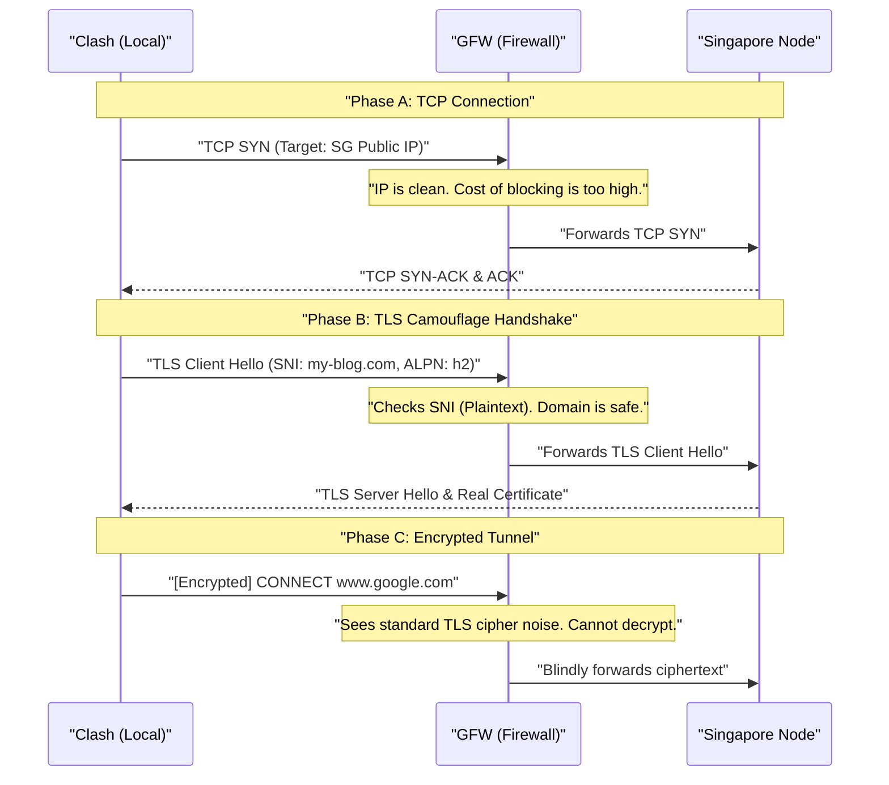
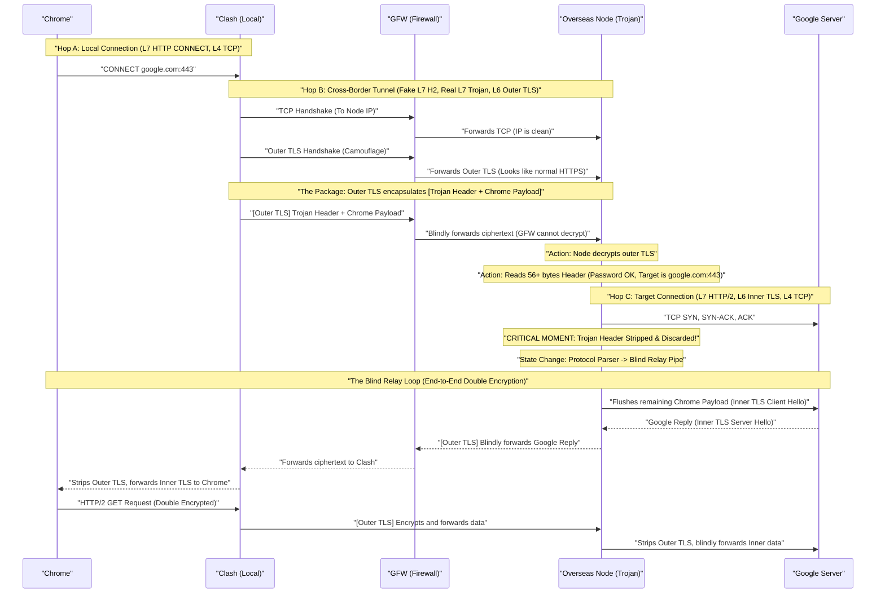

# “翻墙”基本原理

当我们在 Chrome 输入网址 `www.google.com`，按下回车，这个请求到底是如何翻越 GFW（长城防火墙）到达 Google 服务器的？

---

## 0. Fake-IP 机制

在流量离开 Chrome 之前，有一个核心问题：**Chrome 还没联网，是怎么知道 google.com 的 IP 并构造出数据包的？**

传统的 DNS 解析会被 GFW 污染（返回一个错误的 IP），导致连接还没开始就结束了。现代代理软件（如 Clash）使用了 **Fake-IP 机制**：

1. **接管 DNS**：Chrome 向系统请求 `google.com` 的 IP 时，Clash 拦截了请求。
2. **立即回复**：Clash 不去互联网查找，而是从自己的保留地址池（如 `198.18.x.x`）里随便抓一个 IP 丢给 Chrome。
3. **建立映射**：Clash 在本地建立一个映射表：`198.18.0.1 <-> www.google.com`。
4. **效果**：Chrome 以为解析成功，兴高采烈地向 `198.18.0.1` 发包。Clash 拿到包后查表，就知道这个包其实是要去 Google 的。**这彻底规避了 DNS 污染。**

---

## 1. 全链路四次握手

我们将剥离掉所有复杂的上层概念，只看底层 Socket 和协议的交互过程：

### 第一步：本地接管 (Local Handshake)

当浏览器发现系统设置了代理。它直接向你本机的 Clash 发起**第一次 TCP 三次握手**。连上后，Chrome 发送一条指令：`CONNECT www.google.com:443`。

> [!TIP] 什么是 CONNECT 方法
> - `CONNECT` 是 HTTP 协议中的一个特殊方法（Method），专门用于代理服务器环境。它的核心作用是要求代理服务器**建立一条端到端的透明盲传隧道（Transparent Blind Relay Tunnel）**。
> - 当浏览器需要访问 HTTPS（端口 443）等加密服务时，代理服务器无法解密中间的流量。因此，浏览器必须先用明文的 `CONNECT` 指令告诉代理目标地址，代理接通后，双方再开始传输加密数据。

> [!important] 为什么需要 CONNECT 方法？
> 因为现代网络是 **HTTPS (TLS)** 加密的。Clash 没有 Google 的私钥，无法直接解密流量。浏览器必须用明文的 `CONNECT` 方法向代理“报备”目的地。

### 第二步：建立代理隧道 (Proxy Tunnel Handshake)

在单跳代理网络中，本地客户端（Clash）与海外节点建立加密连接的过程。现代代理协议（如 Trojan、Vmess over TLS）的核心设计哲学是“流量伪装（Traffic Camouflage）”，即放弃创造未知的加密特征，而是将代理流量完全寄生并伪装成一次标准的、合法的 HTTPS 网页访问，以此规避 GFW 的审查。

Clash 在接收到浏览器的请求并查阅本地分流规则后，决定将流量路由至新加坡节点。此时，Clash 角色转换为客户端，向新加坡节点的公网 IP 发起**第二次 TCP 三次握手**，随后立即进行**一层 TLS 握手**。

在这层 TLS 握手中，协议展现了双重特性：

- **表面上（给 GFW 看的）：** 机场在新加坡节点部署了一个真实的伪装网站（如英文博客），并配置了受信任的 TLS 证书。GFW 看到的，完全是一个中国网民正在访问一个合法的海外博客。
- **本质上（对 Clash 而言）：** 这并非普通的网页浏览，而是“TLS 隧道承载代理流量”。Clash 将代理协议的指令（如 `CONNECT www.google.com`）作为有效载荷（Payload），塞进了这条 TLS 安全管道中。
    

**核心问题：为什么这套握手流程不会被 GFW 拦截？**

GFW 是一个极其庞大且复杂的流量过滤系统，其封锁策略基于**规则匹配与全网误杀成本**。伪装协议正是利用了这一点：

**1. 为什么 TCP 握手被放行？（IP 层面）**

- **干净的 IP 兜底：** 互联网每天存在海量的合法跨国 TCP 连接。只要新加坡节点的公网 IP 目前**不在 GFW 的黑名单库**中，GFW 就会默认允许建立底层的 TCP 连接。GFW 不会无差别阻断所有出境的 TCP 握手，否则整个跨国互联网通信将直接瘫痪。
    

**2. 为什么 TLS 握手被放行？（特征层面）**

- **法不责众的协议：** 全球互联网的金融、购物、社交等高价值数据交换几乎 100% 依赖 TLS（HTTPS）。GFW 绝不敢直接屏蔽跨境的 TLS 协议本身。
- **完美的伪装参数：** * **SNI (Server Name Indication)：** 在 `TLS Client Hello` 阶段，Clash 发出的明文请求中明确写着伪装域名（如 `my-blog.com`）。GFW 核查该域名未在黑名单内。
    - **ALPN (Application-Layer Protocol Negotiation)：** 同样以明文声明后续应用层使用主流的 `h2` (HTTP/2) 或 `http/1.1` 协议。
    - **真实证书回传：** 服务器回传的 TLS 证书是由国际知名机构（如 Let's Encrypt）颁发的真实有效证书。
- **GFW 的最终判定：** 域名合法、协议标准、证书真实，判定为**“合法的跨境网页访问”**，予以放行。
    

**3. 为什么后续真实流量无法被识别？（加密层面）**

- **高强度加密盲区：** 一旦 TLS 握手完成（Phase C），后续传输的所有代理寻址指令和用户的翻墙数据，全部被转化为高强度的随机乱码（密文）。
- **无钥解密悖论：** GFW 无法获取节点服务器的私钥，因此绝对无法解开这层外衣。在 GFW 的视角里，这仅仅是隧道两端在持续进行正常的、加密后的“网页数据传输”，从而实现了安全的暗度陈仓。

### 第三步：远端目标握手 (Remote Target Handshake)

在建立好的加密隧道内，Clash 把 Chrome 的诉求（我想连 Google）发了过去。

1. **剥离外衣**：新加坡服务器解开 TLS，读取代理协议头部，看到目的地是 `google.com:443`。
2. **代理执行**：新加坡服务器代替你的电脑，向 Google 服务器发起第三次 TCP 三次握手。

### 第四步：端到端真实握手 (End-to-End Handshake)

此时，Chrome 与 Google 终于开始了对话。Chrome 发出自己的 `TLS Client Hello` 去和 Google 协商加密。

**此时的数据包是“双重加密”的：**

- **内层**：Chrome 与 Google 之间的 HTTPS 加密。
- **外层**：Clash 与代理节点之间的隧道加密。

---

## 2. 全链路生命周期

---

## 3. 进阶对抗

即使 TLS 伪装完美，GFW 仍有手段封锁：

1. **深度包检测 (Deep Packet Inspection, DPI)：** 这是一种**被动旁路监听**技术。传统的防火墙只看网络包的头部（源 IP、目标 IP、端口），而 DPI 就像海关的 X 光机，它会拆开数据包，深入检查应用层（L7）的内容。对于加密流量，DPI 无法解密，但它会通过**统计学特征**（如数据包的大小分布、时间间隔、TLS 握手特征等）来推测这条加密隧道里跑的是不是代理协议。
2. **主动探测 (Active Probing)：** 这是一种**主动干扰**技术。当 DPI 发现某条连接的特征“疑似”翻墙流量，但又缺乏确凿证据时，GFW 的探测集群会伪装成一个普通的客户端，主动向该海外服务器的相同端口发送精心构造的探测包（如随机乱码、错误的 TLS 握手包、重放过去的流量），通过观察服务器的回应来“验明正身”。

这就是为什么我们需要像 **Trojan** 这样能“回落”到真实网站的协议。

详情参阅：**[代理协议深度解析](代理协议.md)**。