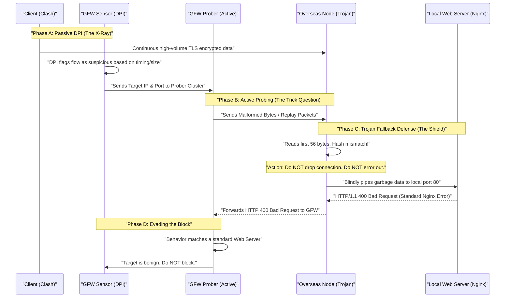
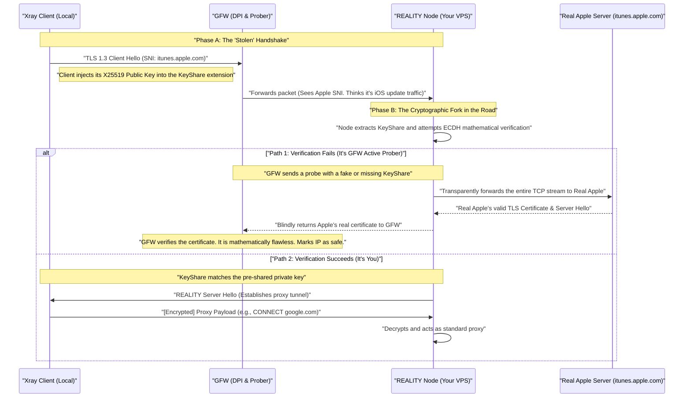

# 代理协议深度解析

在标准的 HTTPS 访问中，TLS 的上层是 HTTP。但在科学上网中，外层 TLS 握手完毕后，它的真实上层是 **“代理协议本身”（Proxy Protocol）**，而伪装协议是 **“HTTP/2 或 HTTP/1.1”**。

---

## 1. 协议对比：为什么需要代理协议？

- **HTTPS（事务型传输协议）：** 即使 TCP 保持连接，**每一次** 请求（GET/POST）都必须带有完整的 HTTP 头部。HTTP 协议贯穿连接的整个生命周期。
- **代理协议（一次性路由寻址协议）：** 它的协议头部（包含密码哈希和目标地址）通常只在 TCP 连接建立的 **最开始** 发送一次。寻址完成后，协议本身“隐身”，剩下的生命周期完全变成纯粹的 TCP 字节流盲传。

这就是为什么 GFW 通过深度包检测（DPI）很难识别：因为它只在连接开启的第一毫秒发送了非标准数据，且这段数据被包裹在 TLS 加密中。

---

## 2. Trojan 协议详解：字节结构布局

Trojan 的设计哲学是 **“极简与克制”**。它完全将自己寄生在标准的 TLS 1.3 隧道内。

### 2.1 内存字节布局 (Raw Bytes)

Clash 发出的 **第一个加密数据包** 就是 Trojan 请求头。它直接拼接在你要发送的真实业务数据（如 Chrome 发出的 TLS Client Hello）之前。

```text
+---------------------------------------------------------------+
|                  Password Hash (56 Bytes)                     |
|          (SHA224 of your proxy password, in hex)              |
+---------------------------------------------------------------+
|                        CRLF (2 Bytes)                         |
|                            "\r\n"                             |
+---------+----------+----------------------+-------------------+
| CMD (1) | ATYP (1) | DST.ADDR (Variable)  | DST.PORT (2 Bytes)|
| 0x01/02 | 0x01/3/4 |   e.g., google.com   |    e.g., 443      |
+---------+----------+----------------------+-------------------+
|                        CRLF (2 Bytes)                         |
|                            "\r\n"                             |
+---------------------------------------------------------------+
|                       Payload (Variable)                      |
|       (e.g., Chrome's raw TLS Client Hello to Google)         |
+---------------------------------------------------------------+
```

### 2.2 核心字段拆解

- **身份验证层 (Password Hash)**：前 56 字节。
    - **对抗 GFW 的关键**：如果哈希对不上，服务器判定为“GFW 主动探测”，它**不会断开连接**，而是把探测乱码原封不动转发给背后的 Nginx，假装自己是个真正的博客。
- **寻址指令层 (CMD/ATYP/DST)**：
    - **CMD (1 Byte)**：`0x01` 是 TCP（网页、下载），`0x02` 是 UDP（游戏、DNS）。
    - **ATYP (1 Byte)**：目标地址类型（IPv4、域名、IPv6）。
- **数据载荷 (Payload)**：第二个 `\r\n` 之后的所有字节，就是你原本要发给 Google 的数据。

---

## 3. 从“协议解析器”到“盲传水管”

一旦海外节点解析并验证了 Trojan 头部，神奇的事情发生了：**节点将 Trojan 头部彻底销毁，自身化作一根透明的“盲传水管”。** 

### 3.1 底层逻辑

Socket A $\leftrightarrow$ Socket B

在成功连上 Google 的那一毫秒，节点上的代理程序启动了两个极简的“死循环（Infinite Loop）线程”：

1. **上行线程 (Upload)**：只要从 **Socket A**（你的电脑）读到任何字节，立刻原封不动地塞进 **Socket B**（Google）。它绝对不看字节内容。
2. **下行线程 (Download)**：只要从 **Socket B**（Google）读到任何字节，立刻用 TLS 加密，然后塞进 **Socket A**（发回给你）。

**结论**：Trojan 协议只在连接开启的一瞬间存在，之后它就从内存中消失了。这极大降低了中转节点的 CPU 开销。

---

## 4. UDP 转发：UDP over TCP (CMD: 0x02)

如果协议头部中的 `CMD` 是 `0x02`，代表这是一个 UDP 包（如 DNS 请求）。

由于 TLS 只能承载 TCP 流，代理协议通过以下方式实现 **“在 TCP 隧道里强行塞入 UDP”**：

1. **分段封装**：Clash 将 UDP 包（包含目标 IP/Port 和 Payload）前面加上 2 字节的长度前缀。
2. **流式传输**：这些封装好的“UDP 片段”像 TCP 字节一样通过 TLS 隧道发送。
3. **远端解包**：新加坡服务器收到后，剥掉前缀，还原成原始 UDP 包发往 Google DNS（8.8.8.8）。

> [!warning] 队头阻塞问题
> 由于 UDP 被强行套在了 TCP（TLS）里，如果跨国网络丢了一个包，TCP 会等待重传，导致后续所有的 UDP 包（即使是实时性很强的游戏数据）也跟着被卡住。这就是为什么打游戏推荐使用基于 UDP 的原生协议（如 Hysteria2 或 WireGuard）。


## 5. Trojan 回落机制 (Fallback)

在[“翻墙”基本原理](“翻墙”基本原理.md)重提到，GFW有其他手段检查加密隧道中的流量是否是翻墙流量，DPI 和主动探测。

Trojan 回落机制 (Fallback) 是 Trojan 应对 DPI 和主动探测的核心防御策略。面对无法验证身份的探测包，Trojan 绝不主动暴露代理特征（如直接断开连接或返回特定错误），而是**将自己降级为一个透明的反向代理**，把非法的探测流量全部盲传给本机的真实 Web 服务器（如 Nginx），由真实环境去应对审查。





我们可以把这场底层博弈拆解为三个阶段来看：

**第一阶段：DPI 的被动嗅探 (Phase A)** 

尽管 Trojan 完美套上了一层 TLS 1.3 的外壳，但在 DPI 眼里，普通的网页浏览和代理翻墙在**流量形态**上是有区别的。你浏览网页是阵发性的（加载图片，停顿，再点击）；而你看 YouTube 4K 视频或者下载大文件时，这条 TLS 隧道里会持续、长时间地塞满达到带宽上限的数据块。DPI 敏锐地捕捉到了这种“不符合常规 Web 浏览行为”的统计学异常，于是将你的新加坡节点 IP 标记为“高度可疑”。

**第二阶段：主动探测的火力侦察 (Phase B)** 

GFW 无法确认里面是不是翻墙数据，于是派出了“刺客”（主动探测集群）。探测器直接连接你节点的 443 端口，不按套路出牌，发过去一堆无意义的乱码，或者把昨天抓取到的你的某段加密包重新发一遍（重放攻击）。 如果你的节点运行的是老旧的代理软件（如早期的 Shadowsocks），遇到解不开的乱码，程序会直接抛出异常并发送 `TCP RST` 强行断开连接。GFW 收到 `RST` 瞬间就能断定：正常的 Web 服务器遇到乱码会返回 HTTP 错误，直接断开连接的绝对是心虚的代理软件。IP 随即被封杀。

**第三阶段：Trojan 的降维防御 (Phase C & D)** 

这就是 Trojan 协议最精妙的地方。当 Trojan 监听 443 端口并收到 GFW 发来的探测包时，它的状态机极其冷静：

1. 它读取数据包的前 56 个字节，尝试与本地的密码哈希进行比对。
2. 因为 GFW 发的是乱码，哈希必然比对失败。
3. 此时，Trojan 触发 **Fallback（回落）** 逻辑。它在内存中打通一条通往本机 `127.0.0.1:80`（通常运行着一个真实的 Nginx 或 Caddy 服务器）的内部管道。
4. Trojan 把 GFW 发来的那些乱码，原封不动地全盘倒给 Nginx。
5. Nginx 作为一个标准的、严格遵守 RFC 规范的 Web 服务器，看到这堆乱码，自然无法解析为 HTTP 请求。于是，Nginx 诚实地生成了一个极其标准的包含服务器版本号的 `HTTP/1.1 400 Bad Request` 页面，交还给 Trojan。
6. Trojan 再把这个标准的错误页面发给 GFW 的探测器。
    

在 GFW 探测器的视角里，它用乱码攻击了这个 IP，并且收到了与全网上千万台真实 Nginx 相同的标准报错反应。它无法区分这是一个真实的网站，还是一个套着 Nginx 护盾的 Trojan 节点，最终只能得出结论：“查无异常，放行”。


不过，道高一尺魔高一丈。由于传统 TLS 伪装需要机场去购买真实的域名，成本极高，并且GFW 后来开始利用 **SNI 阻断**（直接封锁 Clash 和机场节点 Client Hello 里的明文域名）来打击这种方案。

## 6. REALITY 协议

**REALITY 协议**（通常作为 Xray-core 的一部分运行）是目前对抗 GFW 最前沿的“无域名、去中心化”伪装技术。

传统的 TLS 伪装（如 Trojan、Vmess+TLS）要求你必须自己购买一个域名，并配置真实的 Nginx 服务器和证书。这不仅有成本，而且你新注册的“野鸡域名”本身在 GFW 的大数据系统中就缺乏信誉度。

REALITY 的核心哲学是“借鸡生蛋”。它不需要你购买任何域名。它通过在握手阶段拦截和重定向，直接“偷用”高信誉度大厂（如微软、苹果、亚马逊）的公有域名和真实 TLS 证书来为你打掩护。




REALITY 的精妙之处在于它对底层密码学的极致利用，我们拆解来看：

**第一步：白嫖高信誉 SNI (The 'Stolen' Handshake)** 

你在本地配置 REALITY 时，会填入一个“目标网站”（比如 `itunes.apple.com`）。当你的客户端向你的海外节点发起连接时，它会在 `TLS Client Hello` 的 SNI 字段明文写上 `itunes.apple.com`。 GFW 看到这个包，第一反应是：“这是一个中国网民在访问苹果的服务器”。因为苹果的流量在全国范围内极其巨大，GFW **绝对不敢**采取“宁可错杀一千，不可放过一个”的策略去阻断这个 SNI。

**第二步：暗藏玄机的握手 (The KeyShare Injection)** 

既然 SNI 写的是苹果，你的节点怎么知道这是你要翻墙，而不是真的有人不小心访问到了你的服务器？ 在 TLS 1.3 的握手协议中，有一个叫 **Key Share（密钥共享）** 的扩展字段，原本是用来协商加密算法的。REALITY 客户端会把提前约定好的 **X25519 公钥** 巧妙地伪装成普通的加密参数，塞进这个字段里。这就像是在公开的信封上，用隐形墨水画了一个只有你和节点才懂的暗号。

**第三步：完美消除特征 (The Cryptographic Fork)** 

当数据包到达你的海外节点时，REALITY 服务端会检查那个暗号：

- **如果是 GFW 的主动探测集群来了：** GFW 也会伪装成客户端发送 `Client Hello`，但它不知道你的私钥，所以它构造不出正确的 Key Share 暗号。 此时，REALITY 节点**完全不作任何回应**，而是瞬间化身为一个透明的路由器，把 GFW 的探测包直接转发给**真正的苹果服务器**。苹果服务器收到请求，自然会返回它自己那份由顶级 CA 机构签发的、绝对真实有效的 TLS 证书。REALITY 节点再把这份真证书原封不动地传给 GFW。 GFW 一查：“证书是真的，指纹是对的，这确实是一台苹果的边缘缓冲服务器。”探测顺利通过。
    
- **如果是你自己的流量来了：** REALITY 节点对上了暗号，立刻接管连接，截断发往苹果的请求，并在内部为你建立起通往真正目标（如 Google）的代理隧道。
    
---

**总结：为什么 REALITY 是目前的终极形态？** 

传统的 Trojan 是“自己造假”（自己买域名、自己配 Nginx）， 不管你怎么造假，你服务器的 TLS 指纹（JA3/JA3S）和真实的大型网站多少会有区别。 而 REALITY 是“真实验证”。当面对审查时，它交出去的那份证书，不是伪造的，而是真正的目标网站实时生成的。它实现了**密码学意义上的完美伪装**。