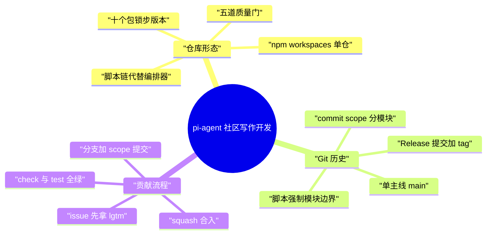

# pi-agent 社区写作开发

> [!note]
> **Ref:** [AGENTS.md](../../source/AGENTS.md) | [CONTRIBUTING.md](../../source/CONTRIBUTING.md) | [package.json](../../source/package.json)

pi（pi-mono）是一个以 npm workspaces 组织的 TypeScript monorepo：十一个发布包共享同一个版本号，无构建编排器，靠根脚本按依赖拓扑顺序链编译；git 历史是单主线加锁步发布线，模块归属由 commit message 的 scope 标记，模块边界由 check 脚本强制。社区贡献的门槛前置在 PR 之前——先经 issue 沟通获得维护者 `lgtm`，再提交；本地改动需遵循精确暂存、scope 提交、全量验证的纪律。

## 仓库形态：npm workspaces 单仓

### 工作区结构

根 `package.json` 的 `workspaces` 声明三类成员：

- `packages/*`：10 个包，统一 `@earendil-works/pi-*` 命名
- `packages/session-backends/*`：sqlite-node 后端
- `packages/coding-agent/examples/extensions/*`：5 个示例扩展（有独立依赖，如 custom-provider 示例）

包清单与依赖方向：

| 包 | 职责 | 依赖上游 |
| --- | --- | --- |
| `pi-tui` | 终端交互界面 | — |
| `pi-telemetry` | 遥测 | — |
| `pi-ai` | 模型与 provider 层 | — |
| `pi-agent-core` | agent 核心 | ai |
| `pi-session-backend-sqlite-node` | 会话存储 | — |
| `pi-protocol` | RPC 协议 | telemetry |
| `pi-client` | 客户端 | protocol |
| `pi-server` | 服务端 | client, protocol |
| `pi-coding-agent` | 最上层产品 | agent, ai, client, protocol, tui |
| `pi-evals` | 评测（不入发布） | coding-agent 等 |

### 锁步版本

- 所有包共享**同一个版本号**（当前 0.84.1），互相依赖用 `^0.84.1` caret 范围
- `version:patch|minor` 脚本：`npm version --workspaces` 统一 bump → `scripts/sync-versions.js` 校验同步 → `npm install --package-lock-only` 刷新锁文件
- 发布走 `scripts/release.mjs`：bump 版本、更新各包 CHANGELOG、生成 artifacts、跑 `npm run check`、提交 `Release vX.Y.Z`、打 tag、推 main + tag；CI 负责构建二进制与 npm 发布（GitHub Actions OIDC 信任发布，本地不执行 `npm publish`）

### 构建与依赖纪律

- 无 turborepo/nx 类编排器，根脚本按依赖拓扑**手写顺序链**：`tui → telemetry → ai → agent → sqlite-node → protocol → client → server → coding-agent`
- 每个包用 `tsgo -p tsconfig.build.json`（TypeScript native preview 编译器）编译；coding-agent 额外用 esbuild 打包并 chmod 可执行
- 直接外部依赖**精确锁版本**（`scripts/check-pinned-deps.mjs` 强制），传递依赖用根 `overrides` 覆盖
- 新建 provider（`packages/ai`）有独立清单：核心类型、provider 实现、惰性注册、模型生成、完整测试矩阵、coding-agent 接线、文档（见 `add-llm-provider` skill）

### 质量门：npm run check

`npm run check` = biome（lint + format）→ pinned-deps → ts-imports 相对导入检查 → coding-agent 的 `npm-shrinkwrap.json` 与 install-lock 校验 → `tsgo --noEmit` 全仓类型检查 → 浏览器 smoke。

发布特殊处理：`pi-coding-agent` 作为独立 npm 包持有自己的 shrinkwrap（`scripts/generate-coding-agent-shrinkwrap.mjs` 生成，新依赖需显式加入 allowlist）；`scripts/local-release.mjs` 在发布前做 Node/Bun 双二进制本地冒烟。

## Git 历史与模块开发

### 历史形态

- **单仓单主线**：只有 `main`，无 develop；5651 个提交、317 个 merge commit；2025-11 建仓，首个提交即为 monorepo 初始化，无历史包袱
- **发布线**：`Release vX.Y.Z` 提交 + `vX.Y.Z` tag 锁步发布，v0.0.1 到 v0.84.1 共 300+ tag；节奏快，近期几乎每天一发
- **合并方式混合**：存在 `Merge pull request #N` 合入（317 个），但多数提交是 squash 或直推进 main；PR 合入后最终历史保持单 commit，本地历史是否干净不影响主仓库

### 模块边界与提交规范

模块**不拆独立仓库、不用子模块**，全部在单仓内：

- commit message 即模块归属：`{feat,fix,docs,refactor,chore}[(scope)]: 消息`，scope 为模块名（ai / tui / agent / coding-agent / protocol / plan-mode 等）
- 历史 scope 统计：`fix(coding-agent)` 712、`fix(ai)` 390、`feat(coding-agent)` 254、`docs(coding-agent)` 208、`fix(tui)` 207
- 目录活跃度：coding-agent 3405 提交、ai 1765、tui 1081、agent 955——coding-agent 是产品外壳，最活跃
- 分支命名自由：`fix-issue-XXXX`、`feat/xxx`、`refactor/xxx` 乃至任意短 slug 并存，无强制规范

模块边界靠脚本强制而非 git：

- `check:ts-imports`：禁止跨包相对导入，必须走 `@earendil-works/pi-*` 包名
- `check:pinned-deps`：直接依赖精确锁版本，防止模块间漂移
- coding-agent 的 shrinkwrap / install-lock 脚本生成并校验独立发布物

### 协作门槛

- 新贡献者的 issue/PR 默认被 bot **自动关闭**，维护者回复 `lgtm`（解锁 issue + PR）或 `lgtmi`（仅解锁 issue）才放行；自动关闭是流量缓冲，维护者定期人工复审
- 铁律一条："You must understand your code"——用 AI 写码可以，提交不理解其行为的改动会被关闭
- 周五至周日提交的 issue/PR 不保证及时复审

## 参与开发与提 PR 流程

### 前置：先拿 lgtm

无 `lgtm` 批准前**不要开 PR**。正确顺序：先在 issue 中说明意图（简洁、一屏以内、自己写、明确表达"我想实现"）→ 等维护者回复 `lgtm` → 再动手。违反两次或批量机器人生成 issue 会被永久封禁。

### 本地分支与提交纪律

```bash
git checkout -b fix-issue-1234     # 惯例命名，自由发挥
git add packages/ai/src/xxx.ts     # 精确路径暂存，禁用 git add -A / git add .
git commit -m "fix(ai): 描述"
```

- 一次 PR 只做一件事；跨模块改动**每个模块一个 commit**
- 提交消息必须能讲清"为什么"

### 验证：必须全绿

```bash
npm run check
./test.sh
```

- **不要动 CHANGELOG.md**——由维护者统一维护
- lockfile 变更被 pre-commit 拦截，需 `PI_ALLOW_LOCKFILE_CHANGE=1`；新依赖必须精确锁版本，coding-agent 依赖变更须过 shrinkwrap allowlist

### 推送与 PR

```bash
git push -u origin fix-issue-1234
gh pr create --title "fix(ai): ..." --body-file /tmp/pr-body.md
```

- PR 标题沿用 commit 风格（带 scope）；描述写清问题、复现、为何如此修
- 主分支前进时用 `git rebase origin/main` 同步；冲突**只解决自己改的文件**，他人文件冲突停下询问

### 禁忌清单

- 禁止 `git reset --hard` / `checkout .` / `clean -fd` / `stash`——仓库允许多 agent/session 并行工作，这些命令会毁掉他人改动
- 禁止用 AI 生成 issue/PR 文案；AI 生成的段落须明确标注
- 禁止在 PR 中夹带无关文件；只精确暂存本次改动
