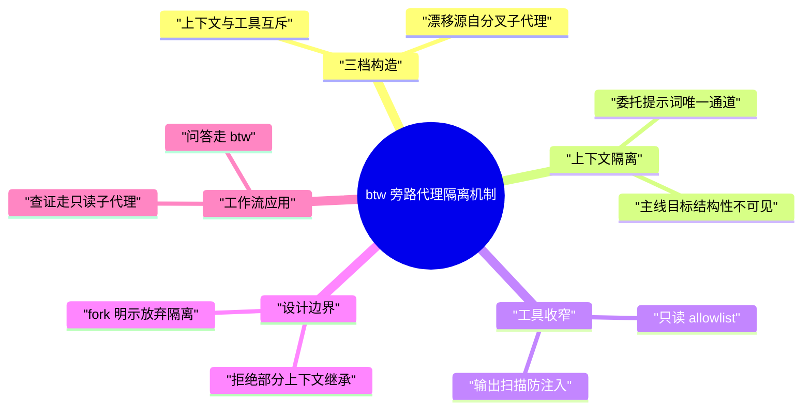
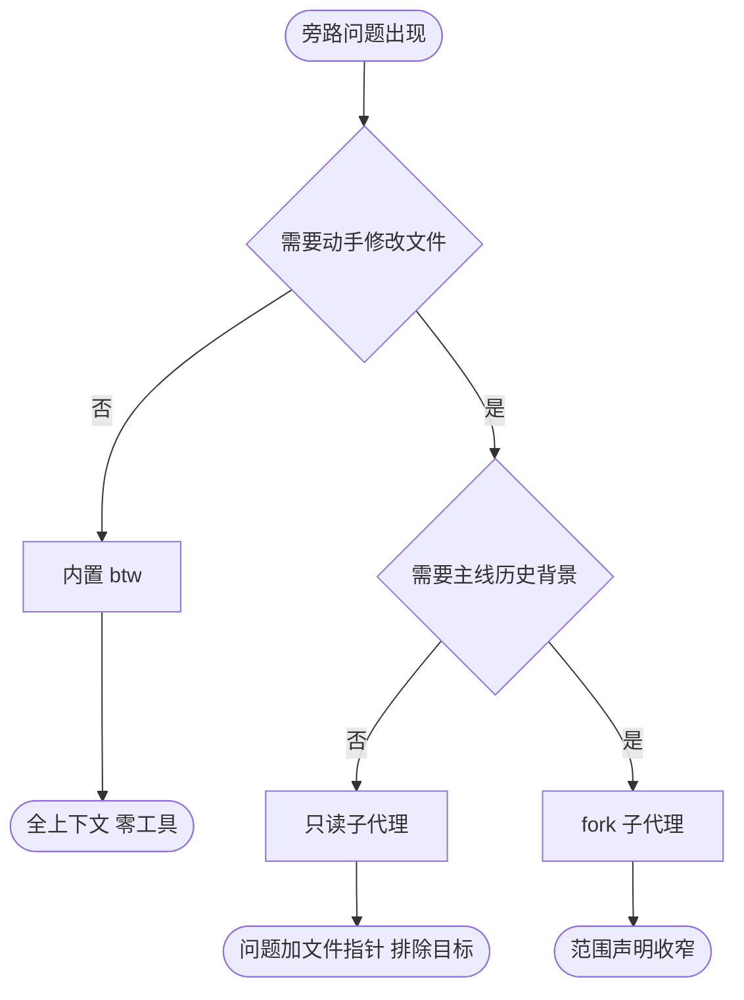

# Claude Code 旁路代理隔离机制

> [!note]
> **Ref:** [Create custom subagents](https://code.claude.com/docs/en/sub-agents) | [Tools reference](https://code.claude.com/docs/en/tools-reference) | [Agent SDK Subagents](https://code.claude.com/docs/en/agent-sdk/subagents) | [Interactive mode 与 btw](https://code.claude.com/docs/en/interactive-mode) | [How and when to use subagents in Claude Code](https://claude.com/blog/subagents-in-claude-code) | [Building agents with the Claude Agent SDK](https://claude.com/blog/building-agents-with-the-claude-agent-sdk) | [claude-code issue 4908](https://github.com/anthropics/claude-code/issues/4908)

主线推进 /goal 时，旁路代理需要足够工程上下文才能有效解答；上下文一旦完整注入，子代理便倾向推进主线工程，即便系统提示词明令禁止。Claude Code 的解法把「上下文」与「工具」设计为两个互斥的轴：默认子代理零上下文继承、全工具可用；内置 /btw 全上下文可见、零工具可用；fork 两者俱全，官方明示放弃输入隔离。漂移的根因在父代理撰写的委托提示词，抑制手段为结构性收窄——工具的机械不可用，比提示词禁令可靠。

## 核心设计：上下文与工具互斥的三档构造

| 档位 | 上下文 | 工具 | 官方定位 |
| :--- | :--- | :--- | :--- |
| 默认 subagent | 零继承，全新上下文窗口 | 全量，可按定义收窄 | 需动手或查证的旁路任务 |
| /btw 旁路问答 | 全量，完整会话可见 | 零工具 | 纯问答，回答不入历史 |
| fork（/subtask） | 全量继承 | 全量 | 需背景的并行动手，明示放弃隔离 |

官方将 /btw 定义为子代理的反向构造：

> `/btw` is the inverse of a subagent: it sees your full conversation but has no tools, while a subagent has full tools but starts with an empty context.

推论：充分上下文与主线推进抑制之间没有平衡点，只能在「给上下文不给手」与「给手不给上下文」中选择。漂移现象出现在两者俱给的 fork 档位。

## 上下文隔离机制（默认子代理）

子代理以全新隔离上下文启动：

> Each subagent starts with a fresh, isolated context window. It doesn't see your conversation history, the skills you've already invoked, or the files Claude has already read.

启动时装载的清单：

- 自身 system prompt（agent definition 正文加基本环境信息，不含主线完整系统提示词）
- 父代理的委托提示词
- CLAUDE.md 与 git status 快照（Explore / Plan 跳过）
- frontmatter `skills` 指定的 preloaded skills

永不传递的：主会话对话历史、工具结果、主线系统提示词。SDK 文档明确唯一通道：

> The only content you pass from parent to subagent is the Agent tool's prompt string, so include any file paths, error messages, or decisions the subagent needs directly in that prompt.

推论：/goal 目标对子代理结构性不可见，除非父代理将其写入委托提示词。fork 是唯一例外，继承完整会话，官方明示 "drops the input isolation that subagents otherwise provide"。

## 工具收窄机制

- 不存在 `read-only: true` 标志；只读通过 `tools` allowlist（如 `tools: Read, Grep, Glob`）或 `disallowedTools: Write, Edit` 机械实现
- 内置 Explore / Plan 为只读类型，Write 与 Edit 被拒
- agent definition frontmatter 可配 `permissionMode`（含 plan）、`maxTurns`、`skills`、`mcpServers`、`background` 等
- 后台运行的子代理工具自动收窄为 Read / Grep / Glob / Bash / Edit / Write 等一小批
- output scanning（v2.1.210）：扫描子代理 final report 中的指令形文本并中和，同时约束间接注入与越权行动

提示词禁令可能被模型违背；不存在的工具无法被使用。工具收窄是最硬的一层抑制。

## 设计理由与边界

- 上下文保护：旁路任务在子代理独立上下文完成，仅返回摘要，不淹没主线上下文。官方称这是子代理利于长会话的原因
- 新鲜视角：子代理不继承主线会话的假设、上下文与盲区
- 浏览器标签页类比：在不丢失主线的前提下追寻旁路支线
- 安全：changelog v2.1.210 强化 Agent 工具对间接提示注入的防护
- 边界：GitHub 议题 4908「Scoped Context Passing for Subagents」被关闭为 not planned，官方不做部分上下文继承；替代方案即把所需上下文显式写入委托提示词

隔离是刻意设计，留了 fork 一个显式出口。

## 工作流应用：/goal 场景规范

旁路问题按性质分流：

配套规则：

1. 纯问答走内置 /btw：上下文给足，无工具抓手，回答不入历史
2. 查证走只读子代理：委托提示词只含问题、文件路径与必要事实，不写 /goal 目标与推进状态
3. 必须传主线上下文时只传事实，不传目标——目标陈述是 goal-pull 触发词
4. /goal 状态落文件（如 GOAL.md），旁路代理按需自读，由主线口述
5. 漂移的根因在父代理侧委托提示词，治理的检查点在父代理，而非子代理自律
