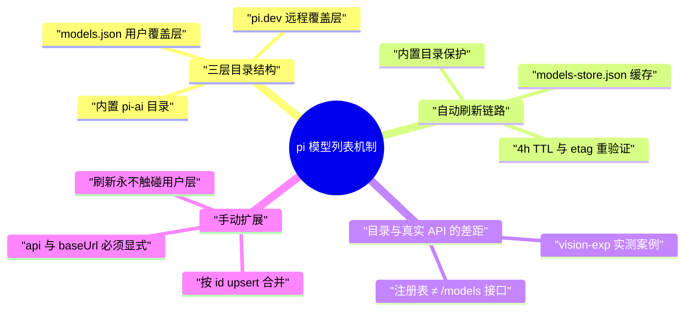
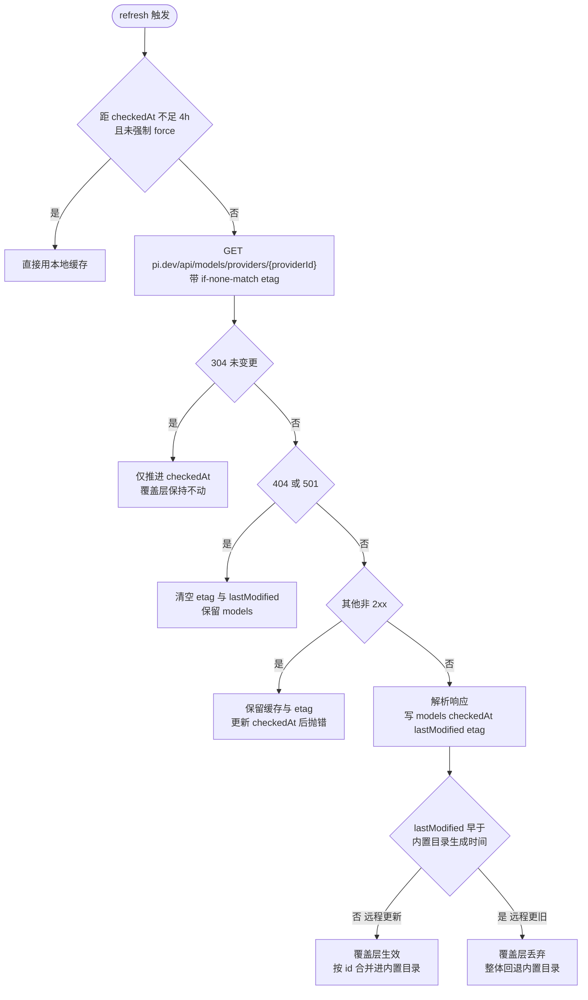

# pi 模型列表机制：目录来源、自动刷新与手动扩展

> [!note]
> **Ref:** [providers.md](/home/pi/.nvm/versions/node/v24.13.0/lib/node_modules/@earendil-works/pi-coding-agent/docs/providers.md) | [models.md](/home/pi/.nvm/versions/node/v24.13.0/lib/node_modules/@earendil-works/pi-coding-agent/docs/models.md) | `dist/core/remote-catalog-provider.js` | `dist/core/provider-composer.js` | [pi.dev catalog API](https://pi.dev/api/models/providers)（下称 $PI_ROOT，即 pi-coding-agent 安装目录）



pi 的模型列表是一个三层叠加目录：随版本发布的内置静态目录、4 小时 TTL 的 pi.dev 远程覆盖层、以及用户手写的 models.json 覆盖层。自动刷新只镜像 pi.dev 注册表，从不查询 LLM 提供商的真实 `/models` 接口，因此注册表滞后的模型（如 `deepseek-v4-flash-vision-exp`）刷多少次都不会出现，唯一持久途径是 models.json 用户层。

## 模型目录的三层结构

| 层 | 来源 | 刷新时机 | 持久位置 |
| :--- | :--- | :--- | :--- |
| 内置目录 | pi-ai 包 `dist/providers/data/<provider>.json` | 随 pi 升级 | 安装目录 |
| 远程覆盖层 | `https://pi.dev/api/models/providers/<id>` | 启动/显式刷新，4h TTL | `~/.pi/agent/models-store.json` |
| 用户覆盖层 | `~/.pi/agent/models.json` | 每次打开 `/model` 重载 | 用户配置（编辑器直接改） |

远程覆盖层以 `withRemoteCatalog` 包裹每个非 radius 的内置 provider（`model-runtime.js` 的 `ModelRuntime.create`），效果为按模型 id 合并：`合并 = 内置列表 + 覆盖层`，同名 id 覆盖、新 id 追加。`PI_OFFLINE=1` 时整套网络刷新禁用。

## 自动刷新链路

`models-store.json` 按 provider 缓存一条记录：

```json
{
  "opencode-go": {
    "models": [ { "id": "deepseek-v4-flash", "...": "模型元数据" } ],
    "checkedAt": 1787498571550,
    "lastModified": 1787302810000,
    "etag": "W/\"3652c8924cfbb8c23736322bdb51b880\""
  }
}
```

刷新决策（`remote-catalog-provider.js`）：



要点：

- **304 重验证**：只有缓存里确有 `models` 才带 `if-none-match`，保证 304 永远落在有 body 的缓存上，不会留下空覆盖层。
- **`localGeneratedAt` 保护**：远程 `lastModified` 若不晚于内置目录生成时间，覆盖层整体丢弃。内置目录比远程新时，pi 信任内置。
- **失败语义**：网络/5xx 失败保留原缓存与 etag，仅推进 `checkedAt`，下次刷新继续重验证，不盲目清空。

## 为什么真实 API 有模型而 pi 没有

2026-08-23 实测 `deepseek-v4-flash-vision-exp`（DeepSeek V4 Flash 视觉实验版）：

| 来源 | 模型数 | 含 vision-exp |
| :--- | :--- | :--- |
| pi.dev 远程目录 `opencode-go`（实时请求，etag 与本地缓存一致） | 21 | 无 |
| pi.dev 远程目录 `deepseek` | 2 | 无 |
| pi-ai 0.84.2 内置目录（npm 已是最新版） | — | 无 |
| opencode zen 网关 `/v1/models`（`opencode.ai/zen/go`） | 30 | 有 |
| `api.deepseek.com/models` | 3 | 有 |

上游网关与官方 API 早已上线该模型，pi 的两层目录都没跟上。刷新只能拿回 pi.dev 注册表的内容，注册表本身缺条目时，模型在 pi 中不可见——自动刷新救不了注册表滞后的 case。

## 手动扩展：models.json 用户覆盖层

用户层是官方为这类 case 设计的合并口（`provider-composer.js` 的 `applyModelsJson`）：

- 内置模型全部保留；自定义模型按 `id` upsert，撞名替换、新名追加。
- **陷阱：`api` 与 `baseUrl` 缺省时从 `defaults` 继承，而 `defaults` 是该 provider 的第一个内置模型**。`opencode-go` 的第一个内置条目是 anthropic-messages 的 minimax-m3，因此自定义 openai-completions 模型必须显式写 `api: "openai-completions"` 与 `baseUrl: "https://opencode.ai/zen/go/v1"`，否则会继承错误的 API 类型与端点。
- 省略 `apiKey` 时走 `auth.json` / 环境变量，与内置模型同一套鉴权。
- 覆盖层仅在内存中与内置合并；网络刷新只写 `models-store.json`，**永不触碰 models.json**。与之相对，直接手改 `models-store.json` 会在下一次刷新时被覆盖，不可作为持久手段。

给 `opencode-go` 加视觉模型的完整示例：

```json
{
  "providers": {
    "opencode-go": {
      "models": [
        {
          "id": "deepseek-v4-flash-vision-exp",
          "name": "DeepSeek V4 Flash Vision Exp",
          "api": "openai-completions",
          "baseUrl": "https://opencode.ai/zen/go/v1",
          "reasoning": true,
          "input": ["text", "image"],
          "cost": { "input": 0.22, "output": 0.66, "cacheRead": 0.007, "cacheWrite": 0 },
          "contextWindow": 1000000,
          "maxTokens": 384000,
          "compat": {
            "supportsStore": false,
            "supportsDeveloperRole": false,
            "maxTokensField": "max_tokens",
            "requiresReasoningContentOnAssistantMessages": true,
            "thinkingFormat": "deepseek"
          },
          "thinkingLevelMap": { "minimal": null, "low": "low", "medium": null, "high": "high", "max": "max" }
        }
      ]
    }
  }
}
```

元数据以同名内置条目（deepseek-v4-flash）为模板：thinking 走 deepseek 格式、`max_tokens` 字段、1M 上下文。本次案例已用 1×1 红图对网关端到端验证：返回 `reasoning_content`、图片识别正确，compat 字段与网关行为一致。

## 关键文件与命令

- 内置目录：`$PI_ROOT/node_modules/@earendil-works/pi-ai/dist/providers/data/<provider>.json`
- 远程覆盖层：`$PI_ROOT/dist/core/remote-catalog-provider.js`（`withRemoteCatalog`，TTL 常量 `REMOTE_CATALOG_REFRESH_INTERVAL_MS`）
- 用户覆盖层合并：`$PI_ROOT/dist/core/provider-composer.js`（`applyModelsJson` / `modelFromJson`）
- 本地配置：`~/.pi/agent/models.json`（用户层）、`~/.pi/agent/models-store.json`（刷新缓存，可安全删除触发全量重拉）
- 验证：`pi --list-models` 列全量目录；会话内打开 `/model` 即重载 models.json，无需重启
- 根治路径：等 pi.dev 目录补条目（上游 pi-mono 仓库）或 pi-ai 发新版内置；届时删掉 models.json 覆盖层即可回归纯自动
