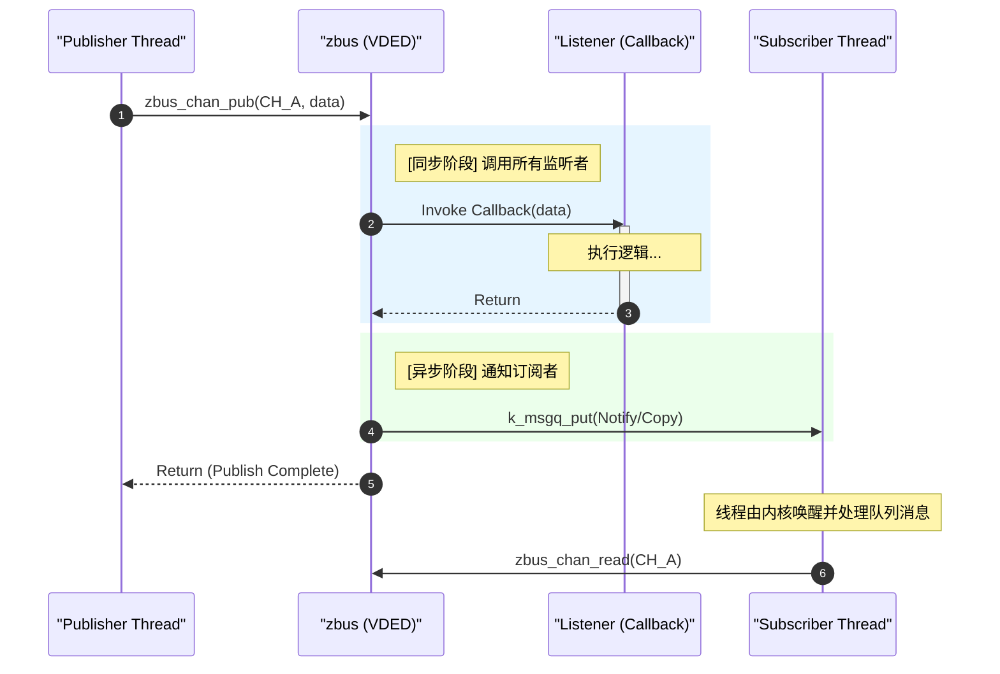

# 设计模式辨别：监听者 (Listener) vs 订阅者 (Subscriber)

> [!note]
> **Ref:** 
> - [Zephyr Bus (zbus) — Zephyr Project Documentation](https://docs.zephyrproject.org/latest/services/zbus/index.html)
> - POSIX Socket API `listen(2)`

在系统设计和 IPC（进程间通信）中，“监听”与“订阅”常被混用。在 Zephyr 的 `zbus` 组件中，这两者被严格区分为两种不同的观察者模型。本文旨在通过对比其实施机制、执行上下文及典型案例（如 Socket），厘清其本质。

## 1. 核心差异对比

| 特性 | 监听者 (Listener) | 订阅者 (Subscriber / Msg Subscriber) |
| :--- | :--- | :--- |
| **底层本质** | **同步回调函数 (Callback)** | **异步消息线程 (Thread + Queue)** |
| **执行上下文** | **发布者 (Publisher) 线程上下文** | **订阅者 (Subscriber) 自身线程上下文** |
| **通信开销** | 极低（仅函数调用，无上下文切换） | 较高（涉及内核调度与队列内存拷贝） |
| **实时性** | **硬实时/高实时** | **软实时/受调度影响** |
| **耦合影响** | **强耦合**：回调耗时会直接阻塞发布者 | **弱耦合**：发布者将数据入队后即可返回 |
| **典型应用** | 状态打桩、LED 翻转、轻量级日志 | 传感器数据处理、协议栈转发、磁盘/网络 IO |

## 2. 行为模式分析 (Sequence Diagram)

通过 `zbus` 的执行时序可以看到，监听者属于发布动作的“延伸”，而订阅者属于发布动作的“解耦”。

## 3. 案例分析：Socket 的 `listen` 属于哪种？

**结论：Socket 的 `listen()` 属于“订阅者 (Subscriber)”模式。**

虽然术语中带有 "listen"，但其行为特征完全符合订阅者模型：
1.  **队列机制 (Backlog)**：`listen(fd, backlog)` 明确要求内核分配一个缓冲区队列。这对应了 `zbus` 订阅者的 `k_msgq`。
2.  **生产者-消费者解耦**：
    *   **生产者 (Client)** 发起连接（SYN）时，服务器的业务线程不需要立即运行。
    *   **内核 (Broker)** 完成握手并将连接放入 Backlog 队列。
    *   **消费者 (Server)** 通过 `accept()` 阻塞式地从队列中提取连接。
3.  **非侵入性**：如果服务器线程忙于处理旧连接，新连接会安全地堆积在 Backlog 队列中（直到溢出），而不会像 `Listener` 回调那样强迫服务器线程立即处理。

## 4. 选型指南

### 何时使用监听者 (Listener)？
*   **动作极快**：例如仅修改一个全局变量、打一条简单的 Log。
*   **同步性要求极高**：必须在数据产生的第一时间完成处理，不接受任何延迟。
*   **资源极度受限**：无法承担额外的线程栈（Stack）和消息队列（MsgQ）开销。

### 何时使用订阅者 (Subscriber)？
*   **耗时操作**：如 `printf` 到慢速串口、Flash 写入、数学建模计算。
*   **复杂业务逻辑**：需要调用其他可能阻塞的 API（如 `k_sem_take`）。
*   **多源汇聚**：一个处理线程需要监听多个通道，并按顺序处理它们产生的消息。

---
> [!tip]
> **开发建议：** 在 Zephyr `zbus` 中，默认应优先考虑 **Message Subscriber**。因为它通过数据副本 (Copy) 提供了最强的隔离性，能有效防止由于缓冲区重写导致的数据竞争。
