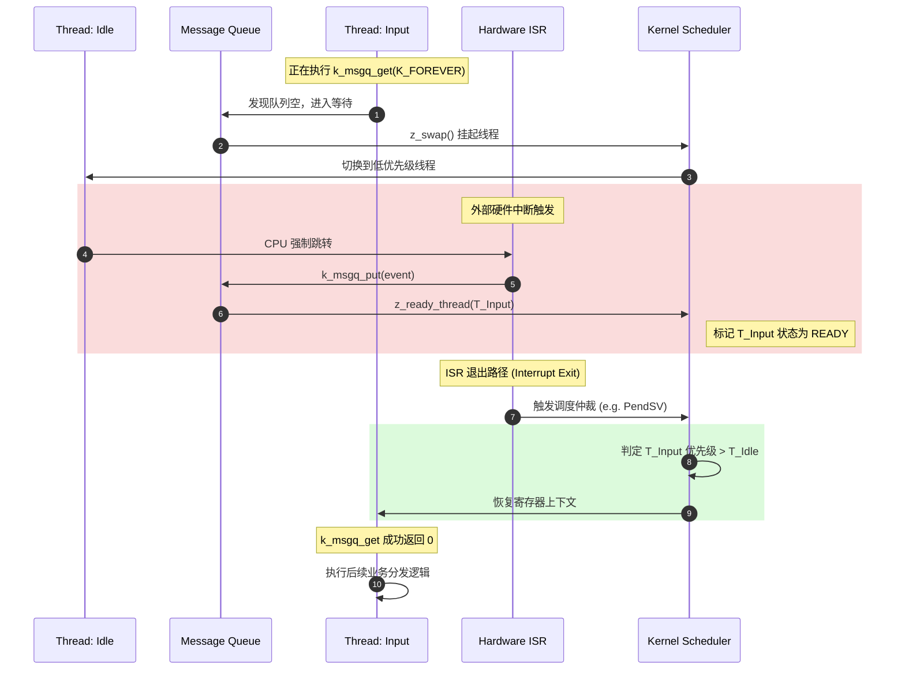

# ISR 触发源与重调度机制

> [!note]
> **Ref:** 
> - `note/subsystem/input/07-Input_Report_Implementation_Deep_Dive.md`
> - Zephyr Kernel Documentation: [Scheduling](https://docs.zephyrproject.org/latest/kernel/services/scheduling/index.html)

在 RTOS 中，中断（ISR）是系统最核心的动力源。本节解析当一个线程因等待消息队列而挂起后，如何通过 ISR 的一次触发，经历内核的四级跳跃，最终重新夺回 CPU 执行权。

## 1. 阶段一：冬眠 (Pending 状态)

当 `input_thread` 调用 `k_msgq_get(..., K_FOREVER)` 且队列为空时：
1. **加入等待队列 (Wait Queue)**: 内核将该线程的 TCB (Thread Control Block) 从系统的 **Ready Queue** 中移除，挂载到该消息队列特有的 `wait_q` 链表上。
2. **上下文切换 (Context Switch)**: 内核调用 `z_swap()`，保存当前寄存器到栈，并切换到其他就绪线程（如 Idle 线程）。
3. **状态转换**: 线程进入 **PENDING** 状态，不再消耗任何 CPU 周期。

## 2. 阶段二：破局 (ISR 调用 put)

用户按下按键，硬件中断触发 CPU 跳转到 ISR 并在其中执行 `k_msgq_put`：
1. **数据拷贝**: `input_event` 被 `memcpy` 到消息队列的环形缓冲区。
2. **唤醒沉睡者 (`z_sched_wake`)**: 内核检查 `wait_q`，发现 `input_thread` 正在等待。
3. **状态转换**: 内核调用 `z_ready_thread()`，将 `input_thread` 从消息队列的等待链表摘除，重新插回操作系统的 **Ready Queue**。
4. **标记重调度**: 内核设置一个内部标志位（或在 ARM 上悬起 `PendSV`），标记系统需要进行一次调度仲裁。**注意：此时 ISR 仍在运行，CPU 尚未切换。**

## 3. 阶段三：退出与仲裁 (Interrupt Exit)

当 ISR 执行完毕准备退出时，底层汇编代码（如 `z_arm_int_exit`）会接管控制权。
1. **优先级比对**: 调度器检查当前被中断的线程（例如之前的 Idle 线程）与刚进入就绪态的 `input_thread` 的优先级。
2. **抢占判定**: 如果 `input_thread` 优先级更高（通常如此），调度器决定不返回之前的线程，而是直接切换上下文。

## 4. 阶段四：夺权 (Context Switch)

1. **栈指针切换**: CPU 的堆栈指针（SP）被切换到 `input_thread` 的私有栈顶。
2. **寄存器恢复**: 之前 `input_thread` 在 `k_msgq_get` 处保存的寄存器被弹出（POP）到物理寄存器中。
3. **程序执行**: PC 指针回到 `k_msgq_get` 后的下一条指令。

---

## 5. 微观时序全景图

## 6. 核心术语辨析

- **Wait Queue (等待队列)**: 挂载在具体内核对象（如 sem, msgq, mutex）上的链表，存放等待该对象的线程。
- **Ready Queue (就绪队列)**: 系统全局链表，存放所有可以立即运行的线程，按优先级排列。
- **PendSV (ARM 架构专用)**: 一种可悬起的软件中断，Zephyr 利用它在所有硬中断处理完后，在最低优先级的中断上下文中安全执行上下文切换。
- **Preemption (抢占)**: 高优先级线程在 Ready 队列中由于外部事件就绪，强行夺取低优先级线程 CPU 使用权的行为。
