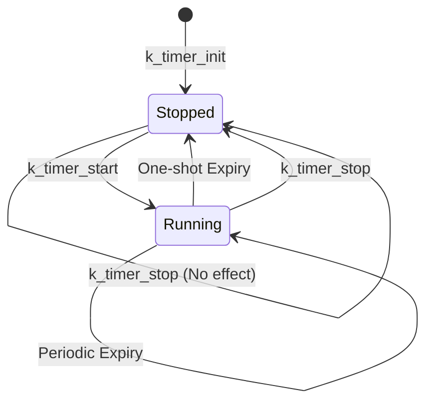

# Kernel Timer Concepts & API (内核定时器概念与 API)

> [!note]
> **Ref:**
> - [Official Wiki: Timers](https://docs.zephyrproject.org/latest/kernel/services/timing/timers.html)
> - Local Source: `sdk/source/zephyr/doc/kernel/services/timing/timers.rst`
> - Local Header: `sdk/source/zephyr/include/zephyr/kernel.h`

Zephyr 的 **Timer (定时器)** 是一个基于内核系统时钟的对象。当达到指定的时间限制时，它可以执行异步回调函数，或者允许线程同步等待其到期。

## 1. 核心概念 (Core Concepts)

一个 `k_timer` 实例包含以下关键属性：

*   **Duration (初始延时)**：从定时器启动到**第一次**到期之间的时间间隔。
*   **Period (周期)**：第一次到期之后，后续每次到期的时间间隔。
    *   如果为 `K_NO_WAIT` 或 `K_FOREVER`，则为**单次 (One-shot)** 定时器。
    *   如果大于 0，则为**周期性 (Periodic)** 定时器。
*   **Expiry Function (过期回调)**：每次定时器到期时在 **ISR 上下文**中执行的函数。
*   **Stop Function (停止回调)**：当定时器被显式停止时，在**调用者线程上下文**中执行的函数。
*   **Status (状态值)**：记录自上次读取以来定时器过期的次数。

## 2. 数据结构 (Data Structure)

在 `kernel.h` 中，`struct k_timer` 的定义如下：

```c
struct k_timer {
    struct _timeout timeout;    // 内核底层超时管理节点
    _wait_q_t wait_q;           // 等待该定时器的线程队列
    void (*expiry_fn)(struct k_timer *timer); // 到期回调 (ISR)
    void (*stop_fn)(struct k_timer *timer);   // 停止回调 (Thread)
    k_timeout_t period;         // 周期
    uint32_t status;            // 过期次数计数
    void *user_data;            // 用户自定义数据
    // ...
};
```

## 3. 生命周期与状态转换



## 4. 标准用法 API

### 4.1 定义与初始化
可以通过宏静态定义，或在运行时动态初始化。

```c
// 方式 A: 静态定义
K_TIMER_DEFINE(my_timer, my_expiry_handler, my_stop_handler);

// 方式 B: 动态初始化
struct k_timer dyn_timer;
k_timer_init(&dyn_timer, my_expiry_handler, my_stop_handler);
```

### 4.2 启动与停止
```c
// 启动：100ms 后第一次过期，之后每 50ms 过期一次
k_timer_start(&my_timer, K_MSEC(100), K_MSEC(50));

// 停止
k_timer_stop(&my_timer);
```

### 4.3 状态读取与同步
定时器提供了一种轻量级的线程间同步机制。

```c
// 1. 直接读取并重置状态
uint32_t count = k_timer_status_get(&my_timer);

// 2. 同步阻塞：直到定时器过期至少一次
uint32_t final_count = k_timer_status_sync(&my_timer);
```

## 5. 注意事项

1.  **ISR 上下文限制**：`expiry_fn` 在系统时钟中断中运行，必须保持简短、非阻塞。如果需要处理耗时任务，应在回调中提交任务到 `Workqueue`。
2.  **精度与漂移**：定时器的 Duration 是**最小**延时。对于周期性定时器，内核会自动处理补偿，以确保长期运行不会相对于系统时钟发生漂移。
3.  **单线程同步**：通常建议只有一个线程通过 `k_timer_status_sync` 同步，因为读取状态会将其重置。
