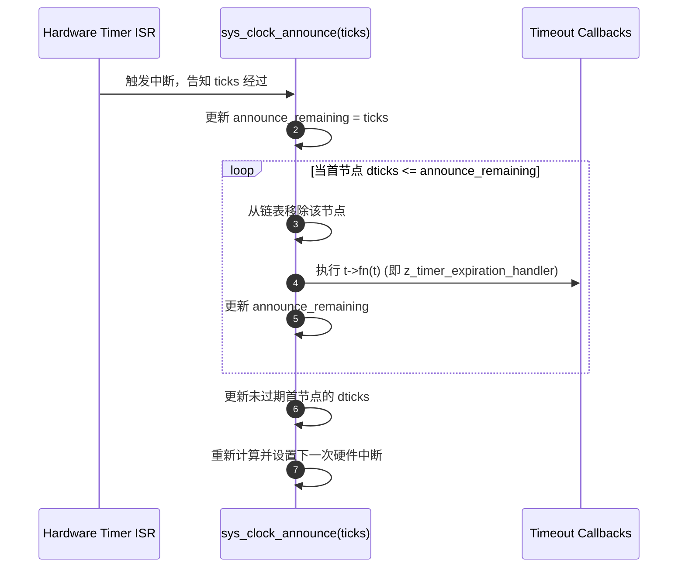

# Timer Queue Implementation (定时器队列实现机制)

> [!note]
> **Ref:**
> - Local Source: `sdk/source/zephyr/kernel/timeout.c`
> - Local Header: `sdk/source/zephyr/include/zephyr/sys_clock.h`

Zephyr 的定时器不仅仅是 `k_timer`，还包括线程睡眠 (`k_sleep`)、信号量等待超时等。所有这些超时逻辑在底层都统一由 `struct _timeout` 和内核的 **Timeout Queue** 管理。

## 1. 核心数据结构：Delta List

Zephyr 使用一个双向链表 `timeout_list` 来管理所有活跃的超时对象。为了在时钟中断中能够以 $O(1)$ 的复杂度处理到期任务，它采用了 **Delta List (增量链表)** 算法。

### 1.1 `dticks` 的含义
在 `struct _timeout` 中，`dticks` 并不代表绝对时间，也不代表总延时，而是代表**相对于前一个节点的延时**。

*   **Header (首节点)**: `dticks` 是相对于当前系统时间 (`curr_tick`) 的剩余滴答数。
*   **Subsequent (后续节点)**: `dticks` 是相对于前一个节点到期后的额外延时。

**示例**: 假设有三个定时器分别在 10, 15, 20 ticks 后到期：
`List -> [A: dticks=10] -> [B: dticks=5] -> [C: dticks=5]`

### 1.2 算法优势
*   **到期检查**: 每次时钟中断只需检查首节点。如果首节点没到期，后面的一定没到期。
*   **更新成本**: 随着时间推移，只需要递减首节点的 `dticks`。

## 2. 定时器插入流程 (`z_add_timeout`)

当调用 `k_timer_start` 时，最终会进入 `z_add_timeout`：

1.  **锁定**: 获取 `timeout_lock` 自旋锁。
2.  **计算**: 确定该超时的总 ticks。
3.  **遍历与差分**:
    *   从头开始遍历链表。
    *   不断减去当前节点的 `dticks`。
    *   找到合适位置插入，并更新**后一个**节点的 `dticks`（减去新插入节点的延时）。
4.  **硬件联动**: 如果新节点排在了最前面，调用 `sys_clock_set_timeout` 重新编程硬件定时器（针对 Tickless 模式）。

## 3. Tick 公告机制 (`sys_clock_announce`)

这是时钟驱动程序调用的核心接口，用于告知内核时间流逝了 `ticks` 个滴答。

### 关键细节：
*   **锁释放**: 在执行回调 `t->fn(t)` 之前，内核会**释放** `timeout_lock`。这意味着回调函数可以安全地调用其他内核 API，甚至重新启动定时器。
*   **防止竞态**: 在 SMP 系统中，使用 `announce_remaining` 标记来防止多个 CPU 同时处理同一个公告逻辑。

## 4. 总结

Zephyr 的超时管理通过 **Delta List** 实现了：
1.  **极高的中断处理效率**: 到期检查只需 $O(1)$。
2.  **统一的超时视图**: 无论是内核对象还是应用线程延时，都共用一套高效的基础设施。
3.  **精确的重触发机制**: 在 `z_timer_expiration_handler` 中，周期性定时器会计算原本应该到期的时间点，重新加入队列，从而消除累积误差。
