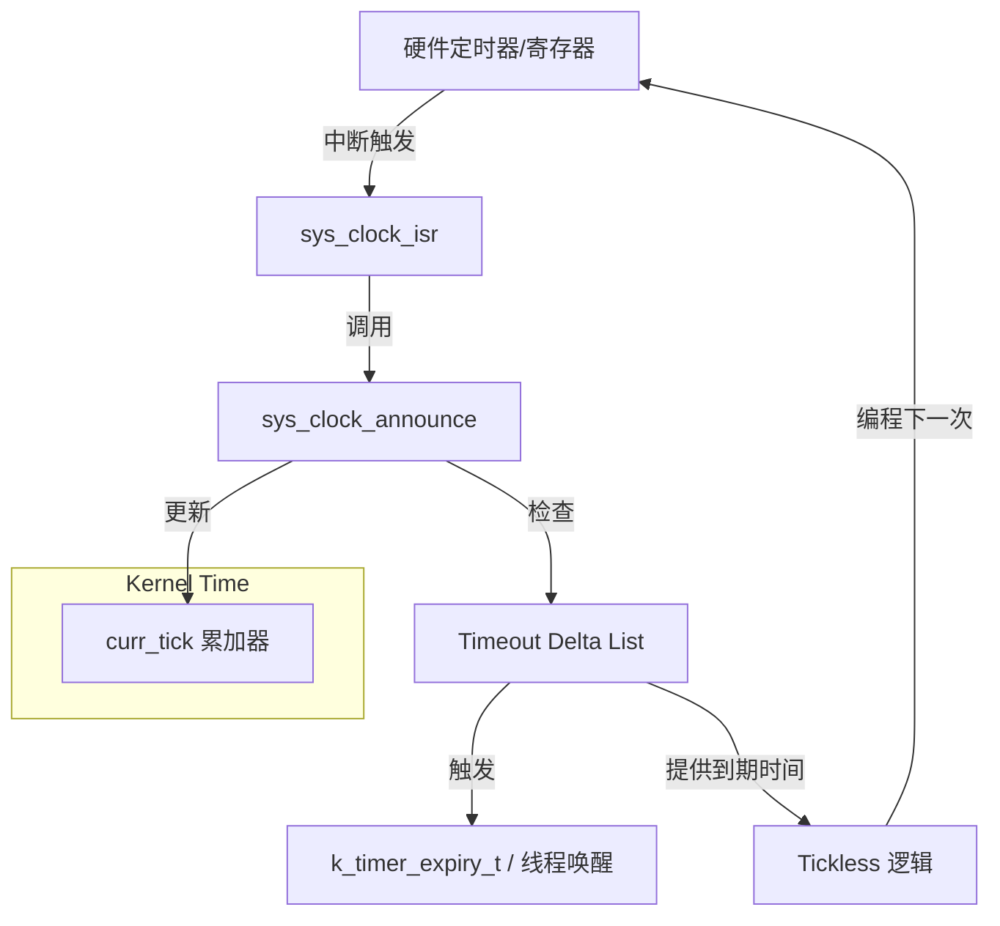

# System Clock & Tick (系统时钟与 Tick 产生)

> [!note]
> **Ref:**
> - Local Source: `sdk/source/zephyr/drivers/timer/cortex_m_systick.c`
> - Local Header: `sdk/source/zephyr/include/zephyr/sys_clock.h`

Zephyr 内核的运行依赖于一个持续的心跳，即 **System Tick**。本篇剖析硬件定时器驱动与内核时间基准的对接。

## 1. 核心配置参数

内核通过以下两个关键配置建立时间转换模型：

*   **`CONFIG_SYS_CLOCK_HW_CYCLES_PER_SEC`**: 硬件定时器的输入频率（单位：Hz）。
*   **`CONFIG_SYS_CLOCK_TICKS_PER_SEC`**: 软件层面的 Tick 频率（通常为 100 或 1000，即 10ms 或 1ms 一个 Tick）。

**转换公式**:
`CYC_PER_TICK = HW_CYCLES_PER_SEC / TICKS_PER_SEC`

## 2. 系统定时器驱动 (System Timer Driver)

系统定时器驱动是 Zephyr 中最特殊的驱动之一，它不属于标准设备模型（不通过 `DEVICE_DT_GET` 获取），而是通过特定的全局接口与内核对接。

### 2.1 驱动接口实现
每个系统定时器驱动必须实现以下 API：
*   `sys_clock_set_timeout(ticks, idle)`: 设置下一次中断的时间（Tickless 模式核心）。
*   `sys_clock_elapsed()`: 获取自上一次公告以来经过的硬件周期数。
*   `sys_clock_idle_exit()`: 退出低功耗模式时的补偿。

### 2.2 中断处理流程 (`sys_clock_isr`)
以 Cortex-M SysTick 为例，当硬件计数器归零时：

1.  **锁定**: 进入 ISR，获取自旋锁。
2.  **计算时间流逝**: 
    *   读取硬件寄存器，计算距离上次处理经过了多少 `cycles`。
    *   将 `cycles` 转换为软件 `ticks`。
3.  **公告内核**: 调用 `sys_clock_announce(ticks)`。
    *   如上一篇所述，这会触发 Delta List 的到期检查并执行回调。
4.  **重新编程**: 如果是周期模式，设置下一次 Tick；如果是 Tickless 模式，查询内核下一次到期时间并设置。

## 3. Tick 模式 vs. Tickless 模式

### 3.1 经典 Tick 模式 (Legacy)
硬件定时器被配置为固定频率触发（如每 1ms 一次）。
*   **优点**: 逻辑简单，系统心跳稳定。
*   **缺点**: 即使系统完全空闲（Idle），CPU 也会被频繁唤醒，不利于功耗优化。

### 3.2 Tickless 模式 (`CONFIG_TICKLESS_KERNEL`)
硬件定时器不再以固定频率触发，而是**按需触发**。
*   **逻辑**: 内核查看 `timeout_list` 的首节点，计算出距离现在还有 $N$ 个 ticks。
*   **动作**: 驱动通过 `sys_clock_set_timeout(N)` 将硬件定时器设置为在 $N$ 个 ticks 后触发。
*   **优势**: 极大减少中断次数，允许 CPU 长时间处于深度睡眠。

## 4. 总结：时间流转全景图

