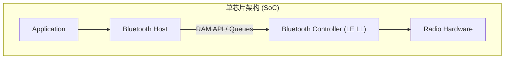
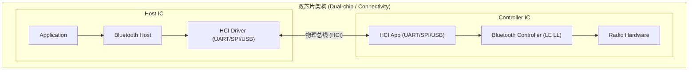

# Zephyr 蓝牙协议栈架构概览 (Bluetooth Stack Architecture)

> [!note]
> **Ref:** [Zephyr Bluetooth Stack Architecture](https://docs.zephyrproject.org/latest/connectivity/bluetooth/bluetooth-arch.html)
> **Source:** `$ZEPHYR_BASE/doc/connectivity/bluetooth/bluetooth-arch.rst`

Zephyr 主要致力于对 **低功耗蓝牙 (Bluetooth Low Energy, BLE)** 的支持（同时对经典的 BR/EDR Host 提供有限支持）。作为一款高度可配置的 RTOS，Zephyr 的蓝牙子系统具有极强的灵活性，既可以作为完整的全栈运行在单芯片上，也可以拆分成 Host 或 Controller 独立运行。

## 1. 蓝牙 LE 分层架构 (Bluetooth LE Layers)

构成一个完整的低功耗蓝牙协议栈，主要包含以下三个核心层次：

1. **主机层 (Host)**:
   位于应用程序的正下方。Host 层由多个（非实时的）网络和传输协议组成（如 L2CAP, ATT, GATT, SMP 等）。它为上层应用提供标准化的接口，使其能够以互操作的方式与对等设备进行通信。
   
2. **控制器层 (Controller)**:
   实现了链路层 (Link Layer, LE LL)。这是一个底层的、**高实时性**的协议。控制器与无线电硬件协同工作，提供标准的无线通信能力。它负责调度数据包的收发、保证数据交付，并处理所有的链路层控制程序。

3. **无线电硬件 (Radio Hardware)**:
   实现了必需的模拟和数字基带功能模块，使得链路层固件能够在 2.4GHz 频段内发送和接收射频信号。

## 2. 主机控制器接口 (HCI)

蓝牙规范定义了 Host 与 Controller 之间的通信格式，即 **主机控制器接口 (Host Controller Interface, HCI)**。
- HCI 确保了来自不同供应商的 Host 和 Controller 可以混合搭配并以标准方式通信。
- HCI 协议可以承载于多种物理传输总线上，如 **UART、SPI 或 USB**。
- 协议详细定义了 Host 可以向 Controller 发送的**命令 (Commands)**，Controller 返回的**事件 (Events)**，以及空口传输的用户/协议**数据 (Data)** 格式。

## 3. 部署配置与硬件架构 (Configurations)

得益于分层架构和标准化的 HCI 接口，Zephyr 支持将 Host 和 Controller 部署在相同或不同的硬件平台上：

### 3.1 单芯片配置 (Single-chip / SoC)
单个微控制器 (MCU) 运行所有的三层协议及应用程序。
- **通信方式**: Host 与 Controller 直接通过 RAM 中的函数调用和消息队列 (Queues) 进行通信，无需经过物理串口封装 HCI 报文。
- **优势**: 占用面积小 (Small footprint)、功耗最低 (Lowest power consumption)。

### 3.2 双芯片配置 (Dual-chip / Connectivity)
使用两块独立的 IC，一块运行 App + Host，另一块运行 Controller + Radio。
- **通信方式**: 通过物理总线（如 UART、SPI）传输标准的 HCI 协议流。
- **优势**: 极大的灵活性。你可以使用 Zephyr Controller 搭配跑在 Linux 上的 BlueZ Host；或者使用 Zephyr Host 搭配任何第三方的蓝牙 Controller 芯片。

## 4. 构建类型 (Build Types) 与 Kconfig

根据不同的硬件架构，可以在编译时通过 `Kconfig` 对 Zephyr 进行极度精简的裁剪：

### 4.1 全栈构建 (Combined Build)
专为单芯片 (SoC) 设计，包含 Application、Host 和 Controller。大部分 `samples/bluetooth` 目录下的示例默认采用此模式。
- **Kconfig**:
  - `CONFIG_BT=y`
  - `CONFIG_BT_HCI=y`
- **DeviceTree**: 必须启用对应的蓝牙 Controller 节点。

### 4.2 仅主机构建 (Host-only Build)
包含 Application 和 Bluetooth Host，外加一个与外部 Controller 通信的 HCI Driver（如 UART/SPI）。
- **Kconfig**:
  - `CONFIG_BT=y`
  - `CONFIG_BT_HCI=y`
- **DeviceTree**: 如果本地也有 Controller 节点，需要将其 `status` 设为 `disabled`。同时启用负责 HCI 的外设节点（如 UART），并将 `zephyr,bt-hci` 属性指向该节点。

### 4.3 仅控制器构建 (Controller-only Build)
充当纯粹的低功耗蓝牙网卡。包含 Link Layer 和一个负责透传的桥接应用 (HCI App)，用于监听物理总线上的 HCI Command 并转交 Controller。
- 桥接应用源码位于：`bluetooth_hci_uart` / `bluetooth_hci_usb` / `bluetooth_hci_spi`。
- **Kconfig**:
  - `CONFIG_BT=y`
  - `CONFIG_BT_HCI=y`
  - `CONFIG_BT_HCI_RAW=y` (关键宏，表示接收原始 HCI 数据包而无需 Host 解析)
- **DeviceTree**: 必须启用 Controller 节点。
