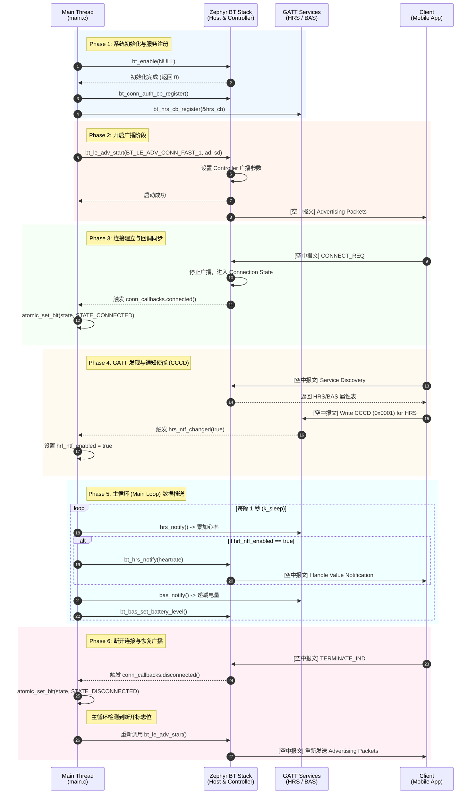

# Peripheral HR 时序与逻辑深潜

> [!note]
> **Ref:** `$ZEPHYR_BASE/samples/bluetooth/peripheral_hr/src/main.c`

为了彻底搞懂一个 Zephyr 蓝牙应用的运转机制，我们不能仅仅停留在静态的代码结构上。本节我们将通过时序图 (Sequence Diagram) 从时间线上剖析 `peripheral_hr` 的全生命周期，重点关注**主线程、蓝牙回调和底层协议栈**之间的状态同步与数据交互。

## 1. 核心时序交互全景 (Sequence Diagram)

以下是 `peripheral_hr` 从系统上电、初始化、广播、被连接到数据交互的完整生命周期时序图。

## 2. 逻辑细节与避坑指南 (Deep Dive)

### 2.1 同步初始化 vs 异步初始化
在 Phase 1 (步骤 1) 中，示例代码调用了 `bt_enable(NULL)`。
- **细节**：传入 `NULL` 意味着这是**同步调用**。主线程会一直阻塞，直到 Host 栈和 Controller 完全启动并握手成功。
- **最佳实践**：在真正的生产级应用中，由于蓝牙初始化可能涉及加载固件补丁，耗时较长。建议传入一个回调函数（如 `bt_enable(bt_ready)`），让 `bt_enable` 立即返回，以免阻塞系统其他关键线程的启动。

### 2.2 状态同步：回调与主循环的解耦
在 Phase 3 (步骤 6-7) 和 Phase 6 中，Zephyr 栈触发了 `connected` 和 `disconnected` 回调。
- **细节**：这些回调函数是在 **System Workqueue (系统工作队列)** 或 **BT RX 线程**的上下文中执行的。
- **避坑**：**绝对不要在蓝牙回调函数中执行耗时操作（如 Flash 读写、长延时）或直接调用可能阻塞的蓝牙 API。** 如果堵塞了 RX 线程，会导致蓝牙协议栈无法处理底层的 ACL/HCI 数据包，最终引发超时断开（Supervision Timeout）。
- **示例解法**：代码中使用了 `atomic_set_bit(state, STATE_CONNECTED)`，仅仅是设置一个标志位。然后在主线程的 `while(1)` 循环中，通过 `atomic_test_and_clear_bit()` 轮询处理实际的业务逻辑（例如控制 LED 亮灭和重新开启广播）。这是一种非常经典的事件驱动解耦模型。

### 2.3 通知开关的边缘触发
在 Phase 4 (步骤 10-11) 中，手机端写入 CCCD 会触发 `hrs_ntf_changed`。
- **细节**：这是一个**状态改变**事件，意味着如果手机多次写入 `0x0001`，回调可能只会触发一次（由 `false` 变 `true`）。应用层需要妥善保存这个状态。在这个示例中，使用了一个简单的布尔变量 `hrf_ntf_enabled` 来保存。

### 2.4 GATT 服务数据的独立更新
在 Phase 5 的主循环中：
- `bt_hrs_notify()` 负责推送料。
- `bt_bas_set_battery_level()` 只负责更新底层的 GATT 数据缓存。**注意：** 如果手机没有订阅 BAS 服务，电量数据就静静地躺在设备的内存里等待被 `Read`，并不会产生空中报文。

## 3. 架构总结

从时序图可以看出，Zephyr 蓝牙应用遵循典型的**事件驱动架构 (Event-Driven Architecture)**：
- **触发源**：底层协议栈的空口事件 $
\rightarrow$ `ZephyrBT`。
- **事件代理**：GATT 服务层和静态注册的回调表 $
\rightarrow$ 分发给应用层回调。
- **事件消费**：主循环通过**原子位域 (Atomic Bitfield)** 解耦消费这些事件，并调度业务逻辑。

理解这个时序流转，是我们后续将自定义传感器接入蓝牙栈的基础。
