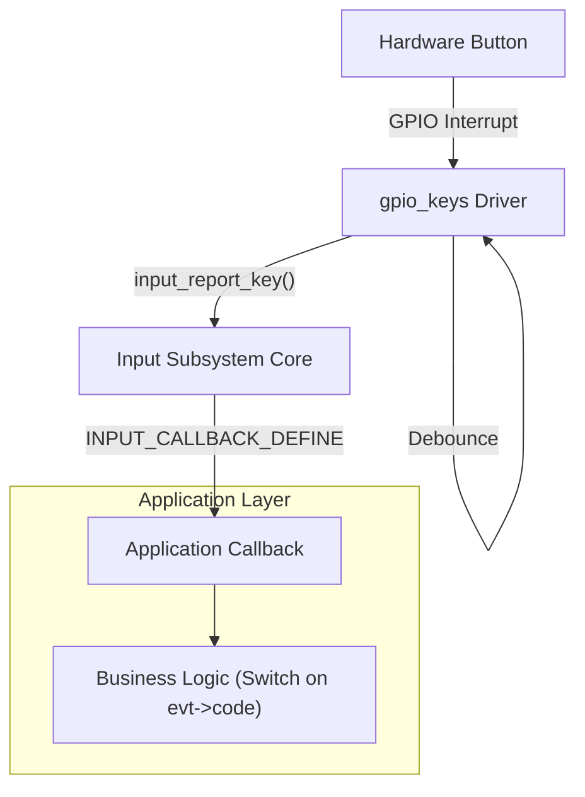

# Input Subsystem (输入子系统)

> [!note]
> **Ref:** [Zephyr Input Subsystem](docs/services/input/index.rst)

Zephyr 的输入子系统提供了一个统一的框架，用于处理来自不同输入设备（按键、触摸屏、编码器等）的事件，并将其分发给应用程序。

相比于直接使用 GPIO 回调，使用 Input 子系统的优势在于：
1.  **统一接口**: 无论是 GPIO 按键、矩阵键盘还是 ADC 按键，应用层接收到的都是标准的 `input_event`。
2.  **去抖动 (Debouncing)**: `gpio-keys` 驱动内置了软件去抖动逻辑。
3.  **事件队列**: 支持同步或异步（线程化）的事件处理模式。
4.  **解耦**: 应用层不需要知道底层的硬件细节（引脚号、电平极性等），只需关注按键的功能定义（Key Code）。

## 1. 硬件定义 (DTS)

在设备树中，我们通常使用 `gpio-keys` 兼容节点来定义按键。

```dts
/* board.dts or app.overlay */

#include <zephyr/dt-bindings/input/input-event-codes.h>

/ {
    buttons {
        compatible = "gpio-keys";
        
        /* 定义一个名为 "user_button" 的按键 */
        user_button: button_0 {
            /* 关联 GPIO: Port 0, Pin 13, Active Low, Pull Up */
            gpios = <&gpio0 13 (GPIO_PULL_UP | GPIO_ACTIVE_LOW)>;
            
            /* 定义键值 (Key Code): 对应 input-event-codes.h 中的宏 */
            zephyr,code = <INPUT_KEY_0>;
            
            /* 可选: 标签 */
            label = "User Button";
        };
    };
};
```

**关键属性**:
-   **`compatible = "gpio-keys"`**: 绑定到通用的 GPIO 按键驱动。
-   **`zephyr,code`**: 指定该按键对应的事件代码 (如 `INPUT_KEY_0`, `INPUT_KEY_ENTER`)。这使得应用层可以通过代码逻辑判断是哪个功能键被按下，而不是判断 GPIO 引脚号。

## 2. 内核驱动 (Driver)

内核会自动加载 `gpio_keys` 驱动。该驱动的工作流程如下：
1.  **初始化**: 读取 DTS 配置，配置 GPIO 引脚为输入模式。
2.  **中断注册**: 注册 GPIO 中断回调。
3.  **去抖动**: 当中断触发时，启动一个定时器进行去抖动 (Debounce)。
4.  **上报**: 确认按键状态稳定后，调用 `input_report_key()` 上报事件。

**Kconfig 配置**:
确保开启了输入子系统：
```properties
CONFIG_INPUT=y
```

## 3. 应用层接收 (Application Callback)

应用层不需要手动注册 GPIO 回调，而是使用 `INPUT_CALLBACK_DEFINE` 宏定义一个输入事件回调函数。

### 3.1 定义回调函数

```c
#include <zephyr/input/input.h>
#include <zephyr/logging/log.h>

LOG_MODULE_REGISTER(app, LOG_LEVEL_INF);

/* 回调函数签名: void (*input_listener_cb)(struct input_event *evt) */
static void input_cb(struct input_event *evt)
{
    /* 过滤: 仅处理按键事件 (INPUT_EV_KEY) */
    if (evt->type != INPUT_EV_KEY) {
        return;
    }

    /* 打印事件信息 */
    LOG_INF("Input event: dev=%p, code=%d, value=%d", 
            evt->dev, evt->code, evt->value);

    /* 根据键值处理业务逻辑 */
    switch (evt->code) {
    case INPUT_KEY_0:
        if (evt->value) {
            LOG_INF("Button 0 Pressed!");
        } else {
            LOG_INF("Button 0 Released!");
        }
        break;
    default:
        break;
    }
}

/* 注册回调: 监听所有设备的输入事件 */
/* 参数: <device_node> (NULL 表示监听所有), <callback_func> */
INPUT_CALLBACK_DEFINE(NULL, input_cb);
```

### 3.2 `struct input_event` 详解

| 字段 | 说明 |
| :--- | :--- |
| `dev` | 产生事件的设备指针 (`const struct device *`)。 |
| `sync` | 同步位。用于指示一组相关事件是否已全部上报（多轴设备常用）。 |
| `type` | 事件类型。按键为 `INPUT_EV_KEY`，坐标为 `INPUT_EV_ABS` 或 `INPUT_EV_REL`。 |
| `code` | 事件代码。对应 DTS 中的 `zephyr,code` (如 `INPUT_KEY_0`)。 |
| `value` | 事件值。对于按键：`1`=按下, `0`=释放。 |

## 4. 进阶：特定设备监听

如果你只想监听特定设备（例如 `buttons` 节点）的事件，可以在宏中指定设备节点：

```c
/* 获取设备结构体 */
#define BUTTONS_NODE DT_COMPAT_GET_ANY_STATUS_OKAY(gpio_keys)

/* 仅监听 gpio-keys 设备的事件 */
INPUT_CALLBACK_DEFINE(DEVICE_DT_GET(BUTTONS_NODE), input_cb);
```

## 5. 处理流程图 (Flowchart)



## 总结

使用 Input Subsystem 处理按键是 Zephyr 推荐的最佳实践：
1.  **标准化**: 将物理 GPIO 映射为逻辑 Key Code。
2.  **健壮性**: 驱动层处理去抖动和中断细节。
3.  **简洁性**: 应用层只需通过一个回调函数即可处理系统中的所有输入事件。
