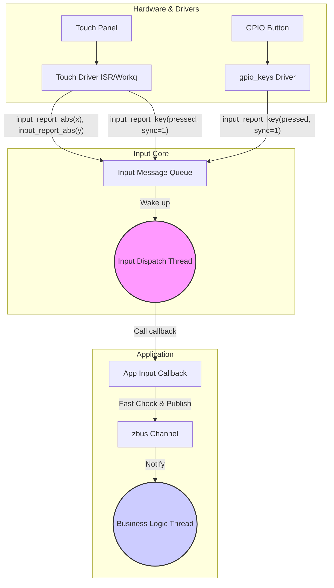

# Input Event Types & Handling (输入事件类型与高级处理)

> [!note]
> **Ref:** [Zephyr Input Subsystem API](https://docs.zephyrproject.org/latest/services/input/index.html)

在掌握了 `gpio-keys` 的基础之后，我们需要深入了解 Zephyr 输入子系统 (Input Subsystem) 所支持的完整事件类型模型，以及这些事件是如何从驱动层安全、高效地传递到应用层的。

## 1. 核心事件模型 (`struct input_event`)

应用层通过 `INPUT_CALLBACK_DEFINE` 接收到的核心数据结构是 `struct input_event`。它的关键在于 `type`, `code` 和 `value` 的组合，用来描述各种复杂的物理动作。

```c
struct input_event {
    const struct device *dev; /* 产生事件的硬件设备指针 */
    uint8_t sync;             /* 同步标志位 (Sync flag) */
    uint8_t type;             /* 事件类型 (Event type) */
    uint16_t code;            /* 事件代码 (Event code) */
    int32_t value;            /* 事件值 (Event value) */
};
```

### 1.1 `type` (事件类型)

Zephyr 借鉴了 Linux Input 子系统的设计，将事件分为几大类：

- **`INPUT_EV_KEY` (按键/按钮)**
  - **描述**: 表示离散的布尔状态（按下、释放）。
  - **`code`**: 代表具体的键，如 `INPUT_KEY_0`, `INPUT_KEY_ENTER`, `INPUT_BTN_LEFT` 等。
  - **`value`**: `1` 表示按下 (Pressed)，`0` 表示释放 (Released)。

- **`INPUT_EV_ABS` (绝对坐标)**
  - **描述**: 表示设备报告的绝对位置，常见于触摸屏 (Touch Panel)、摇杆 (Joystick)。
  - **`code`**: 代表坐标轴，如 `INPUT_ABS_X`, `INPUT_ABS_Y`, `INPUT_ABS_MT_SLOT` (多点触控)。
  - **`value`**: 具体的坐标数值（如 X=1024, Y=768）。

- **`INPUT_EV_REL` (相对位移)**
  - **描述**: 表示相对于上一次状态的变化量，常见于鼠标 (Mouse)、旋转编码器 (Rotary Encoder)。
  - **`code`**: 代表移动轴，如 `INPUT_REL_X` (鼠标水平移动), `INPUT_REL_WHEEL` (滚轮滚动)。
  - **`value`**: 变化的偏移量（可正可负，如滚轮向上转动 +1，向下转动 -1）。

- **`INPUT_EV_VENDOR` (自定义)**
  - **描述**: 供厂商或特定应用自定义的事件类型，用于不符合上述标准类型的特殊数据。

### 1.2 `INPUT_EV_SYNC` (同步机制)

**问题背景**: 当你按下一个坐标为 (X=100, Y=200) 的触摸屏时，驱动程序实际上需要产生**两个**独立的事件：一个发送 X 坐标，另一个发送 Y 坐标。如果应用层在收到 X=100 后立刻处理，此时 Y 可能还是旧的值，就会导致坐标撕裂。

**解决方案 (`sync` 字段)**:
`struct input_event` 中有一个 `sync` 位。驱动程序在发送属于同一逻辑动作的一组事件时，最后一个事件会将 `sync` 设置为 `1`。

- 驱动行为：
  1. 上报 X 坐标事件 (sync = 0)。
  2. 上报 Y 坐标事件 (sync = 0)。
  3. 上报按键按下事件 (sync = 1) -> **表示这批事件已完整，应用可以处理了。**

- 应用层处理范式：
  在回调函数中，通常先缓存同一设备的数据，直到收到 `sync == 1` 的事件时，才触发最终的业务逻辑。

## 2. Input Core 的分发机制 (Dispatching)

Zephyr Input Core 接收到驱动上报的事件后，需要分发给所有通过 `INPUT_CALLBACK_DEFINE` 注册的监听者。这个分发过程有两种运行模式，通过 Kconfig 配置控制。

### 2.1 同步模式 (Synchronous Mode) - `CONFIG_INPUT_MODE_SYNCHRONOUS=y`

- **行为**: 当底层驱动调用 `input_report_*()` API 时，Input Core 会**立刻、直接**在当前上下文中调用所有匹配的应用层回调函数 (`input_listener_cb`)。
- **上下文**: 如果驱动是在中断上下文 (ISR) 中上报事件，那么**应用层回调也会在 ISR 中执行**。如果驱动在工作队列 (Workqueue) 或自身线程中上报，回调就在该线程执行。
- **优点**: 极低的延迟，最快响应输入。
- **缺点/风险**: **极其危险！** 回调函数可能运行在 ISR 中，这意味着你的回调函数绝对不能阻塞（不能使用 `k_sleep`, 不能等待互斥锁 `k_mutex`，打印大量日志也会导致系统卡顿）。这会极大地限制应用层处理事件的能力。

### 2.2 线程模式 (Thread Mode) - `CONFIG_INPUT_MODE_THREAD=y` (默认/推荐)

- **行为**: 当驱动上报事件时，Input Core 会将事件放入一个消息队列 (`k_msgq`)。随后，Input 系统内部的一个专门的后台线程 (Input Thread) 会被唤醒，从队列中取出事件，并在该线程的上下文中调用应用层的回调函数。
- **上下文**: 应用层回调**始终运行在 Input 线程上下文**中。
- **优点**: **安全且解耦**。驱动程序的 ISR 能够快速退出。应用层的回调函数由于运行在线程中，可以使用各种 RTOS 阻塞 API，处理复杂的业务逻辑，而不会导致系统内核 Panic。
- **配置项**:
  - `CONFIG_INPUT_THREAD_PRIORITY`: 配置 Input 后台线程的优先级。
  - `CONFIG_INPUT_QUEUE_MAX_MSGS`: 配置事件消息队列的深度（防止事件突发导致队列溢出丢弃）。

## 3. 最佳实践：如何正确处理 Input 事件

1. **认清上下文**: 始终明确你的 Input 回调函数运行在什么模式下。除非你有极其苛刻的微秒级延迟要求，否则**永远保持 `CONFIG_INPUT_MODE_THREAD=y`**。
2. **利用 Sync**: 对于包含多个维度信息的输入（如触摸屏坐标），务必利用 `sync` 标志位来确保读取到完整、原子的一帧数据。
3. **避免在回调中执行长任务**: 即便是在 Thread Mode 下，所有注册的 Input 回调都是在这个单一的 Input 线程中串行执行的。如果你的回调函数执行了 100ms 的耗时操作，那么系统将会有 100ms 无法响应其他的输入事件（如别的按键）。
4. **黄金法则 (桥接 zbus)**: Input 回调函数应该尽可能轻量。最优雅的设计是：在回调函数中，只是将收到的 `input_event` 转换一下格式，然后迅速**发布 (Publish) 到 zbus** 上。让专门的业务逻辑线程去订阅 zbus 并处理耗时任务。

---


