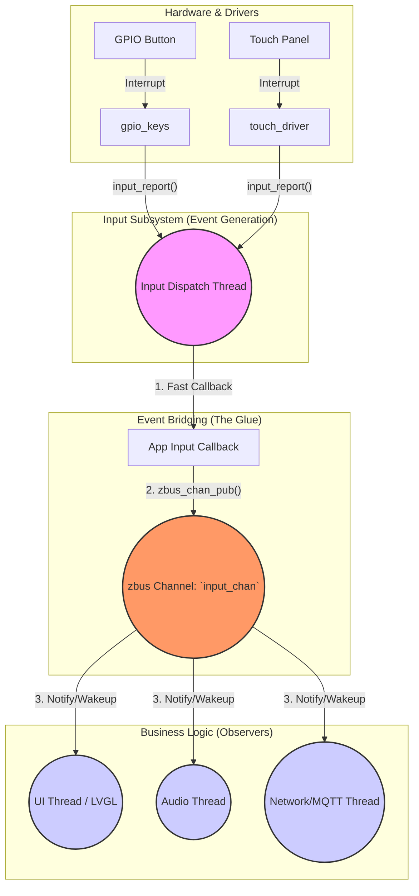

# Input to Zbus Integration (输入系统与 zbus 联动)

> [!note]
> **Ref:** 
> - [Zephyr Input Subsystem](https://docs.zephyrproject.org/latest/services/input/index.html)
> - [Zephyr zbus Subsystem](https://docs.zephyrproject.org/latest/services/zbus/index.html)

在前面的学习中，我们了解了 Input 子系统如何将底层的硬件中断转化为标准的 `input_event` 并通过回调函数上报。然而，在实际的复杂应用开发中，**直接在 Input 回调函数中编写业务逻辑是极其危险和不可维护的**。

本节将探讨 Zephyr 应用架构的“黄金法则”：**将 Input 事件通过 `zbus` (Zephyr Bus) 发布出去，让专门的业务线程去异步订阅和处理。**

## 1. 为什么不能直接在 Input Callback 中处理业务？

### 1.1 上下文限制与阻塞风险
正如 `02-Event_Types_and_Handling.md` 中提到的，Input 回调函数的执行上下文取决于 Kconfig 配置 (`CONFIG_INPUT_MODE_THREAD` 或 `CONFIG_INPUT_MODE_SYNCHRONOUS`)。

- **如果在 ISR (同步模式) 中执行**: 你的回调函数绝对不能调用任何可能引起阻塞的 API (如 `k_sleep`, `k_mutex_lock`, 等待网络响应等)。一旦阻塞，将导致内核 Panic。
- **如果在 Input Thread 中执行**: 虽然允许阻塞，但系统通常只有一个全局的 Input 线程。如果你的按键回调函数中执行了 500ms 的网络请求，那么在这 500ms 内，系统将无法响应任何其他的按键或触摸事件。这会导致灾难性的用户体验（UI 卡顿、按键丢失）。

### 1.2 架构耦合 (Spaghetti Code)
如果按键回调函数直接调用点灯逻辑、直接调用网络发送逻辑、直接调用屏幕刷新逻辑，那么 Input 模块将与所有的业务模块产生强耦合。当需求变更（比如：按下按键不再是点灯，而是播放音乐）时，你需要修改底层按键相关的代码，这违反了“开闭原则”。

## 2. 终极解耦架构：Input 驱动 + zbus 总线

结合我们在 `zbus` 章节学到的知识，完美的架构应该长这样：



**核心思想**：
App 的 Input 回调函数不再处理任何具体的业务（点灯、发网络包），它的**唯一职责**就是充当“桥梁”：将收到的 `struct input_event` 原封不动（或稍作转换）地**发布 (Publish)** 到一个专门的 `zbus` 通道上。然后迅速返回（Return），让 Input 线程继续去处理下一个硬件事件。

## 3. 代码实战示例

下面展示如何将 Input 事件桥接到 zbus 上。

### 3.1 定义 zbus 通道

首先，我们定义一个专门用于广播输入事件的 zbus 通道。消息类型可以直接复用 `struct input_event`，或者自定义一个更精简的结构体。

```c
/* src/events/input_event.h */
#include <zephyr/zbus/zbus.h>
#include <zephyr/input/input.h>

/* 定义一个 zbus 消息结构体 (可选：如果不直接用 input_event) */
struct app_input_msg {
    uint16_t code;   /* 键值 */
    int32_t  value;  /* 状态 (按下/释放/坐标值) */
    uint8_t  type;   /* 类型 (KEY/ABS/REL) */
};

/* 声明外部 zbus 通道 */
ZBUS_CHAN_DECLARE(app_input_chan);
```

```c
/* src/events/input_event.c */
#include "input_event.h"

/* 定义通道: 消息类型为 struct app_input_msg，不验证，简单回调监听器无 */
ZBUS_CHAN_DEFINE(app_input_chan,
                 struct app_input_msg,
                 NULL, NULL, 
                 ZBUS_OBSERVERS_EMPTY,
                 ZBUS_MSG_INIT(0));
```

### 3.2 编写极速 Input 回调 (The Bridge)

```c
/* src/input_bridge.c */
#include <zephyr/kernel.h>
#include <zephyr/input/input.h>
#include <zephyr/logging/log.h>
#include "events/input_event.h"

LOG_MODULE_REGISTER(input_bridge, LOG_LEVEL_INF);

/* 核心桥接逻辑: 极快, 无阻塞 */
static void app_input_callback(struct input_event *evt)
{
    /* 1. 过滤掉不需要的事件 (例如只关心按键) */
    if (evt->type != INPUT_EV_KEY) {
        return;
    }

    /* 2. 构建 zbus 消息 */
    struct app_input_msg msg = {
        .type  = evt->type,
        .code  = evt->code,
        .value = evt->value,
    };

    /* 3. 发布到 zbus 通道 (非阻塞超时设为 K_NO_WAIT 是极其重要的安全底线) */
    int err = zbus_chan_pub(&app_input_chan, &msg, K_NO_WAIT);
    
    if (err) {
        LOG_ERR("Failed to publish input event to zbus: %d", err);
    }
}

/* 监听所有输入设备 */
INPUT_CALLBACK_DEFINE(NULL, app_input_callback);
```
> **⚠️ 关键安全警告**: 在 Input 回调中调用 `zbus_chan_pub` 时，超时参数**必须**设置为 `K_NO_WAIT` (或者极短的超时)。如果你在这里阻塞等待通道有空闲空间，如果消费者（业务线程）卡死了，你的整个 Input 子系统也会随之卡死！

### 3.3 业务逻辑线程 (Subscriber)

在其他业务文件（如 UI 逻辑、音频控制）中，我们可以作为一个普通的 `zbus` 观察者 (Subscriber) 来异步消费这些按键事件。这里我们甚至可以使用长按/短按逻辑，随意调用阻塞 API (如 `k_sleep`, `k_msgq_get`)。

```c
/* src/audio_logic.c */
#include <zephyr/kernel.h>
#include <zephyr/logging/log.h>
#include "events/input_event.h"

LOG_MODULE_REGISTER(audio, LOG_LEVEL_INF);

/* 定义一个消息订阅者 (Message Subscriber)，它自带线程和消息队列 */
ZBUS_MSG_SUBSCRIBER_DEFINE(audio_input_sub);

/* 将订阅者附加到我们定义的通道上 */
ZBUS_CHAN_ADD_OBS(app_input_chan, audio_input_sub, 3);

/* 业务线程入口 */
void audio_thread_main(void)
{
    const struct zbus_channel *chan;
    struct app_input_msg msg;

    LOG_INF("Audio thread started, waiting for inputs...");

    while (1) {
        /* 1. 阻塞等待 zbus 消息 (解耦了底层的中断和轮询) */
        int err = zbus_sub_wait(&audio_input_sub, &chan, K_FOREVER);
        if (err) {
            continue;
        }

        /* 2. 读取消息内容 */
        if (zbus_chan_read(chan, &msg, K_NO_WAIT) == 0) {
            
            /* 3. 随心所欲地执行耗时的业务逻辑 */
            if (msg.code == INPUT_KEY_PLAYPAUSE && msg.value == 1) {
                LOG_INF("PLAY Button Pressed! Start decoding MP3...");
                /* 假设解码需要 500ms... 这完全不会影响别的线程接收按键 */
                k_msleep(500); 
                LOG_INF("Playback started.");
            }
        }
    }
}

K_THREAD_DEFINE(audio_tid, 1024, audio_thread_main, NULL, NULL, NULL, 5, 0, 0);
```

## 4. 总结与进阶建议

1. **唯一正确的姿势**: Input 回调仅仅是数据的搬运工，zbus 才是数据的分发中心。
2. **状态机前置**: 如果你需要实现复杂的按键逻辑（如双击、长按 3 秒），最好的做法是创建一个独立的“按键处理模块”。这个模块订阅原始的 `app_input_chan`，维护一个状态机，识别出“双击”或“长按”后，再向另一个高级的业务通道发布语义更明确的消息（如 `EVENT_WIFI_RESET` 或 `EVENT_ENTER_RECOVERY_MODE`），供最终的业务线程消费。这正是高内聚低耦合的体现。
