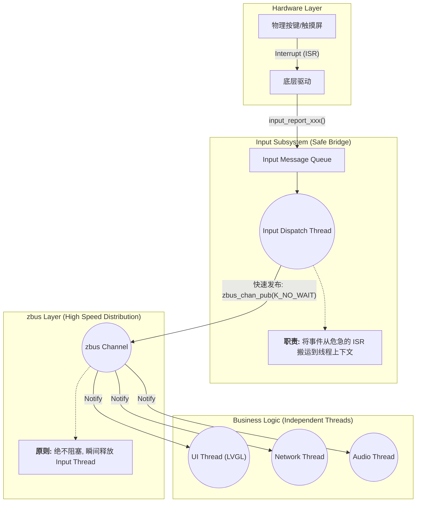

# Input Thread 与 zbus 协同架构认知

> [!note]
> **Ref:** 
> - [note/subsystem/input/02-Event_Types_and_Handling.md](./02-Event_Types_and_Handling.md)
> - [note/subsystem/input/05-Input_to_Zbus_Integration.md](./05-Input_to_Zbus_Integration.md)

## 1. 核心矛盾：既然有了 Input Thread，为什么还要 zbus？

在学习了 `CONFIG_INPUT_MODE_THREAD=y` 后，我们知道输入系统会提供一个后台线程来执行回调。初学者常有的疑问是：“既然已经是异步线程了，直接在回调里写业务代码（如更新屏幕、发网络包）不是更简单吗？”

答案是：**Input Thread 解决了“生存”问题（Safety），而 zbus 解决了“性能”与“解耦”问题（Scalability）。**

## 2. 深度解析

### 2.1 全局单线程瓶颈 (Blocking Problem)

Zephyr 系统的 `input_thread` 通常是**全局唯一**的。

- **现象**: 所有的输入设备（按键 A、按键 B、触摸屏、编码器）共用同一个事件队列和同一个处理线程。
- **风险**: 如果你在 `input_thread` 的回调函数中直接执行业务逻辑，一旦发生阻塞或耗时操作，整个输入系统就会卡死。
  - *案例*: 按下按键后执行 500ms 的 HTTP 请求。
  - *后果*: 在这 500ms 内，用户滑屏、按其他键，系统全无反应，因为 `input_thread` 正在死等网络回包。

### 2.2 架构解耦 (Dependency Inversion)

直接在回调中写业务会导致严重的 **Spaghetti Code (意大利面条式代码)**：

- **强耦合**: 你的输入回调需要引入 `display.h`, `audio.h`, `wifi.h` 等。底层驱动代码与高层业务模块死锁在一起。
- **扩展性差**: 如果以后增加一个“长按按键触发语音助手”的功能，你必须修改底层输入模块的代码，这违反了“开闭原则”。

## 3. 协同架构全景图

## 4. 角色对比总结

| 维度 | Input Thread (02 笔记) | zbus Bridge (05 笔记) |
| :--- | :--- | :--- |
| **解决的问题** | **生存问题**：防止在 ISR 中调用阻塞 API 导致内核 Panic。 | **性能问题**：防止耗时业务阻塞全局唯一的输入分发。 |
| **执行上下文** | `input_thread` (单一线程) | 多个独立的业务线程 (并发执行) |
| **编程模型** | 回调函数 (Callback) | 发布-订阅 (Pub-Sub) |
| **耗时操作** | **严禁！** 必须在微秒级完成。 | **允许**：业务线程可以随意阻塞或休眠。 |
| **依赖关系** | 驱动依赖 Input 系统 | 驱动完全不感知业务逻辑，实现真正的解耦。 |

## 5. 最终结论：黄金法则

1.  **Input Callback** 应该仅仅是数据的“邮差”：它接收 `input_event`，将其封装为 zbus 消息并立即通过 `K_NO_WAIT` 发布。
2.  **真正的业务逻辑** 应该作为 zbus 的观察者（Observer/Subscriber），在各自的业务线程中异步处理耗时任务。
