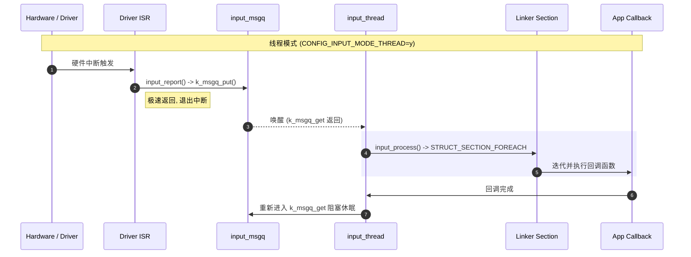

# input_report 回调实现机制 (源码级解析)

> [!note]
> **Ref:** 
> - `subsys/input/input.c`
> - `include/zephyr/input/input.h`

在 Zephyr 输入子系统中，事件的传递并不是通过简单的函数指针注册实现的，而是结合了 **RTOS 消息队列**与 **Linker Section (链接段)** 技术的工业级实现。

## 1. 上报入口：`input_report` 的双态分叉

当驱动层调用 `input_report` 时，系统根据 `CONFIG_INPUT_MODE_THREAD` 的配置进入两个完全不同的世界。

```c
/* subsys/input/input.c */
int input_report(const struct device *dev, uint8_t type, ...)
{
    struct input_event evt = { ... };

#ifdef CONFIG_INPUT_MODE_THREAD
    /* 路径 A: 线程模式 (默认/安全) */
    return k_msgq_put(&input_msgq, &evt, timeout);
#else
    /* 路径 B: 同步模式 (极低延迟/高风险) */
    input_process(&evt);
    return 0;
#endif
}
```

- **同步模式**: 直接在调用者的上下文（通常是 ISR）中遍历并执行所有回调。
- **线程模式**: 将事件压入 `input_msgq` 消息队列后立即返回，实现了中断与业务逻辑的解耦。

## 2. 核心枢纽：`input_thread` 的生命周期

在线程模式下，输入子系统会静态创建一个后台线程。

### 2.1 队列与线程的定义
```c
/* 1. 定义消息队列: 深度由 CONFIG_INPUT_QUEUE_MAX_MSGS 决定 */
K_MSGQ_DEFINE(input_msgq, sizeof(struct input_event), CONFIG_INPUT_QUEUE_MAX_MSGS, 4);

/* 2. 定义后台线程: 随系统启动自动运行，优先级通常设为最低应用级 */
K_THREAD_DEFINE(input, CONFIG_INPUT_THREAD_STACK_SIZE,
                input_thread, NULL, NULL, NULL,
                K_LOWEST_APPLICATION_THREAD_PRIO, 0, 0);
```

### 2.2 线程执行循环 (Event Loop)
`input_thread` 采用典型的“生产者-消费者”模型：
```c
static void input_thread(void *p1, void *p2, void *p3)
{
    struct input_event evt;
    while (true) {
        /* 永久阻塞等待队列，不消耗 CPU */
        k_msgq_get(&input_msgq, &evt, K_FOREVER);
        
        /* 唤醒后，进入分发逻辑 */
        input_process(&evt);
    }
}
```

## 3. 回调分发魔法：Linker Section 遍历

这是 Zephyr 最具特色的地方。应用层使用 `INPUT_CALLBACK_DEFINE` 时，并**没有**动态调用任何 `register()` 函数，而是利用编译器宏将配置信息写到了内存的一个特定段（Section）中。

### 3.1 应用层注册
```c
/* 应用层宏定义 */
INPUT_CALLBACK_DEFINE(my_dev, my_cb);
```
该宏会在编译期生成一个 `struct input_callback` 结构体，并使用 `__attribute__((__section__(".input_callback_area")))` 强制将其存放在 `.input_callback_area` 内存段。

### 3.2 内部自动发现机制
在 `input_process` 中，系统只需要遍历这个内存段即可找到所有的监听者：

```c
static void input_process(struct input_event *evt)
{
    /* 核心魔法: 遍历 Linker Section 中定义的所有回调结构体 */
    STRUCT_SECTION_FOREACH(input_callback, callback) {
        
        /* 过滤器检查: 指定设备匹配 或 监听所有设备 (NULL) */
        if (callback->dev == NULL || callback->dev == evt->dev) {
            
            /* 执行应用层回调 */
            callback->callback(evt, callback->user_data);
        }
    }
}
```

## 4. 全景时序图



## 5. 架构总结

1.  **静态注册**: 回调函数通过 Linker Section 静态注册，零运行时开销，且不存在动态内存分配风险。
2.  **异步解耦**: `k_msgq` 提供了 ISR 到 Thread 的安全通道，保护了内核稳定性。
3.  **单线程瓶颈**: 注意！所有 `input_callback` 都在同一个 `input_thread` 中**串行**执行。因此，回调函数严禁长时间阻塞，**高响应需求的业务应结合 `zbus` 进行二次异步分发。**
