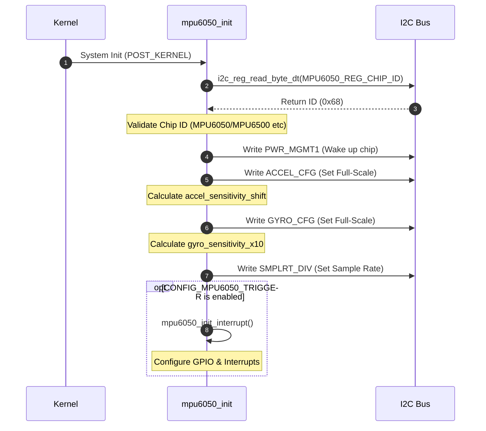
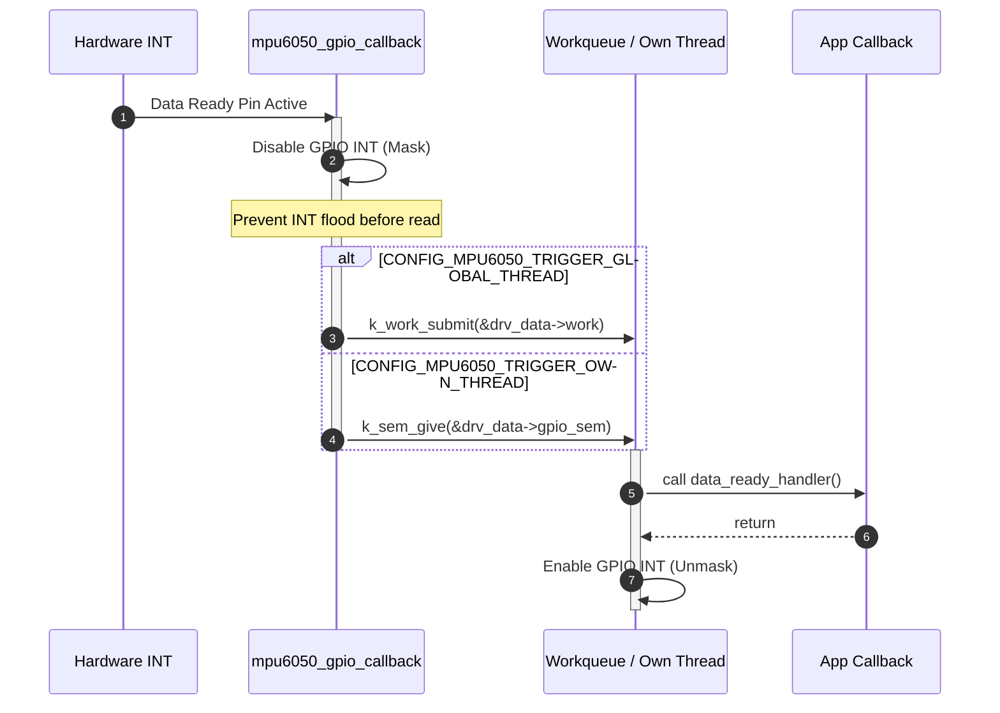

# MPU6050 驱动实现源码深度剖析

> [!note]
> **Ref:** 
> - MPU6050 驱动核心逻辑: `$ZEPHYR_BASE/drivers/sensor/tdk/mpu6050/mpu6050.c`
> - MPU6050 触发器机制: `$ZEPHYR_BASE/drivers/sensor/tdk/mpu6050/mpu6050_trigger.c`
> - MPU6050 头文件与数据结构: `$ZEPHYR_BASE/drivers/sensor/tdk/mpu6050/mpu6050.h`

继前文对 MPU6050 示例应用层的分析后，我们需要深入到底层驱动代码，看看 Zephyr 是如何将抽象的 Sensor API（如 `sensor_sample_fetch`, `sensor_channel_get`, `sensor_trigger_set`）映射到具体的 I2C 寄存器操作和中断处理上的。

## 1. 驱动数据模型：Config 与 Data 分离

遵循 Zephyr 的设备驱动模型规范，MPU6050 驱动将设备实例分离为**只读的配置数据** (`struct mpu6050_config`) 和**可变的运行时数据** (`struct mpu6050_data`)。它们都在 `SENSOR_DEVICE_DT_INST_DEFINE` 宏展开时被实例化。

### 1.1 Config：硬件静态配置
`mpu6050_config` 包含了直接从 DeviceTree (DTS) 解析出的硬件参数，运行时不可变放在 ROM 中：
- `i2c`: I2C 总线设备句柄与从机地址 (`I2C_DT_SPEC_INST_GET`)。
- `accel_fs` / `gyro_fs`: 加速度计和陀螺仪的满量程范围 (Full-Scale Range)。
- `smplrt_div`: 采样率分频系数。
- `int_gpio`: 中断引脚的 GPIO 描述符（仅在启用了 Trigger 时存在）。

### 1.2 Data：运行时上下文
`mpu6050_data` 记录了驱动运行时的动态状态放在 RAM 中：
- **缓存的原始数据**: `accel_x/y/z`, `gyro_x/y/z`, `temp` 等，在 `fetch` 阶段从 I2C 读取并存储。
- **转换系数**: `accel_sensitivity_shift`, `gyro_sensitivity_x10`，在 `init` 阶段根据 Full-Scale 范围计算好，供后续 `get` 阶段快速换算，避免浮点运算。
- **触发器上下文**: 包含 `data_ready_trigger`、回调函数指针、`gpio_cb` 以及多线程通信原语（如专属线程使用的 `k_sem`, `k_thread` 或全局线程使用的 `k_work`）。

## 2. 驱动初始化流程 (`mpu6050_init`)

系统在 `POST_KERNEL` 阶段自动调用该初始化函数。其主要职责是唤醒芯片并根据 DTS 配置各个寄存器。

## 3. 核心 API 实现解析

### 3.1 数据拉取 (`mpu6050_sample_fetch`)
该函数负责从传感器的硬件寄存器中拉取最新数据快照。
在 MPU6050 中，加速度、温度、角速度寄存器是**连续排列**的（从 `0x3B` 开始，共 14 个字节）。驱动巧妙地使用了一次 `i2c_burst_read_dt` 突发读取全部数据，极大降低了 I2C 通信的开销。
读取完成后，利用 `sys_be16_to_cpu` 将大端序的寄存器数据转换为 CPU 本地字节序，并保存在 `mpu6050_data` 中。

### 3.2 数据获取与转换 (`mpu6050_channel_get`)
该函数将缓存在 Data 结构体中的 raw 数据转换为标准的 `struct sensor_value`（包含整数部分 `val1` 和小数部分 `val2`）。
Zephyr 为了避免内核空间大量浮点运算，驱动内部的换算（`mpu6050_convert_accel/gyro/temp`）**全部使用定点数和位移运算**：
- 加速度：根据初始化时确定的 `sensitivity_shift`，使用 `>>` 位移实现除法，最后分离整数和小数（微级）。
- 陀螺仪：通过预先查表获得的 `sensitivity_x10`，结合 `SENSOR_PI` 宏，计算转换为 `rad/s` 标准单位。

## 4. 中断触发器 (Trigger) 深度揭秘

这是 MPU6050 驱动中最具价值的部分，展示了 Zephyr 如何处理硬件中断到顶层回调的上下文切换。

### 4.1 中断注册机制
在 `mpu6050_trigger_set` 中，驱动接收应用层的回调函数。此时，驱动会**开启引脚的边缘中断** (`GPIO_INT_EDGE_TO_ACTIVE`)。

### 4.2 中断底半部 (Bottom Half) 设计模式
硬件中断 (ISR) 的执行时间必须极短，因此 Zephyr 采用了**分离上下文**的设计。

**关键设计剖析：**
1. **中断屏蔽防御**: `mpu6050_gpio_callback` (ISR) 执行的第一件事是 `GPIO_INT_DISABLE`，即屏蔽该 GPIO 的后续中断。这是为了防止应用层来不及通过 I2C 读取数据，导致 MPU6050 持续拉高 INT 引脚从而引发“中断风暴 (Interrupt Storm)”。
2. **上下文移交**: ISR 不能执行阻塞操作（比如 I2C 读写），所以它仅仅是提交一个工作项 (`k_work_submit`) 或者释放一个信号量 (`k_sem_give`)，随后立即退出。
3. **线程级执行**: 处理线程被唤醒执行 `mpu6050_thread_cb`。此时处于线程上下文，允许调用阻塞 API。它回调应用层的 handler（应用层在其中调用 fetch 通过 I2C 获取数据）。
4. **中断恢复**: 当应用层数据读取完毕后，再重新恢复边缘中断监听 (`GPIO_INT_EDGE_TO_ACTIVE`)，准备迎接下一次数据就绪。

### 4.3 两种触发线程模型的抉择
从源码可以看出，`Kconfig` 宏直接改变了运行时结构体的数据成员和行为方式：
- **`CONFIG_MPU6050_TRIGGER_GLOBAL_THREAD`**:
  驱动只需维护一个 `struct k_work`。资源消耗最小，但响应延迟受制于系统全局队列中其他任务的繁忙程度。
- **`CONFIG_MPU6050_TRIGGER_OWN_THREAD`**:
  驱动必须静态分配一整块栈内存 (`K_KERNEL_STACK_MEMBER`) 并在初始化时 `k_thread_create` 创建一个专用死循环线程，其内部阻塞在 `k_sem_take`。这牺牲了内存（数百字节的 Stack），但赋予了传感器处理极高的可预测性和独立优先级。对于有极高实时性要求的高频位姿解算（如四轴飞行器），这是必须的选择。

## 5. 总结
MPU6050 驱动是 Zephyr Sensor 子系统的一个绝佳示范。它不仅展现了设备树属性如何映射到只读的 Config 结构、如何利用寄存器突发读取压榨 I2C 性能、以及如何用定点数避免浮点开销；更深入诠释了在实时操作系统中，如何利用内核原语（Semaphore/Workqueue）和中断屏蔽机制，构建一个安全、防抖、可抢占的传感器触发架构。