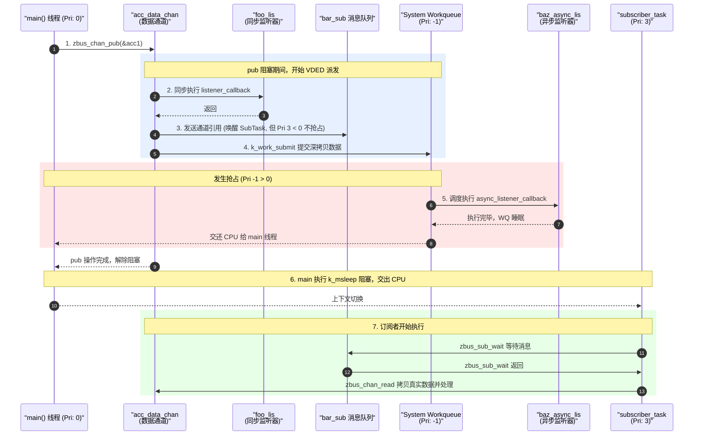

# zbus Hello World 实验现象与代码逻辑剖析

> [!note]
> **Ref:**
> - [Zephyr zbus documentation](https://docs.zephyrproject.org/latest/services/zbus/index.html)
> - 本地源码: `/home/pi/Zephyr-Suite/note/subsystem/zbus/hello_world_sample/src/main.c`
> - 本地文档: `/home/pi/Zephyr-Suite/note/subsystem/zbus/hello_world_sample/README.rst`

结合 `README.rst` 中展示的运行日志（以及代码中实际的打印和命名扩展），我们可以将 `hello_world` 工程的执行过程分为四个核心阶段。以下是通过现象反推 `main.c` 代码逻辑的详细剖析。

## 整体执行时序图



---

## 核心重点：线程优先级与调度关系解析

理解 zbus 机制的核心在于理清涉及到的多个线程及其调度优先级（Zephyr 中，数字越小优先级越高，负数为不可抢占的协作式线程）：

1. **`main` 线程**：默认优先级为 **0**（可抢占）。
2. **`System Workqueue`（系统工作队列）**：默认优先级通常为 **-1**（协作式，优先级极高）。
3. **`subscriber_task`（订阅者线程）**：在代码中被定义为优先级 **3**（可抢占，优先级最低）。

当 `main` 线程（Pri 0）调用 `zbus_chan_pub` 发布数据时，其完整的调度细节如下：

### 1. 同步监听器直接执行 (无抢占)
首先，zbus 框架会在 `main` 线程自身的上下文中，**同步调用** `foo_lis` 的回调函数。此时没有上下文切换，依然是 `main` 线程在跑。

### 2. 唤醒订阅者 (就绪但不抢占)
接着，zbus 会将通道的引用推入 `bar_sub` 的消息队列。这个动作会唤醒阻塞在队列上的 `subscriber_task` 线程（Pri 3）。**但是**，由于 `main` 线程的优先级（0）高于 `subscriber_task`（3），此时**不会发生抢占**。`subscriber_task` 只是从挂起状态变为了就绪（Ready）状态，排在就绪队列中等待。

### 3. 异步监听器提交与高优先级抢占
最后，zbus 为异步监听器 `baz_async_lis` 准备好消息的深拷贝，并通过 `k_work_submit` 提交给 `System Workqueue`。
*   这个动作会唤醒优先级为 **-1** 的工作队列线程。
*   因为 -1 的优先级高于 `main` 线程的 0，Zephyr 的调度器会**立刻触发抢占（Preemption）**。
*   上下文瞬间切换到 `System Workqueue`，并执行 `async_listener_callback_example`。
*   执行完毕后，工作队列重新挂起，CPU 控制权才会交还给 `main` 线程。

### 4. `main` 线程释放 CPU，订阅者最终执行
当 `main` 线程彻底完成 `pub` 的派发并返回后，它执行了 `k_msleep(1000);` 导致自身阻塞挂起。
此时，就绪队列中优先级最高的线程变成了之前被唤醒的 `subscriber_task`（Pri 3）。调度器将 CPU 交给它，它才会从 `zbus_sub_wait` 中醒来并完成 `zbus_chan_read` 操作。

> **总结**：真正的执行流顺序是：**同步 Listener -> 异步 WQ Listener -> (pub 结束，main 睡眠) -> 订阅者 Subscriber**。这完全由它们所在的线程优先级决定。

---

## 阶段一：静态数据读取与通道自省

### 现象
```console
D: Sensor sample started raw reading, version 0.1-2!
D: Channel list:
... (列出 acc_data_chan, version_chan 等)
D: Observers list:
... (列出 Listener 和 Subscriber 等)
```

### 代码逻辑剖析
1. **静态通道读取**：`version_chan` 是一个没有挂载任何观察者（`ZBUS_OBSERVERS_EMPTY`）的通道，它的作用纯粹是全局数据共享。代码通过 `zbus_chan_const_msg(&version_chan)` 拿到了通道内部数据的 `const` 指针。由于通道在定义时通过 `ZBUS_MSG_INIT` 赋了初值，因此这里可以直接读出 `0.1-2`，体现了 zbus 作为**全局静态状态容器**的能力。
2. **系统自省（Introspection）**：zbus 在编译期将通道和观察者放在了特定的 linker section 中。`zbus_iterate_over_channels_with_user_data` 等迭代器函数遍历这些内存段，打印出系统的通信拓扑结构。这对于复杂系统的架构梳理和 Debug 非常有价值。

---

## 阶段二：消息发布与同步派发

### 现象
```console
D: From listener -> Acc x=1, y=1, z=1
```
*(注：根据 README 日志和 Zephyr 内部 DEBUG 机制，在进入监听器前后 zbus 核心还可能打印 `START/FINISH processing channel` 日志)*

### 代码逻辑剖析
在 `main` 函数中调用了核心 API：
```c
zbus_chan_pub(&acc_data_chan, &acc1, K_SECONDS(1));
```
由于 `acc_data_chan` 绑定了 `foo_lis`（同步监听器），`zbus_chan_pub` 内部会**直接在调用者（main线程）的上下文中同步执行** `listener_callback_example` 回调。
*   **注意**：此时通道被锁，所以回调内部可以直接用 `zbus_chan_const_msg(chan)` 零拷贝读取数据，但也正因如此，**同步回调中绝对不能包含阻塞或休眠操作**。

---

## 阶段三：异步派发与订阅者消费

### 现象
```console
D: From subscriber -> Acc x=1, y=1, z=1
D: From async listener -> Acc x=1, y=1, z=1  // main.c 新增的异步监听器现象
```

### 代码逻辑剖析
除了同步监听器，`acc_data_chan` 还绑定了 `bar_sub`（订阅者）和 `baz_async_lis`（异步监听器）。
1. **订阅者 (`bar_sub`)**：
   * 在 `pub` 的派发阶段，zbus 将 `acc_data_chan` 的**指针**压入了 `bar_sub` 的消息队列（深度为 4），而不是深拷贝消息数据本身。
   * 这唤醒了阻塞在 `zbus_sub_wait` 上的 `subscriber_task` 独立线程。
   * 被唤醒后，该线程主动调用 `zbus_chan_read`，将通道中的最新数据拷贝到自己的栈变量中并打印。**这种机制非常适合耗时较长的业务处理**。
2. **异步监听器 (`baz_async_lis`)**：
   * 相比于订阅者，异步监听器不需要我们手动创建线程。zbus 将消息**深拷贝**后，直接提交到了 Zephyr 的 System Workqueue（系统工作队列）中等待调度执行。

---

## 阶段四：Validator 数据拦截（扩展机制）

在 `main.c` 尾部，示例展示了 zbus 的表单验证（Validator）能力：
```c
value = 15; /* 超出 [0, 9] 范围 */
err = zbus_chan_pub(&simple_chan, &value, K_MSEC(200)); // 返回 -ENOMSG
```
*   **逻辑**：`simple_chan` 挂载了 `simple_chan_validator` 回调。当执行 `pub` 时，zbus 会先将待发布数据送入 Validator。若 Validator 返回 `false`，则中断发布流程并返回 `-ENOMSG` 错误码。
*   **应用场景**：这种机制将数据合法性校验下沉到了总线层，避免了无效脏数据触发大量的观察者调度。
