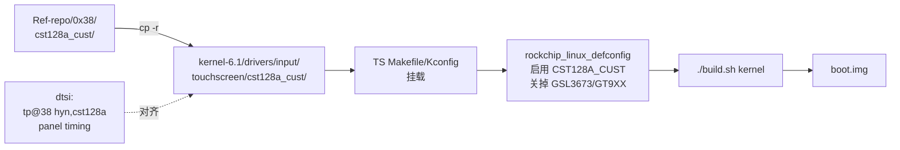

# D310T9362V1 移植 - 完整集成步骤

> [!note]
> **Ref:**
> - 背景与方案选型：[[00-overview]]
> - 参考方案：`../Ref-repo/0x38/`
> - SDK：`sdk/tspi-rk3566-sdk/kernel-6.1` (`devp` 分支)
> - 关联 commits：`1b20c72580af`（集成）、`ad6f867f2a05`（vendor 6.1 兼容）、`098e8d738075`（pinctrl 层级修复）


## 0. 起点状态

在 `kernel-6.1/` (devp 分支) 上：

```text
HEAD:    "适配泰山派1M-20260401-103238"
工作树:  arch/arm64/boot/dts/rockchip/tspi-rk3566-dsi-v10.dtsi 已有未提交修改
        (用户已先把 dtsi 中触摸节点从 my,touch -> hyn,cst128a，
         lane-rate 500 -> 480, vp0 -> vp1, backlight levels 等)
```

→ **dtsi 字段已对齐**；缺：触摸驱动文件 + Kbuild 挂载 + defconfig。

## 1. 完整移植链路



## 2. 四步集成（commit `1b20c72580af`）

### 2.1 dtsi 字段对齐（用户先行完成）

`arch/arm64/boot/dts/rockchip/tspi-rk3566-dsi-v10.dtsi` 关键字段切换：

| 字段 | HEAD | 工作树 → commit |
|---|---|---|
| 触摸节点 | `myts@38 { compatible = "my,touch"; }` | `tp@38 { compatible = "hyn,cst128a"; }` |
| `touch_gpio` pinctrl | 无 | `<1 RK_PA0 RK_FUNC_GPIO &pcfg_pull_up>` |
| `rockchip,lane-rate` | 500 | **480** |
| `route_dsi1` connect | `vp0_out_dsi1` | `vp1_out_dsi1` |
| `dsi1_in_vp0` / `vp1` status | vp0 okay / vp1 disabled | vp0 disabled / **vp1 okay** |
| `dsi,flags` | 含 `NO_EOT_PACKET` | 含 `EOT_PACKET`（⚠ 见 §3.1） |
| `backlight brightness-levels` | 0..255 线性 | 0..51 分段 + 256 末值 |
| `default-brightness-level` | 255 | 192 |

### 2.2 拷入触摸驱动

```sh
cp -r note/BSP-Dev/LCD-Touch/TSPI-D310T9362V1/Ref-repo/0x38/cst128a_cust \
      sdk/tspi-rk3566-sdk/kernel-6.1/drivers/input/touchscreen/cst128a_cust
```

> [!warning]
> **陷阱：`cp -r src dst` 当 dst 已存在时会创建嵌套 `dst/src/`**。如果 ls 不到预期文件，要 `mv dst/src/* dst/ && rmdir dst/src`。

驱动包含 3 个文件：

```text
cst128a_cust/
├── Kconfig         # CONFIG_TOUCHSCREEN_CST128A_CUST tristate
├── Makefile        # obj-$(CONFIG_TOUCHSCREEN_CST128A_CUST) += cst128a_ts.o
└── cst128a_ts.c    # 288 行 i2c driver, of_match "hyn,cst128a"
```

### 2.3 挂 Kbuild

**`drivers/input/touchscreen/Makefile`** 末尾追加：

```makefile
obj-$(CONFIG_TOUCHSCREEN_CST128A_CUST)	+= cst128a_cust/
```

**`drivers/input/touchscreen/Kconfig`** 在 `endif` 前追加：

```kconfig
source "drivers/input/touchscreen/cst128a_cust/Kconfig"
```

### 2.4 调 defconfig

**`arch/arm64/configs/rockchip_linux_defconfig`** 第 247-248 行：

```diff
-CONFIG_TOUCHSCREEN_GSL3673=y
-CONFIG_TOUCHSCREEN_GT9XX=y
+# CONFIG_TOUCHSCREEN_GSL3673 is not set
+# CONFIG_TOUCHSCREEN_GT9XX is not set
+CONFIG_TOUCHSCREEN_CST128A_CUST=y
```

- `GSL3673` / `GT9XX`：10 寸 panel 方案遗留，与本屏无关
- `HYN=y` 与 `MXT=y` 保留（其他屏方案可复用，不冲突）

### 2.5 提交集成 commit

```text
commit 1b20c72580af  适配 D310T9362V1 3.1寸MIPI屏: 集成 cst128a 触摸驱动 + dsi-v10 对齐 0x38 参考方案
 .../boot/dts/rockchip/tspi-rk3566-dsi-v10.dtsi   | 344 ++++++++++-----------
 arch/arm64/configs/rockchip_linux_defconfig      |   5 +-
 drivers/input/touchscreen/Kconfig                |   2 +
 drivers/input/touchscreen/Makefile               |   1 +
 drivers/input/touchscreen/cst128a_cust/Kconfig   |   7 +
 drivers/input/touchscreen/cst128a_cust/Makefile  |   1 +
 .../input/touchscreen/cst128a_cust/cst128a_ts.c  | 288 +++++++++++++++++
 7 files changed, 473 insertions(+), 175 deletions(-)
```

## 3. Build / Boot 修复（共 3 处 fixup）

| 序 | 修复点 | commit | 暴露阶段 | 类别 |
|---|---|---|---|---|
| §3.1 | `MIPI_DSI_MODE_EOT_PACKET` 未定义 | `ad6f867f2a05` | `./build.sh kernel` 编译期 | vendor 6.1 API 错配 |
| §3.2 | `i2c_driver.remove` 返回类型不兼容 | `ad6f867f2a05` | 编译期 | vendor 6.1 API 错配 |
| §3.3 | pinctrl `touch_gpio` group 层级错误 | `098e8d738075` | **板上 probe 阶段（静默失败）** | Rockchip 平台 DT 陷阱 |

§3.1 / §3.2 共同根因：**Ref-repo 的资料对应更早期的内核（≤ 5.x），与 RK 6.1 vendor 树存在 API/语义错配**。
§3.3 是参考 dtsi 在新 dts 文件中被误编辑成顶层挂载导致的层级错位，跟内核版本无关。

### 3.1 DTS：`MIPI_DSI_MODE_EOT_PACKET` 未定义

#### 错误现象

```text
Error: arch/arm64/boot/dts/rockchip/tspi-rk3566-dsi-v10.dtsi:414.16-17 syntax error
FATAL ERROR: Unable to parse input tree
```

#### 根因分析

Linux mainline 在 6.0 翻转了 EOT 标志极性：

| Kernel 版本 | 头文件中宏 | 语义 |
|---|---|---|
| ≤ 5.x | `MIPI_DSI_MODE_NO_EOT_PACKET` | **设此 flag = 不发** EOT 包（默认发） |
| ≥ 6.0 | `MIPI_DSI_MODE_EOT_PACKET` | **设此 flag = 发** EOT 包（默认不发） |

参考 commit (mainline): `f79d6d28d8df ("drm: Switch DSI EOT flag polarity")`.

RK 的 **6.1 vendor 树** 没跟进这个翻转，仍只在 `include/dt-bindings/display/drm_mipi_dsi.h:39` 定义旧极性 `MIPI_DSI_MODE_NO_EOT_PACKET`。

```sh
$ grep -n "MIPI_DSI_MODE.*EOT" include/dt-bindings/display/drm_mipi_dsi.h
39:#define MIPI_DSI_MODE_NO_EOT_PACKET	(1 << 9)
```

#### 修复

```diff
 dsi,flags = <(MIPI_DSI_MODE_VIDEO | MIPI_DSI_MODE_VIDEO_BURST |
-	MIPI_DSI_MODE_LPM | MIPI_DSI_MODE_EOT_PACKET)>;
+	MIPI_DSI_MODE_LPM)>;
```

**语义换算**：`Ref-repo` dtsi 显式设 `EOT_PACKET`（新极性下"发 EOT"）→ 在旧极性下等价于**不设** `NO_EOT_PACKET`，即直接省略此 flag。

### 3.2 驱动：`i2c_driver.remove` 签名不兼容

#### 错误现象

```text
drivers/input/touchscreen/cst128a_cust/cst128a_ts.c:280:17:
  error: initialization of 'void (*)(struct i2c_client *)'
         from incompatible pointer type 'int (*)(struct i2c_client *)'
         [-Werror=incompatible-pointer-types]
```

#### 根因分析

Linux 6.1 mainline 把 `i2c_driver.remove` 的回调签名从

```c
int (*remove)(struct i2c_client *)
```

改为

```c
void (*remove)(struct i2c_client *)
```

参考 commit (mainline): `ed5c2f5fd10d ("i2c: Make remove callback return void")`. 该改动是为了消除"remove 失败"的伪场景 — bus remove 路径无法回滚。

RK 6.1 vendor 树**已跟进**这个 API 变化，但 Ref-repo 的 `cst128a_ts.c` 来自更早的内核，沿用旧签名。

#### 修复

```diff
-static int hyn_cst128_ts_remove(struct i2c_client *client)
+static void hyn_cst128_ts_remove(struct i2c_client *client)
 {
     struct hyn_cst128_dev *cst128 = i2c_get_clientdata(client);
     input_unregister_device(cst128->input);
-    return 0;
 }
```

### 3.3 DTS: pinctrl `touch_gpio` group 层级错误

#### 错误现象

板上 `1-0038` 设备已建（`name=cst128a`），`hyn_cst128a` driver 已注册，但 `readlink driver` 为空 — driver 与 device 没绑上，且 dmesg **完全没有 hyn_cst128a 的任何输出**（无 `dev_err`、无 probe 痕迹）。

手动 bind 触发一次 probe 才把错误曝光：

```sh
echo 8 > /proc/sys/kernel/printk
echo 1-0038 > /sys/bus/i2c/drivers/hyn_cst128a/bind
# bind result: 1
# dmesg 末尾立刻多出:
# [  804.798195] rockchip-pinctrl pinctrl: unable to find group for node touch-gpio
```

#### 根因分析

Rockchip pinctrl 框架在 `&pinctrl` 节点下要求**两层嵌套**：

```
&pinctrl {
    <function-name> {                  ← 第一层: function (任意名)
        <group-label>: <group-name> {  ← 第二层: group
            rockchip,pins = <...>;
        };
    };
};
```

错误写法（commit `1b20c72580af` 引入）：

```dts
&pinctrl {
    dsi1 {
        dsi1_rst_gpio: dsi1-rst-gpio {
            rockchip,pins = <3 RK_PC1 RK_FUNC_GPIO &pcfg_pull_none>;
        };
    };
    touch_gpio: touch-gpio {            // ❌ 挂在 &pinctrl 顶层而非 function 内
        rockchip,pins = <1 RK_PA0 RK_FUNC_GPIO &pcfg_pull_up>;
    };
};
```

dtc 不报错（语法合法），DT 上下文也成功 phandle 引用，但 `rockchip-pinctrl` driver 在解析时找不到对应 group 配置，使 `tp@38` 节点的 `pinctrl-0 = <&touch_gpio>` resolve 失败，**i2c probe 链路在 pinctrl apply 阶段提前 fail**。

这条错误归类为"静默 probe 失败"：因为 pinctrl 失败发生在 device-driver probe 之前的 device 准备阶段，driver 的 `dev_err` 还轮不到执行就被驳回，导致没有任何业务日志。详见 [[#7-调试方法论probe-静默失败]]。

#### 修复

把 `touch_gpio` 移进 `dsi1` function 内：

```diff
 &pinctrl {
     dsi1 {
         dsi1_rst_gpio: dsi1-rst-gpio {
             rockchip,pins = <3 RK_PC1 RK_FUNC_GPIO &pcfg_pull_none>;
         };
-    };
-    touch_gpio: touch-gpio {
-        rockchip,pins = <1 RK_PA0 RK_FUNC_GPIO &pcfg_pull_up>;
+        touch_gpio: touch-gpio {
+            rockchip,pins = <1 RK_PA0 RK_FUNC_GPIO &pcfg_pull_up>;
+        };
     };
 };
```

### 3.4 提交两个 fixup commit

```text
commit ad6f867f2a05  fixup: cst128a 移植适配 kernel 6.1 API (修复 build 错误)
 arch/arm64/boot/dts/rockchip/tspi-rk3566-dsi-v10.dtsi    | 2 +-
 drivers/input/touchscreen/cst128a_cust/cst128a_ts.c     | 3 +--
 2 files changed, 2 insertions(+), 3 deletions(-)

commit 098e8d738075  fixup: cst128a 触摸 pinctrl group 层级错误 (修复 probe 失败)
 arch/arm64/boot/dts/rockchip/tspi-rk3566-dsi-v10.dtsi    | 6 +++---
 1 file changed, 3 insertions(+), 3 deletions(-)
```

## 4. 编译验证

```sh
source /home/pi/imx/tspi_env.sh
cd $SDK_DIR
./build.sh kernel
```

成功标志（末尾日志）：

```text
Running 10-kernel.sh - build_kernel succeeded.
```

输出产物：

```text
output/firmware/boot.img    # 含新 dtb + 新 kernel
```

## 5. 板上验证清单

烧 `boot.img` → 重启 → 检查：

```sh
# 触摸驱动绑定确认
cat /sys/bus/i2c/devices/1-0038/name
# 期望: cst128a (旧厂家方案下是 'touch')

readlink /sys/bus/i2c/devices/1-0038/driver
# 期望: ../../../../bus/i2c/drivers/hyn_cst128a

dmesg | grep -iE "cst128|hyn,cst"

# 显示分辨率确认
fbset
# 期望 mode 包含 480x800

# 触摸事件流确认
evtest /dev/input/event<N>
```

## 6. 板上验证实录

烧三轮 boot.img 后的实际板上状态：

```sh
$ cat /sys/bus/i2c/devices/1-0038/name
cst128a                                                     # dts 节点 OK
$ readlink /sys/bus/i2c/devices/1-0038/driver
../../../../../bus/i2c/drivers/hyn_cst128a                  # driver 绑定 OK ✅
$ dmesg | grep -iE "cst128|input"
[    5.728412] hyn_cst128a 1-0038: hyn_cst128_ts_write: write error, addr=0x0 len=1.
[    5.728500] hyn_cst128a 1-0038: hyn_cst128_ts_write: write error, addr=0xa4 len=1.
[    5.729038] input: CST128 TouchScreen as /devices/.../1-0038/input/input1
$ cat /sys/class/drm/card0-DSI-1/modes
480x800                                                     # DRM 报告分辨率 OK ✅
$ evtest /dev/input/event<N>                                # 触摸坐标稳定上报 ✅
```

## 7. 调试方法论：probe "静默失败"

### 现象定义

i2c device 在 sysfs 已建（`/sys/bus/i2c/devices/X-XXXX/name` 正确），driver 也在 `/sys/bus/i2c/drivers/` 注册，但：

- `readlink /sys/bus/i2c/devices/X-XXXX/driver` **为空** — driver 与 device 没绑
- `dmesg` **完全没有 driver 的任何输出**（连 `dev_err` 都没）

这种"既无成功又无错误"的状态最难定位。

### 三种可能根因

| 类型 | 表现 | 排查 |
|---|---|---|
| A. compatible 不匹配 | driver 注册但没 match | 查 `of_device_id` table vs dts `compatible` |
| B. device 准备阶段失败（pinctrl/clock/regulator） | 触发不到 driver probe，无业务 log | **手动 bind 强制 probe 暴露** |
| C. probe 失败但 `dev_err` 被 dmesg 缓冲冲掉 | 启动早期 print 被晚期事件覆盖 | **手动 bind 强制 probe 暴露** |

### 关键工具：手动 bind

```sh
echo 8 > /proc/sys/kernel/printk                          # 解锁 KERN_DEBUG 输出
echo X-XXXX > /sys/bus/i2c/drivers/<drv_name>/bind        # 强制对该 device 走 probe
echo "bind result: $?"                                    # 0=成功, 非0=失败
dmesg | tail -30                                          # 错误打在 dmesg 末尾, 不会被冲掉
```

本案例触发出关键一行：

```text
[  804.798] rockchip-pinctrl pinctrl: unable to find group for node touch-gpio
```

立刻定位到 §3.3 的 pinctrl 层级问题。

### 类比工具

- `unbind` + `bind` 循环：`echo X-XXXX > .../unbind; echo X-XXXX > .../bind`
- 模块化驱动可直接 `modprobe -r <mod>; modprobe <mod>` 重新触发 probe（本驱动 `=y` builtin 不支持）
- `cat /proc/device-tree/<path>/<prop>` 验 DT 实际生效内容

## 8. 已知现象（非阻塞）

### 8.1 probe 期两条 i2c write error

```text
hyn_cst128a 1-0038: hyn_cst128_ts_write: write error, addr=0x0 len=1.
hyn_cst128a 1-0038: hyn_cst128_ts_write: write error, addr=0xa4 len=1.
```

#### 触发链

probe 第 213-223 行：

```c
hyn_cst128_ts_reset(cst128);            // 拉低 reset, msleep(5), 拉高
msleep(5);
hyn_cst128_ts_write(cst128, 0x00, ...); // 写 DEVIDE_MODE_REG = 0 (normal)
hyn_cst128_ts_write(cst128, 0xA4, ...); // 写 ID_G_MODE_REG = 1 (中断模式)
// ↑ 两次 write 均不检查返回值, 继续往后走
```

#### 根因

CST128-A 在 reset 拉高后稳定时间 > 5 ms（实测约 20-30 ms 才稳定响应 i2c），driver 的 `msleep(5)` 偏紧。

#### 为何不阻塞触摸

两次 write 写入的都是**IC 上电默认值**：

- `0x00 DEVIDE_MODE_REG ← 0`：normal 工作模式（IC 默认就是）
- `0xA4 ID_G_MODE_REG ← 1`：中断触发模式（FT5x16 兼容固件默认就是）

→ 即使 i2c write 失败，IC 仍在正确状态，**触摸事件正常上报**。

#### 美化方案（低优先级）

```diff
- msleep(5);
+ msleep(50);   // CST128A reset 稳定时间
  hyn_cst128_ts_write(cst128, 0x00, ...);
```

或加返回值检查 + retry，但属过度工程。当前实际功能完整，不修。

## 9. 遗留 / TODO

| # | 项 | 说明 | 状态 |
|---|---|---|---|
| 1 | `my_touch/` 驱动残留 | TS Makefile 仍有 `obj-y += my_touch/` 强编进 kernel，dts compatible 已无指向，仅 module_init print 一行，浪费 KB | 待 cleanup commit |
| 2 | `0x58` I²C 设备 | 板载，未声明、未驱动，疑似 PD controller / audio amp | 待查 oshwhub 原理图 |
| 3 | userland UI 分辨率适配 | 内核 DRM 已报 480×800，但 Weston/GTK 渲染异常（详见 §10） | **未解决** |
| 4 | CRLF 行尾清理 | dtsi 部分行为 CRLF，dtc 不报错但视觉污染 | 可在合适时机 `dos2unix` |
| 5 | 文档化 cst128a_ts.c | 拆解 i2c-client / input_dev / IRQ 上报路径，落到 [[../../../SysCall/]] 或 [[../../../DTS/]] | 学习时再做 |
| 6 | reset 时序美化 | §8.1 的 `msleep(5)` 太紧 | 低优先级 |

## 10. 关键经验沉淀

- **RK vendor kernel 跟 mainline 节奏不一致**：跨大版本时务必先 `grep` 头文件确认宏/API 版本，不能想当然按 Ref-repo 直接套
- **移植第三方 panel/touch 驱动时必查三点**：
  1. `MIPI_DSI_MODE_*EOT*` 极性（6.0 翻转）— §3.1
  2. `i2c_driver.remove` 签名（6.1 改 void）— §3.2
  3. **Rockchip pinctrl group 必须嵌在 function 内**，不能挂 `&pinctrl` 顶层 — §3.3
- **dtsi 字段对齐 vs 整体替换**：HEAD 已有厂家适配的复杂树，**不能整体替换** Ref-repo 版本；按字段精细 diff 才是正确姿势
- **`echo <dev> > /sys/.../driver/bind` 是 probe 静默失败的核武器**：强制重走 probe，错误打在 dmesg 末尾不会被冲掉。比 `dmesg | grep` 翻早期日志高效得多 — §7
