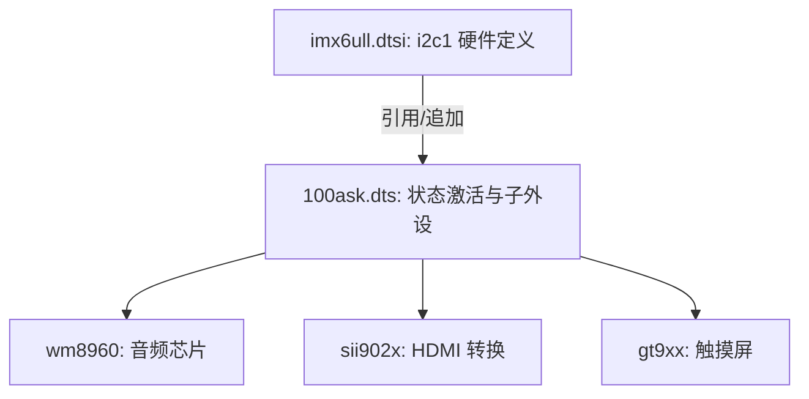

# 常用节点属性规则

> [!note]
> **Ref:** 
> - 本地源码：`note/Addt/evb-imx设备树配置文件/imx6ull.dtsi`
> - 本地源码：`note/Addt/evb-imx设备树配置文件/100ask_imx6ull-14x14.dts`

在 Device Tree 中，节点通过属性（Property）来描述硬件特征。属性遵循特定的 Binding 规则，以下通过 I2C 控制器及其外设的实例进行详细解析。

## 1. 通用标准属性

### 1.1 compatible (兼容性)
*   **语法**：`"manufacturer,model"` (字符串列表)
*   **作用**：驱动程序与硬件节点的匹配基准。通常从具体到通用排列。
*   **实例**：
    ```dts
    compatible = "fsl,imx6ul-i2c", "fsl,imx21-i2c";
    ```
    驱动会先尝试匹配 `imx6ul-i2c`，若无对应驱动，则退而求其次匹配 `imx21-i2c`。

### 1.2 reg (寄存器地址)
*   **语法**：`<address length>` (Cells 列表)
*   **作用**：定义设备寄存器的起始物理地址和映射空间大小。
*   **实例**：
    ```dts
    reg = <0x021a0000 0x4000>; // 起始地址 0x021a0000，长度 16KB (0x4000)
    ```

### 1.3 interrupts (中断)
*   **语法**：`<interrupt-type number type>`
*   **作用**：描述设备产生的中断信号。
*   **实例**：
    ```dts
    interrupts = <GIC_SPI 36 IRQ_TYPE_LEVEL_HIGH>;
    ```
    *   `GIC_SPI`: 共享外设中断。
    *   `36`: 中断号。
    *   `IRQ_TYPE_LEVEL_HIGH`: 高电平触发。

### 1.4 status (状态控制)
*   **作用**：控制内核是否挂载、激活该设备。
*   **取值**：
    *   `"okay"`: 设备激活。
    *   `"disabled"`: 设备不激活（默认在 SoC 级的 `.dtsi` 文件中常设为 disabled，由具体开发板 `.dts` 激活）。

---

## 2. 层次结构属性

### 2.1 #address-cells 与 #size-cells
*   **作用**：定义**子节点**中 `reg` 属性的编写格式。
*   **I2C 实例**：
    ```dts
    i2c1: i2c@021a0000 {
        #address-cells = <1>; // 子节点 reg 第 1 个 cell 是地址
        #size-cells = <0>;    // 子节点 reg 无长度（I2C 地址无需长度标识）
        
        codec: wm8960@1a {
            reg = <0x1a>;     // 仅需写出 I2C 从机地址
        };
    };
    ```

---

## 3. 引用与复用属性 (Phandles)

### 3.1 clocks
*   **作用**：引用系统时钟控制器节点定义的时钟源。
*   **语法**：`clocks = <&phandle ID>`
*   **实例**：
    ```dts
    clocks = <&clks IMX6UL_CLK_I2C1>;
    ```

### 3.2 pinctrl (引脚复用)
*   **作用**：定义设备正常工作所需的 IO 引脚配置（通过 Pinctrl 子系统处理）。
*   **实例**：
    ```dts
    pinctrl-names = "default";
    pinctrl-0 = <&pinctrl_i2c1>;
    ```

---

## 4. 厂商自定义属性

设备树允许通过厂商前缀（如 `fsl,`、`wlf,`、`goodix,`）来定义特定硬件所需的非标准参数。

*   **字符串**：`clock-names = "mclk";`
*   **整型**：`touchscreen-size-x = <800>;`
*   **布尔**：`wlf,shared-lrclk;` (该属性只要存在即代表 true)
*   **字节序列 (Binary)**：
    ```dts
    goodix,cfg-group0 = [
        6b 00 04 58 02 05 0d ...
    ];
    ```

---

## 5. 综合实例剖析：I2C 控制器

以下结合 `imx6ull.dtsi`（SoC定义）和 `100ask_imx6ull-14x14.dts`（板级定义）的配置逻辑：



### 控制器层 (DTS 节点)
```dts
&i2c1 {
    clock-frequency = <100000>; // 自定义属性：配置 I2C 速率为 100kHz
    pinctrl-names = "default";
    pinctrl-0 = <&pinctrl_i2c1>; // 引用 pinctrl 定义好的 IO 状态
    status = "okay";             // 激活控制器以使其在系统中挂载
};
```

### 外设层 (子节点)
```dts
codec: wm8960@1a {
    compatible = "wlf,wm8960";
    reg = <0x1a>;              // I2C 具体的从机地址
    clocks = <&clks IMX6UL_CLK_SAI2>; // 引用提供给音频模块的系统时钟
    clock-names = "mclk";
    wlf,shared-lrclk;          // 厂商特有布尔属性配置
};
```

---

## 6. 特殊虚拟节点：`chosen`

> [!note]
> **Ref:** `chosen` 节点虽然存在于设备树中，但它**不代表任何具体的硬件实体**。

`chosen` 节点的作用是在固件（如 U-Boot）和操作系统（如 Linux Kernel）之间**传递运行时的启动参数或软件层面的配置**。

### 6.1 核心属性解析

#### (1) `stdout-path` (标准输出路径)
在 `100ask_imx6ull-14x14.dts` 中有如下定义：
```dts
chosen {
    stdout-path = &uart1;
};
```
*   **意义**：明确告诉内核将早期的启动日志（Boot log）和控制台的标准输出重定向到 `uart1` 对应的物理串口上。内核解析到此属性后，就会优先初始化该串口终端。

#### (2) `bootargs` (内核启动参数)
虽然在部分 DTS 源码中可能未显式定义，但这是 `chosen` 节点最关键的属性。
*   **语法**：字符串
*   **实例**：
    ```dts
    chosen {
        bootargs = "console=ttymxc0,115200 root=/dev/mmcblk1p2 rootwait rw";
    };
    ```
*   **意义**：直接向 Linux 内核传递命令行参数（Cmdline），比如指定根文件系统的挂载位置（`root=`）、读写权限（`rw`）、串口名称及波特率等。
*   **动态修改**：在实际启动流程中，U-Boot 通常会读取其内部的环境变量（如 `bootargs`），并在将设备树真正传递给内核之前，**动态地向位于内存中的 DTS 的 `chosen` 节点注入或覆盖 `bootargs` 属性**。这也是为什么有时我们在静态的 DTS 文件中看不到 `bootargs`，但内核依然能正确获取启动参数的原因。
