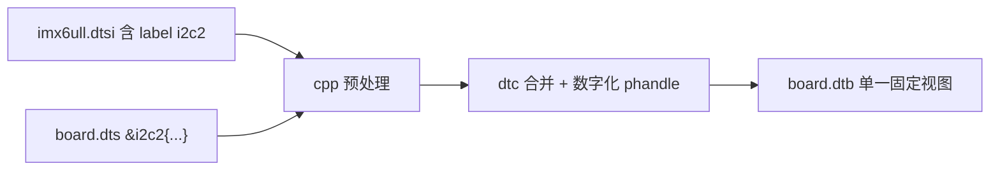
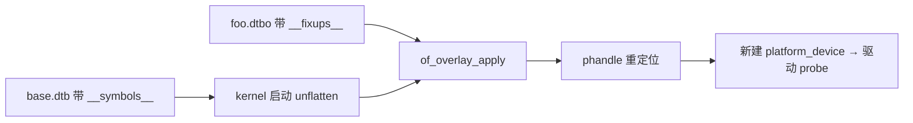

# dts 覆盖 dtsi 与 dtso 运行时 overlay 的异同

> [!note]
> **Ref:**
> - `Documentation/devicetree/overlay-notes.txt`
> - `Documentation/devicetree/dynamic-resolution-notes.txt`
> - `scripts/dtc/dtc.c`(`-@` 选项与 `__symbols__` 生成)

二者**语法几乎相同**(都用 `&phandle { ... }` 追加/覆盖属性),但**作用时机、解析者、约束**完全不同。本节做横向对照。

## 1. 共同点

| 维度 | 说明 |
|---|---|
| 语法形式 | 都靠 `&label { 新属性; }` 引用既有节点;新属性覆盖旧值,新子节点追加 |
| 合并语义 | 同名 property → 后者胜;同名 node → 递归合并;`/delete-property/`、`/delete-node/` 两边都支持 |
| 依赖 phandle | 都要求被覆盖的节点在基底中**已经有 label**,否则无锚点 |
| 工具链 | 都由 `dtc` 编译,产物都是 FDT 二进制结构 |

## 2. 差异

| 维度 | `.dts` 覆盖 `.dtsi` (静态) | `.dtso` 运行时 overlay |
|---|---|---|
| 发生时机 | 编译期,`cpp` + `dtc` 把 dtsi+dts 合并成**单一 dtb** | 运行期,kernel 把 `.dtbo` apply 到已 unflatten 的 `of_root` 上 |
| 执行者 | `dtc` 文本合并 | kernel `of_overlay_apply()` / `of_resolve_phandles()` |
| phandle 解析 | 编译期数字化,产物是普通 dtb | dtbo 内是**符号引用**(`__symbols__` / `__fixups__` / `__local_fixups__`),加载时由 kernel 重定位 |
| 基底要求 | 无特殊标记 | 基底 dtb 必须用 `dtc -@` 生成,带 `__symbols__` 节点 |
| 产物 | 一个 `.dtb`,被 bootloader 一次性传给 kernel | 独立 `.dtbo` 文件,可装入 `/lib/firmware/` 或 configfs 动态 apply/remove |
| 可逆性 | 不可逆,改完要重启 | 可 `of_overlay_remove()` 撤销,触发对应 platform_device 的 `.remove()` |
| 触发的驱动行为 | 一次性 probe,启动时完成 | apply 时**动态新建** platform_device → 触发驱动 probe;remove 时反向 |
| 覆盖范围 | 任何节点,任何属性,无限制 | 受限:只能改"可动态变化"的部分;改 CPU/memory/中断控制器等早期使用过的节点通常无效或崩溃 |
| `/dts-v1/` 头 | `/dts-v1/;` | `/dts-v1/; /plugin/;`(`/plugin/` 让 dtc 生成 fixups 段) |
| 典型用途 | 板卡定制(100ask vs vendor EVK)、SoC 变体派生 | Cape/HAT 热插拔、Raspberry Pi `dtoverlay=`、SPI/I2C 子卡、调试期临时挂外设 |
| 失败后果 | 编译失败,本地可见 | 运行时 `-EINVAL` / 驱动 probe 失败 / 甚至内核 oops |

## 3. 关键概念:`/plugin/` 与 fixups

```dts
/dts-v1/;
/plugin/;                    /* ← 告诉 dtc 这是 overlay */

&i2c2 {                      /* 符号引用,编译后进入 __fixups__ */
    eeprom@50 {
        compatible = "atmel,24c32";
        reg = <0x50>;
    };
};
```

```bash
dtc -@ -I dts -O dtb -o foo.dtbo foo.dtso
```

产物含三段元数据:

| 段 | 作用 |
|---|---|
| `__symbols__` | 导出本 overlay 内部 label → 节点 path,供后续 overlay 再次引用 |
| `__fixups__` | 列出对**外部符号**的引用与待修正偏移(本例:`i2c2`) |
| `__local_fixups__` | overlay 内部 phandle 自指(节点 A 引用节点 B)的重定位表 |

加载时 kernel 在 **基底 dtb** 的 `__symbols__` 中查 `i2c2` 的真实 path,把 fixups 表里指向的字段改写成正确的 phandle 数值——**这一步正是静态 dts 在编译期已经替你做完的事**。

## 4. 静态合并示意



## 5. 运行时 overlay 示意



## 6. 何时选哪种

| 场景 | 推荐 |
|---|---|
| 板卡形态固定,出厂不变 | **静态 dts 覆盖 dtsi**,简单可靠 |
| 同一基底要派生多块板卡 | 静态:多写几份 `board-A.dts` / `board-B.dts`,共享 dtsi |
| 可拆卸扩展板(Cape/HAT/子卡) | **dtso overlay**,运行时挂载 |
| 调试期临时挂外设,不想重启 | dtso overlay + configfs |
| 改 CPU/内存/中断控制器 | **必须**走静态 dts,overlay 不可靠 |
| 100ask EVB 现状 | 全部静态(`100ask_imx6ull-14x14.dts` 一次性合并) |

## 7. 一句话总结

> **`.dts` 覆盖 `.dtsi` 是"编译期文本合并",`.dtso` 是"把同一种合并推迟到运行时,再多做一次 phandle 重定位"。**
> 前者用于固化板卡形态,后者用于热插拔与可拆卸扩展。能在编译期定下来的硬件,**永远优先用 dtsi/dts**;只有真正需要运行时增删的场景,才付出 overlay 的复杂度代价。
