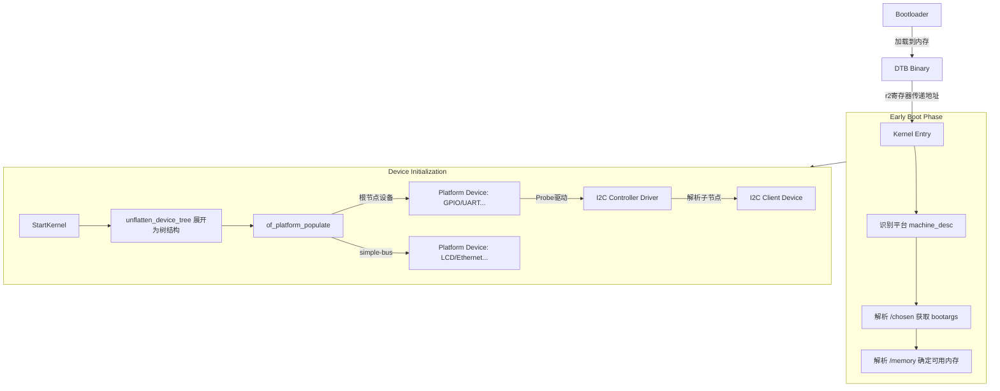

# Linux 与 Device Tree (Usage Model)

> [!note]
> **Ref:** [Linux 和设备树 — Linux 内核文档](https://docs.linuxkernel.org.cn/devicetree/usage-model.html)

设备树 (Device Tree, DT) 是一种用于描述硬件的数据结构，旨在将硬件配置信息从内核源码中解耦，使得同一份内核镜像 (zImage/Image) 能够支持多种硬件平台。

它最初由 Open Firmware (开放固件) 创建，作为将数据从固件传递到客户端程序（如操作系统）的通信方法。最重要的是要理解：**DT 只是一个描述硬件的数据结构，它提供一种语言，将硬件配置与 Linux 内核驱动分离，使设备支持成为数据驱动的。**

## 1. 核心概念

### 1.1 FDT (Flattened Device Tree)
Linux 内核并不直接读取文本格式的 `.dts` 文件，而是读取编译后的二进制 `.dtb` 文件，称为 **FDT**。
- **Bootloader (U-Boot)**: 将 `.dtb` 加载到内存，并通过寄存器（如 ARM 的 r2 寄存器）将内存地址传递给内核。
- **Kernel**: 在启动早期解析 FDT，获取内存大小、命令行参数等关键信息。

### 1.2 Bindings (绑定)
从概念上讲，DT 定义了一组通用的使用约定（具名属性与契约好的属性组织形式），称为“Bindings (绑定)”，用于描述数据应该如何在树中出现。只有遵循 Binding，驱动程序才能正确解析硬件特征（包括数据总线、中断线、GPIO 等）。

---

## 2. 内核三大用途

根据内核文档，内核使用 Device Tree 主要完成三件事：

### 2.1 平台识别 (Platform Identification)
在 ARM 架构上，内核需要确定当前运行在哪个板子上。
- **机制**: 检查根节点 `/` 的 `compatible` 属性。
- **匹配流程**: 
  1. `setup_arch()` 会调用 `setup_machine_fdt()`。
  2. 读取根节点的 `compatible` 字符串列表（例如 `["100ask,imx6ull-14x14", "fsl,imx6ull"]`，从最确切到最宽泛排序）。
  3. 搜索内核的 `machine_desc` 表，与 `struct machine_desc` 中的 `dt_compat` 列表比较，找到最佳匹配来初始化特定平台代码。

### 2.2 运行时配置 (Runtime Configuration: The `/chosen` Node)
在大多数情况下，DT 是固件向内核传递数据的唯一方法。
- **`/chosen` 节点**: 这是一个特殊的虚拟节点，**不描述真实硬件**，仅用于固件 / 引导加载程序向内核传递**运行时配置**。
- **关键属性**:
    - `bootargs`: 内核命令行参数 (如 `console=ttyS0,115200 root=/dev/mmcblk0p2 rw`)。
    - `initrd-start` / `initrd-end`: 指定 initrd blob 在内存中的物理地址空间。
- **解析时机**: 在早期引导阶段，内核使用 `early_init_dt_scan_chosen()` 等辅助函数在设置分页之前解析这些设备树数据。

### 2.3 设备生成 / 填充 (Device Population)
在识别出板卡并解析完早期配置后，内核需要根据 DT 生成设备结构体。
- **动态分配**: 过去通过在 C 文件中硬编码 `platform_devices`，现在通过解析 DT 动态分配设备结构，通常在 `.init_machine()` 钩子中触发。
- **根节点与 `simple-bus`**:
    - 调用 `of_platform_populate(NULL, ...)`。
    - 根节点下的子节点会被注册为 `platform_device`。
    - 标记为 `simple-bus` 的节点，其子节点也会被递归注册为 `platform_device`。
- **总线设备 (如 I2C/SPI)**:
    - I2C 控制器驱动（platform driver）加载后，会主动解析其 DT 节点下的子节点。
    - 为每个子节点注册 `i2c_client` 或 `spi_device`，而不是平台总线设备。

---

## 3. 解析流程图解 (Mermaid)

## 4. 总结
- **DTS 是硬件的描述**，不是配置脚本。
- **根节点决定平台** (`compatible`)。
- **`/chosen` 决定启动参数** (`bootargs`)。
- **`of_platform_populate` 决定设备生成**。