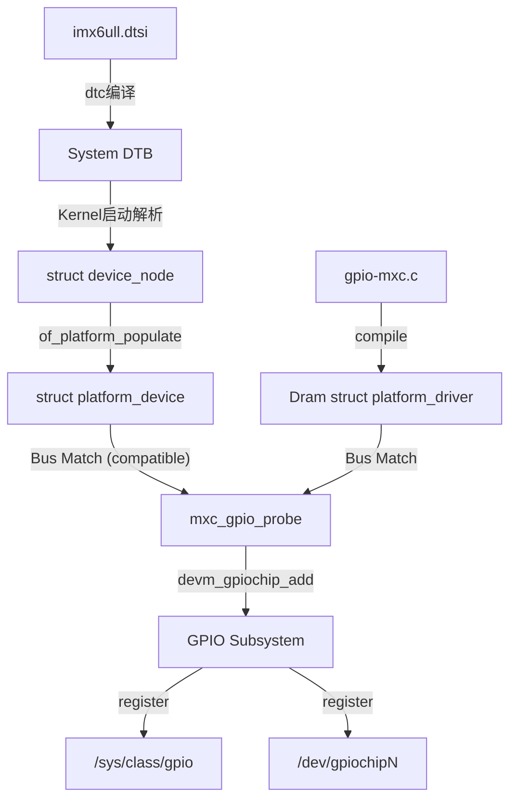

# 从 DTS 到 驱动绑定：GPIO 控制器实例化全流程

本文档深入剖析 IMX6ULL 平台上，GPIO 控制器节点如何从设备树（DTS）一步步转化为内核中的 `struct platform_device`，并最终与 `gpio-mxc` 驱动完成绑定。

## 1. 流程概览

1.  **DTS 编译**：`.dts` -> `.dtb` (Blob)。
2.  **启动解析**：内核启动时解析 DTB，生成 Device Tree Structure (`struct device_node`)。
3.  **设备实例化**：内核遍历节点，将根节点下的特定总线节点转换为 `struct platform_device`。
4.  **驱动注册**：`gpio-mxc.c` 注册 `struct platform_driver`。
5.  **匹配与探测**：总线匹配 `compatible` 字符串，调用 `probe` 函数。
6.  **VFS 呈现**：在 Sysfs 中生成设备层级。

## 2. 关键代码链分析

### 2.1 DTS 定义 (Source)
在 `imx6ull.dtsi` 中：
```dts
gpio1: gpio@0209c000 {
    compatible = "fsl,imx6ul-gpio", "fsl,imx35-gpio";
    reg = <0x0209c000 0x4000>;
    interrupts = <GIC_SPI 66 IRQ_TYPE_LEVEL_HIGH>, ...;
    gpio-controller;
    ...
};
```

### 2.2 设备实例化 (Kernel Core)
内核启动阶段，`of_platform_default_populate_init` (或其他 machine_init 调用) 会调用 `of_platform_populate`。
- **机制**：遍历 Device Tree 节点，为带有 `compatible` 属性且位于 System Bus 上的节点分配并注册 `struct platform_device`。
- **结果**：内存中生成了一个 `platform_device` 实例，其 `.dev.of_node` 指向对应的 DTS 节点。

### 2.3 驱动定义 (`drivers/gpio/gpio-mxc.c`)
```c
static const struct of_device_id mxc_gpio_dt_ids[] = {
    { .compatible = "fsl,imx35-gpio", .data = &mxc_gpio_devtype[IMX35_GPIO], },
    ...
};

static struct platform_driver mxc_gpio_driver = {
    .driver = {
        .name = "gpio-mxc",
        .of_match_table = mxc_gpio_dt_ids, // 关键：匹配表
    },
    .probe = mxc_gpio_probe,
};
```

### 2.4 绑定过程 (Matching)
1.  **Driver Register**：`subsys_initcall(gpio_mxc_init)` 注册驱动。
2.  **Match**：Platform Bus (`platform_bus_type`) 的 `match` 函数被调用。它会对比 `platform_device` 的 `of_node->compatible` 和 `platform_driver` 的 `of_match_table`。
3.  **Hit**：`"fsl,imx35-gpio"` 匹配成功。
4.  **Probe**：内核调用 `mxc_gpio_probe(pdev)`。

### 2.5 Probe 核心逻辑
`mxc_gpio_probe` 完成了从“通用平台设备”到“具体 GPIO 控制器”的蜕变：
1.  **资源获取**：
    - `platform_get_resource(pdev, IORESOURCE_MEM, 0)` 获取寄存器基地址 (0x0209c000)。
    - `devm_ioremap_resource` 映射为内核虚拟地址。
    - `platform_get_irq` 获取中断号。
2.  **硬件初始化**：
    - `clk_prepare_enable` 使能时钟。
    - 写入寄存器（如 `GPIO_IMR`, `GPIO_ISR`）复位硬件状态。
3.  **注册到 gpiolib**：
    - 初始化 `struct gpio_chip`。
    - 设置回调：`gc.request`, `gc.free`, `gc.direction_input`, etc.
    - 调用 `devm_gpiochip_add_data` 将其注册到内核 GPIO 子系统。

## 3. VFS 下的总线层级分析 (Live Dump Guide)

要在运行的系统上验证上述分析，可以通过以下路径进行“考古”：

### 3.1 查找 Platform Device
```bash
# 查看所有 gpio-mxc 驱动绑定的设备
ls -l /sys/bus/platform/drivers/gpio-mxc/
# 输出示例：
# 209c000.gpio -> ../../../../devices/soc0/soc/2000000.aips-bus/209c000.gpio
# 20a0000.gpio -> ...
```
这里 `209c000.gpio` 就是基于 DTS 里的 `reg` 属性生成的设备名。

### 3.2 查看 Device Tree 节点 (Firmware)
内核将解析后的 DTB 暴露在 sysfs 中：
```bash
cd /sys/firmware/devicetree/base/soc/aips-bus@02000000/gpio@0209c000
cat compatible
# 输出: fsl,imx6ul-gpiofsl,imx35-gpio
```

### 3.3 关联到 GPIO 子系统
```bash
ls -l /sys/class/gpio/
# 你会看到 gpiochipN 链接指向上述 platform device
# gpiochip0 -> ../../devices/soc0/soc/2000000.aips-bus/209c000.gpio/gpio/gpiochip0
```

## 4. 总结图解

