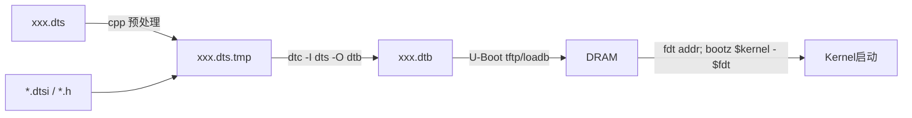

# DTS 编译与运行时调试链路

> [!note]
> **Ref:**
> - `sdk/.../Linux-4.9.88/scripts/Makefile.lib`
> - `sdk/.../Linux-4.9.88/arch/arm/boot/dts/Makefile`
> - `Documentation/devicetree/usage-model.txt`

## 1. 编译链路总览



要点:
- DTS 在 **kbuild** 内由 `cpp` 先做 C 预处理(展开 `#include`、`#define`),所以可以用 `<dt-bindings/...>` 头文件。
- 之后 `dtc` 把文本编译成扁平二进制 `dtb`。
- U-Boot 把 `dtb` 加载到内存,通过 ATAG/`r2` 寄存器把 `dtb` 物理地址传给 kernel。
- Kernel `start_kernel` 早期 `setup_machine_fdt()` 解析 `dtb`,挂到 `of_root`。

## 2. 在内核源码树中编译

```bash
source ~/imx/imx-env.sh                    # 设 ARCH/CROSS_COMPILE
cd ~/imx/sdk/100ask_imx6ull-sdk/Linux-4.9.88

make 100ask_imx6ull_defconfig
make dtbs                                  # 编译所有 dts
# 单文件:
make arch/arm/boot/dts/100ask_imx6ull-14x14.dtb
```

产物路径:`arch/arm/boot/dts/100ask_imx6ull-14x14.dtb`

`Makefile` 中按 `dtb-$(CONFIG_SOC_IMX6ULL) += 100ask_imx6ull-14x14.dtb` 注册,只有 defconfig 选中对应 SOC 才会被纳入 `make dtbs` 的批量构建。

## 3. 直接调用 dtc

```bash
# DTS → DTB
dtc -I dts -O dtb -o foo.dtb foo.dts

# 反汇编 DTB → DTS(看 dtsi 合并后的最终视图)
dtc -I dtb -O dts -o foo.dts.out arch/arm/boot/dts/100ask_imx6ull-14x14.dtb

# 静态校验 + 警告
dtc -W no-unit_address_vs_reg -I dts -O dtb foo.dts
```

`-I dtb -O dts` 反汇编是 **板卡上调试 DTS 的最快确认手段**:可以验证宏、引用、覆盖是否生效,得到的是真正会被 kernel 看到的视图。

## 4. U-Boot 中加载与切换

```text
=> tftp 0x83000000 zImage
=> tftp 0x84000000 100ask_imx6ull-14x14.dtb
=> setenv bootargs 'console=ttymxc0,115200 root=/dev/mmcblk1p2 rw'
=> bootz 0x83000000 - 0x84000000
```

调试期常用:
- `fdt addr 0x84000000; fdt print /chosen` 查看节点。
- `fdt set /chosen bootargs "..."` 临时改启动参数。
- `fdt rm /soc/aips-bus@02100000/usb@02184000` 临时禁外设排错。

## 5. 内核加载时机

| 阶段 | 函数 | 行为 |
|---|---|---|
| 早期 | `setup_machine_fdt` | 解析 `dtb` 头,选 machine,扫描 `memory`/`chosen`/`cpus` |
| arch 初始化 | `unflatten_device_tree` | 把扁平 `dtb` 转成内核中的 `device_node` 树 |
| `core_initcall` | `of_platform_default_populate_init` | 按 `compatible` 把节点实例化为 `platform_device` |
| 驱动 probe | `of_match_device` | 驱动 `of_match_table` 与节点 `compatible` 匹配后调用 `probe()` |

## 6. 运行时调试入口

### 6.1 `/sys/firmware/devicetree/base/`

完整 DT 节点视图,与 dtb 反汇编一致:

```bash
ls /sys/firmware/devicetree/base/
cat /sys/firmware/devicetree/base/model
hexdump -C /sys/firmware/devicetree/base/soc/aips-bus@02000000/i2c@021a4000/wm8960@1a/reg
```

### 6.2 `/proc/device-tree/`

`/sys/firmware/devicetree/base` 的旧符号链接,内容相同。

### 6.3 debugfs

挂载 debugfs 后(`mount -t debugfs none /sys/kernel/debug`):

| 路径 | 用途 |
|---|---|
| `/sys/kernel/debug/clk/clk_summary` | 时钟树状态(rate/parent/enable_count),验证 `assigned-clocks` 是否生效 |
| `/sys/kernel/debug/pinctrl/20e0000.iomuxc/pinmux-pins` | 每个 pad 当前的复用功能 |
| `/sys/kernel/debug/pinctrl/20e0000.iomuxc/pinconf-groups` | 每个 group 的电气配置码 |
| `/sys/kernel/debug/regulator/regulator_summary` | 稳压器拓扑与启用状态 |
| `/sys/kernel/debug/gpio` | GPIO 占用情况 |

### 6.4 `dmesg` 关键字

| 关键字 | 含义 |
|---|---|
| `OF: ...` | of 框架解析过程,语法/属性错误最先出现 |
| `Failed to apply prop` | 某个属性写法不合法 |
| `pinctrl ... not found` | `pinctrl-0` 引用了不存在的 group |
| `clk: ...` + `assigned-clocks` | 时钟分配失败 |

## 7. 调试套路示例

**问题**:加了一个 I2C 设备,probe 没被调用。

排查顺序:
1. `cat /sys/firmware/devicetree/base/.../wm8960@1a/compatible` —— 确认 dtb 中节点存在且 `compatible` 拼写正确。
2. `dmesg | grep i2c` —— 确认 `&i2c2` 控制器 probe 成功(`status="okay"`,pinctrl 正确)。
3. `i2cdetect -y 2` —— 确认硬件 ACK,排除接线/上拉问题。
4. 检查驱动 `of_match_table` 是否覆盖该 `compatible`。
5. 用 `dtc -I dtb -O dts` 反汇编整张 dtb,确认覆盖关系没被其它 `&i2c2` 块意外破坏。

## 8. 小结

- **编译期**靠 `dtc` 和反汇编验证 DTS 视图。
- **加载期**靠 U-Boot `fdt` 命令临时调整。
- **运行期**靠 `/sys/firmware/devicetree`、`debugfs/clk`、`debugfs/pinctrl`、`dmesg` 四件套定位 90% 的 DT 问题。

把这条链路打通,后续写新外设的 DTS 节点几乎可以「一次写对、一次启动成功」。
