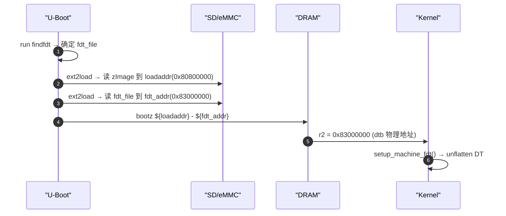
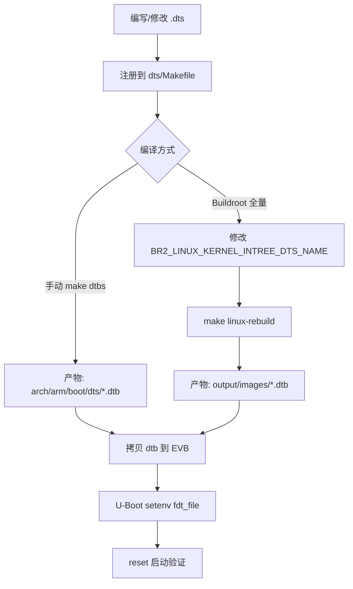

# 100ask EVB 工具链与自定义 DTS 合入内核镜像实操

> [!note]
> **Ref:**
> - `sdk/100ask_imx6ull-sdk/` — BSP 根目录
> - `sdk/100ask_imx6ull-sdk/Uboot-2017.03/include/configs/mx6ullevk.h` — U-Boot 启动环境变量
> - `sdk/100ask_imx6ull-sdk/Buildroot_2020.02.x/linux/linux.mk` — Buildroot 编译 dtb 逻辑
> - `note/DTS/mechanism/01-dtb-boot-delivery.md` — dtb 合入镜像的 4 条路径(前置阅读)

---

## 1. SDK 工具链全景

100ask IMX6ULL SDK 位于 `sdk/100ask_imx6ull-sdk/`，核心组件：

| 组件 | 路径 | 版本 / 说明 |
|------|------|-------------|
| **交叉编译器** | `ToolChain/arm-buildroot-linux-gnueabihf_sdk-buildroot/` | GCC 7.5.0 (Buildroot 2020.02) |
| **备用编译器** | `ToolChain/gcc-linaro-6.2.1-2016.11-x86_64_arm-linux-gnueabihf/` | Linaro GCC 6.2.1 |
| **Kernel** | `Linux-4.9.88/` | NXP BSP Linux 4.9.88 |
| **U-Boot** | `Uboot-2017.03/` / `Uboot-2018.03/` | 2017.03 为主力 |
| **Buildroot** | `Buildroot_2020.02.x/` | 2020.02，管理 rootfs + kernel + U-Boot 全链路 |

激活环境：

```bash
source ~/imx/imx-env.sh
# 设定:
#   KERN_DIR  = .../Linux-4.9.88
#   ARCH      = arm
#   CROSS_COMPILE = arm-buildroot-linux-gnueabihf-
#   PATH += .../ToolChain/.../bin
```

验证：

```bash
arm-buildroot-linux-gnueabihf-gcc --version   # 7.5.0
dtc --version                                  # 1.6.1 (系统 dtc)
```

---

## 2. 内核树中 DTS 的组织

```text
Linux-4.9.88/arch/arm/boot/dts/
├── imx6ull.dtsi                    ← SoC 级公共 dtsi
├── imx6ull-14x14-evk.dts           ← NXP 官方 EVK
├── 100ask_imx6ull-14x14.dts        ← 100ask Pro 板级 DTS
├── 100ask_imx6ull_mini.dts         ← 100ask Mini 板级 DTS
└── Makefile                        ← 控制哪些 dts 被编译成 dtb
```

`100ask_imx6ull-14x14.dts` 开头：

```c
/dts-v1/;
#include <dt-bindings/input/input.h>
#include "imx6ull.dtsi"

/ {
    model = "Freescale i.MX6 ULL 14x14 EVK Board";
    compatible = "fsl,imx6ull-14x14-evk", "fsl,imx6ull";
    ...
};
```

### 2.1 Makefile 注册

`arch/arm/boot/dts/Makefile` 中 `dtb-$(CONFIG_SOC_IMX6ULL)` 列表：

```makefile
dtb-$(CONFIG_SOC_IMX6ULL) += \
    ...
    100ask_imx6ull-14x14.dtb \
    100ask_imx6ull_mini.dtb \
    ...
```

**关键规则**：只有出现在此列表中的 `.dtb` 才会被 `make dtbs` 编译。新增自定义 DTS 必须在此处添加对应条目。

---

## 3. 自定义 DTS 并编译 dtb（手动方式）

### 3.1 新建或修改 DTS

```bash
cd $KERN_DIR/arch/arm/boot/dts

# 方式 A: 基于现有板级 DTS 复制
cp 100ask_imx6ull-14x14.dts my_custom_board.dts
# 编辑 my_custom_board.dts，修改节点

# 方式 B: 直接修改 100ask_imx6ull-14x14.dts
vim 100ask_imx6ull-14x14.dts
```

### 3.2 注册到 Makefile

如果新建了 DTS 文件，必须将 `.dtb` 加入 Makefile：

```makefile
#$KERN_DIR/arch/arm/boot/dts/makefile
dtb-$(CONFIG_SOC_IMX6ULL) += \
    ...
    100ask_imx6ull-14x14.dtb \
    my_custom_board.dtb \          # ← 新增
    ...
```

### 3.3 编译

```bash
source ~/imx/imx-env.sh
cd $KERN_DIR

# 仅编译 dtb（不重编内核）
make 100ask_imx6ull_defconfig      # 首次需要
make dtbs                          # 编译全部注册的 dtb
# 产物: arch/arm/boot/dts/my_custom_board.dtb

# 或单独编译指定 dtb
make arch/arm/boot/dts/my_custom_board.dtb
```

### 3.4 单独替换 dtb 到 EVB

100ask EVB 使用**路径 ①（独立文件）**启动，因此替换 dtb 不需要重编内核：

```bash
# 通过 NFS 挂载直接拷贝
cp arch/arm/boot/dts/my_custom_board.dtb ~/imx/prj/mount/

# 在 EVB 端
ssh imx
cp /mnt/my_custom_board.dtb /boot/

# 修改 U-Boot 环境变量（串口进 U-Boot）
=> setenv fdt_file my_custom_board.dtb
=> saveenv
=> reset
```

---

## 4. Buildroot 全链路编译（dtb 随 kernel 一起构建）

Buildroot `<evb>-defconfig` 中与 DTS 相关的关键配置：

```makefile
# --- Kernel ---
BR2_LINUX_KERNEL=y
BR2_LINUX_KERNEL_DEFCONFIG="100ask_imx6ull"
BR2_LINUX_KERNEL_DTS_SUPPORT=y
BR2_LINUX_KERNEL_INTREE_DTS_NAME="100ask_imx6ull-14x14 100ask_imx6ull_mini"

# --- U-Boot ---
BR2_TARGET_UBOOT=y
BR2_TARGET_UBOOT_BOARDNAME="mx6ull_14x14_evk"
BR2_TARGET_UBOOT_FORMAT_DTB_IMX=y
BR2_TARGET_UBOOT_NEEDS_DTC=y
```

### 4.1 `BR2_LINUX_KERNEL_INTREE_DTS_NAME` 工作机制

Buildroot `linux/linux.mk` 中：

```makefile
LINUX_DTS_NAME += $(call qstrip,$(BR2_LINUX_KERNEL_INTREE_DTS_NAME))
LINUX_DTBS = $(addsuffix .dtb,$(LINUX_DTS_NAME))
```

即把空格分隔的 DTS 名称列表展开为 `.dtb` 后缀，传给内核 `make dtbs`。

### 4.2 添加自定义 DTS 到 Buildroot 构建

**步骤 1**：在内核树 `arch/arm/boot/dts/` 添加 DTS + 注册 Makefile（同第 3 节）。

**步骤 2**：修改 Buildroot defconfig，添加 DTS 名称：

```bash
cd sdk/100ask_imx6ull-sdk/Buildroot_2020.02.x
# 在 configs/100ask_imx6ull_pro_ddr512m_systemV_core_defconfig 中修改：
BR2_LINUX_KERNEL_INTREE_DTS_NAME="100ask_imx6ull-14x14 100ask_imx6ull_mini my_custom_board"
```

**步骤 3**：重编

```bash
make 100ask_imx6ull_pro_ddr512m_systemV_core_defconfig
make linux-rebuild        # 仅重编内核 + dtbs
# 或
make                      # 全量构建（含 rootfs 打包）
```

产物位于 `output/images/`：

```text
output/images/
├── zImage
├── 100ask_imx6ull-14x14.dtb
├── my_custom_board.dtb        ← 新增
├── u-boot-dtb.imx
└── rootfs.tar
```

---

## 5. U-Boot 如何加载 dtb

`Uboot-2017.03/include/configs/mx6ullevk.h` 定义了启动环境变量：

```c
"fdt_file=100ask_imx6ull-14x14.dtb\0"    // 默认 dtb 文件名
"fdt_addr=0x83000000\0"                   // dtb 加载到 DRAM 的地址
"boot_fdt=try\0"                          // try = 有 dtb 则用，无则跳过
"loadfdt=ext2load mmc ${mmcdev}:${mmcpart} ${fdt_addr} ${bootdir}/${fdt_file}\0"
```

启动流程：



**切换自定义 dtb 只需**：

```text
=> setenv fdt_file my_custom_board.dtb
=> saveenv
```

---

## 6. 完整操作速查



| 场景 | 推荐方式 | 是否需重编内核 |
|------|----------|----------------|
| 调试期频繁改 DTS | 手动 `make dtbs` + NFS 替换 | 否 |
| 新增板级 DTS 文件 | 内核 Makefile 注册 + `make dtbs` | 否 |
| 发布完整 BSP 镜像 | Buildroot 全量 `make` | 是（随 kernel 一起） |
| 切换已编译的 dtb | U-Boot `setenv fdt_file` | 否 |

---

## 7. 关联阅读

- dtb 合入镜像的 4 条路径 → `mechanism/01-dtb-boot-delivery.md`
- 板级公共设备节点 → `Bindings/05-imx6ull-common-devices.md`
- pinctrl 与复用 → `Usage/05-pinctrl-and-mux.md`
