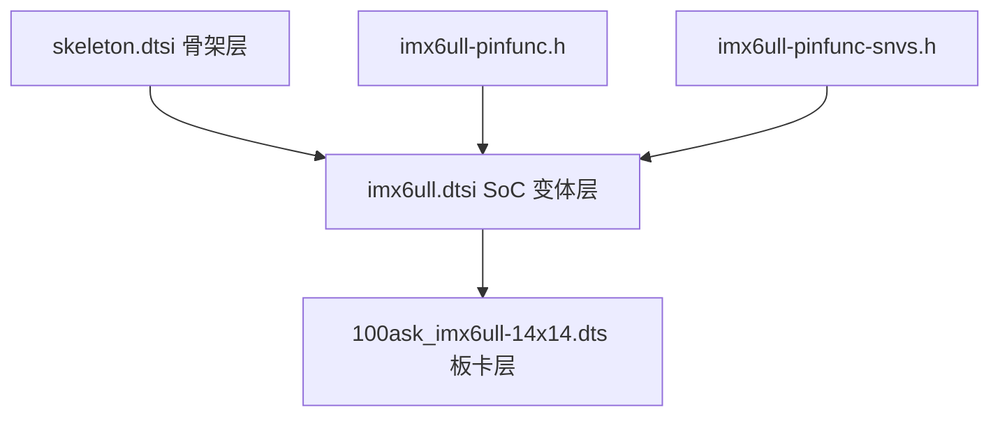

# 100ask_imx6ull-14x14 板卡 DTS 分层分析

> [!note]
> **Ref:**
> - `sdk/100ask_imx6ull-sdk/Linux-4.9.88/arch/arm/boot/dts/100ask_imx6ull-14x14.dts`
> - `sdk/100ask_imx6ull-sdk/Linux-4.9.88/arch/arm/boot/dts/imx6ull.dtsi`
> - `sdk/100ask_imx6ull-sdk/Linux-4.9.88/arch/arm/boot/dts/imx6ull-14x14-evk.dts` (vendor 对照)

本文聚焦 100ask EVB 实际入栈的板卡 DTS,梳理「骨架 → SoC 变体 → 引脚宏 → 板卡」四层组合,并指出相对 NXP 参考板的取舍。

## 1. 包含与覆盖链

要点:
- `imx6ull.dtsi` 与 `imx6ul.dtsi` 是 **分叉** 关系而非继承,ULL 单独维护一份,新增 900 MHz OPP 与 SNVS pad。
- 板卡层使用 `&phandle { ... }` 覆盖核心节点,默认 `disabled` 的外设在此被点亮。
- `compatible = "fsl,imx6ull-14x14-evk", "fsl,imx6ull"` (`100ask_imx6ull-14x14.dts:16`) 沿用 NXP machine 字符串,因此 100ask 不需要新增 board file,只靠 DT 改造硬件视图。

## 2. 各层职责

| 层 | 文件 | 贡献 |
|---|---|---|
| L1 骨架 | `skeleton.dtsi` | root `#address/size-cells`、空 `chosen/aliases/memory` (deprecated, 仍兼容) |
| L2 SoC 变体 | `imx6ull.dtsi` | `cpu@0` Cortex-A7、GICv2 `@0x00a01000`、`clks`、aliases、所有外设 core 节点(默认 `disabled`) |
| L3 引脚宏 | `imx6ull-pinfunc.h` / `-snvs.h` | `MX6UL_PAD_*` 宏 → `<mux_reg conf_reg input_reg mux_mode input_val>` 五元组常量 |
| L4 板卡 | `100ask_imx6ull-14x14.dts` (927 行) | 顶层新增节点 + `&phandle` 覆盖 + `iomuxc` pin groups |

## 3. 板卡层关键内容

### 3.1 顶层新增节点

| 节点 | 行 | 说明 |
|---|---|---|
| `chosen.stdout-path` | 18-20 | 调试串口指向 `&uart1` |
| `memory` | 22-24 | `0x80000000 + 0x20000000` → 512 MB DDR |
| `reserved-memory.linux,cma` | 26-37 | 320 MB CMA 池(供 LCDIF/PXP/V4L2 使用) |
| `backlight` | 39-45 | PWM1 @ 1 kHz, 9 级亮度(0-8) |
| `regulators` | 52-99 | `reg_can_3v3` / `reg_usb_ltemodule` / `reg_gpio_wifi` 三个固定稳压器 |
| `gpio-keys` | - | USER1(SNVS_TAMPER1=GPIO5_IO01)、USER2(GPIO4_IO14) |
| `sound` (WM8960) | - | 绑 `&sai2`,hp-det 注释关闭 |
| `spi4` (gpio-spi) | - | bit-bang + 74HC595 GPIO 扩展, 10 kHz |
| `sii902x_reset` | - | HDMI bridge 复位 GPIO |
| `leds` | - | 默认 `disabled` |

### 3.2 `&phandle` 覆盖外设

| 节点 | 关键改动 |
|---|---|
| `&fec1` / `&fec2` | 双以太网,reset GPIO5_IO09 / IO06,MDIO 总线挂在 fec2 下,phy@0 / phy@1 |
| `&usdhc1` / `&usdhc2` | SD 卡 4-bit / eMMC 8-bit |
| `&lcdif` | 1024×600 @ 50 MHz, 24-bit RGB, reset GPIO3_IO04 |
| `&i2c2` | + sii902x HDMI bridge `@0x39`,+ Goodix GT9xx 触摸屏 `@0x5d`(三组 cfg-group 对应 7"/4.3"/5") |
| `&sai2` | I2S 接 WM8960 |
| `&tsc` | 4-wire 电阻屏 |
| `&flexcan1` | 启用,vref `reg_can_3v3` |
| `&adc1` / `&pwm1` / `&pxp` / `&ecspi1/3` / `&uart1/3/6` / `&usbotg1/2` | 启用 |
| `&gpmi` | `disabled` (100ask 板卡无 NAND) |

### 3.3 `&iomuxc` / `&iomuxc_snvs`

40+ pinctrl 组定义在板卡末尾,为每个启用的外设提供 pad 复用与电气配置;`&iomuxc_snvs` 单独管理 SNVS 域 pad(TAMPER 系列),用于按键、LED、网卡 reset、tsc reset、spi4 等。pad 配置码(如 `0x1b0b0`)解析见 `Usage/05-pinctrl-and-mux.md`。

## 4. vs NXP `imx6ull-14x14-evk.dts`

| 项目 | Vendor EVK | 100ask | 含义 |
|---|---|---|---|
| DVFS | `reg_gpio_dvfs` 接 `cpu0.dc-supply` | 无 | 100ask 不做动态调压 |
| CAN | CAN1 + CAN2 | 仅 CAN1 | 引脚被 LCD/触摸占用 |
| 摄像头 | OV5640 (CSI) | 移除 | 板卡未引出 CSI |
| 传感器 | mag3110 + fxls8471 (I2C1) | 移除 | - |
| 显示 | 未定义 timing | 1024×600 RGB + sii902x HDMI | 出厂带 LCD |
| 触摸 | 无 | Goodix GT9xx (3 组 cfg) | 适配多尺寸屏 |
| 电源轨 | sd1_vmmc | usb_ltemodule(3.8 V) + gpio_wifi(3.3 V) | 支持 4G/WiFi 模组 |
| SPI4 速率 | 100 kHz | 10 kHz | 保守提高可靠性 |
| 按键 / LED | 无 | USER1/2 + 1 LED | - |
| 行数 | 750 | 927 | +177(主要 GT9xx + LCD) |

## 5. 阅读路径建议

1. 先看 `imx6ull.dtsi` 的 aliases / clks / 各 controller 节点 → 建立 SoC 视角。
2. 再看 `100ask_imx6ull-14x14.dts` 顶层新增节点 → 理解整机硬件清单。
3. 最后看 `&phandle` 覆盖与 `&iomuxc` pin groups → 理解每个外设的 enable 路径与 pin mux。
4. 与 vendor `imx6ull-14x14-evk.dts` `diff` → 看清 100ask 的取舍。
