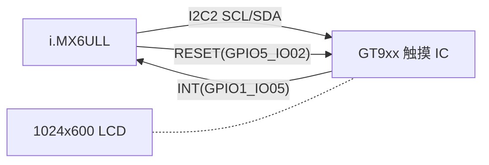

# Goodix GT9xx I2C 电容触摸屏 DTS 案例

> [!note]
> **Ref:**
> - `100ask_imx6ull-14x14.dts` `&i2c2.gt9xx`
> - `Documentation/devicetree/bindings/input/touchscreen/goodix.txt` (同系列)
> - Goodix GT9xx Programming Guide

## 1. 硬件链路



GT9xx 的 I2C 地址由 **RESET 释放瞬间 INT 引脚的电平** 决定:
- INT=低 → I2C addr = `0x5d`
- INT=高 → I2C addr = `0x14`

100ask 选择 `0x5d`,因此驱动复位时序必须先把 INT 拉低,再释放 RESET。

## 2. DTS 范例(精简)

```dts
&i2c2 {
    clock-frequency = <100000>;
    pinctrl-0 = <&pinctrl_i2c2>;
    status = "okay";

    gt9xx: gt9xx@5d {
        compatible = "goodix,gt9xx";
        reg = <0x5d>;

        interrupt-parent = <&gpio1>;
        interrupts = <5 IRQ_TYPE_EDGE_FALLING>;
        irq-gpios   = <&gpio1 5 0>;
        reset-gpios = <&gpio5 2 0>;

        /* 多尺寸面板:三组固件配置 */
        goodix,cfg-group0 = [ /* 7"  屏配置字节流 ... */ ];
        goodix,cfg-group1 = [ /* 4.3" 屏配置字节流 ... */ ];
        goodix,cfg-group2 = [ /* 5"  屏配置字节流 ... */ ];
    };
};
```

## 3. 关键属性解释

| 属性 | 作用 |
|---|---|
| `compatible = "goodix,gt9xx"` | 100ask 自带 vendor 驱动匹配字符串(社区主线为 `goodix,gt911`) |
| `reg = <0x5d>` | I2C 7-bit 地址 |
| `interrupt-parent` + `interrupts` | 走标准 of_irq 路径,touch IC 触摸时驱动 ISR 启动 |
| `irq-gpios` | 同一根 GPIO 同时作为 **中断脚** 和 **复位时序辅助脚**;驱动会在 reset 期间把它当 GPIO 使用,reset 完成后切回 IRQ |
| `reset-gpios` | 上电时先拉低 ≥10 ms,再拉高,触发 GT9xx 进入正常模式 |
| `goodix,cfg-group0..N` | 出厂校准/坐标参数固件,**字节流**形式直接存进 DTS,驱动用 `of_property_read_u8_array` 读取后写入 GT9xx 寄存器 0x8047~ |

## 4. 多尺寸切换思路

100ask 把 7" / 4.3" / 5" 三套 cfg 都塞进 DTS,**驱动启动时根据某种匹配条件**(常见是读 LCD ID 或 module-id GPIO)选其中一组下发。优势:

- 单一 dtb 适配多种屏幕,产线刷机成本低。
- 屏幕厂家每次微调坐标范围只需要替换 `goodix,cfg-groupN` 字节流,DTS 之外不用动驱动代码。

劣势:DTS 体积变大(每组约 180 字节),并且驱动需要私有逻辑选 group。主线 goodix 驱动更倾向把 cfg 作为 firmware 文件由 `request_firmware()` 加载,二者各有取舍。

## 5. 复位时序细节

```
VCC ┐
     └────────────────────────────
RESET ─ ─ ─ ─ ─┐         ┌────────
              └─────────┘
INT   ─ ─ ─ ─ ┐ (低=0x5d) ┌──IRQ──
              └──────────┘
              <──10 ms──><─50 ms─>
              ▲          ▲
              释放前先   配置写完
              INT 设方向 后才允许
              并拉低     上报中断
```

驱动大致流程:
1. 申请 `irq-gpios` / `reset-gpios` 为 GPIO output。
2. RESET=低 ≥ 10 ms → INT=低 → RESET=高 → 等待 ≥ 50 ms。
3. 把 `irq-gpios` 切换为 input,作为 IRQ 输入。
4. 通过 I2C 把选中的 `cfg-groupN` 写入 GT9xx 寄存器。
5. 注册 input device 与 IRQ handler。

## 6. 排错清单

| 现象 | 排查 |
|---|---|
| `i2cdetect -y 1` 看不到 0x5d / 0x14 | reset 时序 INT 电平不对;`reset-gpios`/`irq-gpios` GPIO 号写反 |
| 触摸坐标全部偏移或翻转 | `cfg-groupN` 与实际屏幕方向不匹配,或者驱动选错 group |
| 触摸偶发不报点 | `interrupts` 用了 `LEVEL_LOW` 而硬件实际是 `EDGE_FALLING`,或者中断被去抖丢失 |
| 烧机后失效 | GT9xx FLASH 模式被误进入,确认 reset 时序顺序 |

## 7. 小结

GT9xx 案例展示了 I2C 触摸 IC 在 DTS 层的三个典型问题:**地址由复位时序决定**、**reset 与 irq 共享 GPIO**、**固件参数内嵌 DTS**。把这三点理顺,大多数 I2C 触摸/传感器 IC 的 DTS 写法都可以套用。
