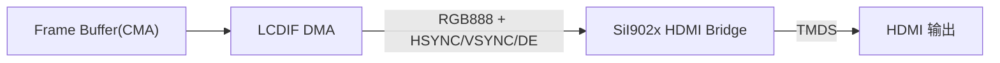

# LCDIF + RGB 屏 display-timings 案例

> [!note]
> **Ref:**
> - `100ask_imx6ull-14x14.dts` `&lcdif` 节点
> - `Documentation/devicetree/bindings/display/mxsfb.txt`
> - `Documentation/devicetree/bindings/display/panel/display-timing.txt`

## 1. LCDIF 在 IMX6ULL 中的角色

LCDIF (LCD Interface Controller) 是 i.MX 系列的 **并行 RGB 输出控制器**,直接驱动 TTL/LVDS bridge,带 DMA frame buffer。100ask 板把 LCDIF 通过 SiI902x bridge 转 HDMI,但 LCDIF 看到的依然是「定时严格的 1024×600 RGB 面板」。



## 2. DTS 范例

```dts
&lcdif {
    pinctrl-names = "default";
    pinctrl-0 = <&pinctrl_lcdif_dat
                 &pinctrl_lcdif_ctrl>;
    display = <&display0>;
    status = "okay";

    display0: display@0 {
        bits-per-pixel = <16>;
        bus-width = <24>;

        display-timings {
            native-mode = <&timing0>;
            timing0: timing0 {
                clock-frequency = <51200000>;
                hactive      = <1024>;
                vactive      = <600>;
                hfront-porch = <160>;
                hback-porch  = <140>;
                hsync-len    = <20>;
                vfront-porch = <12>;
                vback-porch  = <20>;
                vsync-len    = <3>;
                hsync-active    = <0>;
                vsync-active    = <0>;
                de-active       = <1>;
                pixelclk-active = <0>;
            };
        };
    };
};
```

## 3. 字段语义

| 字段 | 含义 | 与硬件手册的对应 |
|---|---|---|
| `clock-frequency` | 像素时钟(Hz) | DCLK frequency,本例 51.2 MHz |
| `hactive` / `vactive` | 可视像素 | 1024×600 |
| `hfront-porch` | 行尾消隐(active → hsync) | DCLK 数 |
| `hsync-len` | 行同步脉冲宽度 | DCLK 数 |
| `hback-porch` | 行首消隐(hsync → next active) | DCLK 数 |
| `vfront/back-porch` | 帧消隐 | 行数 |
| `vsync-len` | 场同步脉冲宽度 | 行数 |
| `hsync-active` / `vsync-active` | 同步脉冲极性,`0`=低有效, `1`=高有效 | - |
| `de-active` | DE 信号极性,`1`=高有效 | - |
| `pixelclk-active` | 像素时钟边沿,`0`=下降沿采样, `1`=上升沿采样 | - |

总行/总列由 LCDIF 驱动自动计算:
```
htotal = hactive + hfront-porch + hsync-len + hback-porch = 1024+160+20+140 = 1344
vtotal = vactive + vfront-porch + vsync-len + vback-porch = 600 +12 +3  +20 = 635
refresh ≈ clock-frequency / (htotal × vtotal) = 51.2 MHz / (1344×635) ≈ 60 Hz
```

## 4. `bits-per-pixel` vs `bus-width`

- `bits-per-pixel = 16`:**帧缓冲格式** RGB565,DMA 节省一半带宽。
- `bus-width = 24`:**LCDIF 输出脚** 24 根并行(R[7:0]/G[7:0]/B[7:0]),驱动会把 RGB565 自动展开为 RGB888 输出。
- 二者不必相等;若改为 `bpp=24` 则 framebuffer 翻倍,适合需要色阶平滑的场景。

## 5. 排错清单

| 现象 | 原因 / 检查 |
|---|---|
| 黑屏 | 像素时钟未配置(查 `clk_summary`);`pinctrl_lcdif_*` 没引用;background light 没开 |
| 画面整体偏移 | porch 与手册不一致;`hsync-len` 极性反 |
| 闪烁/撕裂 | `pixelclk-active` 边沿选错;DCLK 频率边界(超出 LCDIF 上限) |
| 颜色错乱 | `bus-width` 与 bridge 输入不符;RGB 通道接线反 |
| HDMI 无信号 | sii902x 控制 I2C 没注册;`reset-gpios` 未拉脚;sii902x 输出格式与 timing 不兼容 |

## 6. 与 vendor 的差异

NXP `imx6ull-14x14-evk.dts` **不内嵌 display-timings**,默认依赖 EDID 或 vendor 默认 fb_videomode,因此 vendor 板上 sii902x 通过 EDID 协商。100ask 反过来 **写死 1024×600**,屏蔽 EDID 抖动,保证产线一致性。如要切换屏幕尺寸,只需要在板卡 DTS 中替换 `timing0` 的 8 个数值即可,无需修改 LCDIF/sii902x 驱动。
