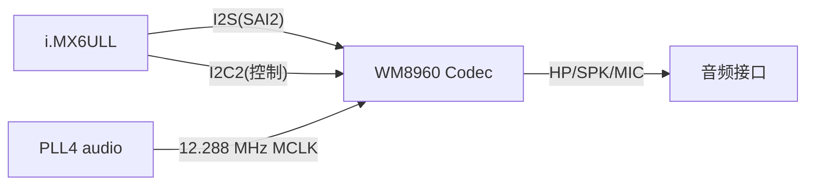

# SAI2 + WM8960 音频链路 DTS 案例

> [!note]
> **Ref:**
> - `100ask_imx6ull-14x14.dts` (`sound`、`&sai2`、`&i2c2.codec`)
> - `Documentation/devicetree/bindings/sound/imx-audio-wm8960.txt`
> - `Documentation/devicetree/bindings/sound/fsl-sai.txt`

## 1. 物理链路



- **数据通路**: SAI2 ↔ WM8960 I2S 引脚 (BCLK / LRCLK / TX / RX)
- **控制通路**: I2C2 总线访问 WM8960 寄存器 `@0x1a`
- **时钟通路**: PLL4_AUDIO → SAI2 root clock → WM8960 MCLK

## 2. 三段 DTS

### 2.1 codec @ I2C2

```dts
&i2c2 {
    codec: wm8960@1a {
        compatible = "wlf,wm8960";
        reg = <0x1a>;
        clocks = <&clks IMX6UL_CLK_SAI2>;
        clock-names = "mclk";
        wlf,shared-lrclk;
    };
};
```

- `clocks`/`clock-names` 让 codec 驱动从 CCM 直接拿到 MCLK 频率(供其内部分频计算)。
- `wlf,shared-lrclk` 适配 WM8960 的 TX/RX 共享 LRCLK 模式。

### 2.2 SAI2 控制器

```dts
&sai2 {
    pinctrl-names = "default";
    pinctrl-0 = <&pinctrl_sai2>;

    assigned-clocks = <&clks IMX6UL_CLK_SAI2_SEL>,
                      <&clks IMX6UL_CLK_SAI2>;
    assigned-clock-parents = <&clks IMX6UL_CLK_PLL4_AUDIO_DIV>;
    assigned-clock-rates = <0>, <12288000>;

    status = "okay";
};
```

- `assigned-clocks` 在驱动 probe 之前,由 of_clk 框架强制设置 mux/rate,**保证 MCLK 稳定为 12.288 MHz**(48 kHz × 256 fs)。
- `<0>` 表示对应 clock 的 rate 不变,只切换 parent。
- pinctrl 组覆盖 SAI2 的 MCLK / TX_BCLK / TX_SYNC / TX_DATA / RX_DATA 五脚,见 `pinctrl_sai2`。

### 2.3 ASoC machine 节点

```dts
sound {
    compatible = "fsl,imx-audio-wm8960";
    model = "wm8960-audio";
    cpu-dai = <&sai2>;
    audio-codec = <&codec>;
    asrc-controller = <&asrc>;     /* 可选,采样率转换 */
    codec-master;                  /* WM8960 作主,SAI 作从 */
    audio-routing =
        "Headphone Jack", "HP_L",
        "Headphone Jack", "HP_R",
        "Ext Spk",        "SPK_LP",
        "Ext Spk",        "SPK_LN",
        "LINPUT1",        "Mic Jack",
        "Mic Jack",       "MICB";
    /* hp-det = <3 0>;  // 100ask 板未引出耳机检测脚,关闭 */
};
```

- `cpu-dai` + `audio-codec` 通过 phandle 把 SAI 与 codec 关联,**这是 ASoC machine driver 唯一的拼接点**。
- `audio-routing` 是 DAPM 路径,左右两列分别是 sink → source widget 名,必须与 codec 驱动内部 widget 名严格一致。
- `codec-master` 决定 BCLK/LRCLK 由 codec 还是 CPU 提供;100ask 让 WM8960 主时钟,SAI 跟随。

## 3. 调试要点

| 现象 | 排查 |
|---|---|
| `aplay` 无声但无报错 | 检查 `audio-routing`,确保 `Headphone Jack` / `Ext Spk` 在 codec widget 列表中存在;`amixer` 打开对应 mixer |
| MCLK 频率不对(播放变速) | `cat /sys/kernel/debug/clk/sai2/clk_rate` 验证是否 12.288 MHz;查看 `assigned-clock-rates` |
| I2C 读不到 codec | 检查 `&i2c2 status="okay"`、wm8960 上电时序、`reg=0x1a` 是否与硬件 `CSB` 引脚一致 |
| 录音底噪大 | `LINPUT1` 路由 + `MICB` 偏置是否正确;参考板有去耦电容 |

## 4. 与 vendor 的差异

NXP `imx6ull-14x14-evk.dts` 在 `sound` 节点中**启用** `hp-det`(GPIO 检测耳机插入),100ask 因硬件未引出该脚,**显式注释**该属性,避免驱动一直认为耳机不存在导致 DAPM 切错路径。
