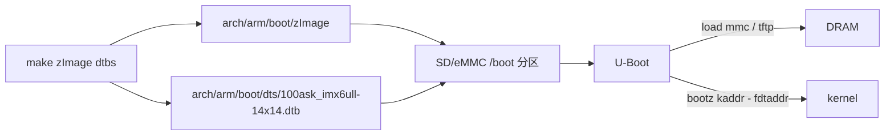

# dtb 合入启动镜像与传递给 kernel 的 4 条路径

> [!note]
> **Ref:**
> - `Documentation/arm/Booting`
> - `arch/arm/boot/compressed/head.S`(`r2 = dtb 物理地址`)
> - `drivers/of/fdt.c` (`early_init_dt_verify`)

dtb 从「编译产物」到「kernel 看到」之间存在 **4 条独立链路**,理解全景才知道每条路径的取舍以及 100ask EVB 选了哪一条。

## 0. 共同入口

无论走哪条路径,kernel `head.S` 早期约定:
- ARM32 ABI:`r0=0`, `r1=machine id`(可忽略),`r2 = dtb 物理地址`
- ARM64 ABI:`x0 = dtb 物理地址`

随后 `setup_machine_fdt()` → `early_init_dt_verify()` 校验魔数 `0xd00dfeed`。**4 条路径的差异只在"谁、在哪一步、把 dtb 放到那块物理内存并把地址写进寄存器"**。

## 1. 独立文件,bootloader 显式加载(100ask 现状)



> [!note]
>
> 这种独立文件 u-boot模式下，在evb 的 RTFS 就绪后 ， 在板上修改存储器的的`/boot`分区，替换启动dtb是可行的。 （Linux驱动开发的经典范式）
>
> ```bash
> # 通过 NFS 挂载直接拷贝
> cp arch/arm/boot/dts/my_custom_board.dtb ~/imx/prj/mount/
> 
> # 在 EVB 端
> ssh imx
> cp /mnt/my_custom_board.dtb /boot/
> 
> # 修改 U-Boot 环境变量（串口进 U-Boot）
> => setenv fdt_file my_custom_board.dtb
> => saveenv
> => reset
> ```


U-Boot 命令:

```text
=> load mmc 1:1 0x83000000 zImage
=> load mmc 1:1 0x84000000 100ask_imx6ull-14x14.dtb
=> bootz 0x83000000 - 0x84000000
              ^kernel  ^initrd  ^dtb
```

`bootz` / `booti` / `bootm` 第三个参数即 dtb 物理地址,U-Boot 把它写进 `r2`。

| 优 | 缺 |
|---|---|
| dtb 与 kernel 解耦,换板子只换 dtb | bootloader 必须知道 dtb 路径与加载地址 |
| 调试期可单独替换 dtb | 文件多,需要 boot 脚本管理 |


## 2. dtb 与 zImage 拼接(`CONFIG_ARM_APPENDED_DTB`)

```bash
cat arch/arm/boot/zImage arch/arm/boot/dts/foo.dtb > zImage-dtb
```

- decompressor (`arch/arm/boot/compressed/head.S`) 在 zImage 末尾按魔数 `0xd00dfeed` 嗅探 dtb,自动解压并把地址塞进 `r2`。
- bootloader 像加载老的 ATAG kernel 一样只 `bootz $addr`,**完全不感知 dtb**。
- kbuild 快捷:`CONFIG_ARM_APPENDED_DTB=y` + `CONFIG_BUILD_ARM_APPENDED_DTB_IMAGE=y` + `CONFIG_BUILD_ARM_APPENDED_DTB_IMAGE_NAMES="100ask_imx6ull-14x14"`,产物 `arch/arm/boot/zImage-dtb`。

| 优 | 缺 |
|---|---|
| 兼容只懂 ATAG 的旧 bootloader | 换 dtb 必须重拼 |
| 单文件部署 | 主线趋势是淘汰这种用法,不建议新项目使用 |

## 3. 打包进 FIT image(U-Boot `bootm`)

FIT(Flattened Image Tree)用一个 `image.its` 描述 kernel/dtb/ramdisk/签名:

```text
/dts-v1/;
/ {
    images {
        kernel-1 { data = /incbin/("zImage");   ... };
        fdt-1    { data = /incbin/("100ask.dtb"); ... };
        fdt-2    { data = /incbin/("variant-b.dtb"); ... };
    };
    configurations {
        default = "conf-1";
        conf-1 { kernel = "kernel-1"; fdt = "fdt-1"; };
        conf-2 { kernel = "kernel-1"; fdt = "fdt-2"; };
    };
};
```

```bash
mkimage -f image.its image.itb
```

U-Boot:`bootm $addr#conf-1`,自动选 dtb。

| 优 | 缺 |
|---|---|
| **多板共用一个镜像**(多 `conf-X`) | 镜像生成与脚本更复杂 |
| 支持哈希/签名校验 → secure boot 首选 | bootloader 必须支持 FIT |
| 可携带多个 ramdisk 与配置组合 | - |

## 4. 直接编入 vmlinux 段(`CONFIG_OF_EMBED`)

`drivers/of/Kconfig` 提供 `CONFIG_OF_EMBED`:把指定 dtb 作为符号 `__dtb_xxx_start` 链接进 vmlinux。kernel 启动时直接用内嵌 dtb。

| 优 | 缺 |
|---|---|
| 真·单一 ELF,无需 bootloader 关心 dtb | **主线明确写"do not enable for production"** |
| 调试 / QEMU 轻量启动方便 | 换板子需重编内核 |

## 5. 路径对比速查

| 路径 | dtb 位置 | bootloader 是否感知 dtb | 主要场景 |
|---|---|---|---|
| ① 独立文件 | 单独 dtb 文件 | 是 | 通用嵌入式量产、开发板 |
| ② appended | 拼接在 zImage 末尾 | 否 | 兼容旧 bootloader |
| ③ FIT | itb 容器内的子段 | 是,需支持 FIT | secure boot、多 variant |
| ④ OF_EMBED | vmlinux ELF 段 | 否 | 调试 / 仿真 |

## 6. 100ask EVB 现状

- **路径**:① 独立文件
- 启动介质:SD/eMMC boot 分区
- 关键 U-Boot 环境变量:
  ```text
  bootcmd = run findfdt; ... ; bootz ${loadaddr} - ${fdt_addr}
  fdt_addr = 0x83000000
  loadaddr = 0x80800000
  ```
- 切换板卡时直接替换 SD 分区中的 `.dtb` 即可,内核 `zImage` 不需重编。
- 该路径与 overlay **不冲突**:若日后启用 cape 类扩展,推荐在 U-Boot 阶段用 `fdt apply` 把 dtbo 合并到独立 dtb 上(详见 `Overlays/03-dtso-runtime-loading.md`)。

## 7. 关联阅读

- 运行时动态修改 DT → `Overlays/01-dt-overlays.md`、`Overlays/03-dtso-runtime-loading.md`
- 板卡级 dtb 编译细节与调试命令 → `evb/dts-build-and-debug.md`
- DT 在 kernel 中的解析与 unflatten → `Usage/01-linux-and-devicetree.md`
