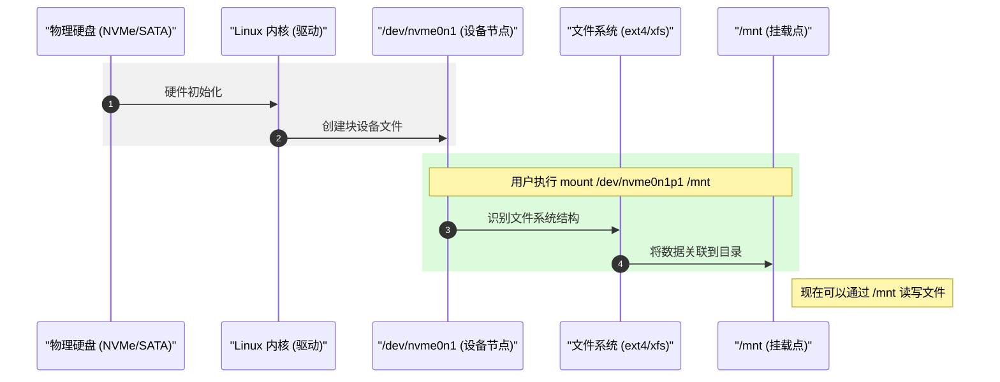

# 存储设备 (NVMe/SDA) 与挂载点 (MNT) 的区别

> [!note]
> **Ref:** [Linux Storage Stack](https://www.kernel.org/doc/html/latest/block/index.html), FHS Standard.

## 1. 概念层级对照

在 Linux 中，访问存储数据需要经过：**物理硬件 -> 内核驱动 -> 设备节点 -> 文件系统挂载**。

| 概念 | 示例 | 类别 | 角色 |
| :--- | :--- | :--- | :--- |
| **NVMe 设备** | `/dev/nvme0n1` | 硬件命名 | 走 **PCIe 总线** 的高速固态硬盘。 |
| **SDA 设备** | `/dev/sda` | 硬件命名 | 走 **SATA/SCSI 总线** 的机械硬盘或 SSD。 |
| **挂载点** | `/mnt` | 逻辑路径 | 目录树中的一个**位置**，用于访问设备中的数据。 |

## 2. /dev/nvme* vs /dev/sda (硬件接口差异)

这是两种不同的硬件协议在内核中的命名表现：

### /dev/sda (SCSI/SATA/USB)
- **名称含义**: `sd` 代表 **S**CSI **D**isk。
- **物理接口**: SATA 接口、SAS 接口或通过 USB 连接的外部硬盘。
- **协议**: 使用较老的 AHCI 或 SCSI 协议。
- **分区表示**: `/dev/sda1`, `/dev/sda2`。

### /dev/nvme0n1 (NVMe)
- **名称含义**: **N**on-**V**olatile **M**emory **e**xpress。
- **物理接口**: M.2 (NVMe)、U.2 或 PCIe 插卡。
- **协议**: 专为闪存设计的 NVMe 协议，支持高并发队列，速度远快于 SATA。
- **命名规则**:
    - `nvme0`: 第 0 号控制器。
    - `n1`: 第 1 个命名空间 (Namespace，逻辑上相当于整块物理盘)。
    - `p1`: 第 1 个分区 (例如 `/dev/nvme0n1p1`)。

## 3. /dev/* vs /mnt (设备与入口的区别)

这是 **"设备文件"** 与 **"文件夹"** 的本质区别：

- **`/dev/sda` 是 "门" 本身**:
    - 它是一个特殊文件，代表硬件设备。
    - 你不能直接 `cd /dev/sda`，因为它是二进制块设备流。
    - **如果你直接往里面写数据，会破坏分区表和文件系统！**

- **`/mnt` 是 "门后的房间"**:
    - 它只是根文件系统中的一个普通**目录**。
    - 只有当执行了 `mount` 命令后，这个目录才成了访问设备数据的“入口”。

## 4. 总结

1. **NVMe 和 SDA** 的区别在于**快不快**（接口协议不同）。
2. **Device (/dev) 和 Mount (/mnt)** 的区别在于**能不能直接看**（物理设备 vs 逻辑入口）。
3. **日常操作**: 我们通过 `/dev/nvme*` 识别硬盘，通过 `mount` 将其映射到 `/mnt` 或 `/data`，最后在挂载点读写文件。
