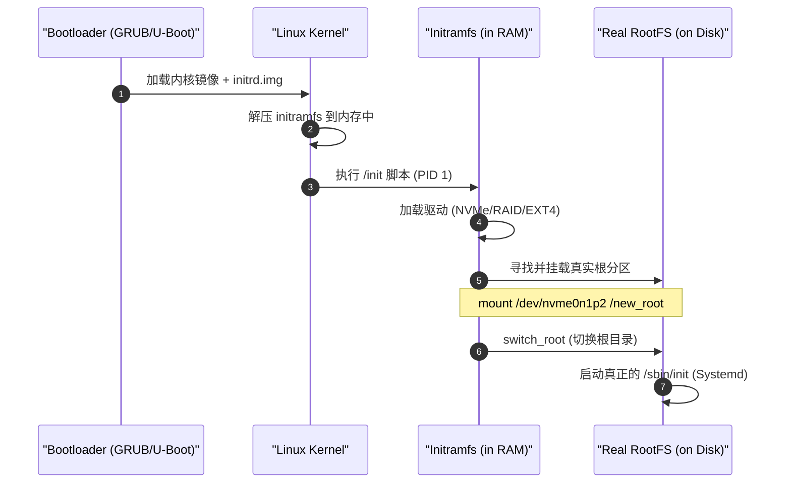

# Initramfs 深度解析

> [!note]
> **Ref:** [Kernel Docs: ramfs-rootfs-initramfs](https://www.kernel.org/doc/Documentation/filesystems/ramfs-rootfs-initramfs.txt), Local system `/boot` content.


## 1. 为什么需要 Initramfs？ (核心矛盾)

当内核启动时，它需要挂载磁盘上的 **真实根文件系统 (RootFS)**。但这里存在一个逻辑死循环：
1. **矛盾点**: 硬盘（如 NVMe, RAID, USB）的驱动程序通常存放在根文件系统的 `/lib/modules` 下。
2. **死循环**: 内核必须先挂载根文件系统才能读取驱动，但没有驱动就无法读取硬盘来挂载根文件系统。

**Initramfs 的作用就是打破这个循环**：**它是一个随内核一起加载到内存的小型文件系统，包含了挂载真实硬盘所需的“最小驱动集”和脚本。(busybox)**


## 2. 启动流程：从内存到磁盘




## 3. Initramfs 的本质

- **文件格式**: 它通常是一个经过 `gzip` 压缩的 `cpio` 归档文件。
- **所在位置**: 通常位于 `/boot/initrd.img-$(uname -r)`。
- **工具链**: 在 Ubuntu/Debian 中，通过 `update-initramfs` 工具生成。


## 4. 关键内容

如果你解开一个 `initramfs` 镜像，你会发现它像一个微型 Linux：
- **`/conf`**: 包含挂载参数（UUID 等）。
- **`/scripts`**: 包含各种环境下的启动脚本（nfs, local, lvm）。
- **`/lib/modules`**: **最重要的部分**，存放了当前硬件所需的内核模块（驱动）。
- **`/bin/busybox`**: 提供基本的 shell 命令支持。


## 5. 调试与观察

### 如何查看 initramfs 内容？
在 Ubuntu 上，你可以使用 `lsinitramfs` 命令预览其内部结构：
```bash
lsinitramfs /boot/initrd.img-$(uname -r) | less
```

### 什么时候会卡在 initramfs？
如果系统启动时出现 `(initramfs) _` 提示符，说明：
1. **找不到分区**: 磁盘 UUID 变了，`/etc/fstab` 没更新。
2. **缺少驱动**: 比如你把系统迁移到了新的 RAID 控制器上，但 `initramfs` 里没包含对应驱动。
3. **文件系统损坏**: 需要手动运行 `fsck` 修复挂载失败的分区。


## 6. 与历史上的 initrd 有什么区别？

| 特性 | Initrd (旧) | Initramfs (新) |
| :--- | :--- | :--- |
| **机制** | 模拟成一块“磁盘” (RAM Disk) | 内存文件系统 (RAM FS) |
| **效率** | 存在两次缓存，浪费内存 | 直接映射内存，极其高效 |
| **大小** | 固定大小，需预先分配 | 动态大小，随内容增减 |
| **文件格式** | 磁盘镜像 (ext2/minix) | CPIO 归档 (类似 tar) |
