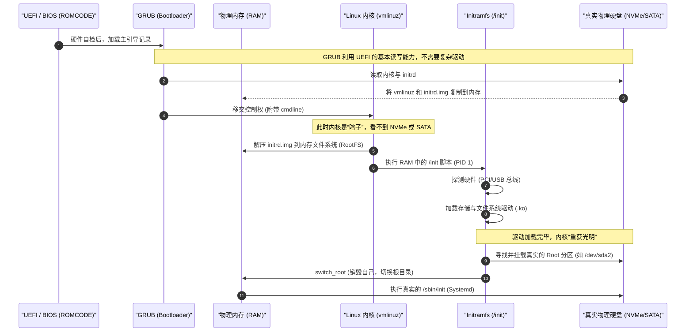

# 通用 PC 启动全流程解析 (硬件识别与 KO 加载)

> [!note]
> 本文针对通用 x86_64 架构 PC（如 Ubuntu/CentOS/Fedora）。它与嵌入式（如 i.MX6ULL 直挂模式）最大的区别在于：PC 极度依赖 `initramfs` 作为“跳板”来动态加载存储驱动 (`.ko` 文件)。

## 1. 启动全流程时序图

整个启动过程就像一场精密的“接力赛”：

## 2. 阶段深度剖析：从“瞎子”到“重获光明”

### 阶段一：GRUB 的“作弊”阶段
此时内核尚未启动。GRUB 自身并不包含复杂的 NVMe 或 RAID 驱动，它是**通过调用 UEFI 固件提供的底层接口**，以最基础的块读取方式，硬生生把硬盘里的 `vmlinuz`（内核压缩包）和 `initrd.img`（也就是 initramfs）读出来，一股脑塞进物理内存（RAM）里。

### 阶段二：内核启动与“临时工具箱”
内核解压运行后，由于身上没有任何硬盘驱动，它就像处于“瞎子”状态，无法访问真正的根分区。
于是，它将刚刚 GRUB 塞进内存的 `initrd.img` 解压，挂载为内存虚拟文件系统（tmpfs/ramfs），并执行里面的 `/init` 脚本。
**此时的系统运行在一个纯内存的“微型 Linux”中。**

### 阶段三：硬件识别与加载 KO (最核心步骤)
在 `/init` 脚本的指挥下，系统开始进行硬件识别：

1. **扫描总线**: 内核遍历 PCIe 和 USB 总线，读取硬件的 Vendor ID 和 Device ID（例如 `8086:f1a8` 代表某个 Intel NVMe 控制器）。
2. **触发 udev**: `udevd` (或轻量级的 `mdev`) 接收到内核发现新硬件的事件。
3. **匹配别名 (modules.alias)**: 系统查找 `/lib/modules/$(uname -r)/modules.alias` 文件。这就好比一本字典，里面记录着：`alias pci:v00008086d0000F1A8* nvme`。
4. **加载驱动 (.ko)**: 查到匹配的驱动后，`/init` 脚本使用 `modprobe` 命令，从它**随身携带的临时库**中加载 `nvme.ko` 和 `ext4.ko` 等内核模块。

> **解惑：临时库是哪来的？**
> `initrd.img` 在生成时（比如你更新内核时运行的 `update-initramfs`），就已经把你电脑需要的核心存储驱动打包放进去了。

### 阶段四：挂载真实根分区
驱动加载成功 (`insmod` / `modprobe`) 后，内核的设备树终于“亮”了。
1. 系统中出现了 `/dev/nvme0n1p2`。
2. `/init` 脚本读取启动参数（`cmdline` 中的 `root=UUID=xxxx-xxxx`）。
3. 脚本在 `/dev` 目录下找到匹配 UUID 的设备。
4. 将该设备挂载到一个临时目录，比如 `/rootmnt` 或是 `/sysroot`。

### 阶段五：金蝉脱壳 (`switch_root`)
真实硬盘已经挂载好了，但现在的根目录 `/` 还是那个在内存里的临时系统。
最后一步，调用神奇的 `switch_root` 指令：
1. 它将真实的硬盘挂载点（如 `/rootmnt`）移动到 `/`。
2. **彻底清空/释放** 原来的内存文件系统（Initramfs）以腾出内存。
3. 在真实的硬盘上执行 `/sbin/init`（通常是 systemd）。

至此，启动的接力棒完美交接给了真实硬盘上的操作系统，后续将由 systemd 拉起网络、图形界面、SSH 等服务。

## 3. PC vs 嵌入式 (i.MX6ULL) 的根本对比

| 环节 | 通用 PC (Ubuntu/CentOS) | 嵌入式开发板 (i.MX6ULL) |
| :--- | :--- | :--- |
| **存储驱动来源** | 存在于 `initramfs` 中的 `.ko` 模块，**动态加载**。 | 直接编译进 `zImage` 内核中（Built-in），**无需加载**。 |
| **解决死循环方式** | 用 GRUB 将微型环境塞入内存，做跳板中转。 | 硬件固定，内核自带驱动直接挂载，简单粗暴。 |
| **内核镜像大小** | 较小（通用功能做成 `.ko` 随需加载）。 | 适中或较大（所需驱动全包含在内）。 |
| **灵活性** | **极高**。把系统盘拔下来插到 AMD 还是 Intel 机器都能启动。 | **极低**。内核与特定芯片和板级硬件深度绑定。 |
