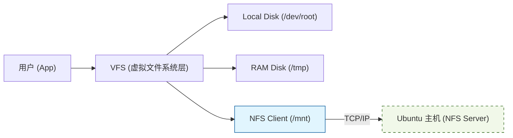

# 存储挂载与 NFS 深度解析

> [!note]
> **Ref:** Local SSH `cat /etc/fstab` output on `imx` board.


## 1. /etc/fstab 解析 (静态挂载表)

在 Linux 中，任何分区（本地磁盘、内存、网络磁盘）都需要通过 `mount` 关联到目录。`/etc/fstab` 就是 `mount` 命令的“默认参数表”。

### 标准格式
`<file system> <mount pt> <type> <options> <dump> <pass>`

根据您的实测数据：
| 挂载源 | 挂载点 | 类型 | 特殊选项 (Options) | 说明 |
| :--- | :--- | :--- | :--- | :--- |
| `/dev/root` | `/` | `ext2` | `rw,noauto` | 根分区，显式要求读写模式。 |
| `tmpfs` | `/tmp` | `tmpfs` | `mode=1777` | **内存文件系统**。存放临时文件，重启消失，且不磨损 Flash。 |
| `sysfs` | `/sys` | `sysfs` | `defaults` | 内核与驱动交互的窗口。 |
| `192.168.31.101:/path` | `/mnt` | **`nfs`** | `rw,sync,vers=3,nolock` | **网络文件系统**。将主机目录映射到板卡。 |


## 2. NFS (Network File System) 详解

在您的配置中，这一行最为关键：
`192.168.31.101:/home/pi/imx/prj/mount /mnt nfs rw,sync,vers=3,nolock 0 0`

### 2.1 为什么开发者爱用 NFS？
- **代码同步零延迟**: 你在宿主机 (Ubuntu) 上修改 C 代码并编译，生成的可执行文件在板卡的 `/mnt` 下立刻就能看到，无需通过 TFTP/U 盘拷贝。
- **空间无限**: 板卡 Flash 可能只有 256MB，但宿主机的硬盘有几个 TB，挂载后板卡可以随意访问。

### 2.2 挂载参数的含义
- **`rw`**: 读写权限。
- **`sync`**: 同步写入。确保在板卡上写一个文件时，数据立刻刷回主机磁盘，防止突然断电导致代码丢失。
- **`vers=3`**: 指定使用 NFS v3 协议。
- **`nolock`**: **嵌入式必备**。告诉内核不使用文件锁。因为嵌入式系统通常不运行复杂的分布式锁管理服务（lockd），如果不加此参数，挂载可能会极其缓慢甚至超时。


## 3. 挂载执行的时机

结合我们之前看的 `/etc/inittab`：

1. **内核启动**: 挂载基础 `/` (RootFS)。
2. **Init 进程启动**: 执行 `::sysinit:/bin/mount -a`。
3. **关键动作**: `mount -a` 会扫描 `/etc/fstab`。
    - 它会尝试挂载所有 `noauto` 以外的分区。
    - 对于 `nfs` 类型的条目，它会启动网络驱动，向 `192.168.31.101` 发起挂载请求。


## 4. 实战建议

### 4.1 手动挂载测试
如果你不想修改 `/etc/fstab`，可以手动执行：
```bash
mount -t nfs -o nolock 192.168.31.101:/home/pi/work /mnt
```

### 4.2 常见故障排查
- **Connection timed out**: 主机没开启 NFS 服务，或者防火墙挡住了。
- **Permission denied**: 主机的 `/etc/exports` 没给板卡的 IP 授权。
- **Input/output error**: 网络不稳定，或者 NFS 协议版本不匹配（尝试换成 `vers=4`）。


## 5. 存储架构图


