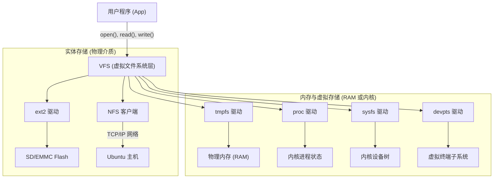

# VFS 与 fstab 挂载机制深度解析

> [!note]
> **VFS (Virtual File System)** 是 Linux 内核的一层软件抽象。它允许用户空间的程序用标准的 `open()`, `read()`, `write()` 系统调用，去访问各种完全不同的底层文件系统。
>
> **Ref:** User's actual `cat /etc/fstab` output.


## 1. 一切皆文件的幕后推手：VFS 架构

为什么你的程序可以像读写本地文件一样，去读取 `/proc` 里的进程信息，或者写入 `/mnt` 里的网络文件？

因为 **VFS 充当了“通用翻译官”**。




## 2. 您的 fstab 逐行深度解析

您提供的 `/etc/fstab` 完美展示了 VFS 支持的多样性。我们按照**“挂载的本质”**将它们分为四大类：

### 2.1 物理根基 (树干)
```text
/dev/root       /               ext2    rw,noauto       0       1
```
- **本质**: 真实的物理存储器（Flash、SD卡等）。
- **如何挂载**: 它是所有后续挂载的**锚点**。内核启动时，会去解析 bootargs (如 `root=/dev/mmcblk1p2`)，找到真实的块设备，把它挂载在 `/`。
- **作用**: 提供了 `/proc`, `/sys`, `/mnt` 等**挂载点（空的物理文件夹）**，为后续的挂载提供栖身之所。

### 2.2 内核VFS
这些文件系统**不占用任何磁盘空间**，它们是内核数据结构向用户态暴露的“幻影”。
```text
proc            /proc           proc    defaults        0       0
sysfs           /sys            sysfs   defaults        0       0
debugfs         /sys/kernel/debug debugfs defaults      0       0
```
- **本质**: 内存中的内核数据。
- **如何挂载**: 内核生成动态数据流，VFS 将其映射到物理根目录的 `/proc` 和 `/sys` 空文件夹上。
- **作用**:
    - **`/proc`**: 存放进程(PID)信息和内存状态。
    - **`/sys`**: 存放硬件设备树、总线和驱动信息。
    - **`debugfs`**: 内核开发者专用的深度调试接口（普通运行时不需要）。

### 2.3 内存文件系统 (高速易失)
```text
tmpfs           /dev/shm        tmpfs   mode=0777       0       0
tmpfs           /tmp            tmpfs   mode=1777       0       0
tmpfs           /run            tmpfs   mode=0755,nosuid,nodev  0       0
```
- **本质**: 直接在物理内存（RAM）中划出的一块区域，模拟成文件系统。
- **如何挂载**: 告诉 VFS 申请一段内存，并挂载到指定目录。
- **作用**:
    - **`/tmp`**: 临时文件，重启后自动消失，**最重要的是：写这里不会消耗 Flash 寿命。**
    - **`/run`**: 存放系统启动后的运行时数据（如 PID 锁文件）。
    - **`/dev/shm`**: 共享内存接口，供多个进程利用内存进行极速通信。

### 2.4 特殊设备与网络接口
```text
devpts          /dev/pts        devpts  defaults...     0       0
192.168.31.101:... /mnt         nfs     rw,sync...      0       0
```
- **devpts**: 用于 SSH 或 Telnet 登录时，动态生成虚拟终端（如 `/dev/pts/0`）。它让远程网络连接看起来像是一个串口设备。
- **NFS**: VFS 将针对 `/mnt` 的读写操作，翻译成 TCP/IP 网络包，发送给远端服务器执行后再返回结果。


## 3. 组装过程：这棵树是怎么长出来的？

结合您板卡的 `/etc/inittab`，整个组装过程如下：

1. **内核启动 (Kernel Boot)**:
    - 挂载 `/dev/root` (ext2) 到 `/`。此时，你只拥有物理磁盘上的只读静态文件。
2. **Init 接管 (BusyBox init)**:
    - 读取 `/etc/inittab` 中的 `sysinit` 指令。
    - 首先执行 `mount -t proc proc /proc` (挂载核心信息)。
    - 执行 `mount -a`：这个命令会读取 `/etc/fstab`。
3. **`mount -a` 的组装工作**:
    - 它遍历 fstab 每一行。
    - 看到 `sysfs`，就调用系统函数将内核对象挂到 `/sys`。
    - 看到 `tmpfs`，就在内存分配空间并挂到 `/tmp`。
    - 看到 `nfs`，就启动网卡发起远端连接，将对方的目录映射到 `/mnt`。
    

至此，一棵融合了**物理磁盘、系统内存、内核状态和远端网络**的参天大树（RootFS）彻底成型，应用程序可以对其进行无差别的读写。
