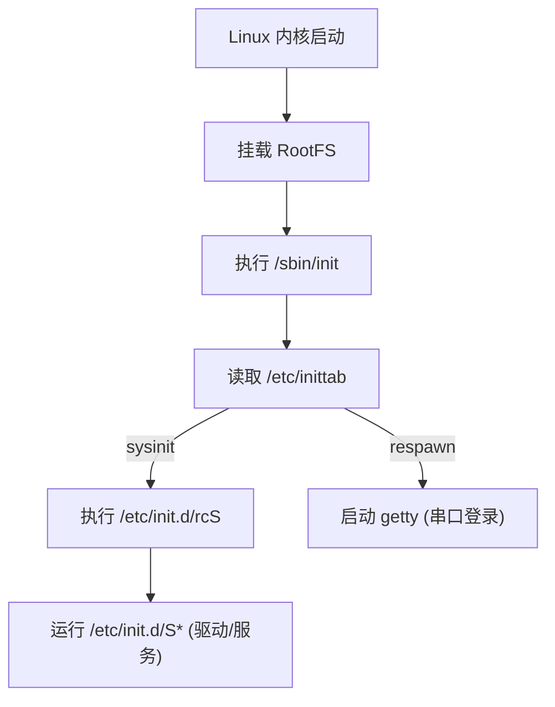

# i.MX6ULL Buildroot 根文件系统分析

> [!note]
> **Ref:** Local SSH observation on `imx` (192.168.31.102), Buildroot Default Configuration.


## 1. 根目录布局 (FHS 简化版)

通过 `ls -F /` 观察到，Buildroot 生成的系统虽然遵循 FHS 标准，但为了节省存储空间进行了大幅精简：

- **`linuxrc@`**: 指向 `/bin/busybox`。这是内核挂载 `initramfs` 后的默认入口（Legacy 模式），在 Buildroot 中常保留以保持兼容。
- **`lib32@`**: 针对 i.MX6ULL (ARMv7-A 32位) 的库目录重定向。
- **`/sbin/init`**: **核心发现**。不同于桌面系统的 Systemd 软链接，这是一个 **35KB 的独立二进制文件**，实质上是 BusyBox 的 init 子模块。


## 2. 核心组件对比：BusyBox vs Systemd

| 特性 | i.MX6ULL (Buildroot/BusyBox) | 桌面/服务器 (Ubuntu/Systemd) |
| :--- | :--- | :--- |
| **PID 1 进程** | `/sbin/init` (BusyBox) | `/lib/systemd/systemd` |
| **配置文件** | `/etc/inittab` | `/etc/systemd/*.service` |
| **启动脚本** | `/etc/init.d/rcS` | 并行化的 Unit 依赖关系 |
| **内存占用** | **极低** (KB 级) | **较高** (MB 级) |
| **功能定位** | 追求极致的启动速度与小体积 | 追求复杂的服务管理与容错 |


## 3. 启动流程分析 (BusyBox 模式)

在 i.MX6ULL 上，启动流程由 `/etc/inittab` 驱动：



### 3.1 `/etc/inittab` 真实配置深度解析

```bash
[root@imx6ull:~]# cat /etc/inittab
# /etc/inittab
#
# This inittab is a basic inittab sample for sysvinit, which mimics
# Buildroot's default inittab for BusyBox.
id:3:initdefault:

si0::sysinit:/bin/mount -t proc proc /proc
si1::sysinit:/bin/mount -o remount,rw /
si2::sysinit:/bin/mkdir -p /dev/pts /dev/shm
si3::sysinit:/bin/mount -a
si4::sysinit:/sbin/swapon -a
si5::sysinit:/bin/ln -sf /proc/self/fd /dev/fd 2>/dev/null
si6::sysinit:/bin/ln -sf /proc/self/fd/0 /dev/stdin 2>/dev/null
si7::sysinit:/bin/ln -sf /proc/self/fd/1 /dev/stdout 2>/dev/null
si8::sysinit:/bin/ln -sf /proc/self/fd/2 /dev/stderr 2>/dev/null
si9::sysinit:/bin/hostname -F /etc/hostname
rcS:12345:wait:/etc/init.d/rcS

mxc0::respawn:/sbin/getty -L  ttymxc0 0 vt100 # GENERIC_SERIAL

# Stuff to do for the 3-finger salute
#ca::ctrlaltdel:/sbin/reboot

# Stuff to do before rebooting
shd0:06:wait:/etc/init.d/rcK
shd1:06:wait:/sbin/swapoff -a
shd2:06:wait:/bin/umount -a -r

# The usual halt or reboot actions
hlt0:0:wait:/sbin/halt -dhp
reb0:6:wait:/sbin/reboot
```

基于 i.MX6ULL 实际的 `/etc/inittab` 文件，其启动行为被严格定义为以下阶段：

#### 阶段 1: 基础设施挂载 (sysinit)
在任何其他脚本运行前，必须由内核 `init` 直接建立底层环境：
- `mount -t proc ...`: 挂载 `/proc` 供内核交互。
- `mount -o remount,rw /`: 将 RootFS 从只读切换为 **读写**。
- `mount -a`: 挂载 `/etc/fstab` 中配置的所有其他分区。
- `ln -sf ...`: 为终端准备 `/dev/stdin` 等标准输入输出。
- `hostname -F`: 读取主机名。

#### 阶段 2: 初始化服务网络 (wait)
- `rcS:12345:wait:/etc/init.d/rcS`: 此时基础设施就绪，执行 `rcS` 并 **等待其结束 (`wait`)**。`rcS` 会去运行网络配置、SSH 服务器等所有开机自启动脚本。

#### 阶段 3: 守护终端登录 (respawn)
- `mxc0::respawn:/sbin/getty -L ttymxc0 0 vt100`: 在 `ttymxc0` (i.MX 原生串口) 启动终端登录。**`respawn`** 动作确保只要你输入 `exit` 退出，系统立刻重启一个新的登录界面。

#### 阶段 4: 安全关机机制 (wait for runlevel 0/6)
- 当系统收到关机 (`halt/0`) 或重启 (`reboot/6`) 信号时，执行 `rcK` (Kill 脚本关闭服务)，随后执行至关重要的 `umount -a -r` (卸载文件系统)，确保数据刷入 Flash，防止损坏。

---

## 4. 关键配置路径


- **内核模块**: `/lib/modules/$(uname -r)/`
- **动态链接库**: `/lib/` 和 `/usr/lib/`
- **默认应用配置**: `/etc/`
- **用户数据**: `/root/` (管理员) 或 `/home/` (普通用户)


## 5. 开发建议

1. **添加启动项**: 建议在 `/etc/init.d/` 下创建以 `S` 开头的脚本（例如 `S99myapp`），即可在开机时自动运行自己的程序。
2. **根文件系统瘦身**: 如果 Flash 空间紧张，可以通过 Buildroot 的 `make menuconfig` 剔除不必要的 `Target packages`。
3. **驱动调试**: 嵌入式开发中，`/lib/modules` 下是否有正确的 `.ko` 文件是解决驱动加载问题的关键。
