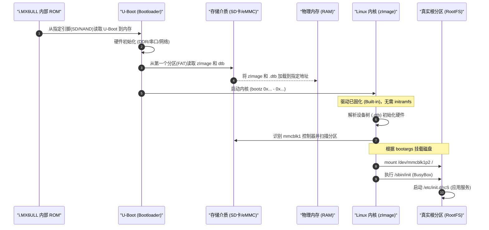

# i.MX6ULL 嵌入式启动全流程解析 (直挂模式)

> [!note]
> **本流程基于您的实测数据**：
> 1. 板卡 `cmdline`: `root=/dev/mmcblk1p2 rootwait rw`
> 2. SDK 内核配置: `CONFIG_INITRAMFS_SOURCE=""`

## 1. 启动全流程时序图

不同于 PC 的“接力赛”，i.MX6ULL 的启动更像是一场“短跑”：

## 2. 核心阶段深度解析

### 阶段一：硬件强制加载 (IROM)
i.MX6ULL 芯片内部有一段固化的 ROM 代码。上电后，它会根据板子上的拨码开关（BOOT_MODE）去读 SD 卡或 eMMC 的起始扇区。
- **依据**: 这是芯片级的物理行为，不需要任何软件配置。

### 阶段二：U-Boot 的搬运工作
U-Boot 是嵌入式系统的“总司令”。
- **动作**: 它利用自己的 MMC 驱动去读分区，找到 `zImage` 和 `100ask_imx6ull-14x14.dtb`。
- **配置依据**: 在 U-Boot 环境变量中设置。你可以通过 `printenv` 看到 `loadimage` 和 `loadfdt` 命令。

### 阶段三：内核的“自带干粮”启动 (Built-in Driver)
这是与 PC 最大的不同点。
- **动作**: 内核解压后，由于驱动已经**编译进内核**，它立即就能和 eMMC/SD 卡通信。
- **SDK 寻找依据**:
    - 在 `/home/pi/imx/sdk/100ask_imx6ull-sdk/Linux-4.9.88/.config` 中：
        - `CONFIG_MMC_IMX_ESDHCI=y` (eMMC 驱动：直接编译进内核)
        - `CONFIG_EXT4_FS=y` (文件系统驱动：直接编译进内核)
        - `CONFIG_INITRAMFS_SOURCE=""` (关闭了 initramfs)

### 阶段四：寻找“根” (Mounting Root)
内核根据 U-Boot 传给它的 `bootargs`（在板子上看到的 `cmdline`）去挂载。
- **动作**: `root=/dev/mmcblk1p2` 告诉内核去挂载 MMC 控制器 1 的第 2 个分区。
- **配置依据**: 在 U-Boot 中设置 `setenv bootargs '...'`。

### 阶段五：执行第一个进程 (PID 1)
挂载根分区成功后，内核去文件系统里找第一个程序。
- **动作**: 默认为 `/sbin/init`（您的板子上是 BusyBox）。
- **配置依据**: 如果在根目录下运行 `ls -l /sbin/init`，你会发现它是个真实文件，而非像 Ubuntu 那样是指向 systemd 的链接。

## 3. i.MX6ULL vs 通用 PC 启动流程总结

| 特性 | i.MX6ULL (您的开发板) | 通用 PC (Ubuntu/x86) |
| :--- | :--- | :--- |
| **Bootloader** | U-Boot (轻量、命令行) | GRUB (重量、菜单式) |
| **硬件识别** | **静态设备树 (DTB)** 定义 | **动态 ACPI/PCI** 扫描 |
| **存储驱动** | **Built-in** (内置在内核里) | **KO** (放在 initramfs 里) |
| **Initramfs** | **无** (直接挂载硬盘) | **有** (作为中转站) |
| **挂载点** | 指定分区 (`mmcblk1p2`) | 通常指定 UUID |

## 4. 总结

在您的 i.MX6ULL 系统中，**内核就是一切**。它不需要“临时跳板”（initramfs），因为它在编译时就已经知道了自己这辈子只会在这一块板子上跑，所以带全了所有必要的驱动。这让启动流程变得异常简洁高效，但也牺牲了像 PC 那样的硬件通用性。
