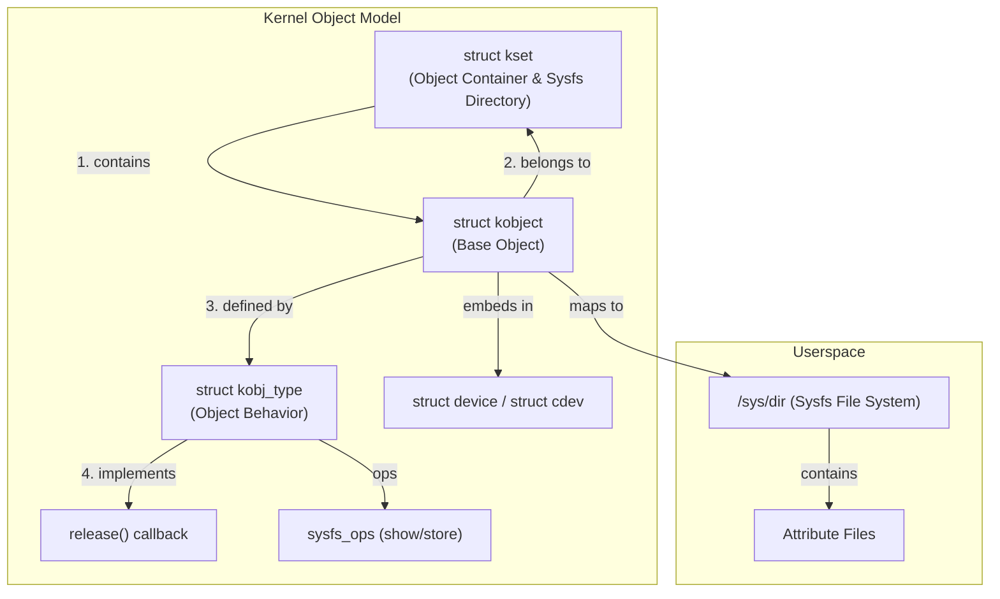
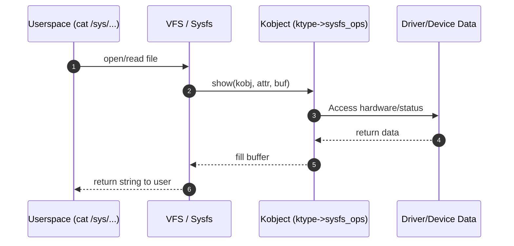
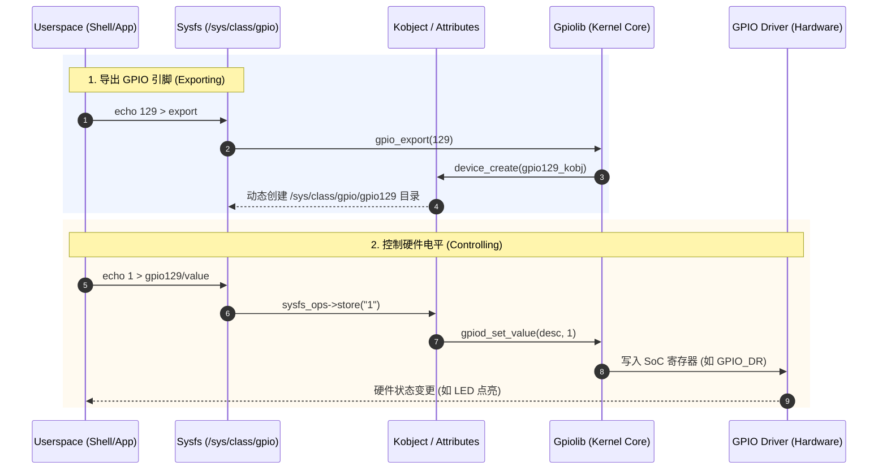
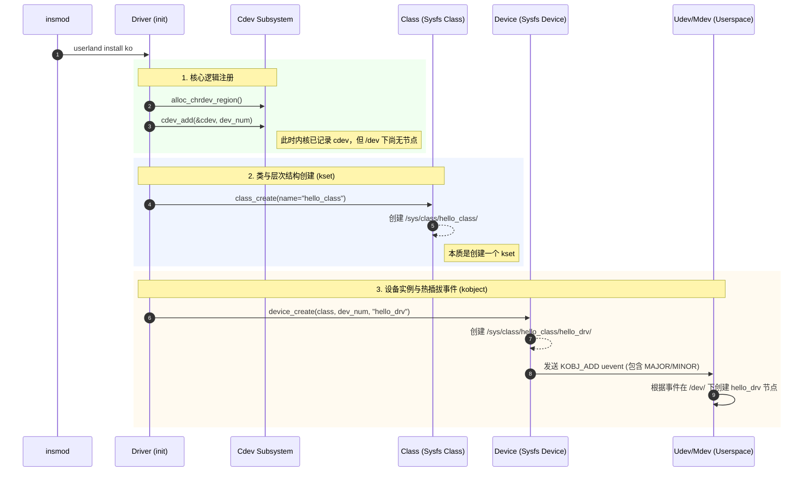

# Linux 内核对象模型 (kobject)

> [!note]
> **Ref:** 
>
> 1. [Linux Kernel Documentation: kobject.txt](sdk/100ask_imx6ull-sdk/Linux-4.9.88/Documentation/kobject.txt)
> 2. [KernelLearning最佳实践.md](note/KernelLearning最佳实践.md)
> 3. [Local Code] `/home/pi/imx/sdk/100ask_imx6ull-sdk/Linux-4.9.88/Documentation/kobject.txt`

kobject 是 Linux 设备模型的基础，它提供了引用计数、sysfs 展示、层级管理（kset）等核心能力。在 VFS 层面，sysfs 正是通过 kobject 体系将内核数据结构以文件系统的形式暴露给用户空间。

理解驱动模型及其底层的 kobject 抽象的难点之一在于没有一个明显的切入点。处理 kobject 需要了解几个相互引用的不同类型。

## 1. 核心术语定义

*   **kobject (`struct kobject`)**: 具有名称和引用计数的对象。kobject 拥有一个父指针（允许对象以层次结构排列）、特定类型，并且通常在 `sysfs` 虚拟文件系统中有对应的表示。
    *   kobject 本身通常没有意义；相反，它们通常被**嵌入**到其他结构体中（如 `struct device`, `struct cdev`），这些结构体包含了代码真正关心的内容。
    *   **引用计数**: 使用 `kobject_get()` 和 `kobject_put()` 管理生命周期。
    *   **Sysfs 映射**: 每个 kobject 通常在 `/sys` 下对应一个目录。
    *   **层级关系**: 通过 `parent` 指针形成树状结构。
    *   **注意：** 任何结构体都不应嵌入多个 kobject。如果这样做，对象的引用计数必定会混乱并出错。

*   **ktype (`struct kobj_type`)**: 嵌入 kobject 的对象类型。每一个嵌入 kobject 的结构体都需要一个对应的 ktype。ktype 控制着 kobject 在创建和销毁时的行为。
    *   `release`: 引用计数归零时的清理函数（极其重要，避免内存泄漏）。
    *   `sysfs_ops`: 定义读写属性文件（show/store）的方法。
    *   `default_attrs`: 默认的 sysfs 属性文件。

*   **kset (`struct kset`)**: kobject 的集合。这些 kobject 可以属于同一 ktype，也可以属于不同的 ktype。kset 是 kobject 集合的基础容器类型。kset 内部包含属于自己的 kobject，但这属于实现细节，kset 核心代码会自动处理它。
    *   当你看到 `sysfs` 中一个包含多个子目录的目录时，通常那些子目录都对应着同一个 kset 中的 kobject。
    *   常用于实现 `/sys/class` 或 `/sys/bus` 下的子目录。

## 2. 关系架构 (Mermaid)



## 3. 嵌入 kobject (Embedding kobjects)

内核代码极少创建独立的 kobject。kobject 通常被用来控制对更大范围、特定领域对象的访问。为此，kobject 会被嵌入到其他结构体中。

### 3.1 容器溯源

使用 `container_of` 从 kobject 指针找回宿主结构体指针：

```c
#define to_my_struct(obj) container_of(obj, struct my_struct, kobj)
```

例如，UIO 驱动中的结构体：
```c
struct uio_map {
    struct kobject kobj;
    struct uio_mem *mem;
};

#define to_map(map) container_of(map, struct uio_map, kobj)
// 使用：
struct uio_map *map = to_map(kobj_ptr);
```

## 4. 关键 API 与工作流

### 4.1 初始化与注册

```c
// 初始化内部字段
void kobject_init(struct kobject *kobj, struct kobj_type *ktype);

// 注册到 sysfs
int kobject_add(struct kobject *kobj, struct kobject *parent, const char *fmt, ...);

// 合体函数：初始化并添加至内核
int kobject_init_and_add(struct kobject *kobj, struct kobj_type *ktype,
                         struct kobject *parent, const char *fmt, ...);
```

### 4.2 创建"简单"的 kobject

如果你只想要在 sysfs 层级中创建一个简单的目录，可以使用以下方法创建独立的 kobject：

```c
struct kobject *kobject_create_and_add(char *name, struct kobject *parent);
```

接着使用以下函数创建关联属性：
```c
int sysfs_create_file(struct kobject *kobj, struct attribute *attr);
// 或者
int sysfs_create_group(struct kobject *kobj, struct attribute_group *grp);
```

## 5. Sysfs 的直接映射

- **目录 (Directory)**: 对应一个 `kobject`。
- **文件 (File)**: 对应一个 `attribute`，通过 `ktype->sysfs_ops` 实现访问。



## 6. ktypes 和 release 方法

当引用计数归零时会发生异步释放。

**规则：必须始终使用 `kobject_put()`，绝对不能直接使用 `kfree()`。**

通知释放机制是通过 `release()` 方法实现的。通常长这样：
```c
void my_object_release(struct kobject *kobj)
{
    struct my_object *mine = container_of(kobj, struct my_object, kobj);
    /* 执行清理工作 */
    kfree(mine);
}
```

`release` 方法并不存储在 kobject 内，而是位于关联的 `kobj_type` 中。

## 7. ksets 机制

`kset` 是期望关联在一起的 kobject 的集合。它不仅作为一个"袋子"，它自己也在 sysfs 中显示为一个子目录。它还可以控制 `uevent`。

由于 kset 内部嵌套了 kobject，所以它也必须动态创建：
```c
struct kset *kset_create_and_add(const char *name,
                                 struct kset_uevent_ops *u,
                                 struct kobject *parent);
```

kset 可以通过 `struct kset_uevent_ops` 拦截或修改子对象的 uevent（如 `filter`, `name`, `uevent` 等方法）。

## 8. 最佳实践

- **永远不要**在结构体中嵌入多个 kobject。
- **必须**提供 `release` 回调，否则会导致 `struct kobject` 及其宿主内存无法释放。
- kobject 的生命周期由内核引用计数管理，不应手动 `kfree` 宿主对象。
- kobject 是动态的，**绝不能**静态声明或分配（分配在栈上）。
- 如果你仅仅需要一个引用计数器而不需要 sysfs 等功能，请使用 `struct kref`。


# 用户空间通过 sysfs 控制硬件 (以 GPIO 为例)

> [!note]
> **Ref:** 
> 1. [IMX6ULL GPIO子系统顶层剖析](note/Subsystem/gpio/00-overview.md)
> 2. [Linux Kernel Documentation: sysfs-rules.txt](sdk/100ask_imx6ull-sdk/Linux-4.9.88/Documentation/filesystems/sysfs.txt)

在 Linux 中，sysfs 将内核中的 `kobject` 及其属性（`attributes`）暴露为文件系统中的目录和文件。用户空间通过对这些文件的读写，最终触发内核驱动中的回调函数，从而实现对底层硬件寄存器的操作。

## 1. GPIO 控制流全景图

以下序列图展示了从用户空间 `echo` 命令到硬件电平变化的完整逻辑链路。



## 2. 核心映射机制

这种“文件即硬件”的转化是通过 `ktype` 中的 `sysfs_ops` 映射实现的：

1.  **目录映射**：当驱动调用 `device_register` 或 `kobject_add` 时，sysfs 会根据 kobject 的层次结构在 `/sys` 下创建一个对应的目录。
2.  **属性映射**：驱动定义的每个 `struct attribute` 都会在目录下显示为一个文件（如 `value`）。
3.  **行为触发**：
    *   **Read (cat)**: 触发 `ktype->sysfs_ops->show()`，内核读取硬件寄存器值并格式化为字符串返回。
    *   **Write (echo)**: 触发 `ktype->sysfs_ops->store()`，内核将用户字符串解析为数值并写入硬件。

## 3. 用户态操作范式 (以 IMX6ULL GPIO129 为例)

通过 sysfs 接口控制硬件通常遵循“导出 -> 配置 -> 操作”的固定流程：

```bash
# 1. 向内核申请导出 GPIO129 的控制接口
echo 129 > /sys/class/gpio/export

# 2. 设置引脚方向为输出 (触发 direction_ktype->store)
echo out > /sys/class/gpio/gpio129/direction

# 3. 设置高电平 (触发 value_ktype->store -> gpiod_set_value)
echo 1 > /sys/class/gpio/gpio129/value

# 4. 释放资源
echo 129 > /sys/class/gpio/unexport
```


# 字符设备驱动注册与 Sysfs 交互 (cdev, class, device)

> [!note]
> **Ref:** 
> 1. [prj/01_hello_drv/src/driver_main.c](prj/01_hello_drv/src/driver_main.c)
> 2. [Linux Kernel Documentation: device-model/class.txt](sdk/100ask_imx6ull-sdk/Linux-4.9.88/Documentation/driver-model/class.txt)

在编写树外驱动（Out-of-tree Driver）时，我们不仅要让内核识别字符设备（`cdev`），还要让用户空间能够通过 `sysfs` 自动发现并创建对应的设备节点（`/dev/xxx`）。这涉及到了 `kobject` 在 `class` 和 `device` 层面上的应用。

## 1. 注册流程与 Sysfs 映射 (Mermaid)

以下序列图展示了驱动加载（`insmod`）时，内核如何在后台通过 kobject 体系构建层级目录。



## 2. 关键 API 深度解析

### 2.1 `cdev_add`：逻辑关联
*   **功能**：将 `struct cdev`（包含 `fops` 指针）与设备号关联。
*   **Sysfs 表现**：在 `/sys/dev/char/MAJOR:MINOR/` 下创建一个符号链接，指向对应的设备对象。

### 2.2 `class_create`：分类目录
*   **功能**：创建一个 `struct class` 结构体。
*   **Sysfs 表现**：在 `/sys/class/` 下创建一个名为 `name` 的目录。
*   **底层**：它实例化一个 `kset`，用于管理该类下的所有具体设备。

### 2.3 `device_create`：实例与热插拔
*   **功能**：在指定的 `class` 下创建一个设备。
*   **Sysfs 表现**：在 `/sys/class/<class_name>/` 下创建子目录，并包含 `dev` 属性文件（记录主次设备号）。
*   **底层触发**：调用 `kobject_uevent(KOBJ_ADD)`。**用户空间的 `udev` (或 `mdev`) 守护进程**监听到该事件后，解析 `dev` 文件中的设备号，从而在 `/dev/` 下自动创建节点。

## 3. 代码范式 (Snippet)

```c
static struct class *my_class;

static int __init my_driver_init(void) {
    // ... 前置分配 cdev ...

    // 1. 创建类：/sys/class/my_vfs_class/
    my_class = class_create(THIS_MODULE, "my_vfs_class");

    // 2. 创建设备：/sys/class/my_vfs_class/my_device/
    // 同时触发 udev 在 /dev/my_device 创建节点
    device_create(my_class, NULL, dev_nums, NULL, "my_device");

    return 0;
}

static void __exit my_driver_exit(void) {
    device_destroy(my_class, dev_nums); // 移除 /sys 目录并发送 uevent 删掉 /dev 节点
    class_destroy(my_class);            // 移除 /sys/class 目录
    // ... 后置释放 cdev ...
}
```

## 4. 总结：一切皆文件的闭环

通过 `class` 和 `device` 的封装，Linux 驱动模型隐藏了复杂的 `kobject` 链接细节：
1.  **kset** 提供了 `/sys/class/xxx` 的容器。
2.  **kobject** 提供了 `/sys/class/xxx/yyy` 的目录实体。
3.  **uevent** 机制打破了内核态与用户态的边界，实现了 `/dev` 节点的自动化管理。
