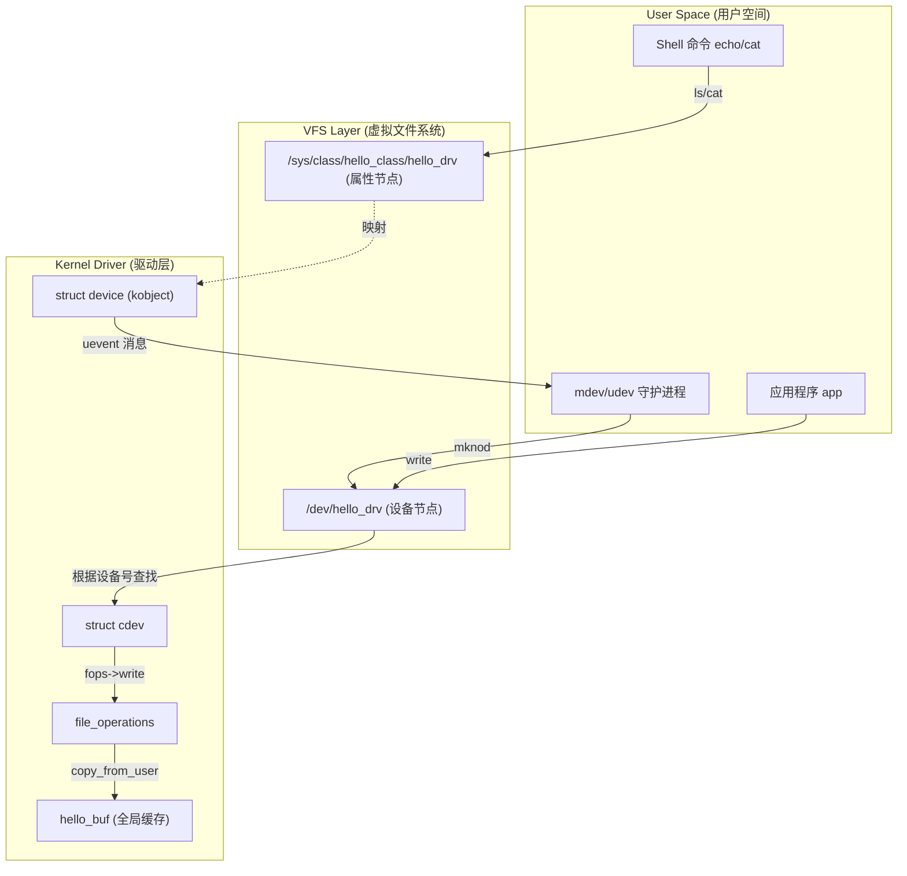

# 虚拟字符设备源码实现与 VFS 机制探讨

本笔记基于 `hello_drv` 虚拟字符设备的源码实现，深入探讨 Linux 内核对象模型、VFS（虚拟文件系统）机制，以及 `/dev`、`/sys`、`/proc` 三大虚拟文件系统的体系地位。

## 1. 驱动源码核心机制解析

### 1.1 关键代码片段

```c
// 1. 设备号分配与 cdev 注册 (接入 VFS)
// parm：设备号 、 uevent(major 、minor)、name 感觉不是很优雅的api。
ret = alloc_chrdev_region(&dev_nums, 0, 1, "hello_drv");
cdev_init(&cdev, &fops);
ret = cdev_add(&cdev, dev_nums, 1);

// 2. 构建内核对象模型 (接入 Sysfs，生成/sys/class/hello_class 和/dev/hello_drv)
hello_class = class_create(THIS_MODULE, "hello_class");
device_create(hello_class, NULL, dev_nums, NULL, "hello_drv");
```

### 1.2 核心机制解读

1.  **VFS 接入 (`alloc_chrdev_region` + `cdev_add`)**:
    *   **作用**: 向内核注册一个“接待员”。告知内核，如果有用户通过 `dev_nums` (主设备号) 访问设备，请调用 `fops` 中的函数（open, read, write）。
    *   **本质**: 这是驱动程序与 **文件系统层 (Filesystem Layer)** 的接口。

2.  **对象模型构建 (`class_create` + `device_create`)**:
    *   **作用**: 在 `/sys` 文件系统中构建目录结构，导出设备信息。
    *   **`class_create`**: 在 `/sys/class/` 下创建分类目录 `hello_class`。
    *   **`device_create`**: 在类目录下实例化设备，生成 `uevent` 文件，触发用户空间的 `udev/mdev` 自动创建 `/dev` 节点。

---

## 2. 内核对象模型与 VFS 联动

Linux 驱动不仅仅是操作硬件的函数集合，它通过严密的内核对象模型向用户空间暴露接口。

### 2.1 数据流转图 (Mermaid)



---

## 3. 深入辨析：/dev, /sys, /proc 的三角关系

这三个目录是 Linux 内核在 RootFS 中的三大投影，分别承担不同的职责。

| 目录 | 全称 | 核心隐喻 | 职责与地位 | 在本驱动中的体现 |
| :--- | :--- | :--- | :--- | :--- |
| **/dev** | Device FS | **操作台** | **IO接口**。提供对硬件的 I/O 接口。用户必须通过它才能 read/write 硬件。通常由 `devtmpfs` 管理。 | `insmod` 后由 `mdev` 自动生成 `/dev/hello_drv`。这是用户读写数据的唯一通道。 |
| **/sys** | Sysfs | **说明书** | **属性配置**。展示设备间的拓扑关系、属性和分类。它是内核数据结构 (`kobject`) 的直接映射。 | `/sys/class/hello_class/hello_drv/`。包含 `dev`(设备号)、`uevent` 等元数据。 |
| **/proc** | Process FS | **仪表盘** | **运行状态**。展示系统运行时的统计信息（内存、中断、进程）。驱动通常只在此做简略登记。 | `/proc/devices` 文件中记录了一行 `245 hello_drv`，表明该主设备号已被占用。 |

### 3.1 实例微观解剖

#### 案例 A: `hello_drv` (虚拟设备)
*   **Sysfs 路径**: `/sys/class/hello_class/hello_drv`
*   **`dev` 文件**: 内容 `245:0`。`udev` 读取它来获知主次设备号。
*   **`uevent` 文件**: 内容 `MAJOR=245...`。这是内核通知用户空间的“草稿”。
*   **`subsystem` 链接**: 指向 `../../../../class/hello_class`，体现了**归属关系**。

#### 案例 B: `gpiochip` (平台设备)
*   **Sysfs 路径**: `/sys/class/gpio/gpiochip0`
*   **`base`**: 属性文件。读取它会触发驱动代码返回该控制器的起始 GPIO 编号。这展示了 Sysfs 的**配置能力**——无需写 C 代码，直接读写文件即可控制驱动参数。
*   **`device` 链接**: 指向 `/sys/devices/platform/soc/.../209c000.gpio`。
    *   **关键点**: `/sys/class` 只是**逻辑分类**（所有 GPIO 都在一起）。`/sys/devices` 才是**物理连接视图**（该 GPIO 控制器挂在 SoC 内部总线上）。这是 Sysfs 最强大的视图功能。

---

## 4. 驱动加载后的生命周期演变

1.  **Kernel Init**: 内核构建 VFS 树，但 `/sys` 和 `/dev` 为空。
2.  **Insmod hello_drv.ko**:
    *   驱动初始化，`alloc_chrdev_region` 占用主设备号。
    *   `class_create/device_create` 在内核内存中构建 `kobject` 树。
    *   内核立即在 `/sys` 下生成对应的目录结构和属性文件。
    *   内核发送 `uevent` 网络广播。
3.  **User Space Response**:
    *   `mdev` 收到广播。
    *   `mdev` 查找 `/sys/.../hello_drv/dev` 获取设备号 `245:0`。
    *   `mdev` 执行 `mknod /dev/hello_drv c 245 0`。
4.  **Application Access**:
    *   用户执行 `echo "data" > /dev/hello_drv`。
    *   Shell 打开 `/dev/hello_drv`。
    *   VFS 根据 inode 找到 `cdev`。
    *   调用 `hello_drv_write`，数据存入 `hello_buf`。

---

## 5. 实验验证指南

在开发板上执行以下命令，观察上述理论的实际表现：

```bash
# 1. 加载驱动
insmod hello_drv.ko

# 2. 验证 Sysfs (对象模型)
# 应该能看到 class 和 device 目录
ls -l /sys/class/hello_class/hello_drv/

# 3. 验证 Devfs (自动挂载)
# 应该能看到 mdev 自动创建的节点，主设备号必须与 sysfs 中的一致
ls -l /dev/hello_drv

# 4. 验证 Procfs (驱动注册)
cat /proc/devices | grep hello

# 5. 功能验证
# 开启 dmesg 监控
dmesg -w &
# 写入数据
echo "test" > /dev/hello_drv
# 读取数据 (注意 Ctrl+C 停止)
cat /dev/hello_drv
```
