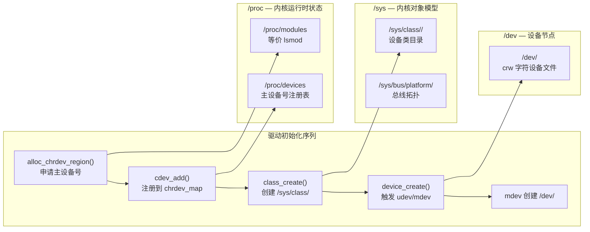
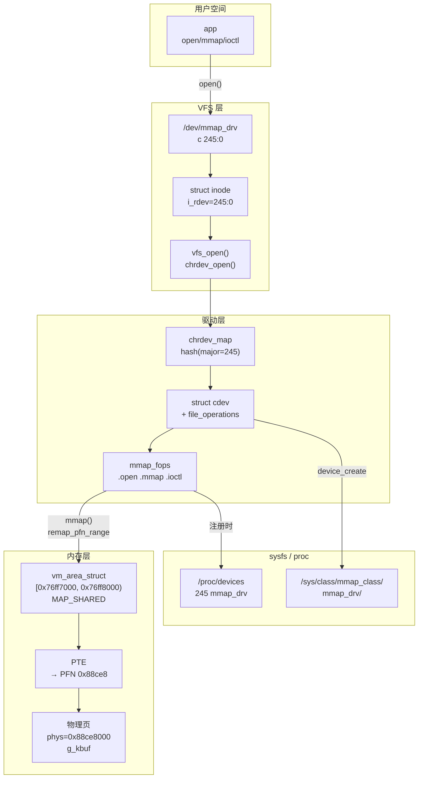

# 设备驱动 VFS 信息调试方法

> [!note]
> **Ref:** [`prj/02_mmap_drv/`](../../../prj/02_mmap_drv/), [`note/VFS/01.树外虚拟字符设备源码实现与VFS机制探讨.md`](./01.树外虚拟字符设备源码实现与VFS机制探讨.md), `man 5 proc`

---

## 一、驱动加载后的 VFS 全景

字符驱动的 `insmod` 会在三个虚拟文件系统留下痕迹：



---

## 二、各节点逐项解读（mmap_drv 实测）

### 2.1 `lsmod` — 模块加载状态

```bash
$ lsmod | grep mmap
mmap_drv    3171    0
# 字段：模块名  大小(bytes)  引用计数
```

| 字段 | 含义 | 注意 |
|------|------|------|
| 大小 | `.ko` 在内核内存中占用的字节数 | 不等于文件大小 |
| 引用计数 | 有多少其他模块依赖它 | 非 0 时 `rmmod` 会拒绝 |

> 底层数据来自 `/proc/modules`，`lsmod` 只是格式化输出。

---

### 2.2 `/proc/devices` — 主设备号注册表

```bash
$ cat /proc/devices | grep mmap
245 mmap_drv
```

`alloc_chrdev_region()` 向内核的 `chrdev_map` 哈希表注册 `(major=245, name="mmap_drv")` 时，这里出现一行。

**主设备号的用途**：用户 `open("/dev/mmap_drv")` 时，VFS 通过 inode 中的 `i_rdev` 字段取出主设备号 → 在 `chrdev_map` 中查找对应的 `cdev` → 找到 `file_operations` → 调用 `.open` 回调。

```
open("/dev/mmap_drv")
  └─ vfs_open()
       └─ chrdev_open()          // fs/char_dev.c
            └─ kobj_lookup(cdev_map, inode->i_rdev)
                 └─ fops->open() // 驱动的 mmap_drv_open()
```

---

### 2.3 `/sys/class/<class>/` — sysfs 设备对象

```bash
$ ls /sys/class/mmap_class/
mmap_drv        # device 子目录，对应 device_create() 的产物

$ ls /sys/class/mmap_class/mmap_drv/
dev  power  subsystem  uevent
# dev 文件内容即 "245:0"（major:minor），udev/mdev 读取此值建立 /dev 节点
```

`class_create()` + `device_create()` 在 sysfs 中构建对象层次，`mdev` 监听 `uevent` 并据此在 `/dev/` 下 `mknod`。

---

### 2.4 `/dev/<name>` — 设备节点

```bash
$ ls -la /dev/mmap_drv
crw-------  1 root root  245, 0  Jan 1 00:02  /dev/mmap_drv
# c = 字符设备   245 = major   0 = minor
```

这是用户空间与驱动交互的**唯一入口**。权限 `crw-------` 表示只有 root 可读写；嵌入式开发调试期间可 `chmod 666`。

---

## 三、运行时调试：mmap VMA 信息

### 3.1 `/proc/<pid>/maps` — 进程虚拟内存布局

在 app 运行时读取，可看到驱动映射区：

```bash
$ cat /proc/$(pidof mmap_drv_test)/maps
...
76ff7000-76ff8000  rw-s  00000000  00:06  1234   /dev/mmap_drv
#  虚拟地址范围      权限   文件偏移  设备号  inode   映射来源
#                   s = MAP_SHARED
```

| 权限位 | 含义 |
|--------|------|
| `r` / `w` / `x` | 读/写/执行 |
| `s` | `MAP_SHARED`（写操作对其他进程可见） |
| `p` | `MAP_PRIVATE`（CoW，写操作私有副本） |

### 3.2 `/proc/<pid>/smaps` — 更详细的 VMA 统计

```bash
$ grep -A 15 mmap_drv /proc/$(pidof mmap_drv_test)/smaps
76ff7000-76ff8000 rw-s 00000000 00:06 1234  /dev/mmap_drv
Size:               4 kB
Rss:                4 kB      # 实际驻留物理内存
Shared_Clean:       0 kB
Shared_Dirty:       4 kB      # MAP_SHARED 被写过的页
Private_Clean:      0 kB
Private_Dirty:      0 kB
```

`Shared_Dirty = 4kB` 证实该页是共享可写映射，且已被写过（对应 `shm->msg` 写入）。

---

## 四、dmesg 调试输出分析

`mmap_drv` 在关键路径打印 `printk`，实测输出：

```
[168.638] mmap_drv: major=245
[168.663] mmap_drv: /dev/mmap_drv created, kbuf phys=0x88ce8000
[311.732] mmap_drv: open  (pid=2684)
[311.736] mmap_drv: pid=2684 mapped phys=0x88ce8000 → virt=0x76ff7000 size=4096
[314.247] mmap_drv [kernel view] seq=5 msg='hello from parent, round 5'
[314.254] mmap_drv: close (pid=2684)
```

**零拷贝验证路径**：

```
用户写  virt=0x76ff7000  (app 侧 shm->msg)
           │
           │ PTE: 0x76ff7000 → PFN 0x88ce8
           ▼
物理页  phys=0x88ce8000  (g_kbuf)
           │
           │ 直接指针访问（无 read/write 系统调用）
           ▼
内核读  g_kbuf           (ioctl DUMP 路径)

结果: kernel view seq=5 msg='hello from parent, round 5'  ✓
```

---

## 五、调试命令速查

```bash
# 模块状态
lsmod | grep <name>
cat /proc/modules | grep <name>
modinfo <name>.ko               # 显示模块元数据（version, author, params）

# 设备号
cat /proc/devices               # 字符/块设备主设备号全表

# sysfs 节点
ls /sys/class/<class>/          # 设备对象目录
cat /sys/class/<class>/<dev>/dev  # 读取 major:minor

# 设备节点
ls -la /dev/<name>

# 运行时 VMA（需 app 正在运行）
cat /proc/<pid>/maps            # 虚拟内存布局
cat /proc/<pid>/smaps           # 含内存统计
grep -c mmap_drv /proc/<pid>/maps  # 快速确认映射是否建立

# 内核日志
dmesg | grep <name>
dmesg -w                        # 实时跟踪（类似 tail -f）

# 引用计数（模块能否 rmmod）
cat /sys/module/<name>/refcnt
```

---

## 六、完整 VFS 对象关系图


