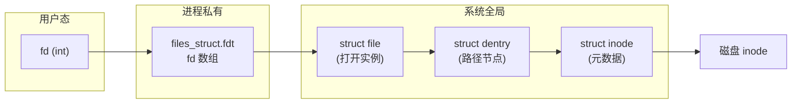
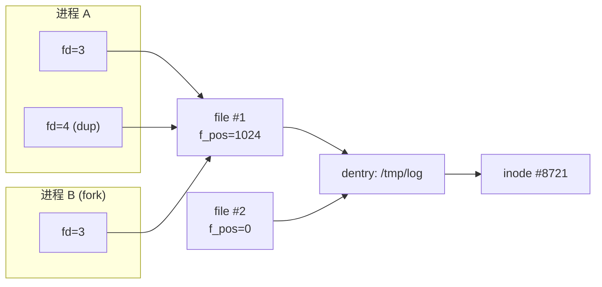
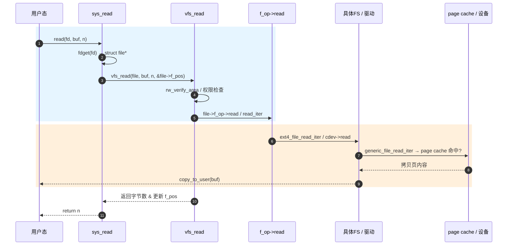

# fd → file → dentry → inode：Linux 文件系统底层四层模型

> [!note]
> **Ref:**
> - `include/linux/fdtable.h`、`include/linux/fs.h`（Linux-4.9.88，sdk/Linux-4.9.88）
> - ULK3 Ch.12 *The Virtual Filesystem*
> - LWN: [The VFS in Linux kernel](https://lwn.net/Articles/57369/)

## 1. 全景：四层对象与三张表

VFS 把"打开一个文件"拆成四个解耦的对象，分别承担**进程视角、打开实例、路径缓存、磁盘元数据**四种语义：



四层之间的对应关系并非 1:1，而是**多对一收敛**：

| 层级 | 作用域 | 关键字段 | 多对一关系 |
|------|--------|----------|------------|
| `fd` | 进程内整数索引 | `current->files->fdt->fd[fd]` | 同进程多个 fd 可指向同一 file |
| `struct file` | 系统全局打开表 | `f_pos` `f_flags` `f_op` `f_path` | 多个 file 可指向同一 dentry |
| `struct dentry` | dcache 路径缓存 | `d_name` `d_inode` `d_parent` | 多个 dentry（硬链接）可指向同一 inode |
| `struct inode` | icache 元数据 | `i_ino` `i_mode` `i_op` `i_fop` `i_mapping` | 1:1 对应磁盘 inode |

> 关键洞察：**`f_pos` 在 file 上**而不在 fd 或 inode 上 —— 这正是 `dup()` 共享偏移、而 `open()` 两次互不影响的根因。

## 2. 三张表的内核实现

### 2.1 进程级 fd 表（per-process）

```c
// include/linux/fdtable.h
struct fdtable {
    unsigned int      max_fds;
    struct file __rcu **fd;      // fd → struct file*
    unsigned long     *close_on_exec;
    unsigned long     *open_fds;
    ...
};

struct files_struct {
    atomic_t          count;     // 被多少 task_struct 共享 (CLONE_FILES)
    struct fdtable __rcu *fdt;
    ...
};
```

- `fd` 就是 `fdt->fd[]` 数组的下标，0/1/2 即 stdin/stdout/stderr。
- `CLONE_FILES`（pthread 默认）让多线程共享同一 `files_struct`，所以**线程间 fd 编号通用**。
- `fork()` 不带 `CLONE_FILES`，会**复制 fdt 数组但不复制 file 对象**，父子 fd 仍指向同一 `struct file`，因此**共享文件偏移**。

### 2.2 系统级打开文件表（global）

`struct file` 由 `slab` 分配，每次 `open()` 产生一个新实例：

```c
struct file {
    struct path       f_path;     // {mnt, dentry}
    struct inode     *f_inode;
    const struct file_operations *f_op;
    atomic_long_t     f_count;    // 引用计数
    unsigned int      f_flags;    // O_RDONLY / O_NONBLOCK ...
    fmode_t           f_mode;
    loff_t            f_pos;      // ★ 当前读写偏移
    void             *private_data;
    struct address_space *f_mapping;
};
```

- `f_count` 由 `fget()/fput()` 维护；归零时调用 `f_op->release()`。
- `f_op` 在 `open()` 时从 `inode->i_fop` 拷贝，驱动可以在自己的 `open()` 里**替换 `f_op`** 实现"按打开方式分派"。

### 2.3 dcache 与 icache（global, hash）

- **dentry** 缓存路径分量与父子关系，避免每次路径解析都走磁盘。`d_inode` 把名字绑到 inode；硬链接 = 多个 dentry 共用一个 inode。
- **inode** 缓存元数据；`i_op`（目录/符号链接操作）与 `i_fop`（普通文件操作）是 VFS 与具体文件系统（ext4 / sysfs / procfs / 字符设备）之间的**多态接口**。

## 3. 共享语义对照表

理解三表之后，下列"看似奇怪"的行为就完全自洽：

| 操作 | 新 fd | 新 file | 共享 f_pos | 共享 f_flags |
|------|-------|---------|------------|--------------|
| `open()` 两次 | ✅ | ✅ 新建 | ❌ | ❌ |
| `dup()` / `dup2()` | ✅ | ❌ 同一个 | ✅ | ✅ |
| `fork()`（不 CLONE_FILES） | ✅ 新表项 | ❌ 同一个 | ✅ | ✅ |
| `pthread_create`（CLONE_FILES）| ❌ 同一个 fd | ❌ | ✅ | ✅ |



## 4. 一次 `read(fd, buf, n)` 的完整下沉路径



要点：

1. `fdget()` 用 RCU **无锁**取得 `struct file*` 并增引用。
2. `vfs_read()` 是策略层，统一处理 `f_pos`、信号、`O_NONBLOCK`。
3. `f_op->read` 才进入 ext4 / sysfs / 字符设备等**具体实现**——这正是字符设备驱动需要实现的回调。
4. 普通文件最终落到 `address_space`（页缓存），缺页时再触发块层 I/O；字符设备则直接与硬件交互，无 page cache。

## 5. 与字符设备驱动的衔接

对于 `prj/` 下的字符设备驱动，关键映射如下：

| VFS 概念 | 驱动侧实现 |
|----------|------------|
| `inode->i_fop` | `cdev_init(&cdev, &my_fops)` 注册的 `file_operations` |
| `file->private_data` | 驱动用来挂载**每打开实例**的私有上下文（如 buffer、设备号副本） |
| `file->f_pos` | 驱动可读可写；`llseek` 默认 `default_llseek` 维护它 |
| `file->f_flags & O_NONBLOCK` | 决定 `read/write` 走阻塞 wait_queue 还是立即 `-EAGAIN` |

> [!tip]
> 在驱动的 `.open` 回调里，如果想做"读端 vs 写端"差异化行为，最干净的做法是**根据 `file->f_mode` 替换 `file->f_op`**，而不是在每个回调里 `if`。这正是 pipe / tty 等子系统的写法。

## 6. 速查总结

- **fd 是进程的，file 是打开的，inode 是文件的，dentry 是名字的。**
- `dup` 共享 `file`，`open` 不共享 —— 偏移行为差异源于 `f_pos` 的归属。
- 驱动写的 `file_operations` 挂在 `inode->i_fop`，每次 `open` 被拷到 `file->f_op`。
- VFS 的多态全靠 `i_op / i_fop / a_ops / s_op` 四组函数表，是理解 Linux "一切皆文件"的钥匙。
