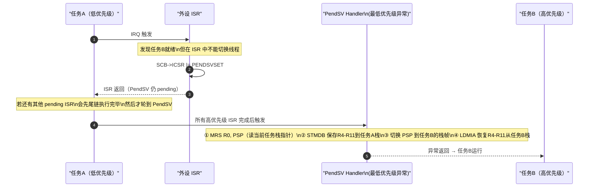
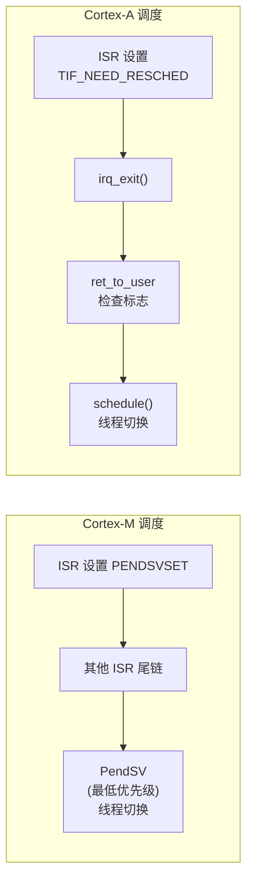

# Addt: Cortex-M PendSV 与 Cortex-A 调度对比

> [!note]
> **Ref:** ARM Cortex-M Architecture Reference Manual, [`05-context-landscape.md`](./05-context-landscape.md), [`note/SoC-Arch/00-Imx6ullArch.md`](../../SoC-Arch/00-Imx6ullArch.md)

## 1. Cortex-M 的两个关键异常

### SVC（Supervisor Call）— 同步系统调用

- 由 `SVC #N` 指令**同步触发**（等价于 Cortex-A 的 `SWI`/`SVC`）
- 用途：用户态请求内核/RTOS 服务（任务创建、信号量操作等）
- **触发时机确定**：执行到该指令立即陷入

```
用户代码 → SVC #0 → SVC_Handler → 查服务表 → 执行内核服务 → 返回
```

### PendSV（Pendable Supervisor Call）— 异步延迟调度

- 通过**写寄存器**触发：`SCB->ICSR |= SCB_ICSR_PENDSVSET_Msk`
- 被配置为**最低优先级异常**（优先级数值最大）
- 用途：**延迟上下文切换到所有 ISR 退出之后**

---

## 2. 为什么 Cortex-M 需要 PendSV

Cortex-M 的 NVIC 中断模型有一个关键特性 —— **尾链（Tail-Chaining）**：

```
IRQ1 触发 → ISR1 执行 → IRQ2 pending
                            ↓
          不返回线程态，直接切到 ISR2（尾链）
                            ↓
                         ISR2 执行 → 所有 ISR 完成 → 返回线程态
```

在尾链期间，CPU 始终处于 Handler 模式，**不经过线程模式**。若在 ISR1 中做线程切换，ISR2 的执行环境会被破坏。

**PendSV 的解决方案：**



> PendSV 的核心价值：**作为最低优先级异常，保证上下文切换一定在所有 ISR 退出后才执行**。

---

## 3. Cortex-M PendSV 上下文切换的硬件辅助

Cortex-M 进入异常时，硬件**自动压栈** 8 个寄存器：

```
┌───────────┐ ← PSP（异常前）
│   xPSR    │
│    PC     │  ← 返回地址
│    LR     │
│    R12    │
│   R3–R0   │  ← 函数参数 / 返回值
└───────────┘ ← PSP（异常后，硬件自动调整）

PendSV_Handler 需手动保存/恢复：R4–R11（被调用者保存寄存器）
```

伪代码：

```asm
PendSV_Handler:
    ; 硬件已自动保存 R0-R3, R12, LR, PC, xPSR 到 PSP

    MRS     R0, PSP              ; 读取当前任务的 PSP
    STMDB   R0!, {R4-R11}        ; 手动保存 R4-R11 到当前任务栈

    ; 将 R0（更新后的 PSP）存入当前 TCB
    LDR     R1, =current_tcb
    STR     R0, [R1]

    ; 切换到新任务
    LDR     R1, =next_tcb
    LDR     R0, [R1]             ; 新任务的栈顶
    LDMIA   R0!, {R4-R11}        ; 从新任务栈恢复 R4-R11
    MSR     PSP, R0              ; 设置 PSP 为新任务栈

    BX      LR                   ; 异常返回，硬件自动恢复 R0-R3 等
```

---

## 4. Cortex-A7（IMX6ULL）的对应机制

Cortex-A **没有 PendSV**，用完全不同的方式实现相同目的：

### 对应关系

| 功能 | Cortex-M | Cortex-A7（IMX6ULL / Linux）|
|------|----------|----------------------------|
| 系统调用 | `SVC` 指令 | `SWI`/`SVC` 指令 → SVC 模式 |
| 延迟调度 | PendSV（专用异常）| `TIF_NEED_RESCHED` 标志 + `schedule()` |
| 切换触发点 | `PendSV_Handler` | `ret_to_user` / `preempt_schedule_irq` |
| 寄存器保存 | 硬件自动压栈 + 软件补充 | **全部软件手动**（`cpu_context_save`）|
| 栈管理 | MSP（主）+ PSP（进程），硬件切换 | 每进程独立 8KB 内核栈，软件切换 |
| 抢占控制 | NVIC 优先级硬件仲裁 | `preempt_count` 软件计数 |

### Cortex-A 不需要 PendSV 的原因

| 设计差异 | Cortex-M | Cortex-A |
|----------|----------|----------|
| ISR 间的切换 | **尾链**：ISR 之间不回线程态 | 每个 ISR 完整走 `irq_exit → ret_to_user` |
| 线程切换位置 | 必须在异常 handler 中（PendSV）| 在 `schedule()` 中（进程上下文）|
| "延迟"语义 | 需要 PendSV 的最低优先级保证 | `ret_to_user` 检查点天然在 ISR 之后 |



---

## 5. Cortex-A `__switch_to` vs Cortex-M PendSV

```c
/* arch/arm/kernel/entry-armv.S: __switch_to 简化 */
ENTRY(__switch_to)
    @ 保存 prev 进程的寄存器（R4-R14）到 cpu_context
    STMIA   ip!, {r4 - sl, fp, sp, lr}

    @ 恢复 next 进程的寄存器
    LDMIA   r1, {r4 - sl, fp, sp, pc}  @ pc 恢复 → 跳转到 next
ENDPROC(__switch_to)
```

对比：

| | Cortex-M PendSV | Cortex-A `__switch_to` |
|--|----------------|----------------------|
| 硬件自动保存 | R0-R3, R12, LR, PC, xPSR | 无 |
| 软件手动保存 | R4-R11 | R4-R14（含 SP, LR）|
| 栈指针切换 | `MSR PSP, R0` | `LDM` 恢复时 SP 自动切换 |
| 返回方式 | `BX LR`（EXC_RETURN 魔术值）| `LDMIA ..., pc`（直接跳转）|

---

## 6. 总结

```
Cortex-M（RTOS 场景）：
  ISR → 设置 PENDSVSET → 尾链其他 ISR → PendSV 触发 → 切换 PSP → 新任务

Cortex-A（Linux 场景）：
  ISR → 设置 TIF_NEED_RESCHED → irq_exit → ret_to_user 检查 → schedule() → __switch_to → 新进程
```

> PendSV 是 Cortex-M NVIC 尾链模型的产物。Cortex-A 的 GIC + 完整异常返回路径天然包含调度检查点，不需要额外的"最低优先级异常"机制。
