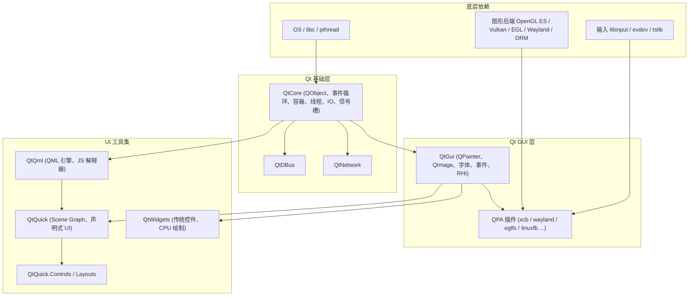
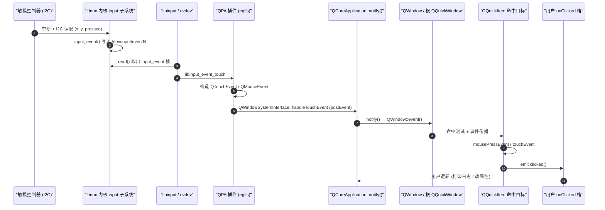
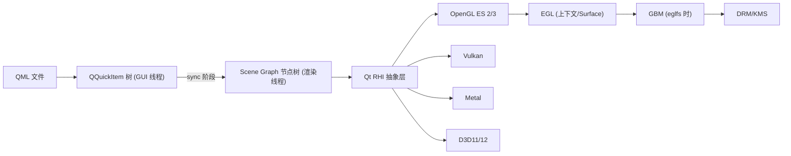
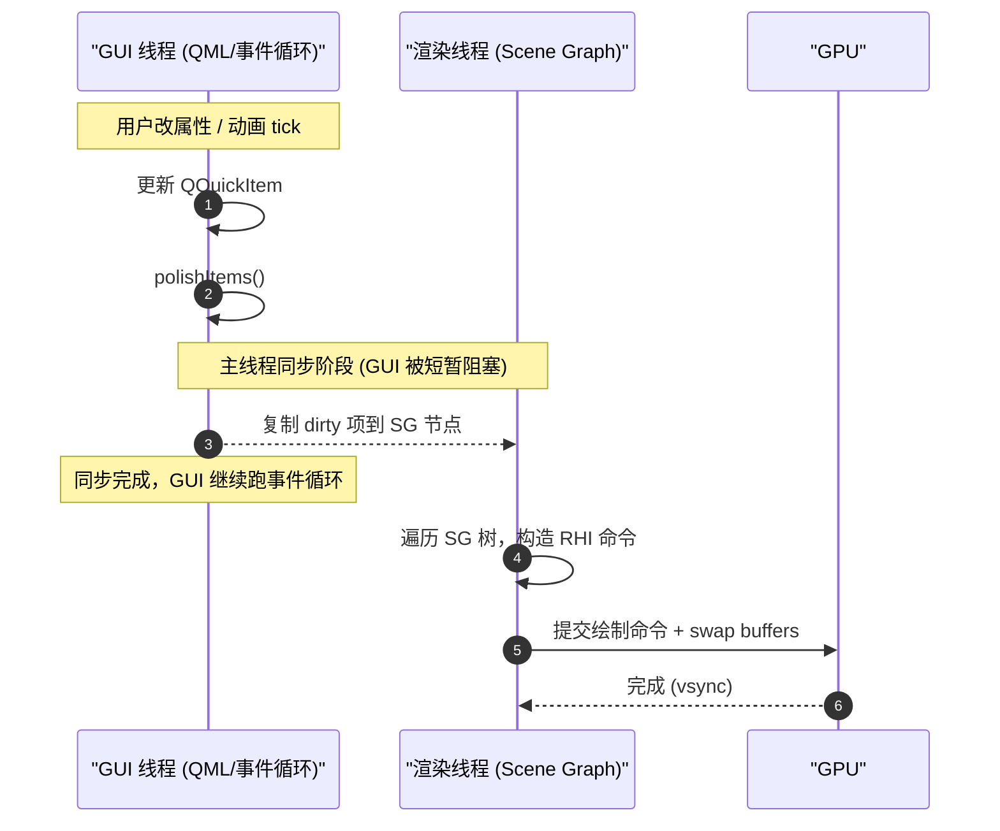
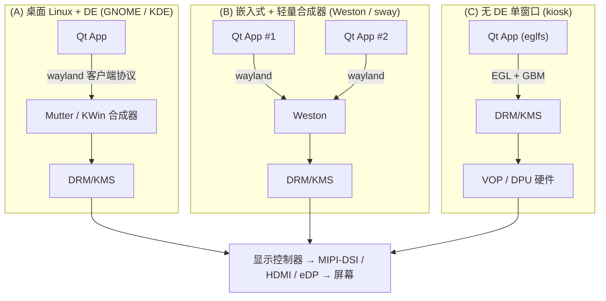
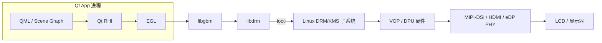
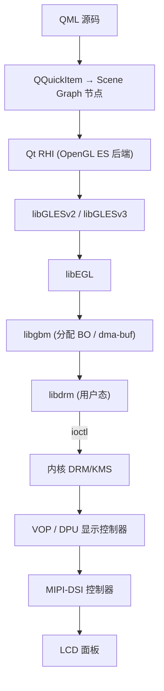
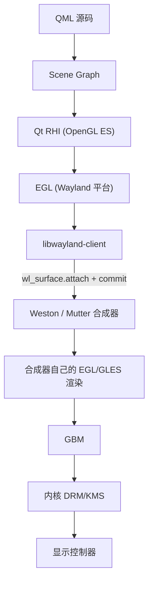
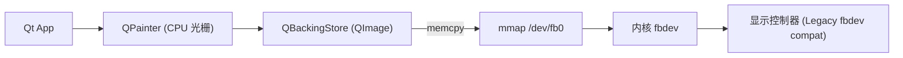
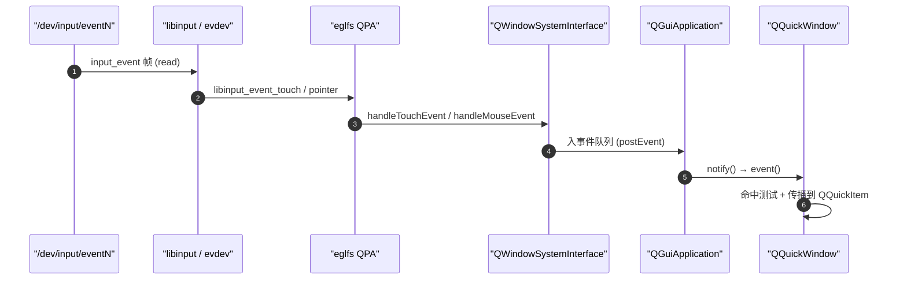

# Qt 应用程序架构

> [!note]
> **Ref:**
> - [Qt 官方文档：Qt Quick & QML](https://doc.qt.io/qt-6/qtquick-index.html)
> - [Qt 官方文档：Qt Platform Abstraction (QPA)](https://doc.qt.io/qt-6/qpa.html)
> - [Qt for Embedded Linux](https://doc.qt.io/qt-6/embedded-linux.html)
> - 本仓库 [[01-ui-stack-overview]]

本笔记承接 [[01-ui-stack-overview]]（图形栈总体视图），自顶向下回答一个核心问题：
**一个 Qt 应用从 QML/Widget 一路写到屏幕上的像素，到底经过了哪些层？在嵌入式 SoC（如 RK3566 / IMX6ULL）上，应该选哪个 QPA 后端？**

阅读顺序建议：
1. 先建立分层心智模型（§1–§4）；
2. 再理解 QPA 这一关键抽象（§5）；
3. 最后看三种典型部署形态及与底层对接（§6–§9）。


## 1. Qt 总览

Qt 是一个跨平台的 C++ 框架，本质是「**对象模型 + 事件循环 + 平台抽象 + GUI 工具集**」的组合。

### 1.1 模块分层（自底向上）



要点：
- **QtCore** 是所有模块的根，提供 `QObject`、信号槽、事件循环、容器和线程。它不依赖图形。
- **QtGui** 提供与「绘制 + 窗口 + 输入」相关的抽象，并通过 **QPA 插件**对接具体后端。
- **QtWidgets** 和 **QtQuick** 是两套并列的 UI 工具集，都构建在 QtGui 之上。

### 1.2 Qt5 vs Qt6 简表

| 维度 | Qt5 | Qt6 |
|------|-----|-----|
| 图形抽象 | 直接用 OpenGL ES 2 | **RHI**（Rendering Hardware Interface），统一抽象 OpenGL / Vulkan / Metal / D3D |
| C++ 标准 | C++11 | C++17（部分 C++20） |
| 默认场景图后端 | OpenGL | RHI（默认仍是 OpenGL，可切 Vulkan） |
| QML 性能 | 解释 + V4 JIT | **QML 编译为 C++**（qmlcachegen / qmltc） |
| CMake | 推荐 qmake，CMake 可选 | CMake 为主 |
| 嵌入式 QPA | eglfs、linuxfb、wayland | 同上，eglfs 内部走 RHI |

嵌入式实战中，**Qt6 + eglfs(RHI/OpenGL ES) + KMS** 是 2024 之后的主流组合。

### 1.3 许可证

- **LGPLv3**：动态链接即可在闭源产品中使用，但需要满足"用户可替换 Qt 库"等条件，嵌入式焊死镜像时有风险。
- **GPLv3**：开源项目可用。
- **商业许可**：付费规避 LGPL 的"可替换"问题，嵌入式量产常见。

本笔记不展开法律细节，开发期默认按 LGPL 走即可。


## 2. 顶层 UI 层

Qt 提供两套并列的 UI 工具集：**Widgets**（传统）与 **Quick/QML**（声明式）。

### 2.1 Qt Widgets

- **历史**：从 Qt1 一路演进而来，面向桌面应用（IDE、邮件、CAD）。
- **绘制路径**：`QWidget::paintEvent` → `QPainter` → **CPU 软件光栅化** → `QBackingStore`（一块共享内存缓冲）→ 由 QPA 推送到合成器/帧缓冲。
- **特点**：
  - 控件树即对象树（`QWidget` 父子关系）。
  - 布局靠 `QLayout`（QVBoxLayout / QGridLayout 等）。
  - 样式靠 QSS（类 CSS）或 `QStyle`。
- **优势**：API 稳定、文档丰富、桌面感强。
- **劣势**：**CPU 绘制为主**，触屏滑动/动画体验差；不适合现代嵌入式触摸 UI。

### 2.2 Qt Quick + QML

- **QML** 是一种**声明式语言**（语法似 JSON + JS），描述 UI 树和属性绑定。
- **Qt Quick** 是基于 QML 的 UI 工具集，**底层是 Scene Graph**：把 QML 项树转成 GPU 友好的几何/材质节点树，由 OpenGL ES / Vulkan / Metal / D3D 渲染。
- **特点**：
  - GPU 加速、动画 60fps 不费 CPU。
  - 属性绑定（property binding）+ 状态机（`State`/`Transition`）。
  - JavaScript 写交互逻辑，C++ 写业务后端，通过 `Q_PROPERTY` / `Q_INVOKABLE` 暴露给 QML。
- **典型一段 QML**：

```qml
import QtQuick
import QtQuick.Controls

ApplicationWindow {
    visible: true
    width: 800; height: 480

    Button {
        anchors.centerIn: parent
        text: "Hello"
        onClicked: console.log("clicked")
    }
}
```

### 2.3 Qt Quick Controls / Qt Quick Layouts

- **Qt Quick Controls 2**：提供 `Button`、`Slider`、`ComboBox` 等开箱即用控件，支持 Material / Universal / Fusion / iOS / macOS 风格。
- **Qt Quick Layouts**：`RowLayout` / `ColumnLayout` / `GridLayout`，类似 Widgets 的 `QLayout` 但是为 GPU 渲染优化。

### 2.4 选型决策：Widgets vs Quick

| 场景 | 推荐 |
|------|------|
| 桌面工具、复杂表格/树视图 | Widgets |
| 嵌入式触屏（车机、HMI、IoT 屏） | **Quick + QML** |
| 需要复杂动画、转场 | Quick |
| 团队只有 C++ 经验、没有前端 | Widgets 入门快 |
| 需要混合 web 风格 + 原生性能 | Quick |

**嵌入式触屏几乎都必须用 Quick + QML**，因为：
1. CPU 软光栅在低端 SoC（如 IMX6ULL）跑不动 60fps 动画；
2. 触摸/手势/惯性滚动在 Quick 中是一等公民；
3. 屏幕分辨率多样，QML 的 anchor/binding 比 QLayout 的像素栅格更适配。


## 3. 核心机制

无论上面用 Widgets 还是 QML，下面这套**QObject + 信号槽 + 事件循环**是 Qt 一切的基石。

### 3.1 QObject 与 meta-object 系统

- **QObject** 是 Qt 的对象根类，提供：
  - 对象树（自动内存管理：父对象析构时递归析构子对象）。
  - **元对象**（meta-object）：运行时反射，存放类名、属性、信号、槽。
  - 信号槽机制的载体。
- **moc**（Meta-Object Compiler）：编译期工具，扫描 `Q_OBJECT` 宏标记的类，生成 `moc_xxx.cpp`，把 `signals:` / `slots:` 翻译成可调用的元数据。
- **属性**：`Q_PROPERTY(int value READ getValue WRITE setValue NOTIFY valueChanged)`，QML 与 QtCreator 调试器可直接读写。

```cpp
class MyObj : public QObject {
    Q_OBJECT
    Q_PROPERTY(int value READ value WRITE setValue NOTIFY valueChanged)
public:
    int value() const { return m_value; }
    void setValue(int v) {
        if (v == m_value) return;
        m_value = v;
        emit valueChanged(v);  // 触发信号
    }
signals:
    void valueChanged(int);
private:
    int m_value = 0;
};
```

### 3.2 信号槽：连接类型

`QObject::connect(sender, signal, receiver, slot, type)` 的 `type` 决定槽函数在**哪个线程、何时**被调用：

| 连接类型 | 行为 |
|----------|------|
| `Qt::DirectConnection` | **同步**调用，槽函数在发射者线程立即执行，相当于函数指针调用 |
| `Qt::QueuedConnection` | **异步**调用，事件 post 到接收者所在线程的事件队列，下次 eventLoop 取出执行 |
| `Qt::AutoConnection`（默认） | 发射者和接收者**同线程** → Direct；**不同线程** → Queued |
| `Qt::BlockingQueuedConnection` | 跨线程，发射者**阻塞**等待接收者执行完；同线程会死锁 |
| `Qt::UniqueConnection` | 标志位，避免重复连接 |

要点：
- **跨线程信号槽是 Qt 多线程模型的核心**——只要接收者所在线程跑着 `QEventLoop`，信号就能安全跨线程传递。
- 对象的"线程归属"由 `QObject::thread()` 决定，可通过 `moveToThread()` 转移。

### 3.3 事件循环 QEventLoop / QCoreApplication::exec()

每个线程最多一个事件循环。GUI 线程的事件循环由 `QApplication::exec()` 启动，伪代码如下：

```cpp
while (!quit) {
    processPostedEvents();        // 处理 QCoreApplication::postEvent 投递的事件
    processPlatformEvents();      // 从 QPA 取一批事件（输入、窗口、绘制）
    processTimers();              // 触发到期 QTimer
    processSocketNotifiers();     // POSIX fd 可读/可写通知
    sleepUntilNextEvent();        // 阻塞在 select/poll/epoll，等下一次唤醒
}
```

四种事件源：

1. **postEvent / sendEvent**：
   - `sendEvent`：**同步**，立即调用 `QCoreApplication::notify()` → 接收者 `event()`。
   - `postEvent`：**异步**，放入事件队列，下次循环处理；可指定优先级。
2. **QPA 平台事件**：QPA 插件把底层（libinput / wayland / xcb）事件转换为 `QEvent` 注入队列。
3. **QTimer**：基于 OS 定时器或 eventloop 内部计时。
4. **QSocketNotifier**：包装 POSIX fd，可读/可写/异常时唤醒事件循环——这是把任意 Linux fd（如 `/dev/input/event*`、`epoll fd`）接入 Qt 的标准方式。

### 3.4 事件分发与传递

`QEvent` 是所有事件的基类，类型多达 100+：`QMouseEvent`、`QTouchEvent`、`QKeyEvent`、`QPaintEvent`、`QResizeEvent`、自定义 `QEvent::User+N`……

分发链路（以一次触摸点击为例）：



要点：
- 所有事件最终都过 `QCoreApplication::notify()`——这是**事件过滤器**（`installEventFilter`）能拦截一切的根源。
- 对 Widgets：`QApplication::notify()` → `QWidget::event()` → `mousePressEvent()`。
- 对 Quick：`QGuiApplication::notify()` → `QQuickWindow::event()` → 命中测试 → `QQuickItem::touchEvent()` → 触发 `onClicked` 等 QML 信号处理器。


## 4. 场景图 Scene Graph（Qt Quick 专属）

Qt Quick 的高性能秘密在于**两棵树**：

- **QQuickItem 树**：QML 项的逻辑树，用户视角的对象。
- **Scene Graph 节点树**：渲染线程持有的几何/材质节点树（`QSGGeometryNode`、`QSGMaterial`、`QSGTransformNode`），是 GPU 友好的结构。

### 4.1 渲染流水线



### 4.2 GUI 线程 vs 渲染线程



关键设计：
- **GUI 线程不阻塞 GPU**：只在 sync 阶段短暂同步，其它时间各跑各的。
- **动画时间步**通过 `QQuickItem::updatePolish()` 节奏化。
- **vsync 控制**由 `eglSwapBuffers` 隐式触发。

### 4.3 RHI（Qt6 新引入）

- 全称 **Rendering Hardware Interface**。
- 把 OpenGL / Vulkan / Metal / D3D 的差异封装成统一 API（`QRhi`、`QRhiBuffer`、`QRhiGraphicsPipeline`）。
- Scene Graph 内部已经全部走 RHI，但默认仍选 OpenGL ES 后端，可通过环境变量切换：
  - `QSG_RHI_BACKEND=vulkan` / `metal` / `d3d11` / `opengl` / `null`。
- 嵌入式场景常用 GL ES 2/3，因为驱动覆盖最全。


## 5. QPA (Qt Platform Abstraction)

QPA 是 Qt 在 5.0 引入的**平台插件层**，把"Qt 应用"与"具体窗口系统/显示后端"彻底解耦。

> [!note]
>
> **🔌 QPA 是QT app 运行时选择显示后端的插件**
>
> 1. 检查当前运行的环境（操作系统、显示服务器等）。
>    - `-platform <name>` 命令行参数（最高优先级）
>    - QT_QPA_PLATFORM 环境变量
>    - 构建时编译进去的默认值（QT_QPA_DEFAULT_PLATFORM，由打包方决定）
> 2. 加载与该环境匹配的平台插件（`libqlinuxfb.so`、`libqwayland-generic.so`、`libqxcb.so` 等）。

### 5.1 QPA 抽象了什么

| 抽象类 | 作用 |
|--------|------|
| `QPlatformIntegration` | 插件入口；创建下面这些对象 |
| `QPlatformWindow` | 一个原生窗口（Wayland surface / X Window / fbdev plane） |
| `QPlatformBackingStore` | CPU 绘制时的中间缓冲（Widgets 用） |
| `QPlatformOpenGLContext` | EGL/WGL/GLX 上下文 |
| `QPlatformScreen` | 输出（显示器）的几何、分辨率、刷新率 |
| `QPlatformInputContext` | 输入法 |
| `QPlatformTheme` | 系统主题（颜色、字体） |

应用启动时，Qt 通过 `QPA_PLATFORM_PLUGIN_PATH` + `QT_QPA_PLATFORM` 加载对应 `.so`，从此整个 GUI 走该插件。

### 5.2 常见 QPA 插件

| 插件 | 依赖 | 典型场景 | 备注 |
|------|------|---------|------|
| `xcb` | libxcb（X11 客户端） | 桌面 Linux + X11 | 老牌，逐步淘汰 |
| `wayland` | libwayland-client | 桌面 Wayland（GNOME/KDE）、嵌入式 Weston | 应用作为合成器**客户端** |
| `eglfs` | EGL + GBM + DRM/KMS（或厂商私有 EGL） | **嵌入式独占屏 (kiosk)** | 无窗口管理器，应用全屏 |
| `linuxfb` | `/dev/fbN` | 老式嵌入式、超低端 SoC | CPU 软件绘制，2D-only |
| `directfb` | libdirectfb | 已基本淘汰 | DirectFB 项目本身不活跃 |
| `vnc` | 内置 RFB 服务器 | 调试 / 无屏远程 | 把渲染推到 VNC 客户端 |
| `offscreen` | 无 | CI / 自动化测试 | 渲染到内存，不显示 |
| `minimal` | 无 | 单元测试 | 几乎不渲染 |
| `kms` | DRM/KMS 但无 GL | 老的 2D 后端 | 已被 eglfs 取代 |

### 5.3 选择 QPA 的环境变量

```bash
# 1) 桌面 Wayland
export QT_QPA_PLATFORM=wayland

# 2) 桌面 X11
export QT_QPA_PLATFORM=xcb

# 3) 嵌入式 eglfs（kiosk）+ KMS 配置文件
export QT_QPA_PLATFORM=eglfs
export QT_QPA_EGLFS_KMS_CONFIG=/etc/qt-kms.json
export QT_QPA_EGLFS_INTEGRATION=eglfs_kms

# 4) 老 fbdev
export QT_QPA_PLATFORM=linuxfb:fb=/dev/fb0:size=800x480

# 5) 多平台后备：找不到 wayland 就退到 eglfs
export QT_QPA_PLATFORM="wayland;eglfs"

# 6) 调试
export QT_LOGGING_RULES="qt.qpa.*=true"
```

`/etc/qt-kms.json` 示例（eglfs_kms）：

```json
{
  "device": "/dev/dri/card0",
  "hwcursor": false,
  "outputs": [
    { "name": "DSI-1", "mode": "800x480", "primary": true }
  ]
}
```


## 6. 三种典型部署形态

这是嵌入式开发者最容易混淆的一节。**同一个 Qt 应用二进制，配不同 QPA，能跑在三种完全不同的形态上**。

### 6.1 三种形态总览



### 6.2 (A) 桌面 Linux + DE

- 形态：Ubuntu 22.04 GNOME、Fedora KDE、Manjaro……
- QPA：`wayland`（默认）或 `xcb`（回退）。
- 应用是合成器的**客户端**：发出 `wl_surface` + 提交 GPU buffer，由 Mutter/KWin/Plasma 合成。
- 多窗口、拖动、Alt-Tab、装饰条都由合成器/窗口管理器负责。
- 典型场景：桌面工具、IDE、QtCreator 本身。

### 6.3 (B) 嵌入式 + 轻量合成器

- 形态：Yocto/Buildroot 镜像跑 **Weston**（wayland 合成器)。
- QPA：`wayland`。
- 一个或多个 Qt 应用通过 wayland 协议接到 Weston，Weston 再走 DRM/KMS。
- 优势：多应用共存、有合成器做 vsync 调度；
- 劣势：多一层延迟和内存。
- 反向用法：**QtWaylandCompositor** 让 Qt 应用自己当合成器，下面跑别的 wayland 客户端。

### 6.4 (C) 无 DE 单窗口（kiosk）—— 嵌入式量产主流

- 形态：Buildroot/Yocto 极小镜像，**没有 Wayland 也没有 X11**，开机就启动一个 Qt 应用独占屏。
- QPA：`eglfs`（首选）或 `linuxfb`（兜底，CPU 绘制）。
- 应用直接操作 **DRM/KMS + GBM + EGL**，从内核拿一个 KMS plane 当输出。
- 输入直接读 `/dev/input/event*`（libinput 或 evdev 内置后端）。
- 优势：延迟最低、内存最省、启动最快（< 2s 可达）。
- 劣势：单窗口，没有窗口管理。




## 7. 与底层栈的对接

把 §4 的"QML → Scene Graph → RHI"和 §5/§6 的 QPA 串起来，看完整通路。

### 7.1 通路 1：eglfs 直驱 DRM/KMS（嵌入式主流）



要点：
- **GBM**（Generic Buffer Management）负责申请显存 BO（buffer object），以 dma-buf fd 形式与 DRM/KMS 共享。
- EGL 用 `EGL_KHR_platform_gbm` 创建 surface，渲染完 `eglSwapBuffers` → 驱动 atomic commit 到 KMS。
- KMS 的 **plane → CRTC → encoder → connector** 链路最终把像素喂给 MIPI-DSI / HDMI。

参考本仓库 [[01-ui-stack-overview]] 中 DRM/KMS 子系统的详细分解。

### 7.2 通路 2：wayland 客户端



- 应用渲染到自己的 EGL surface（实际就是 dma-buf）；
- 通过 `wl_surface` 把这块 buffer 交给合成器；
- 合成器把所有客户端的 surface 合成成一帧，再 atomic commit 到 KMS。

### 7.3 通路 3：linuxfb（软件绘制兜底）



- 适用：只有 fbdev，没有 GPU/EGL；或调试。
- 性能：CPU 绘制 + memcpy，800x480 大约还能跑 30fps，720p 以上吃力。
- Qt6 中 linuxfb 仍可用，但官方更鼓励 eglfs。

### 7.4 三条通路对比

| 维度 | eglfs (kiosk) | wayland (DE / Weston) | linuxfb |
|------|---------------|----------------------|---------|
| 是否需要合成器 | 否 | **是** | 否 |
| GPU 加速 | 是 | 是 | **否（CPU 软光栅）** |
| 多应用共存 | 否（单窗口） | 是 | 否 |
| 延迟 | 最低 | 中（多一跳合成） | 取决于 memcpy 带宽 |
| 启动开销 | 最小 | 需要先起 Weston | 最小 |
| 适合场景 | 量产 HMI / 车机 / IoT 屏 | 多应用嵌入式 / 桌面 | 兜底 / 调试 / 无 GPU SoC |


## 8. 输入

QPA 不仅管显示，也管输入。

### 8.1 eglfs 下的输入

eglfs 没有合成器，必须自己读 `/dev/input/event*`：

- **libinput 后端**（推荐）：编译 Qt 时启用 `-libinput`；运行时 `QT_QPA_EGLFS_NO_LIBINPUT=0`（默认开）。
  - 自动处理多点触控、手势、鼠标加速。
- **evdev 后端**（兜底）：直接读裸 evdev 帧。
  - `QT_QPA_EVDEV_TOUCHSCREEN_PARAMETERS=/dev/input/event2:rotate=90`
  - `QT_QPA_EVDEV_KEYBOARD_PARAMETERS=/dev/input/event0`
  - `QT_QPA_EVDEV_MOUSE_PARAMETERS=/dev/input/event1`
- **tslib**（老式电阻屏校准）：`QT_QPA_EGLFS_TSLIB=1`，配合 `ts_calibrate`。

事件路径：



### 8.2 wayland 下的输入

应用不直接读 evdev，而是订阅 `wl_seat`：

- 合成器（Weston）持有 libinput；
- 合成器把按键/触摸通过 `wl_keyboard` / `wl_pointer` / `wl_touch` 协议发给当前聚焦的客户端；
- Qt 的 wayland QPA 把协议消息翻译成 `QTouchEvent` / `QKeyEvent`。

应用层完全感知不到 libinput 的存在。


## 9. 常见嵌入式实战要点

| 主题 | 关键操作 |
|------|---------|
| **字体** | 用 fontconfig + freetype；嵌入式打包 `Noto Sans CJK` 子集省空间；`QT_QPA_FONTDIR=/usr/share/fonts` |
| **触摸校准** | 电阻屏用 `tslib` + `ts_calibrate`；电容屏一般不需校准，必要时用 `QT_QPA_EGLFS_ROTATION` + Linux input 的 `evdev` 校准参数 |
| **光标隐藏** | `QT_QPA_EGLFS_HIDECURSOR=1` 或 QML 中 `Qt.cursorShape = Qt.BlankCursor` |
| **屏幕旋转** | `QT_QPA_EGLFS_ROTATION=90`（QPA 层旋转，软件代价）；更优是在 KMS plane 配置硬件旋转 |
| **多屏 / 多输出** | 写 `/etc/qt-kms.json`，每个 connector 配 mode + primary + virtualIndex |
| **虚拟键盘** | `Qt Virtual Keyboard` 模块，`QT_IM_MODULE=qtvirtualkeyboard`；可装 InputContext QML 插件 |
| **启动加速** | 编译时 `-no-feature-accessibility -no-feature-printer` 等裁剪；使用 `qmlcachegen` 预编译 QML |
| **DPR / HiDPI** | `QT_SCALE_FACTOR=1.5` 或 QML 内用 `Qt.application.font.pixelSize` 适配 |
| **日志调试** | `QT_LOGGING_RULES="qt.qpa.*=true;qt.scenegraph.*=true"`；`QSG_INFO=1` 打印 Scene Graph 后端 |
| **GPU 选择** | RK3566 用 Mali-G52，需厂商 EGL 驱动；IMX6ULL **无 GPU**，只能 linuxfb 或软 GL（llvmpipe，几乎不可用） |
| **dma-buf 零拷贝** | eglfs + GBM 默认就是 dma-buf；wayland 下走 `linux-dmabuf` 协议，避免 CPU 拷贝 |


## 10. 小结与心智模型

把整篇压缩成一段话：

> **Qt 应用**由 QtCore 提供的 `QObject + 信号槽 + 事件循环`托住对象生命周期与异步通信；
> 上层 UI 用 **Qt Quick (QML)** 写声明式界面，运行时 QML 项树被同步到 **Scene Graph** 节点树，
> 由 **Qt RHI** 抽象成 OpenGL ES / Vulkan / Metal / D3D 命令；
> 这些 GPU 命令与窗口管理通过 **QPA 插件**（决定是 `wayland` 客户端、还是 `eglfs` 直驱 DRM、还是 `linuxfb` 软绘）落到具体后端；
> 嵌入式 kiosk 场景下，`eglfs` 顺着 **EGL → GBM → DRM/KMS → VOP/DPU → MIPI-DSI** 这条路把像素送上屏，
> 同时直接读 `/dev/input/event*`（libinput / evdev）拿触摸。

记忆要点：
1. **QObject + 事件循环**：一切的基石，跨线程靠 `QueuedConnection`；
2. **Quick 比 Widgets 更适合嵌入式触屏**；
3. **QPA 是 Qt 的"显卡驱动接口"**，换一个 `.so` 应用就能换形态；
4. **三种部署形态记牢**：DE / 轻量合成器 / 无 DE eglfs；
5. **eglfs 的通路最直接**：QML → SG → RHI → GLES → EGL → GBM → DRM/KMS → 屏。

后续相关笔记建议（待补）：

- `03-wayland-internals.md` —— Wayland 协议、Weston 合成器、Qt 客户端实现细节
- `04-drm-kms-deepdive.md` —— DRM/KMS atomic、plane/CRTC/encoder/connector、原子提交
- `05-eglfs-on-rk3566.md` —— RK3566 上 eglfs + Mali + MIPI-DSI 实战
- `06-qml-perf-tuning.md` —— Scene Graph 性能、qmlcachegen、qmltc、batch 优化
